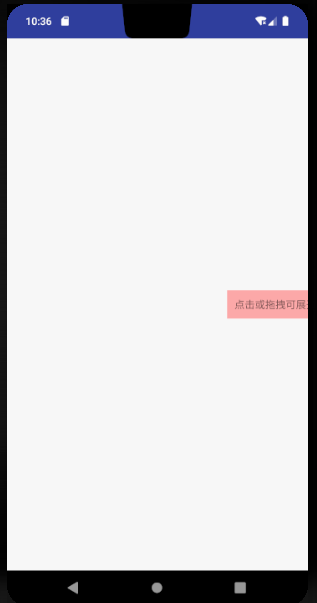
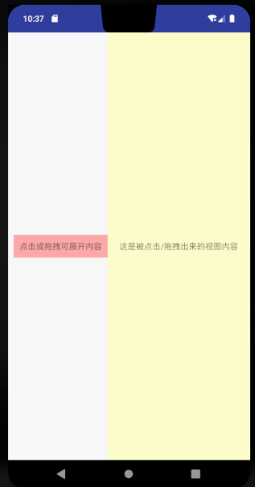

参考链接：

* [Android精彩编程--抽屉式公告](https://www.bilibili.com/video/av29765354)


**注意：**

This class was deprecated in API level 17.
This class is not supported anymore. It is recommended you base your own implementation on the source code for the Android Open Source Project if you must use it in your application.

SlidingDrawer hides content out of the screen and allows the user to drag a handle to bring the content on screen. SlidingDrawer can be used vertically or horizontally. A special widget composed of two children views: the handle, that the users drags, and the content, attached to the handle and dragged with it. SlidingDrawer should be used as an overlay inside layouts. This means SlidingDrawer should only be used inside of a FrameLayout or a RelativeLayout for instance. The size of the SlidingDrawer defines how much space the content will occupy once slid out so SlidingDrawer should usually use match_parent for both its dimensions. Inside an XML layout, SlidingDrawer must define the id of the handle and of the content:

## 一、使用示例

```xml
<?xml version="1.0" encoding="utf-8"?>
<androidx.constraintlayout.widget.ConstraintLayout xmlns:android="http://schemas.android.com/apk/res/android"
    xmlns:tools="http://schemas.android.com/tools"
    android:layout_width="match_parent"
    android:layout_height="match_parent"
    tools:context="com.cnpeng.android2.a_book3.activity.SlidingDrawerActivity">

    <SlidingDrawer
        android:layout_width="match_parent"
        android:layout_height="match_parent"
        android:content="@id/tv_content"
        android:handle="@id/tv_handle"
        android:bottomOffset="50dp"
        android:orientation="horizontal"
        android:topOffset="10dp">

        <TextView
            android:id="@+id/tv_handle"
            android:layout_width="wrap_content"
            android:layout_height="wrap_content"
            android:background="#FAA"
            android:padding="@dimen/dp10"
            android:text="点击或拖拽可展开内容" />

        <TextView
            android:id="@+id/tv_content"
            android:layout_width="match_parent"
            android:layout_height="match_parent"
            android:background="#FFC"
            android:text="这是被点击/拖拽出来的视图内容" />


    </SlidingDrawer>

</androidx.constraintlayout.widget.ConstraintLayout>
```

展开时，可拖拽，可点击，通过 `android:allowSingleTap` 属性控制，默认 true , 即两种方式都可以，如果设置为 false 则只能拖拽展开



