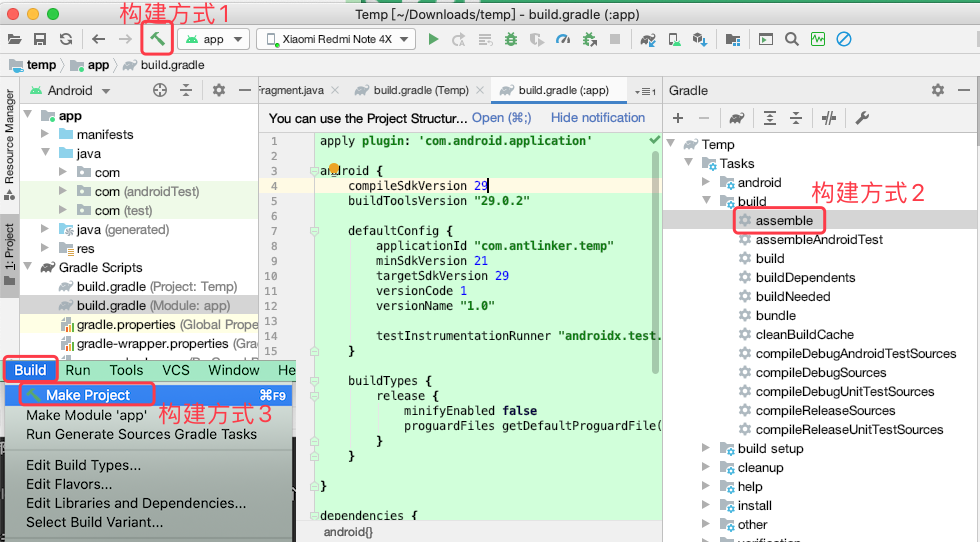
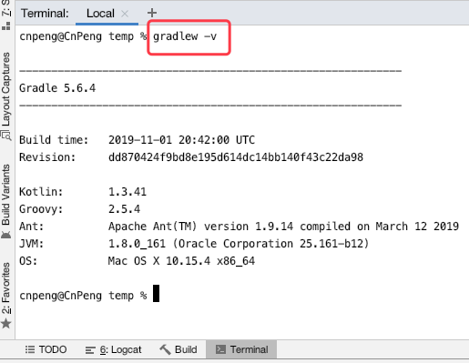

>2020-04-28 内容基于 AndroidStudio 3.6.3


# 1、Gradle 和 AndroidStudio 入门

## 1.2 理解 Gradle 基础

使用 Gradle 构建 Android 项目时，需要有一个名为 `build.gradle` 的构建脚本文件。

Gradle 有约定优于配置的原则，即为设置和属性提供默认值。

Gradle 构建脚本的书写是基于 Groovy 的领域专用语言（DSL），而不是传统的 XML。

Groovy 是一种基于 Java 虚拟机的动态语言。

### 1.2.1 项目和任务

Gradle 中，最重要的两个概念是项目和任务。每次构建都包括至少一个项目，每个项目又包括一个或多个任务。

每个 `builde.gradle` 文件都代表着一个项目，任务定义在构建脚本中。

初始化构建过程时，Gradle 会基于 build 文件组装项目和任务对象。一个任务对象包含一些列动作对象，这些动作对象会按顺序执行。

一个单独的动作对象就是一个待执行的代码块，它和 Java　中的方法类似。

### 1.2.2 构建声明周期

执行一个 Gradle 构建最简单的形式是，只执行任务中的动作，而这些任务又依赖于其他任务。

为了简化构建过程，构建工具会新建一个动态的 **模型流——Directed Acyclic Graph (DAG)**，也就是说，所有的任务都会被顺序执行一次，不会循环。**没有依赖的任务通常会优先执行。**在构建的配置阶段会生成依赖关系图。

一个 Gradle 的构建通常由如下三个阶段：

阶段 | 说明
---|---
初始化 | 项目实例会在该阶段被创建。如果项目有多个模块，并且每个模块都有对一定的 `build.gradle` 文件，则会创建多个项目实例。
配置 | 在该阶段，构建脚本被执行，并为每个项目实例创建和配置任务。
执行 | 在该阶段，Gradle 将决定哪个任务被执行。哪些任务被执行取决于开始本次构建的参数配置和该 Gradle 文件的当前目录。
 
### 1.2.3 构建配置文件

每一个基于 Gradle 构建的项目，都至少有一个 `build.gradle` 文件。

> AS 3.6.3 中项目整体有一个 `build.gradle`，项目中的每一个 module 也都有一个 `build.gradle`

在 Android 的构建文件中，有一些元素是必须的：

```java
// 项目的 build.gradle 
buildscript {
    repositories {
        google()
        jcenter()  
    }
    dependencies {
        classpath 'com.android.tools.build:gradle:3.6.3'
    }
}
```

在 `repositories` 代码块中，配置了整个构建过程都需要使用的依赖仓库。

在每一个可运行的 Android Module 的 `build.gradle` 文件中，都必须申请如下插件：`apply plugin: 'com.android.application'`；如果这个 module 是一个被依赖的仓库，则需要声明 `apply plugin: 'com.android.library'`
  
## 1.3 创建新项目

构建项目的三种方式：



## 1.4 Gradle wrapper 入门

Gradle 是一个不断发展的工具，新版本可能会打破对低版本的兼容，而使用 Gradle wrapper 则不必担心该问题。

在 AndroidStudio 中，打开 Terminal , 然后输入下列命令

平台 | 命令 | 含义
---|---|---
Mac 或 Linux | `./gradlew -v`  | 查看 gradle 版本等信息，
Win | `gradlew.bat -v `| 查看 gradle 版本等信息

> 后续的示例中，统一使用 `gradlew` 代表 Mac/Linux 或 Win 下的命令。

运行效果如下图：



### 1.4.2 基本构架任务

命令 | 含义
---|---
 `gradlew tasks` | 打印所有可用的任务列表
 `gradlew tasks --all` | 查看所有构建任务及对应的依赖
 `gradlew assembleDebug` | 创建 Debug 版本的 App。默认输出目录`MyApp/app/build/outpues/apk` 
 `gradlew assDeb` | `gradlew assembleDebug` 的简写方式
 `gradlew check` | 运行 lint 代码检查，结果会以 xml 和 html 文件输出
 `gradlew build` | 同时触发 assemble 和 check 。（触发所有类型的 assemble）
 `gradlew clean` | 清除项目构建的所有输出内容
  
 为了避免大量的终端输入，**Gradle 支持驼峰式缩写任务名**，但需要注意的是，如果其他任务具有相同的缩写，则该缩写任务名将不生效。如：我们可以使用  `gradlew assDeb` 代表 `gradlew assembleDebug`，也可以使用 `gradlew aDeb` 、`gradlew asDeb` 。
 
 
  

