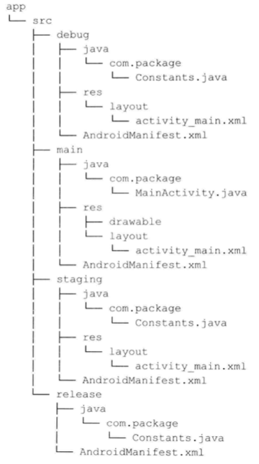
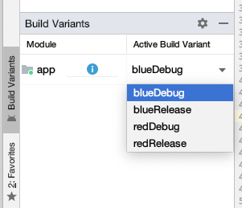
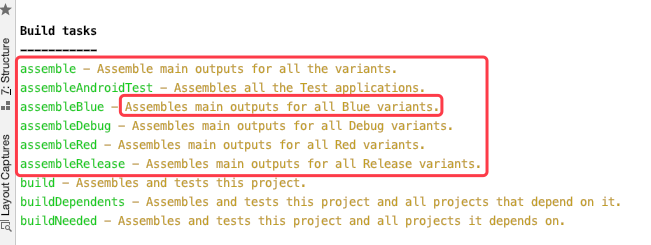
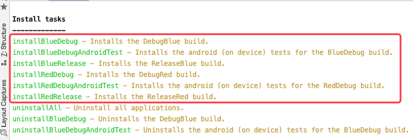
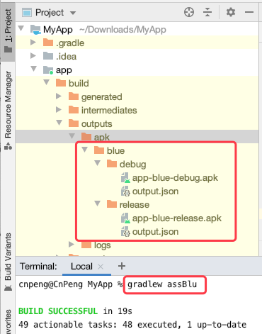
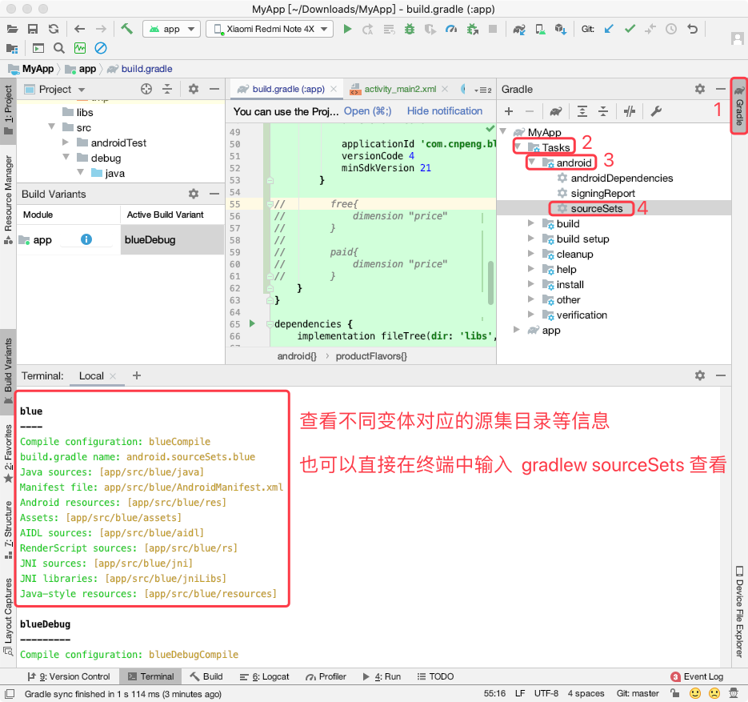
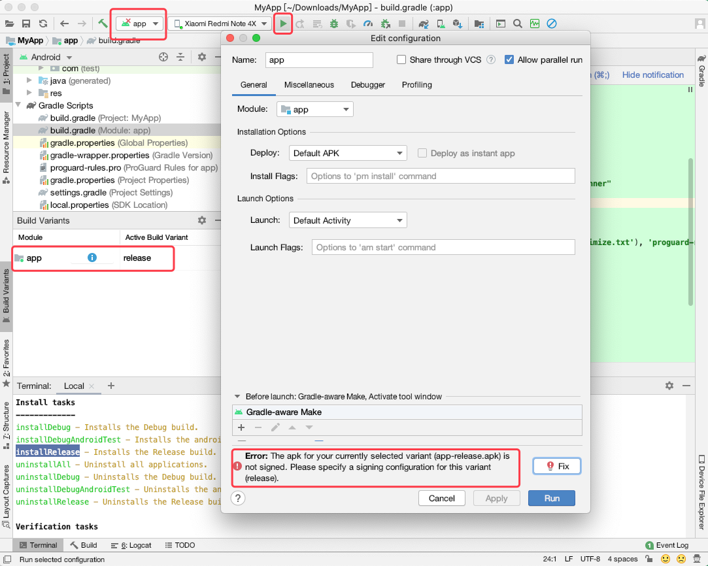
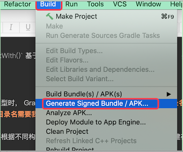
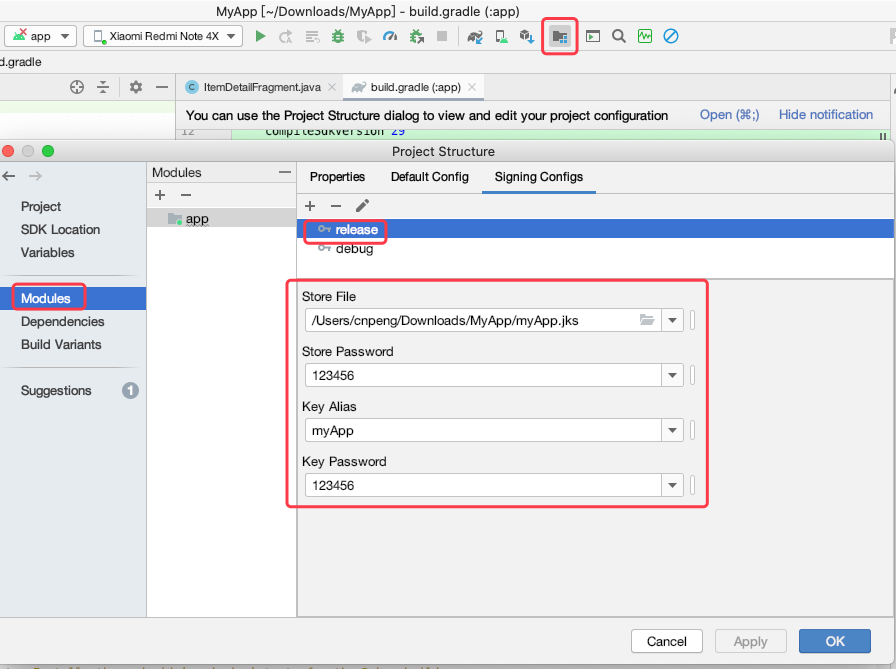
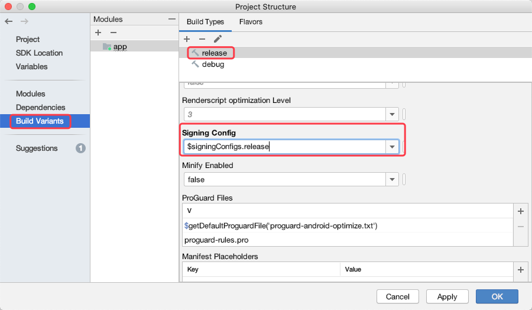

# 四、创建构建 Variant

开发一个应用时，根据是否上线可以区分为测试版本和生产版本；根据是否收费可以分为免费版和付费版。把它们组合在一起，我们就有了四个版本：免费测试版、免费生产版、付费测试版、付费生产版。

测试版和生产版称为**构建类型**；免费版和付费版称为 `product flavor`。

二者经常结合在一起使用，他们的不同组合结果称为 **构建 variant（构建变体）**

## 4.1 构建类型

在 Gradle 的 Android 插件中，构建类型定义在 `buildTypes{ }` 代码块中。可以定义的属性包括：是否启用代码压缩、代码混淆规则、applictionID 等内容。如：

```java
android {
	//其他内容省略
 	buildTypes {
        	release {
            		minifyEnabled false
            		proguardFiles getDefaultProguardFile('proguard-android-optimize.txt'), 'proguard-rules.pro'
        	}
    	}
}
```

通过 AndroidStudio 新建项目之后，模块构建文件中仅展示上述代码中  release 构建类型，但实际上还有一个默认的 debug 构建类型。

我们可以手动在 `buildTypes` 代码块中声明 debug 构建类型，并覆写其中的属性。

### 4.1.1 创建构建类型

#### 4.1.1.1 创建构建类型方式1

我们可以根据实际需要自定义构建类型及其对应的属性内容。如下：

```java
android {
 	buildTypes {
        	staging {
            		applicationIdSuffix ".staging"
            		versionNameSuffix ".staging"
            		buildConfigField("String","API_URL","\"http://staging.example.com/api\"")
        	}
  	}
}        
```

上述代码中，新增了一个 `staging` 构件类型，其中：

* `applicationIdSuffix` 表示 applicationID 的后缀。假设 applicationID 为 `com.cnpeng.myapp`，那么 staging 构建类型构建之后得到的 applicationID 为 `com.cnpeng.myapp.staging`
* `versionNameSuffix` 表示版本名称后缀。 假设 versionName 为 `1.0.0` , 那么构建之后得到的 versionName 为 `1.0.0.staging`
* `buildConfigField (,,)` 表示新增一个字段。第一个参数为数据类型（同 java）；第二个参数为字段名；第三个为字段值， 需要用双引号包裹，如果字段值本身就是字符串，则需要使用转义。

由于 applicationID 是 App 在一个手机中的唯一标识，所以，我们就可以在一个手机上同时安装  staging 和 其他构件类型的 myApp 。

#### 4.1.1.2 创建构建类型方式2

我们可以基于现有的构建类型初始化一个新的构建类型，如下：

```java
android {
  	buildTypes {
  		// 注意，initWith 中的类型必须是已经声明过的类型。
	      staging.initWith(buildTypes.debug)
        	staging{
           		applicationIdSuffix ".staging"
            		versionNameSuffix ".staging"
           		debuggable = false
       	 }
        }
}        
```

上述代码中，通过 `initWith()` 基于 `debug` 创建了一个新的构建类型 `staging`，并覆写了其中的部分属性。

### 4.1.2 源集

当创建一个新的构建类型时， Gradle 也会创建一个新的源集目录。**该源集目录名称默认和构建类型形同，** 但要注意，**源集目录名需要我们手动创建**。

也就是说，当我们需要根据不同构建类型使用不同的源码和资源时，需要手动创建存储这些源码和资源的构建文件夹。

下图是标准的 debug 、release 和自定义构件类型 staging 的目录结构：

 

借助源集，我们可以针对特定的构建类型覆写某些属性，为某些构建类型添加自定义代码、自定义布局或自定义字符串等。

不同源集中的 Java 类是互斥的。也就是说，假设我们在 staging 的源集中添加了 `CustomLogic.java` , 那么我们也可以在 debug 、release 中定义同名的类，当我们构建不同的类型时就会使用不同源集中的该类。但要注意，不能与 main 源集中的类重名，这样相当于定义了两次，构建时会报错。

**当使用不同的源集时，其中的资源文件将会覆盖 main 源集中的同名资源**

假设我们在 staging 源集目录中有如下一个 `strings.xml` 文件：

```xml
<resources>
    <string name="app_name">Staging</string>
    <string name="title_item_detail">Staging</string>
</resources>
```

在 main 源集目录中有如下一个 `strings.xml` 文件：

```xml
<resources>
    <string name="app_name">MyApp</string>
</resources>
```

当我们要构建 staging 类型时，我们得到的 `app_name` 将是 Staging，而构建其他类型时得到的 `app_name` 将是 MyApp。

如果我们为构建类型创建了一个 manifest 文件，我们不必从 main 源集中拷贝整个 manifest 文件，只添加需要的标签即可。


### 4.1.3 依赖

每个构建类型都可以有自己的依赖。Gradle 自动为每个构建类型创建新依赖配置。

如果我们只想在 debug 构建中添加一个 `leakcanary` 库用以检测内容泄漏，则可以按照如下方式添加依赖：

```java
dependencies {
        debugImplementation 'com.squareup.leakcanary:leakcanary-android:2.2'
        // 其他内容省略
}
```

## 4.2 `product flavor`(产品类型)

`product flavor (产品类型)` 用来创建不同的版本，最典型的例子是一个应用有免费版和收费版。另一个常见的场景是，一个机构为多个客户端构建相同功能而品牌不同的应用（这在出租车企业或银行应用中比较常见，一个公司创建一个可以在同一类别所有客户端重复使用的应用，唯一改变的是颜色、图标和后台 URL）。

Product flavors 极大简化了基于相同代码构建多个版本的应用的进程。

当我们对于是创建新的构建类型还是 product flavor 产生疑惑时，首先确认我们要创建的是一个不同的类型还是一个新的 app，如果需要的是一个新的 app，则需要创建 product flavor。

### 4.2.1 创建 product flavor

```java
android {
    productFlavors {
        flavorDimensions "color", "price"

        red {
            dimension "color"
            applicationId 'com.cnpeng.red'
            versionCode 3
        }

        blue {
            dimension "color"

            applicationId 'com.cnpeng.blue'
            versionCode 4
            minSdkVersion 27
        }

        free{
            dimension "price"
        }

        paid{
            dimension "price"
        }
    }
}
```

`product flavor` (产品类型) 对应 [`ProductFlavor` 类](https://google.github.io/android-gradle-dsl/current/com.android.build.gradle.internal.dsl.ProductFlavor.html)，而 `defalutConfig { }` 也对应该类，所以，我们可以在 `defalutConfig { }` 代码块中提供基本配置，然后根据需要在 `product flavor` (产品类型) 中进行覆写。

创建 `product flavor` 时必须要声明 `flavorDimensions` ，并且要为每一个 `flavor` 指定对应的 `dimension`。声明的 `dimension` 也必须要有 `flavor` 对应。

### 4.2.2 源集

`product flavor` 也可以有自己的源集目录。

我们也可以创建 `flavor + 构建类型` 结合体的源集目录，其目录名为 `flavor 名称+构建类型名称`。假如我们想让 `blue` flavor 和 release 构建类型的组合体拥有特定的应用图标，则对应的源集目录为 `blueRelease`。

> 以下简称 product flavor 为产品类型；build types 简称为 构建类型。

产品类型+构建类型的结合体源集目录在构建时优先级高于 构建类型的源集目录 和 产品类型的源集目录。


### 4.2.3 多种定制的版本

通过 `flavorDimensions` 可以定制不同 flavor 结合体版本。比如，我们在 4.2.1 中创建 product flavor 时声明了 red、blue 、free 、paid 四种 falvor，那么在构建 app 时我们就可以构建出 `redFree`、`redPaid`、`blueFree`、`bluePaid` 四种 flavor 组合体。

`flavorDimensions` 数组定义了维度，维度的顺序非常重要。

当结合两个 flavor 时，它们可能定义了相同的属性或资源，此时，先定义的维度会覆盖后定义维度中的相同属性或资源。

而且，维度顺序也决定了构建 variant 的名称。`variant 的名称 = 先定义的维度对应的 flavor 名称 + 后定义维度对应的 flavor 名称。` 在 4.2.1 中我们先定义了 `color` ，后定义了 `price`, 所以，构建时获得的 variant 将是： `redFree`、`redPaid`、`blueFree`、`bluePaid` 四种 flavor 组合体。假设我们的构建类型仅有默认的  debug 和  release，那么最终得到的 variant 如下：

*  `redFreeDebug`、
*  `redPaidDebug`、
*  `blueFreeDebug`、
*  `bluePaidDebug`
*  `redFreeRelease`、
*  `redPaidRelease`、
*  `blueFreeRelease`、
*  `bluePaidRelease`

> variant 的具体内容参考 4.3

## 4.3 构建 variant

构建 variant 是构件类型和产品类型（product flavor）结合的结果。只要我们新增了构建类型或者产品类型，那么新的构建 variant 就会产生。

> 构建 variant 可以称为 构建变体。

假设我们的构建类型仅有默认的 debug 和 release , 产品类型有 blue 和 red, 那么我们得到的构建变体有：



如果没有定义产品类型，则 构建变体将只包含构建类型。

### 4.3.1 任务

每当我们新增构建类型或者产品类型时，Gradle 的 Android 插件就会自动帮我们为新增的构建变体创建构建任务。

假设我们的构建类型仅有默认的 debug 和 release , 产品类型有 blue 和 red，那么我们通过 `gradlew tasks` 可以看到如下 `assemble` 和 `install` 任务：





当我们执行 `gradlew assBlu` （`gradlew assembleBlue` 的简写）命令时，会得到如下结果：



### 4.3.2 源集

构建变体也可以有自己的源集目录。 

通过 `gradlew sourceSets` 命令或者 Android Studio 中的 `sourceSets` 可以查看不同构建变体对应的元及目录：



如果我们创建的源集目录并非 构建类型名称或者产品类型名称 的结合体，则需要 `sourceSets` 代码块指定该目录（[点击查看原文](https://developer.android.google.cn/studio/build/build-variants?hl=zh_cn)）。

以下代码示例将 `app/other/` 目录中的源文件映射到 main 源代码文件集的某些组件，并更改 androidTest 源代码文件集的根目录:

```java
    android {
      ...
      sourceSets {
        // Encapsulates configurations for the main source set.
        main {
          // Changes the directory for Java sources. The default directory is
          // 'src/main/java'.
          java.srcDirs = ['other/java']

          // If you list multiple directories, Gradle uses all of them to collect
          // sources. Because Gradle gives these directories equal priority, if
          // you define the same resource in more than one directory, you get an
          // error when merging resources. The default directory is 'src/main/res'.
          res.srcDirs = ['other/res1', 'other/res2']

          // Note: You should avoid specifying a directory which is a parent to one
          // or more other directories you specify. For example, avoid the following:
          // res.srcDirs = ['other/res1', 'other/res1/layouts', 'other/res1/strings']
          // You should specify either only the root 'other/res1' directory, or only the
          // nested 'other/res1/layouts' and 'other/res1/strings' directories.

          // For each source set, you can specify only one Android manifest.
          // By default, Android Studio creates a manifest for your main source
          // set in the src/main/ directory.
          manifest.srcFile 'other/AndroidManifest.xml'
          ...
        }

        // Create additional blocks to configure other source sets.
        androidTest {

          // If all the files for a source set are located under a single root
          // directory, you can specify that directory using the setRoot property.
          // When gathering sources for the source set, Gradle looks only in locations
          // relative to the root directory you specify. For example, after applying the
          // configuration below for the androidTest source set, Gradle looks for Java
          // sources only in the src/tests/java/ directory.
          setRoot 'src/tests'
          ...
        }
      }
    }
    ...
```

### 4.3.3 源集合并资源和 manifest

源集的引入额外增加了构建进程和复杂性。

Gradle 的 Android 插件在打包应用之前会将 main 源集和其他构建类型源集合并在一起。此外，manifest 文件以及其他 library 项目提供的额外资源也需要合并。

假如我们的应用有 debug 变体，其中需要额外的 Android 权限来存储 log 文件，但我们并不想在 main 源集中申请该权限，此时就可以考虑在 debug 构建类型的源集中额外添加一个 manifest 文件来申请该权限。

在进行资源和 manifest 的合并时，其优先级从高到低依次为：`Build type > Flavor > Main > Dependencies`。也就是说，如果某个资源在 flavor 和 main 中都有声明，那么在构建或打包时优先使用  flavor 中的资源；在 library 中声明的资源通常具有最低的优先级。

> [点击查看官方文档：合并多个清单文件](https://developer.android.google.cn/studio/build/manifest-merge?hl=zh_cn) 

### 4.3.4 创建构建 variant

构建类型和产品类型都可以得到不同的 variant。

示例：

```java
android {
	// 其他代码省略
    buildTypes {
        release {
            minifyEnabled false
            proguardFiles getDefaultProguardFile('proguard-android-optimize.txt'), 'proguard-rules.pro'
            signingConfig signingConfigs.release
        }

        staging.initWith(buildTypes.release)
        staging {
            debuggable = true
        }
    }

    productFlavors {
        flavorDimensions "color" 

        red {
            dimension "color"
            applicationId 'com.cnpeng.red'
            versionCode 3
        }

        blue {
            dimension "color"

            applicationId 'com.cnpeng.blue'
            versionCode 4
            minSdkVersion 21
        }
    }
```

### 4.3.5 variant 过滤器

在构建过程中，我们可以忽略某些变体，这样当我们通过 `assemble` 构建项目时，就可以忽略掉指定的变体，从而提升构建速度。

```java
android {
  variantFilter { variant ->
        if (variant.buildType.name.equals("staging")) {
            variant.getFlavors().each(){ flavor ->
                if (flavor.name.equals("blue") ) {
                    variant.setIgnore(true);
                }
            }
        }
    }
}
```

上述代码中，我们配置了要过滤的变体，先判断构建类型是否为 “staging”, 然后判断产品类型是否为 “blue”, 如果同时满足二者，则过滤该变体。

> [点击查看官方文档：过滤变体](https://developer.android.google.cn/studio/build/build-variants?hl=zh_cn)


## 4.4 签名配置

当我们构建生产版 apk 时，需要指定签名文件（私钥，后缀名通常为 jks 或 keystore），否则就会出现下图的错误提示：



### 4.4.1 创建并声明签名文件

创建签名文件：



为构建类型指定签名文件：



上图中的内容也可以通过代码实现，效果等同：

```java
android {
    signingConfigs {
        // 其他省略
        release {
            storeFile file('/Users/cnpeng/Downloads/MyApp/myApp.jks')
            storePassword '123456'
            keyAlias = 'myApp'
            keyPassword '123456'
        }
        
        //也可以使用这种方式声明签名配置
        //staging.initWith(signingConfigs.debug)
    }
```

在构建类型/产品类型中引用签名配置：



上图中的内容等价于下列代码：

```java
 buildTypes {
        release {
            // 其他省略
            signingConfig signingConfigs.release
        }
    }
```

### 4.4.2 针对构建变体声明签名文件

假如我们需要为构建类型指定不同的签名文件，可以使用如下方式：

```java
buildTypes {
        release {
            // 其他省略
            signingConfig signingConfigs.release
        }
    }
```

当我们需要为产品类型指定不同的签名文件，可以使用如下方式：

```java
productFlavors {
        flavorDimensions "color" //, "price"
        red {
            dimension "color"
            applicationId 'com.cnpeng.red'
            versionCode 3

            signingConfig signingConfigs.release
        }
}        
```

但是，按照上面这种方式，flavor 中的签名配置会覆盖 buildTypes 中的内容。

假如我们需要分别为 red flavor 和 blue flavor 与  release 构建类型组成的变体指定不同的签名配置，则采用如下方式：

```java
buildTypes {
        release {
            minifyEnabled false
            proguardFiles getDefaultProguardFile('proguard-android-optimize.txt'), 'proguard-rules.pro'

		    // 为不同变体指定不同的签名文件。使用这种方式时，需要将 productFlavors 代码块放在  buildTypes 代码块之前。
            productFlavors.red.signingConfig signingConfigs.release
            productFlavors.blue.signingConfig signingConfigs.staging
        }
        
        staging.initWith(buildTypes.release)
        staging {
            debuggable = true
        }
    }
```
