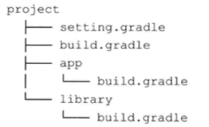
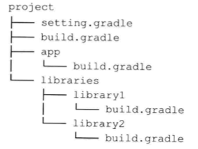
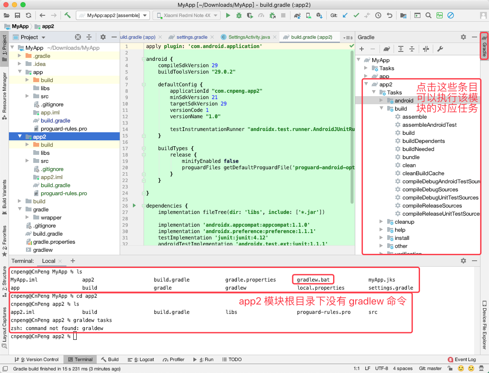
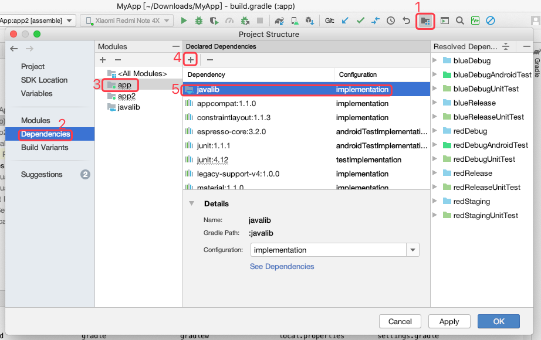
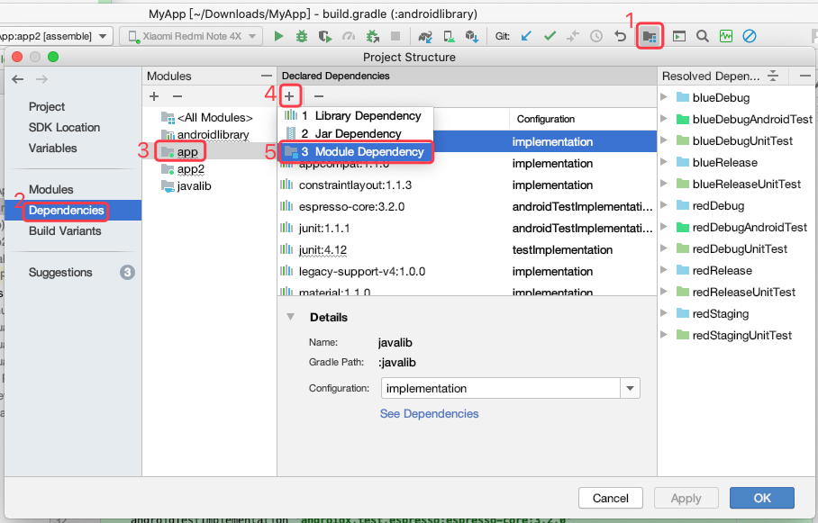
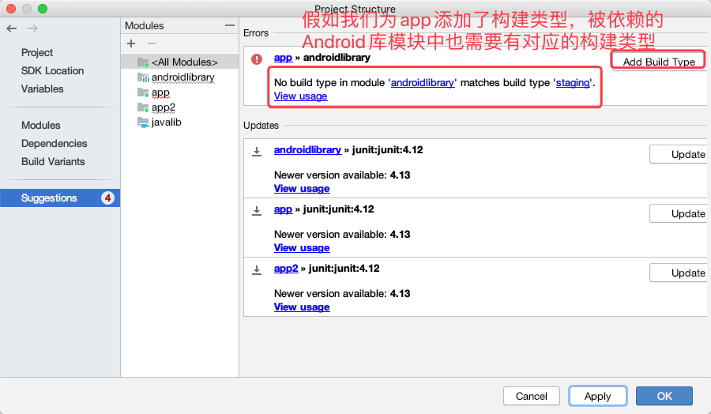
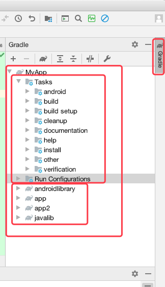

# 五、管理多模块构建

Android Studio 不仅可以为应用和依赖库创建模块，还可以为 Android Wear、Android TV 和 Google App Engine 等创建模块。所有这些模块都可以在一个单一的项目中使用。

比如，我们可能想创建一个使用 Google Cloud Endpoints 作为后台，融合 Android Wear 的应用，在这这种情况下，我们的项目就需要包含三个不同的模块：App 模块，后端模块，Android Wear 模块。

了解多模块项目的结构和构建可以显著加快开发周期。

> Gradle 文档和 Gradle Android 插件都使用了 multiproject 构建术语，但是，在 Android Studio 中，模块和项目时有区别的。如：模块可以是一个 Android 应用或一个 Google App Engine 后端，而项目则是模块的集合。

## 5.1 解剖多模块构建

多模块项目结构示意图，如下：



对于多模块项目，每一个模块中都可以有自己的 `build.gradle` , 并且需要在顶层的 `settings.gradle` 文件中声明所有模块：

```java
include ':app', ':library'
```

如果我们想将 `library` 模块作为 `app` 模块的依赖项，就需要在 app 模块的 `build.gradle` 文件中添加如下代码：

```java
dependencies {
    implementation project( ': library')
}
```

假如我们将 app 以外的模块添加到文件夹内部作为子文件夹，那么声明模块和依赖时会有相应的变化，结构示意图如下：



在 `setting.gradle` 声明模块时，代码如下：

```java
include ':app', ':libraries:library1' , ':libraries:library2' 
```

> 在 `setting.gradle` 中声明模块时，目录都是相对于 `setting.gradle` 文件的位置，其中 `:` 用来代替路径中的斜线。

如果此时我们想将 `library1` 模块作为 `app` 模块的依赖，需要在 app 模块的 `build.gradle` 文件中添加如下代码：

```java
dependencies {
    implementation project( ':libraries:library')
}
```

> Gradle 是从项目的根目录开始创建项目依赖模型的。

### 5.1.1 重访构建生命周期

在初始化阶段，Gradle 会搜寻 `setting.gradle` 文件。如果该文件不存在，Gradle 则假设只有一个单独的模块需要构建。如果我们有多个模块需要构建，则需要在 `setting.gradle` 文件中声明。Gradle 会自动尝试从声明的根目录中查找子模块自己的 `build.gradle` 文件，然后把他们合并到构建进程中。

### 5.1.2 模块任务

当项目中有多个模块，我们在项目根目录下通过终端执行某项任务时，Gradle 会找出可以执行该任务的所有模块，然后让每个模块都执行该任务。

比如，我们项目中有一个 App 模块和一个 Android Wear 模块，那么运行 `gradlew assembleDebug ` 命令时，将会同时构建 App 和 Android Wear 的 Debug 版本。

但是，**当我们切换到某个模块的根目录时，通过终端执行某项任务时则仅会执行该模块的该任务。**

当然了，通过切换目录的方式来执行构建任务也很麻烦，我们可以通过指定模块和任务的方式执行指定的构建任务，如：

```java
// 让名称为 app2 的模块执行 assembleDebug 任务。assDeb 是 assembleDebug 的简写
gradlew :app2:assDeb
```

> 注意：在 AndroidStudio 中，`gradlew.bat` 命令文件仅存在于项目根目录下，模块目录中并没有该命令文件，所以在模块目录下无法执行 gradlew 命令。但 AndroidStudio 自带的 Gradle 侧边栏中有相应的任务，点击即可执行。如下图：



## 5.2 将模块添加到项目

### 5.2.1 添加一个 Java 依赖库

在 AndroidStudio 中新建一个 Java 依赖库模块：`File > New > New Module > Java or Kotlin Library`。新建完成后，该模块的 `build.gradle` 文件内容如下：

```java
apply plugin: 'java-library'

dependencies {
    implementation fileTree(dir: 'libs', include: ['*.jar'])
}

sourceCompatibility = "7"
targetCompatibility = "7"
```

如上，我们看到，Java 库模块使用的是 `java-library` 而不是 `com.android.library`, 因此，在该模块中将不能使用 Android 中的一些属性和任务。

假设我们新建的 Java 库模块名称为 `javalib`, 当 app 模块需要依赖该库模块时，代码如下：

```java
dependencies {
   // 其他内容省略
    implementation project(path: ':javalib')
}
```

也可以通过如下方式添加：



通过上述方式就实现了对 java 库的依赖。当我们构建 app 模块时，会先构建 javalib 库模块。

### 5.2.2 添加一个 Android 依赖库

在 AndroidStudio 中新建一个 Java 依赖库模块：`File > New > New Module > Android Library`。新建完成后，该模块的 `build.gradle` 文件中第一行代码内容如下：

```java
apply plugin: 'com.android.library'
```

假设我们新建的库名称为 `androidlibrary`, 当我们需要让 app 模块依赖该库模块时，代码如下：

```java
dependencies {
   // 其他内容省略
    implementation project(path: ':androidlibrary')
}
```

也可以通过如下方式添加依赖：



注意：如果我们为 app 模块添加了自定义的构建类型，那么被依赖的 Android 库模块中也需要有对应的类型，否则会报错，使用 AndroidStudio 的 `ProjectStructure` 添加依赖时会看到下图的样子：



我们点击上图中的 `Add build Types` 即可。如果是代码添加，在则库模块的  `build.gradle` 文件中添加缺少的 `buildTypes` 即可。


### 5.2.3 融合 Android wear

在 AndroidStudio 中新建一个 Java 依赖库模块：`File > New > New Module > Wear OS Module。新建完成后，该模块的 `build.gradle` 文件内容与普通 Android 库模块的主要区别在于依赖项：

```java
apply plugin: 'com.android.application'

// 其他内容省略

dependencies {
    // 其他内容省略
    compileOnly 'com.google.android.wearable:wearable:2.6.0'
}
```

每个 Android Wear 应用都依赖于 Google 提供的 `wearable` 库。

为了在 Android 应用中使用 Android Wear 应用，需要将 Wear 应用与 App 一起打包，那么我们就需要在 App 的 `build.gradle` 文件中添加如下内容：

```java
dependencies {
    // 其他内容省略
    wearApp project(':wear')
}
```

### 5.2.4 使用 Google App Engine

AndroidStudio 3.6.3 中已经无法创建 `Google Cloud Module` ，所以，此处内容省略。

## 5.3 提示和最佳实践

### 5.3.1 在 AndroidStudio 中运行模块任务



### 5.3.2 提升多模块构建速度

当构建多模块项目时，Gradle 会按顺序处理所有的模块。为了提升构建速度，我们可以开启 Gradle 并行构建，该设置默认不开启。

开启并行构建时，需要在项目根目录的 `gradle.properties` 文件中添加如下内容：

```java
# 开启 gradle 并行构建，提升多模块项目的构建速度
org.gradle.parallel = true
``` 

### 5.3.3 模块耦合

当我们的项目有多个模块时，我们可以在任意模块的 `build.gradle` 文件中使用 `allprojects` 定义适用于所有模块的属性。也就是说， Gradle 允许一个模块引用另一个模块的属性。这样虽然方便维护，但也导致了模块间的耦合。

只要两个模块互相访问了对方的任务或属性，就认为这两个模块间是耦合的。我们可以通过避免直接访问其他模块中的任务或属性来避免耦合——我们可以使用跟模块作为中间，这样子模块仅与跟模块耦合，而不是和其他模块互相耦合。
