# 六、运行测试

[点击查看 Android 官方的测试文档](https://developer.android.google.cn/training/testing)

[](https://blog.csdn.net/yangxuan0261/article/details/104456647)

我们不仅可以在 AndroidStudio 中运行测试框架，也可以直接使用 Gradle 在命令行界面中运行他们。本章主要介绍 Gradle 是如何帮助自动化测试的。

## 6.1 单元测试

Android Studio 和 Gradle 的 Android 插件原生支持单元测试，但在使用它们之前需要一些配置。

### 6.1.1 JUnit

#### 6.1.1.1 添加依赖

Junit 单元测试的测试用例仅对业务逻辑有效，对和 Android SDK 相关的代码无效。

当我们通过 AndroidStudio 新建一个项目之后，在 `src`  目录下默认就会有一个 `test` 目录，其中用来放置单元测试代码。并且在该项目模块的 `build.gradle` 中会有如下依赖语句：` testImplementation 'junit:junit:4.12'`。

test 目录结构如下：

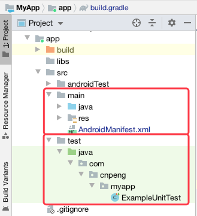

在添加 JUnit 的依赖时，使用的是 `testImplementation` 而不是 `implementation`，这样可以确保该依赖仅在运行测试时有效，而不会包含在 release 的 app 中。 

另外，我们可以指定的构建类型或者 flavor 中启用单元测试：

```java
dependencies {
    // 仅在 Debug 类型启用单元测试	
    //testDebugImplementation 'junit:junit:4.12'
    
    // 当 flavor 为 blue  时启用单元测试。 
    testBlueImplementation 'junit:junit:4.12'
    
    // 这样写会报错
    //testBlueDebugImplementation 'junit:junit:4.12'
}    
```

#### 6.1.1.2 编写单元测试代码

我们在 `test/com/cnpeng/myapp` 目录中新建一个 `LogicTest.java` 类，具体内容如下：

```java
package com.cnpeng.myapp;
import org.junit.Test;
import static org.junit.Assert.assertEquals;

public class LogicTest {
    @Test
    public void addTest(){
        assertEquals("值是相等的：",4, 2 + 2);
    }
}
```

#### 6.1.1.3 运行测试

命令|含义
---|---
`gradlew test` | 运行全部模块中的单元测试时，如果有一个失败了，则会终止程序，不再继续执行后续的单元测试。
`gradlew test -continue`  | 在碰见失败的情况时继续执行，直到全部执行完毕。
`gradlew testRedDebugUnitTest`  | 针对 flavor 为 red , 构建类型为 Debug 的变体进行测试。
`gradlew testRDUT --tests="*.LogicTest"`  | 针对 flavor 为 red , 构建类型为 Debug 的变体进行测试, 并限定仅执行名称为 `LogicTest` 的 java 文件中的测试代码。

> 我们也可以在构建变体的特定目录下创建测试类，比如，我们想在付费版的 App 中测试特定内容，则可以将测试类放在 `test/testPaid/java/com.xxx.xx` 目录中（`com.xxx.xx` 为项目的包名）。如下图：

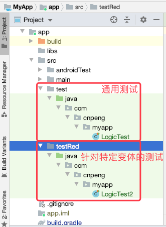

#### 6.1.1.4 查看运行结果

运行完测试任务之后，会在模块的 `/build/reports/` 目录中生成名称为 `index.html` 的测试报告，如下：

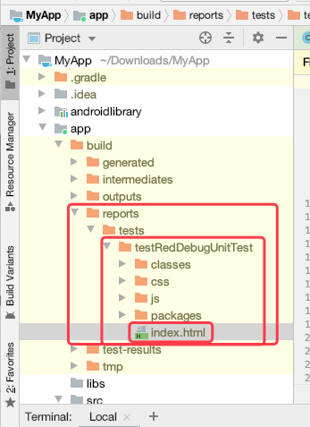

如果测试成功，点击 `index.html` 文件将看到如下样子：

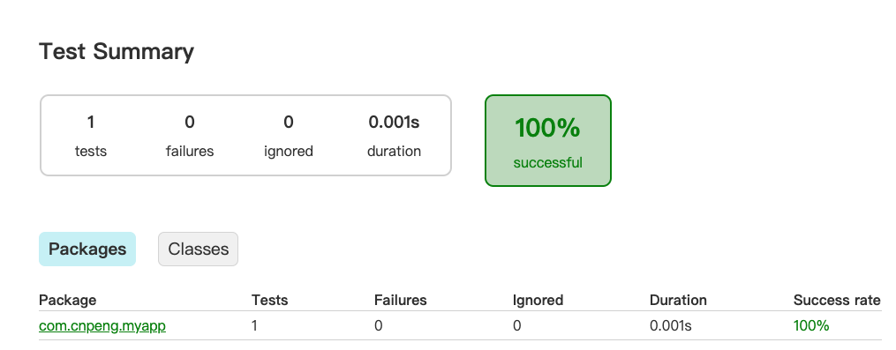

如果测试失败，点击  `index.html` 文件将看到如下样子：

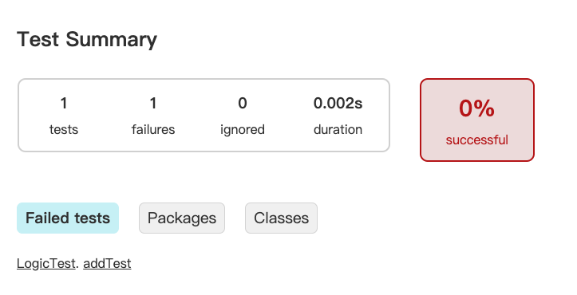

#### 6.1.1.5 使用 AndroidStudio 运行测试

使用 AndroidStudio 中的 Gradle 侧边栏也可以方便的实现单元测试，如下图：

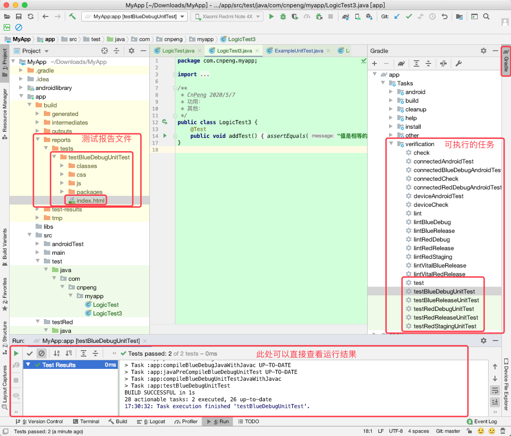

### 6.1.2 Robolectric

[点击进入 Robolectric 官网](http://robolectric.org/)

JUnit 仅能用来测试逻辑内容，无法测试与 Android SDK  相关的内容，而 Robolectric 则可以实现与 Android SDK  相关的单元测试。

> CnPeng 2020-05-07 实际操作时，按照官方文档中的描述未能正常运行，而且官方文档示例中的 api 好几处已经无法使用，所以，不做摘录。


## 6.2 功能测试

功能测试用于测试应用中的几个组件是否可以一起正常工作。例如，我们可以创建一个功能测试用例来确认某个按钮是否打开了一个新的 Activity。Android 中有多个功能测试框架，但最简单最基础的测试框架是 Espresso 框架。

### 6.2.1 Espresso 框架介绍

Espresso 是 Google 提供的功能测试框架。

在 AndriodStudio 3.6.3 版本中，我们新建一个项目时，模块的 `build.gradle` 文件中默认就会添加对 Espresso 的依赖，并指定默认的测试执行器：

```java
android {
    defaultConfig {
        // 指定测试执行器
        testInstrumentationRunner "androidx.test.runner.AndroidJUnitRunner"
    }
}

dependencies {
    // 添加功能测试依赖
    androidTestImplementation 'androidx.test.ext:junit:1.1.1'
    androidTestImplementation 'androidx.test.espresso:espresso-core:3.2.0'
}
```

另外，根据实际需要，我们还可以添加如下与功能测试相关的依赖：

```java
androidTestImplementation 'androidx.test:core:1.2.0'
androidTestImplementation 'androidx.test:runner:1.2.0'
androidTestImplementation 'androidx.test:rules:1.2.0'
//espresso-contrib 是 espresso 的补充依赖库
androidTestImplementation 'androidx.test.espresso:espresso-contrib:3.2.0'
```

`androidTestImplementation ` 表示时针对于 Android SDK 的功能测试，`testImplementation ` 表示时单元测试。

### 6.2.2 编写 Espresso 测试用例

功能测试用例放在 `androidTest` 目录中，结构如下：

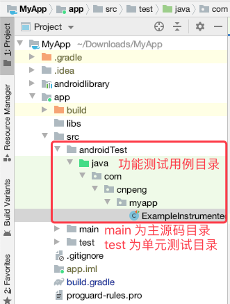

下面的测试用例用来检查 `WelcomeActivity` 中的 TextView 文本是否正确：

```java
import static androidx.test.espresso.Espresso.onView;
import static androidx.test.espresso.assertion.ViewAssertions.matches;
import static androidx.test.espresso.matcher.ViewMatchers.isDisplayed;
import static androidx.test.espresso.matcher.ViewMatchers.withText;

@RunWith(AndroidJUnit4.class)
@SmallTest
public class MainActivityEspressoTest {
    @Rule
    public ActivityTestRule<WelcomeActivity> mActivityTestRule = new ActivityTestRule<>(WelcomeActivity.class);

    @Test
    public void testHelloWordIsShown() {
        onView(withText("Hello World!")).check(matches(isDisplayed()));
    }
}
```

```xml
<?xml version="1.0" encoding="utf-8"?>
<LinearLayout
    xmlns:android="http://schemas.android.com/apk/res/android"
    android:layout_width="match_parent"
    android:layout_height="match_parent">

    <TextView
        android:id="@+id/tv_hello"
        android:text="Hello World!"
        android:layout_width="wrap_content"
        android:layout_height="wrap_content"/>

</LinearLayout>
```

### 6.2.3 运行测试

#### 6.2.3.1 命令行方式

命令 | 含义
---|---
`gradlew connectedCheck` | 运行项目中全部模块的 Espresso 测试用例并生成测试报告。该命令内部会同时触发 `connectedAndroidTest` 和 `ceateDebugCoverageReport`
`gradlew connectedAndroidTest` | 运行项目中全部模块的 Espresso 测试用例并生成测试报告。
`gradlew :app:connectedAndroidTest ` | 运行名为 app 的模块中的功能测试并生成报告
`gradlew connectedAndroidTest  --continue` | 测试过程中出错时，不中断，继续执行。

> * `ceateDebugCoverageReport` 是 Gradle 的内部命令，我们无法主动运行
> * `connectedCheck ` 和 `connectedAndroidTest` 从运行结果看都可以执行测试并生成报告，但它们底层实际执行的任务数量是不一样的。前者的任务数大于后者，我们可以简单理解为前者包含后者。
> * `connectedAndroidTest ` 的完整描述为 Installs and runs instrumentation tests for all flavors on connected devices.
> * `connectedCheck ` 的完整描述为  Runs all device checks on currently connected devices.

#### 6.2.3.2 AndroidStudio 的 Gradle 侧边栏 

除了用命令行运行功能测试之外，也可以通过 AndroidStudio 的 Gradle 侧边栏运行并生成测试报告：

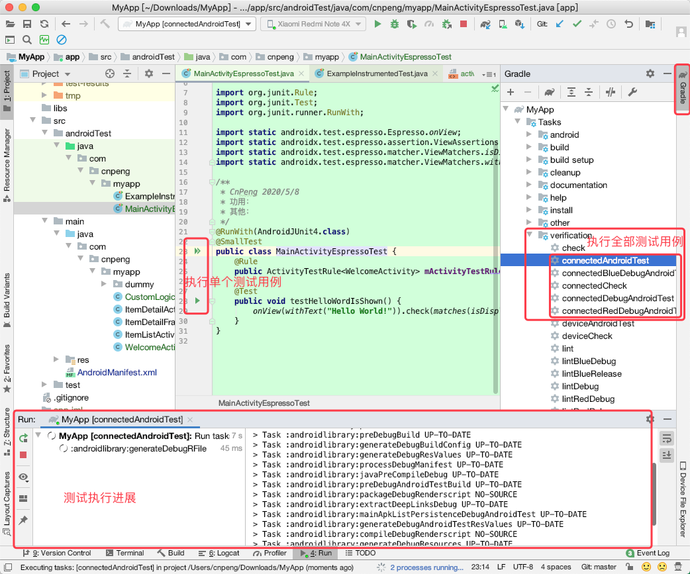

#### 6.2.3.3 在配置选择器中运行测试

这种方式不会生成测试报告：

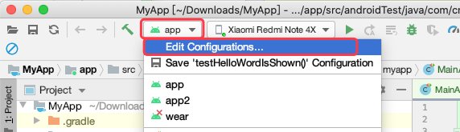

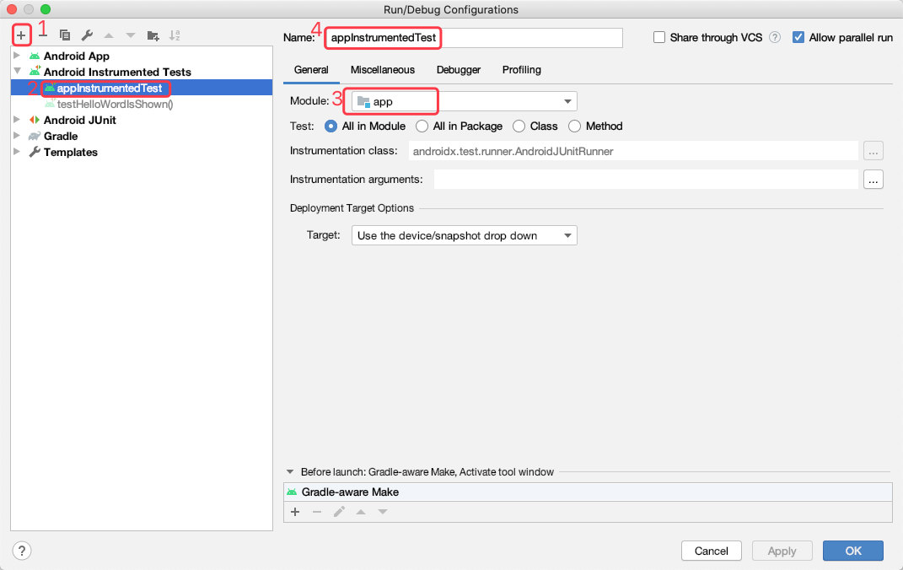

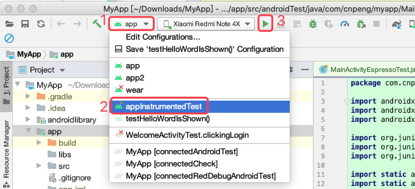

### 6.2.4 查看测试报告

测试报告目录如下：

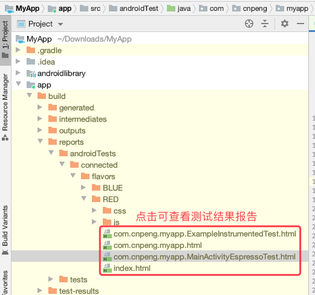

## 6.3 测试覆盖率

针对 Java 的测试覆盖率工具有很多，但用的较多的是 `Jacoco`。

在 AndroidStudio 中默认依赖了 `Jacoco`，但并没有启用。假如我们想为 debug 构建类型启用测试覆盖率的检查，则在模块的 `build.gradle` 中做如下设置：

```java
android {
	buildTypes {
        	debug {
        		// 启用测试覆盖率检查
            		testCoverageEnabled = true
       	 }
        }
}        
```

开启上述设置之后，我们再通过 `gradlew connectedCheck`  或 `gradlew connectedAndroidTest` 运行功能测试之后，就可以查看覆盖率报告，目录如下：

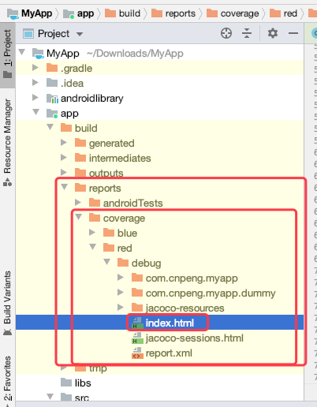

将 `index.html` 在浏览器中打开后，会看到如下内容：

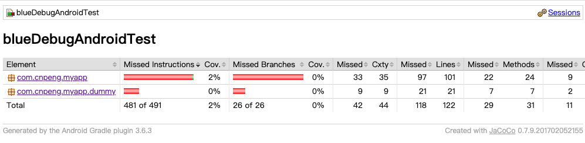

点击上图中的条目可以看到如下内容：

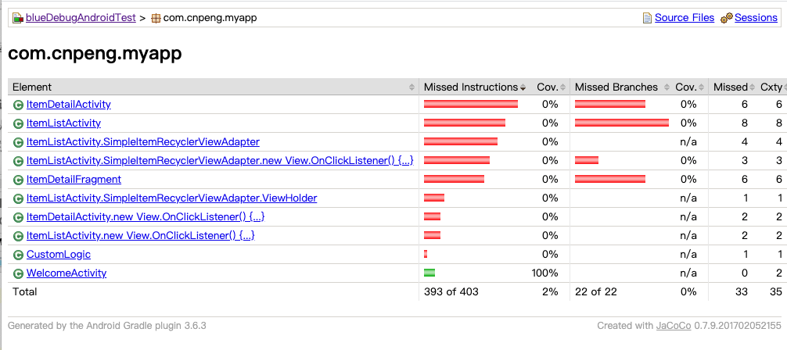

再点击上图中的条目可以查看更加详细的报告内容。
