# 七、创建任务和插件

## 7.1 理解 Groovy

* [Groovy简要文档](http://www.groovy-lang.org/objectorientation.html#_types)
* [Groovy完整文档](http://www.groovy-lang.org/single-page-documentation.html)

AndroidStudio 自带 Groovy 控制台，通过 Groovy 控制台我们可以方便的运行和查看结果。

在 AndroidStudio 中打开 Groovy 控制台的方法：`Tools > Groovy Console`，打开之后样子如下：

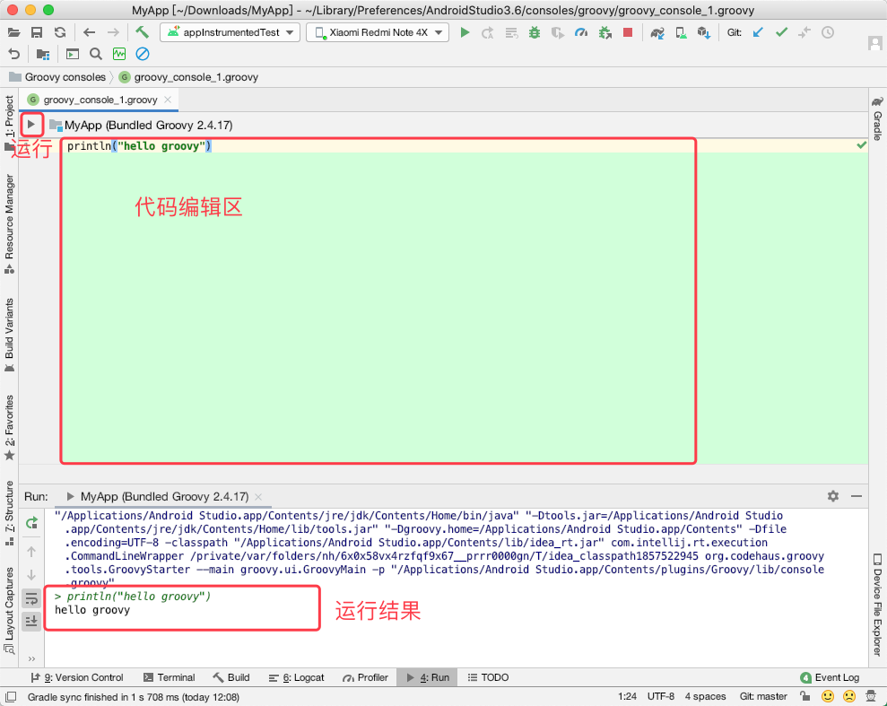

### 7.1.1 简介

Groovy 是从 Java 衍生出来的，运行在 Java 虚拟机上的敏捷型语言。

在 Java 中打印字符串到屏幕上，代码如下：

```java
System.out.println("Hello,groovy");
```

而在 Groovy 中，则通过如下代码实现：

```java
println "hello groovy"
```

通过上面的代码，我们会发现，在 Groovy 中：

* 不需要 System.out 命名空间
* 方法可以不加小括号
* 行的末尾没有分号 

上述示例中我们用双引号包裹了字符串，也可以使用单引号。

双引号和单引号包裹的字符串主要区别在于：**双引号包裹的字符串可以使用字符串插值（字符串模板）。**

字符串插值可以是变量也可以是方法。字符串插值的基本格式为 `${ 插值内容 }`，如果插值内容是一个变量，可以省略两侧的 `{ }`, 如果是表达式或方法则不能省略。

```groovy
def name = "CnPeng"
def greeting = "Hello, $name"
def nameSize = "Your name is ${name.size()} characters long"

// println 方法的括号可以省略——通常写法都是省略
println(greeting)
println nameSize
```

Groovy 的字符串插值还允许我们动态执行代码，下面的例子是打印当前日期：

```groovy
def method = "toString"
def curTime = new Date()."$method"()

println curTime
```

### 7.1.2 类和成员变量

在 Groovy 中创建一个类和再 Java 中创建一个类即为类似，夏敏时仅包含一个成员变量的类：

```groovy
class MyGroovyClass{
    String greeting
    
    String getGreeting(){
        return greeting
    }
}
```

在 Groovy 中不论是类还是成员变量，都没有明确的访问修饰符。Groovy 中类和方法默认是公有的，类成员则默认是私有的。

要想使用上面定义的 `MyGroovyClass` 需要先创建实例：

```groovy
def instance = new MyGroovyClass()
instance.setGreeting "Hello,Groovy"
instance.setGreeting("Hello,Groovy  2")

println instance.greeting
println instance.getGreeting()
```

`def` 关键字用来声明新的变量或方法。在 Groovy 中，即便没有为类的成员变量声明 set/get 方法，我们在通过实例调用该成员时依旧可以使用 set/get 方法。

当我们直接通过类的实例访问其成员变量时，等同于调用该成员的 getter 方法。所以，上述示例代码中，`instance.greeting` 和 ` instance.getGreeting()` 得到的是同样的结果。

### 7.1.3 方法

Groovy 中，默认将方法的最后一行的运行结果作为返回值。也就是说，Groovy 中我们可以不用显示的声明 `return`, 而是把方法的最后一行作为返回值。

Java 中求数字平法的方法如下：

```java
public int square(int num){
    return num*num;
}

System.out.println(square(2));
``` 

Groovy 中则可以这么写：

```groovy
def square(def num){
     num*num
}

println(square(2))
```

我们也可以使用 `closure (闭包)` 的方式定义该方法，如下：

```groovy
def square = { num ->
    num * num
}

def result = square 3
println(result)
```

### 7.1.4 Closures（闭包）

Closures 是匿名代码块，可以接受参数和返回值。他们可以被视为变量，被当做参数传递给方法。

对于上一小节中的代码，我们还可以这么定义：

```groovy
Closure square = {
    it * it
}

def result = square 4
println result
```

上述代码中，直接声明 square 为 Closure 类型，**当 closure 只接收一个参数时，我们可以省略该参数，闭包内部默认用关键字 `it` 来表示该参数。**

### 7.1.5 集合

#### 7.1.5.1 List 

在 Groovy 中通过如下方式即可创建一个 list :

```groovy
List list = [1,2,3,4]
```

使用 `each()` 可以对集合进行迭代遍历：

```groovy
list.each() { element ->
    println element
}

// 下面这种方式与上面的方式等效。it 是默认的元素变量
list.each {
    println it
}
```

#### 7.1.5.2 Map

Groovy 中定义 Map 的方式如下：

```groovy
Map pizzaPrices = [margherita:10, pepperoni:12]
```

获取其中的元素值时，有如下三种方式：

```groovy
def price1 = pizzaPrices["pepperoni"]
def price2 = pizzaPrices.get("pepperoni")
def price3 = pizzaPrices.pepperoni
```

### 7.1.6 Gradle 中的 Groovy

Gradle 的构建文件中，大量使用了 Groovy 的简写方式。

#### 7.1.6.1

简写：

```groovy
apply plugin: 'com.android.application'
```

完整写法：

```groovy
project.apply ([plugin:'com.android.application'])
```

在上述代码中，我们可以看出 `apply()` 是 `Project` 类的一个方法，`apply()` 方法接收一个 Map 作为参数，该 Map 中的 key 为 `plugin`，value 为 `'com.android.application'`。

Project 类是每个 Gradle 构建的基础构建代码块。

#### 7.1.6.2

简写：

```groovy
dependencies {
	implementation 'com.google.android.material:material:1.1.0'
}
```

完整写法：

```groovy
project.dependencies({
    add('implementation', 'com.google.android.material:material:1.1.0')
})
```

在上述代码中，`dependencies(）` 方法接收一个 Closure 闭包作为参数，闭包中通过 `DependencyHandler` 的 `add()` 方法添加到配置中。`add(,)` 方法接收两个参数，第一个是配置名称，第二个是被依赖项。

> 在 MAC 版 AndroidStudio 中按住 CMD 键然后点击上述代码中的 `dependencies ` 即可查看其内部实现。

## 7.2 任务入门 

自定义 Gradle 任务可以提高开发效率。

### 7.2.1 定义任务

任务属于一个 Project 对象，每个任务都可以执行 task 接口。

#### 7.2.1.1 使用极简方式定义任务

定义一个新任务的最简单方式是：`task 任务名`, 如 `task hello` ，我们执行该任务时，Gradle 不会有任何操作，因为 `hello` 仅是任务名，没有具体任务内容。

#### 7.2.1.2 定义在配置阶段执行的任务

在定义 `hello` 的具体任务时，我们可能会这样写：

```groovy
// 这种是有问题的写法！！
task hello{
    println "Hello, World"
}
```

我们运行该任务后，会看到下图的样子：

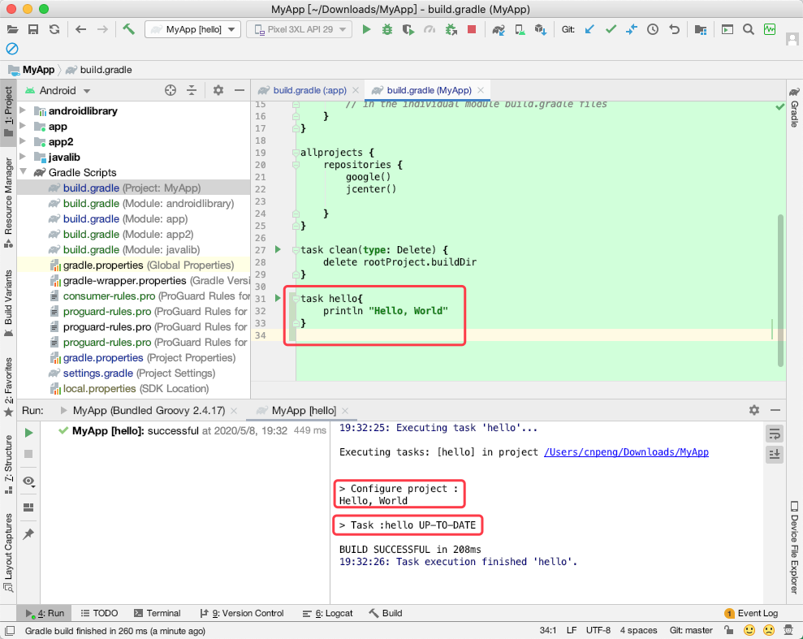

在上图的运行日志工具栏中我们可以看到，虽然能正常打印文本，但实际是先打印了文本，然后才执行了 `hello` 任务。

我们知道，在 Gradle 构建时，会依次经历三个阶段：初始化阶段、配置阶段和执行阶段。我们上面的代码实际是将打印语句添加到了配置阶段。也就是说，我们执行任意的任务时，都会先得到打印结果，然后再执行指定的任务。如下图：

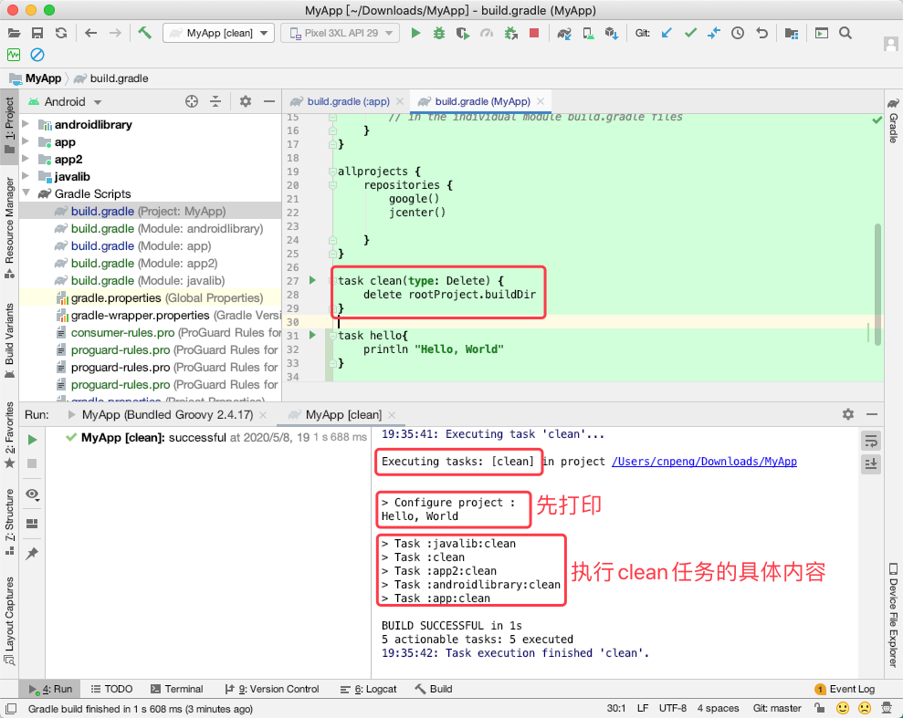

#### 7.2.1.3 在执行阶段定义任务

> * 原书中列举了几种定义任务的方式在 AndroidStudio 中未能正常运行，所以此处不再摘录。
> * 更多定义任务的方式可以参考 《Android Gradle 权威指南》（作者：飞雪无情）中的第四章。下面的示例也参考自该书。

```groovy
task hello  {
    println "在配置阶段打印"

    doLast {
        println "在任务执行阶段打印"
    }
}
```

上述代码中，我们定义了 `hello` 任务，其中 `doLast` 闭包中定义了在任务执行阶段需要做的内容。

另外，即便我们将 `doLast{ }` 闭包放在前面，其中的内容依旧会在任务执行阶段打印，如下图：

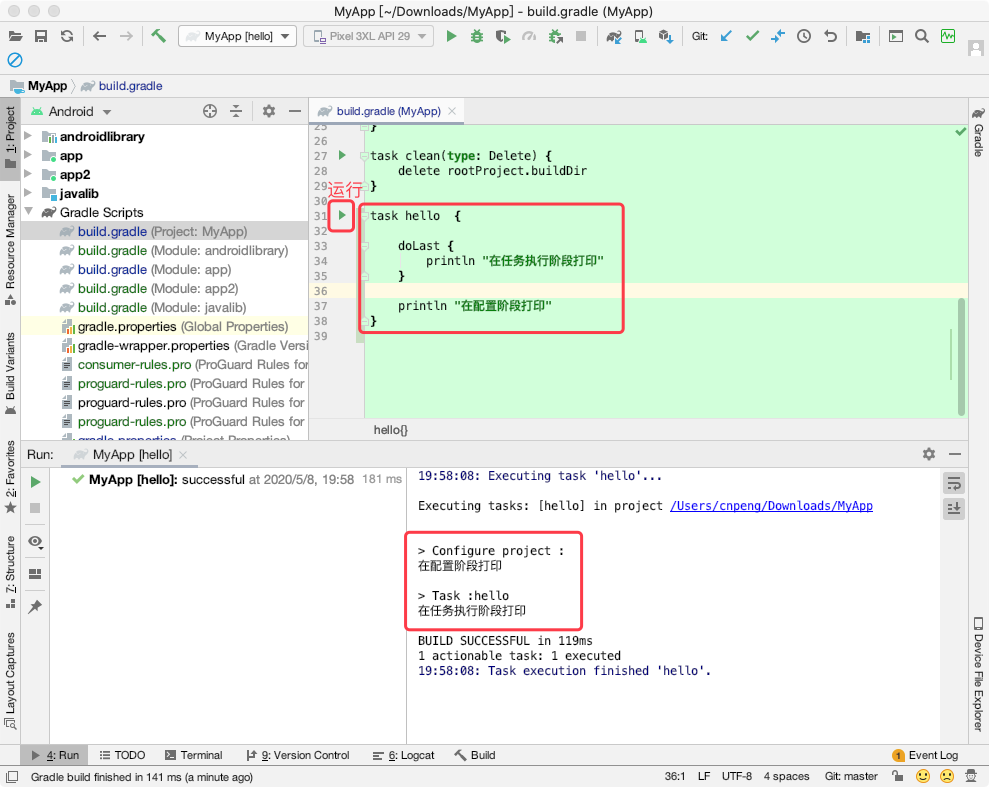

自定义任务也可以直接从命令行中用：`gradlew 自定义任务名` 来执行。

### 7.2.2 任务剖析

Task 接口是所有任务的基础，其中定义了一系列属性和方法。`AbstractTask` 是 Gradle 的一个内部类，它实现了 Task 的所有方法，但由于它是内部类，所以我们无法使用，只能使用其子类 `DefaultTask`。也就是说，我们创建的每一个任务，都是基于 `DefaultTask` 的 。

每个任务都包含一个 Action 对象的集合。当一个任务被执行时，其中的 Action 就会按顺序执行。

#### 7.2.2.1 doFirst 和 doLast

如果我们想在执行阶段执行 Action, 我们可以用 `doFirst()` 、`doLast()` 来为 Task 添加具体的 Action。示例如下：

```groovy
task hello  {

    doLast {
        println "在任务执行阶段打印"
    }

    doFirst{
        println "在任务执行阶段先执行"
    }

    println "在配置阶段打印"
}
``` 

运行结果如下：

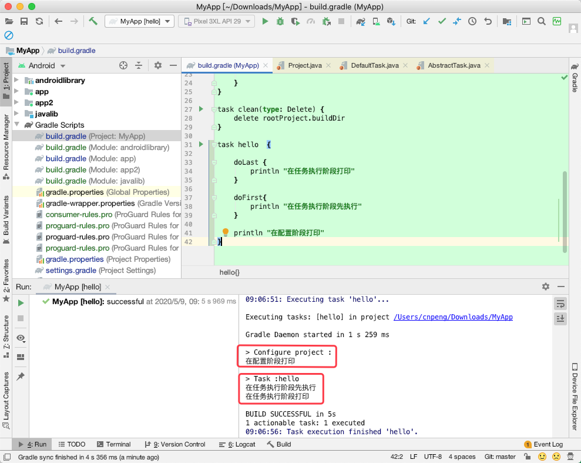

#### 7.2.2.2 多个 doFirst 和 doLast

我们也可以多次使用 doFirst 和 doLast，doFirst 会把任务添加到最前面，doLast 会把任务添加到最后面。也就是说，最后添加的 doFirst 最新执行，最后添加的 doLast 最后执行。

```groovy
task hello  {
    doFirst{
        println "在任务执行阶段先执行1"
    }
    doFirst{
        println "在任务执行阶段先执行2"
    }
    
    doLast {
        println "在任务执行阶段后打印1"
    }
    doLast {
        println "在任务执行阶段后打印2"
    }

    println "在配置阶段打印"
}
```

运行效果如下：

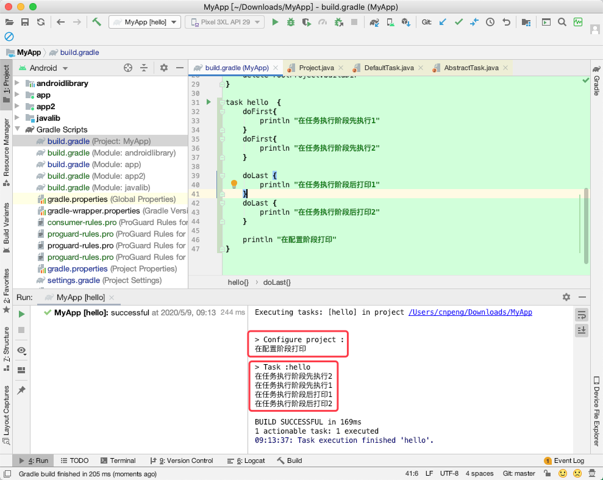

#### 7.2.2.3 `mustRunAfter()`

`mustRunAfter()` 可以用来给 task 排序，该方法会影响 Gradle 如何构建依赖关系图。示例如下：

```groovy
task hello  {
    doLast {
        println "在任务执行阶段打印1"
    }
    println "在配置阶段打印1"
}

task hello2  {
    doLast {
        println "在任务执行阶段打印2"
    }
    println "在配置阶段打印2"
}

hello2.mustRunAfter hello
```

运行效果如下：

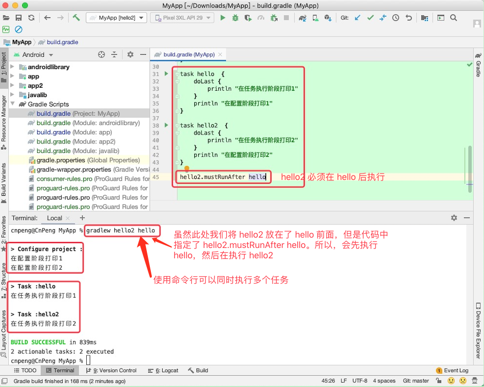

`mustRunAfter()` 只是指定两个任务间的顺序关系，而不是依赖关系。也就是说，在上述代码中，如果我们单纯的执行 hello ，hello2 并不会被执行，反之亦然，因为二者之前没有依赖关系。

#### 7.2.2.4 `dependsOn()`

`dependsOn()` 方法可以指定两个任务间的依赖关系。

```groovy
task hello  {
    doLast {
        println "在任务执行阶段打印1"
    }
    println "在配置阶段打印1"
}

task hello2  {
    doLast {
        println "在任务执行阶段打印2"
    }
    println "在配置阶段打印2"
}

hello2.dependsOn hello
```

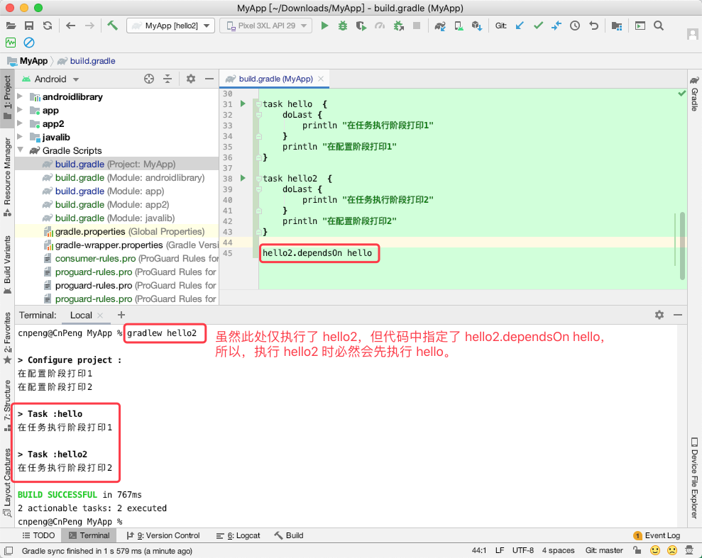

### 7.2.3 使用任务来简化 release 过程

发布应用到市场之前，我们需要使用证书对 apk 进行签名。也就是说，我们需要先创建自己的 keystore 文件，其中包含一堆私钥。然后我们需要在模块的 `build.gradle` 文件中做如下配置：

```groovy
android {
    signingConfigs {
        staging.initWith(signingConfigs.debug)

        release {
            storeFile file('/Users/cnpeng/Downloads/MyApp/myApp.jks')
            storePassword '123456'
            keyAlias = 'myApp'
            keyPassword '123456'
        }
    }
    
    //其他代码省略
    
    buildTypes {
        release {
           signingConfig signingConfigs.release
           //其他代码省略
        }
    }
}    
```

上述代码中，明文展示了 storePassword 和 keyPassword ，这样非常不安全。为了避免这种情况，我们可以创建一个任务，在每次构建 release 包时询问密码。但这种方案比较麻烦，而且也无法让构建服务器自动完成构建。所以，**我们可以考虑创建一个配置文件，专门用来存储密码信息，然后创建任务，在构建 release 包时触发该任务，由该任务负责读取存储在配置文件中的密码信息。**

#### 7.2.3.1 创建 `.proerties` 文件

新建 `key.properties` 文件，并编辑内容：

```groovy
KEY_PASSWORD = 你的 keyPassword
KEY_ALIAS = 你的 keyAlias
STORE_PASSWORD = 你的 storePassword
```

上述文件名以及文件中的字段名都可以自定义，后续在任务中读取时，也需要使用文件名和字段名。

#### 7.2.3.2 创建读取密码的任务

注意，下列代码中使用的文件名和字段名需要与上一节中定义的一致。

```groovy
task getReleasePwd {
    doLast {
        def pwd = ""
        File propertiesFile =rootProject.file('key.properties')
        if (propertiesFile.exists()) {
            Properties properties = new Properties()
            DataInputStream dataInputStream = propertiesFile.newDataInputStream()
            properties.load(dataInputStream)
            pwd=properties.getProperty('KEY_PASSWORD')
        }

        println pwd
    }
}
```

上述任务会在项目的跟目录查找名为 `key.properties` 的文件，如果文件存在，则读取其中全部的属性和值。最后我们在通过 `getProperties` 方法读取我们所需要的键对应的值即可。

为了确保在没有 `key.properties` 文件或者有文件但没有对应属性时依旧可以运行该任务，可以在控制台让用户主动输入：

```groovy
 if (!pwd?.trim() ) {
     // 原书中的这种方式不论是从 AS 还是终端运行都一直报空指针
     //pwd = new String(System.console().readPassword("\n what's the pwd"))

     // 这种方式需要用终端运行，AS 运行会报错 NoSuchElementException
     println "请输入密码"
     pwd = new Scanner(System.in).next()
 }      
```

上述代码中，`pwd?` 表示判断是否为空，为空则不会执行 `trim()`。`if(!pwd?.trim())` 表示，如果是 null 或空串，则执行 if 方法体。 

#### 7.2.3.3 执行 release 构建时执行我们的任务

```groovy
tasks.whenTaskAdded { theTask ->
    if (theTask.name.equals("packageRelease") ) {
        theTask.dependsOn "getReleasePwd"
    }
}
```

上述代码通过添加一个 closure 来链接 （hook into） 到 Gradle 和 Android 插件。其会在任务被添加到依赖关系图时运行。

在 `packageRelease` 任务执行之前，不需要密码，所以我们可以确保 `packageRelease` 依赖于我们的 `getReleasePwd` 任务。

> 下面的内容没看懂。。。先摘录，慢慢消化

我们不能只使用 `packageRelease.dependsOn()`的原因是，Gradle 的 Android 插件是基于构建 variants 动态生成的 packaing 任务。这意味着在 Android 插件发现所有构建 variant 之前，`packageRelease` 任务都不会存在，也就是说，发现过程是在每个单独构建之前。

#### 7.2.3.4 执行 release 构建任务

通过 `gradlew assembleRelease` 执行构建任务时，即可发现会先执行我们自定义的任务，然后再执行 release 构建任务。

## 7.3 Hook 到 Android 插件

在开发 Android 时，我们希望大部分 tasks 都能涉及到 Android 插件。通过 hook 到构建进程来增加任务的行为是可行的。

Hook 到 Android 插件的方式之一是操控构建 variants。其原理是遍历应用的所有构建 variant:

```groovy
android.applicationVariants.all { variant ->
	// Do something 
}
```

我们可以使用 applicationVariants 对象来得到构建 variant 的集合。获取到 variant 的引用之后，就可以访问和操作它的属性，如名称、说明等。

如果我们想对 Android 依赖库使用相同的逻辑，就需要使用 `libraryVariants` 来代替 `applicationVariants`。

上面的示例代码获取到 variant 对象之后，我们就可以修改 apk 名称、为 apk 名称添加版本号等。

> 注意，在上述代码中，我们使用 `all()` 来遍历 variant 而是不会用之前提到的 `each()`。这是因为 `each()` 会在 variant 被 Android 插件创建之前的评测阶段触发，另外，`all()` 方法会在每次添加新项目到集合时触发。

### 7.3.1 自动重命名 Apk

> 书中的例子在 AndroidStudio 3.6.3 ，Gradle 5.6.4，Groovy: 2.5.4 环境中未能运行起来，一直报错 outputFile 是只读的。所以下面的例子是从我们的项目中借鉴的。

遍历构建 variant ，然后通过改变其 outputFile 属性来改变 apk 文件名称：

```groovy
android{
	 applicationVariants.all {variant ->
        variant.outputs.all { output ->
            def file = output.outputFile
            outputFileName = file.name.replace(".apk","-${variant.versionName}.apk")
        }
    }
}
```

### 7.3.2 动态创建新的任务

install 任务时 Android 插件的一部分，但如果通过命令行使用 `installDebug` 任务来安装 App，在安装完成之后，依旧需要我们手动去启动该 App。本节将创建新的任务，实现执行 install 任务之后，自动打开 App。示例如下：

#### 7.3.2.1 创建新的任务并添加描述

```groovy
android {
	android.applicationVariants.all { variant ->
        	if (variant.installProvider ) {
            		tasks.create(name:"run${variant.name.capitalize()}", dependsOn: variant.installProvider){
                		description "Installs the ${variant.description} and runs the main launcher activity"
           		}
        	}
    	}
}    
``` 

在上述代码中，

* 对于每一个 variant 我们都会检查其是否有一个有效的 install 任务。该判断不能省略，因为我们创建的打开 App 的任务依赖于 install 任务。
* 如果具备有效的 install 任务，我们就创建新的任务，并基于 variant 的名称为任务命名。同时让该任务依赖于 install 任务。
* 此外，我们还未该任务添加了一个说明。该说明将在执行 gradlew 任务时显示。

> 原书中判断是否有 install 任务时使用的是 `variant.install` ，但 AndroidStudio 提醒，该方法已经废弃并会被移除，需要使用 `variant.installProvider` 替代。

#### 7.3.2.2 打开 App 的首页

> 这里说的首页，指的是在 `AndroidManifest.xml` 中设置的启动页。

当我们使用 Android Debug Tool (ADB) 命令时，可以通过如下命令打开 App 的首页：

```groovy
//最后一段含义为：applicationId/目标文件路径
adb shell am start -n com.cnpeng.app2/com.cnpeng.app2.SettingsActivity
```

上述代码中， `com.cnpeng.app2` 是应用的包名，`/` 后面是目标 Activtiy 的路径。如果目标 Activity 不是首页，会报错 `SecurityException: Permission Denial: starting Intent not exported from uid`

在 Gradle 中可以使用 `exec()` 方法来执行命令行。示例如下：

```groovy
 android.applicationVariants.all { variant ->
        if (variant.installProvider ) {
            tasks.create(name:"run${variant.name.capitalize()}", dependsOn: variant.installProvider){
                description "Installs the ${variant.description} and runs the main launcher activity"

                doFirst{
                    exec{
                        executable = 'adb'
                        args = ['shell','am','start','-n',"${variant.applicationId}/.SettingsActivity"]
                    }
                }
            }
        }
    }
```

在上述代码中

* args 中的内容就是 adb 命令的内容。最后一个参数指定报名和文件名时，需要注意，如果目标 Activity 位于包的根目录下直接按示例中的写法即可；如果是在子目录中，则需要将子目录也写出来。

假设我们的项目中没有指定 flavor , 当我们想通过上述自定义任务安装并打开 debug  variant 时，可以在终端输入如下命令：

```groovy
// 此处的任务名就是我们创建任务时声明的名字——变体名称前添加 run 前缀。
gradlew runDebug
```   

运行效果如下：

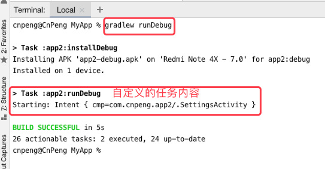

#### 7.3.2.3 为 applicationId 添加了后缀时的处理

如果我们为 applicationId 添加了后缀，那么，我们在 `exec()` 方法中指定要打开的页面时就不能直接使用 applicationId, 必须要拿到目标文件的真正路径名.

添加 applicationId 后缀的方式如下：

```groovy
android {
    // 其他内容省略
    defaultConfig {
        applicationId "com.cnpeng.app2"
    }

    buildTypes {
        debug{
            applicationIdSuffix '.debug'
        }
    }
}    
```

如上述代码， 我们构建 debug 类型的 varint 时，得到的 applicationId 将是 `com.cnpeng.app2.debug` ，然而 SettingsActivity 是放置在 `com.cnpeng.app2` 包的根目录下，所以，对于这种情况，我们就需要单独处理：

```groovy
android{
    android.applicationVariants.all { variant ->
        if (variant.installProvider ) {
            tasks.create(name:"run${variant.name.capitalize()}", dependsOn: variant.installProvider){
                description "Installs the ${variant.description} and runs the main launcher activity"

                doFirst{
                    def classPath = variant.applicationId

                    if (variant.buildType.applicationIdSuffix ) {
                        classPath -= "${variant.buildType.applicationIdSuffix}"
                    }

                    def launchClass = "${variant.applicationId}/${classPath}.SettingsActivity"

                    exec{
                        executable = 'adb'
                        args = ['shell','am','start','-n',"$launchClass"]
                    }
                }
            }
        }
    }
}
```

> AndroidStudio 中对于 gradle 的代码提示目前还不完善，很多东西都需要自己手动拼写。

## 7.4 创建自己的插件

如果我们想在多个项目中复用一些列 Gralde tasks ，那么我们可以把这些 tasks 提取到一个自定义插件中。

插件既可以使用 Groovy 编写，也可以使用其他 JVM 语言编写，如 Java 。Gradle 中的 Android 插件大部分都是由 Java 结合 Groovy 编写的。

### 7.4.1 创建一个简单的插件

#### 7.4.1.1 创建插件

我们可以在模块的 `build.gradle ` 文件中创建一个插件，用来提取其中的构建逻辑。这也是自定义插件最简单的方式。

创建插件时，首先要创建一个实现 `Plugin` 接口的类。下面的代码会把我们在上一节中自定义的安装并打开 App 首页的任务抽取到插件中，如下：

```groovy
class RunPlugin implements Plugin<Project>{
    @Override
    void apply(Project target) {
        project.android.applicationVariants.all { variant ->
            if (variant.installProvider ) {
                project.tasks.create(name:"run${variant.name.capitalize()}", dependsOn: variant.installProvider){
                    description "Installs the ${variant.description} and runs the main launcher activity"

                    doFirst{
                        def classPath = variant.applicationId

                        if (variant.buildType.applicationIdSuffix ) {
                            classPath -= "${variant.buildType.applicationIdSuffix}"
                        }

                        def launchClass = "${variant.applicationId}/${classPath}.SettingsActivity"

                        project.exec{
                            executable = 'adb'
                            args = ['shell','am','start','-n',"$launchClass"]
                        }
                    }
                }
            }
        }
    }
}
```

Plugin 接口定义了一个 `apply()` 方法，当插件被构建文件使用时，会调用该方法。

在 `apply()` 方法中传递了一个 `Project` 参数，这样插件就可以配置项目或使用它的方法和属性了——上述代码中，我们在遍历 variant 、创建任务 以及 执行 adb 命令时，都需要通过 project 对象调用。

我们在 `build.gradle` 文件中引用自定义插件前，必须先引用 android 插件，否则，上述代码中的 `project.android` 就会报错。如下：

```groovy
// 引用 android 插件
apply plugin: 'com.android.application'
// 引用自定义插件
apply plugin: RunPlugin
```

#### 7.4.1.2 完整代码及运行结果：

完整代码如下：

```groovy
apply plugin: 'com.android.application'
apply plugin: RunPlugin

android {
    defaultConfig {
        applicationId "com.cnpeng.app2"
    }

    buildTypes {
        debug{
            applicationIdSuffix '.debug'
        }
    }
}

class RunPlugin implements Plugin<Project>{
    @Override
    void apply(Project project) {
        project.android.applicationVariants.all { variant ->
            if (variant.installProvider ) {
                project.tasks.create(name:"run${variant.name.capitalize()}", dependsOn: variant.installProvider){
                    description "Installs the ${variant.description} and runs the main launcher activity"

                    doFirst{
                        def classPath = variant.applicationId

                        if (variant.buildType.applicationIdSuffix ) {
                            classPath -= "${variant.buildType.applicationIdSuffix}"
                        }

                        def launchClass = "${variant.applicationId}/${classPath}.SettingsActivity"

                        project.exec{
                            executable = 'adb'
                            args = ['shell','am','start','-n',"$launchClass"]
                        }
                    }
                }
            }
        }
    }
}
```

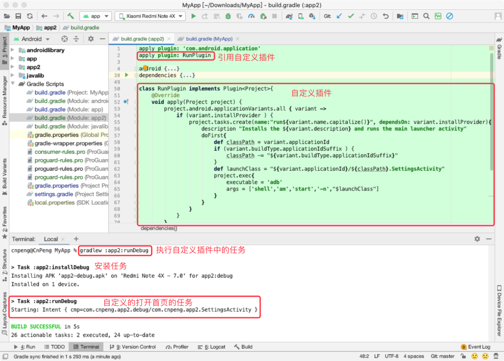

### 7.4.2 jar 文件的分发和使用

为了将我们的插件分发给其他项目使用，就需要把插件移到一个独立模块（或者项目中）。一个独立的插件有其自己的构建文件来配置依赖关系和分发方式。该模块可以生成一个包含插件类和属性的 JAR 文件，我们在其他项目或者模块中使用该 JAR  文件即可。

> 插件的分发和使用可以参考 [在AndroidStudio中自定义Gradle插件](https://www.jianshu.com/p/d53399cd507b)

在 AndroidStudio 中并不支持直接创建插件模块或项目，所以，我们需要进行一些操作，具体如下：

#### 7.4.2.1 创建模块及目录

* 在 AndroidStudio 中新建一个任意类型的 module (假设模块名为 plugin)
* 删除该 module 中除 `build.gradle` 和 `src/main` 之外的全部内容, `src/main` 中的内容也删除。
* 按照如下结构创建目录

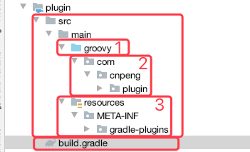

因为自定义插件本质上是一个 groovy 项目，所以，上图中，`src/main` 中的子目录定义为了 `groovy` 而不是 Android 项目中常见的 java。

**resources/META-INF/gradle-plugins** 目录是固定格式，不能修改。

#### 7.4.2.2 修改 gradle 文件

`build.gradle` 中的完整内容如下

```groovy
apply plugin: 'groovy'

version = '1.0.0'

dependencies {
    implementation gradleApi()
    implementation localGroovy()
}
```

我们的自定义插件是基于 Groovy 编写的，所以需要先应用  `groovy` 插件。

在自定义插件中访问 Gradle 命名空间时需要使用 Gradle API , 所以需要依赖 `gradleApi()`

`localGroovy()` 是 Groovy SDK 的一个分发包，来自于 Gradle 安装包中。

> Gradle 默认会提供上述两项依赖，如果没有提供则需要手动下载并引用。

`version` 用来指定插件的版本信息

#### 7.4.2.3 新建插件文件

在 `src/main/groovy/com/cnpeng/plugin` 目录下右击，然后选择 `New -> File`，输入带有 `.groovy` 后缀名的完整文件名：`RunPlugin.groovy` 。

然后手动编写代码内容（因为 AndroidStudio 对 groovy 的代码提示还不完善，所以需要手动编写 ）,完整内容如下：

```groovy
package com.cnpeng.plugin

import org.gradle.api.Plugin
import org.gradle.api.Project

class RunPlugin implements Plugin<Project>{
    @Override
    void apply(Project project) {
        project.android.applicationVariants.all { variant ->
            if (variant.installProvider ) {
                project.tasks.create(name:"run${variant.name.capitalize()}", dependsOn: variant.installProvider){
                    description "Installs the ${variant.description} and runs the main launcher activity"
                    doFirst{
                        def classPath = variant.applicationId
                        if (variant.buildType.applicationIdSuffix ) {
                            classPath -= "${variant.buildType.applicationIdSuffix}"
                        }
                        def launchClass = "${variant.applicationId}/${classPath}.SettingsActivity"
                        project.exec{
                            executable = 'adb'
                            args = ['shell','am','start','-n',"$launchClass"]
                        }
                    }
                }
            }
        }
    }
}
```

#### 7.4.2.4 新建 properties 文件

在 `src/main/resources/META-INF/gradle-plugins` 目录中右击，然后选择 `New -> File` , 输入带有 `.properties` 后缀的完整文件名：`com.cnpeng.plugin.properties`。

这个文件名非常重要，因为在其他 module 的 `build.gradle` 中引用就是该文件名，也就是说，该名称是插件库的 id。

基于当前的插件库名称，我们在其他 module 中引用时，就需要这样写：

```groovy
apply plugin: 'com.cnpeng.plugin'
```

然后编辑该文件的内容，如下：

```groovy
implementation-class = com.cnpeng.plugin.RunPlugin
```

`implementation-class` 是固定格式，`=` 后面的是插件类的完整路径。

综上，我们会发现，该 `.properties` 文件有两个作用，一个是声明该插件库的 id，一个是指定插件类文件。

此时，我们完整的目录结构如下：

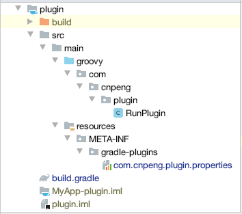

>TODO 暂时未能查找到如何声明多个插件类的方法。

#### 7.4.2.5 生成和使用 jar 插件

生成插件 jar  文件时，可以使用命令行，也可以使用 AndroidStudio Gradle 侧边栏中的条目。默认生成的文件存放在 `build/libs` 目录下。具体如下图：

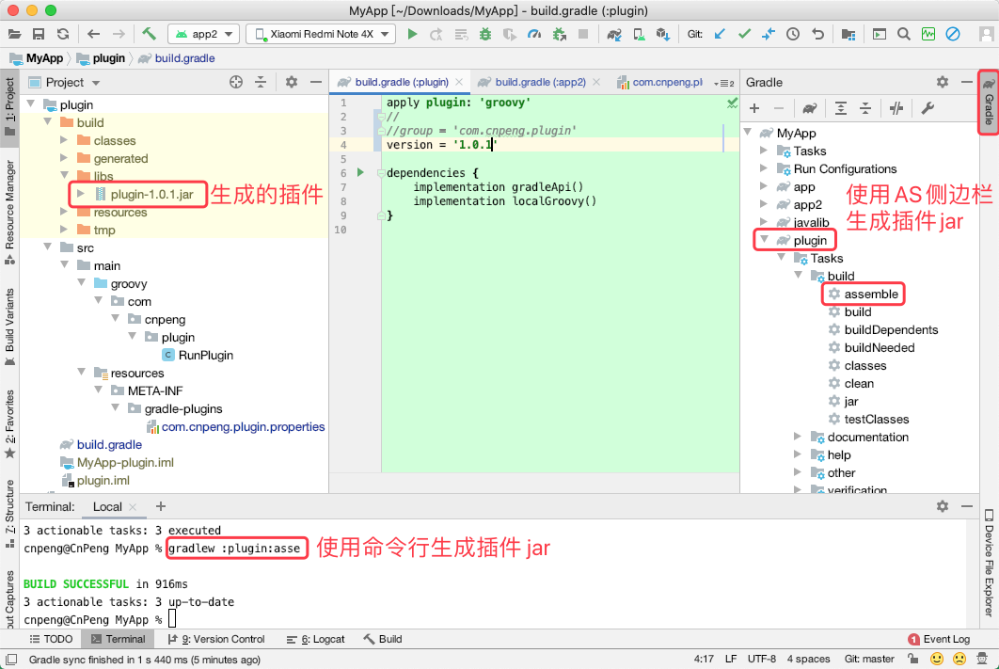

生成 jar 文件之后我们就可以拿来使用了。

将 jar 文件拷贝到我们指定模块（假设模块名为 app2）的 `libs` 目录下，然后在该模块的 `build.gradle` 文件中添加如下内容：

```groovy
buildscript {
    dependencies {
        // 指定本地仓库目录
        repositories {
            flatDir{ dirs 'libs'}
        }
        //添加依赖：插件包名(id):jar文件名
        classpath 'com.cnpeng.plugin:plugin-1.0.1'
    }
}
apply plugin: 'com.cnpeng.plugin'
```

上面指定仓库和依赖的方式也可以简化成下面的样子：

```groovy
buildscript {
    dependencies {
        classpath files('libs/plugin-1.0.1.jar')
    }
}
apply plugin: 'com.cnpeng.plugin'
```


这样我们就可以使用自定义插件中的任务了，具体如下图：

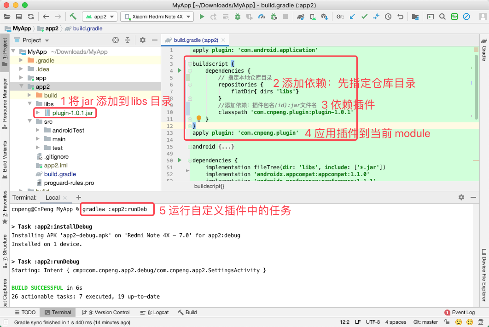

> 注意：通过上述方式生成的插件，如果使用下图中的导入方式会报错，也就是会导入失败。

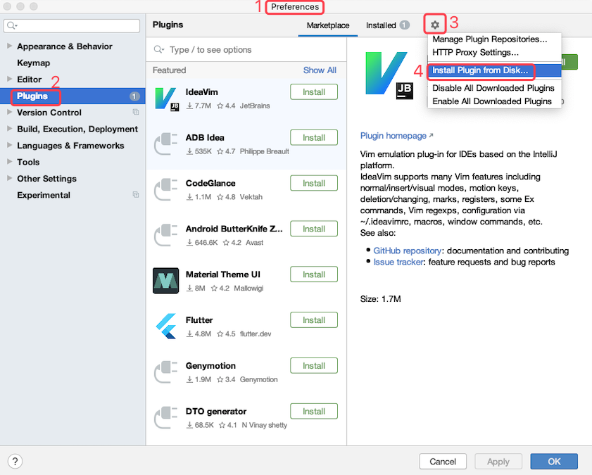

### 7.4.3 远程自定义插件的分发和使用

> 远程自定义插件的分发和使用未做实际尝试，以下内容仅是结合原书和 [《在AndroidStudio中自定义Gradle插件》](https://www.jianshu.com/p/d53399cd507b) 的整理


#### 7.4.3.1 创建远程插件

将插件发布到 maven 仓库中进行分发。

先修改插件模块的 `build.gradle` 文件，添加包名，添加对 maven 插件和库的依赖：

```groovy
apply plugin: 'groovy'
apply plugin: 'maven'

group = 'com.cnpeng.plugin'
version = '1.0.2'

dependencies {
    implementation gradleApi()
    implementation localGroovy()
}

repositories {
    mavenCentral()
}
```

然后继续在该文件中修改输出目录：

```groovy
uploadArchives {
    repositories {
        mavenDeployer {
            //提交到远程服务器：
           // repository(url: "http://www.xxx.com/repos") {
            //    authentication(userName: "admin", password: "admin")
           // }
           //本地的Maven地址设置为D:/repos
            repository(url: uri('D:/repos'))
        }
    }
}
```

`uploadArchives` 是一个预定义的任务，一旦在该任务上配置了仓库，就可以执行它来发布我们的插件。执行该任务的方式如下：

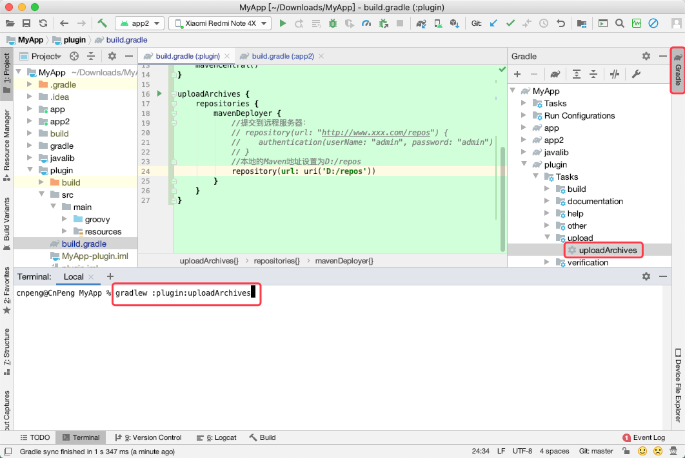

上图中的两种方式都可以实现分发。

#### 7.4.3.2 使用远程插件

在指定模块中使用远程插件时，示例如下：

```groovy
buildscript {
    repositories {
        maven {
        	// Maven仓库地址, 可以是本地目录也可以是远程目录
            url uri('远程目录')
        }
    }
    dependencies {
        //格式为-->group:module:version
        classpath 'com.hc.plugin:myplugin:1.0.0'
    }
}
//com.hc.gradle为resources/META-INF/gradle-plugins 下的properties文件名称
apply plugin: 'com.hc.gradle'
```
 