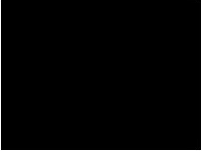
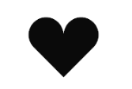

[点击查看原文](https://hencoder.com/ui-1-1/)

# 一、绘制基础

## 1、自定义绘制的四个级别

### 1.1 Canvas 的 drawXxx() 方法及 Paint 最常见的使用

`Cancas.drawXxx()` 是自定义绘制最基本的操作。这些方法可以实现画圆、画方、画图像和文字等。然后再配合 Paint 的一些常见方法对绘制内容的颜色和风格进行配置，即可完成大多数绘制需求。

### 1.2 Paint 完全攻略

Paint 不知可以设置颜色，还可以设置实心空心、线条粗细、阴影效果、拐角形状、线性过滤、特效等内容

### 1.3 Canvas 对绘制的辅助--范围裁切和几何变换

范围裁切和几何变换通常用来做一些比较酷炫的效果。

### 1.4 使用不同的绘制方法来控制绘制顺序

绘制顺序用来解决性能问题，而不是 “做不到” 的问题。

同样的效果，不控制绘制顺序时虽然也能做到，但通常需要多个 View 甚至是多层 View 才能拼凑出来，这样就会影响 UI 性能；增加对绘制顺序的控制后，很可能一个 View 就全搞定。

接下来就先介绍第一个级别：`Canvas.onDraw()` 和 `Paint` 的基础用法

## 2、一切的开始：onDraw()

提前创建好 Paint 对象，重写 onDraw() 方法，把要绘制的内容添加在 onDraw() 方法中，这就是自定义绘制的基本操作。如下：

```java
public class BaseCusView extends View {
    public BaseCusView(Context context) {
        super(context);
    }

    public BaseCusView(Context context, @Nullable AttributeSet attrs) {
        super(context, attrs);
    }

    public BaseCusView(Context context, @Nullable AttributeSet attrs, int defStyleAttr) {
        super(context, attrs, defStyleAttr);
    }

    Paint mPaint = new Paint();

    @Override
    protected void onDraw(Canvas canvas) {
        super.onDraw(canvas);

	  // 在 300，300 的坐标位置绘制一个半径为 200 的圆
        canvas.drawCircle(300, 300, 200, mPaint);
    }
}
```

## 3、`Canvas.drawXxx()` 和 Paint 基础

掌握 `drawXxx()` 和 Paint 基础后，即可应付简单的绘制需求。

Canvas 类中有很多 `drawXxx()` 方法，如：`drawCircle()`、`drawBitmap()` 等，具体可以查看[官方文档中Canvas 的说明](https://developer.android.google.cn/reference/android/graphics/Canvas?hl=en)

Paint 中最常用的方法如下，更多内容可以查看[官方文档中 Paint 的说明](https://developer.android.google.cn/reference/android/graphics/Paint?hl=en):

方法名|含义
---|---
`Paint.setStyle(Style style)` | 设置绘制模式
`Paint.setColor(int color)`| 设置颜色
`Paint.setStrokeWidth(float width)`| 设置线条宽度
`Paint.setTextSize(float testSize)`| 设置文本大小
`Paint.setAntiAlias(boolean aa)`| 设置抗锯齿开关


### 3.1、Paint 基本使用解析

#### 3.1.1、`Paint.setColor(int color)` 

该方法用来设置画笔所绘制内容的颜色。

```java
mPaint.setColor(Color.RED);
canvas.drawCircle(300, 300, 200, mPaint);
```

上面的代码会得到一个红色的圆，如下：


#### 3.1.2、`Paint.setStyle(Paint.Style style)` 

设置画笔所绘制内容的样式，Paint.style 的取值如下：

取值|含义|
---|---
FILL | 内容填充（默认样式）
STROKE | 画线（即 勾边模式）
FILL_AND_STROKE | 画线并填充

```java
mPaint.setStyle(Paint.Style.STROKE); // Style 修改为画线模式
canvas.drawCircle(300, 300, 200, paint);
```

效果如下：


#### 3.1.3、`Paint.setStrokeWidth(float width)`

设置 Stroke 边线的宽度，当 `Paint.Style` 为 `STROKE ` 和 `FILL_AND_STROKE ` 时有效：

```java
paint.setStyle(Paint.Style.STROKE);
paint.setStrokeWidth(20); // 线条宽度为 20 像素
canvas.drawCircle(300, 300, 200, paint);
```

效果如下：


#### 3.1.4、`Paint.setAntiAlias(boolean aa) ` 

用来开启或关闭抗锯齿效果。开启抗锯齿之后图形和文字的边缘会更加平滑。

除了通过 `setAntiAlias(true)` 开启抗锯齿之后，还可以在构建 Paint 对象的同时开启抗锯齿，即 `Paint paint = new Paint(Paint.ANTI_ALIAS_FLAG);`。

开启抗锯齿前后的对比效果如下：


#### 3.1.5、`Paint.setTextSize()` 

用来设置文本大小，在电泳 `Canvas.drawText()`绘制文本时有效。


### 3.2、`Canvas.drawXxx()` 方法解析

#### 3.2.1、`drawColor(@ColorInt int color)` 颜色填充

该方法的作用是在整个绘制区域中涂上指定的颜色。通常用于在绘制之前设置底色，或者在绘制之后为界面设置半透明蒙版。

可用于绘制颜色的方法还有：`drawRGB(int r, int g , int b)`，`drawARGB(int a, int r, int g , int b)`

假设我们有一个下面这种视图：


我们添加 `drawColor(Color.Black)` 或 `drawRGB(0,0,0)` 后将得到如下效果：



而添加 `drawColor(Color.parse(#88880000)) ` 或 `drawARGB(127,127,0,0)` 后将得到如下效果：


方法|含义|示例
---|---|---
`drawColor(int color)`|  `drawColor(Color.parse(#88880000))` | 绘制颜色，含透明度设置 |
`drawRGB(int r, int g , int b)` |  `drawRGB(0,0,0)` | 绘制不透明的颜色
`drawARGB(int a, int r, int g , int b)`|  `drawARGB(127,127,0,0)` | 绘制带有透明度的颜色 |

#### 3.2.2、`drawCircle(,,,)` 画圆

`drawCircle(float centerX, float centerY, float radius, Paint paint) ` 用来画圆，centerX 和 centerY 是圆心坐标，radius 为圆的半径，这三者的单位都是像素（px），它们共同约定了圆的基本信息；paint 用来设置圆的颜色、阴影等附加信息。

```java
canvas.drawCircle(300, 300, 200, mPaint);
```

上述代码将得到如下效果：


> Android  中的坐标系以 view 的左上角为原点，向右和向下为正，反之则为负。

#### 3.2.3、`drawRect(,,,,)` 画矩形

`drawRect(float left, float top, float right, float bottom, Paint paint)` 用来绘制矩形，left 和 top 用来确定矩形左上角的坐标，right 和 bottom 用来确定右下角的坐标。

```java
paint.setStyle(Style.FILL);
canvas.drawRect(100, 100, 500, 500, paint);
  
paint.setStyle(Style.STROKE);
canvas.drawRect(700, 100, 1100, 500, paint);
```


此外，我们还可以通过 `drawRect(RectF rect, Paint paint)` 和 `drawRect(Rect rect, Paint paint)` 来绘制矩形。如：

```java
mPaint.setStyle(Paint.Style.STROKE);
mPaint.setStrokeWidth(20);
canvas.drawRect(new Rect(100,100,500,500), mPaint);
canvas.drawRect(new RectF(100,100,500,500), mPaint);
```


#### 3.2.4、`drawPoint(,,)` 画点

`drawPoint(float x, float y, Paint paint)` 用来画点。

*  x 、y 是点的坐标；
*  点的大小通过 `paint.setStrokeWidth(width)` 来设置； 
*  点的形状通过 `paint.setStrokeCap(cap)` 来设置：
	*  `Cap.ROUND` 画圆点，
	*  `Cap.SQUARE` 和 `Cap.BUTT` 画方点

```java
paint.setStrokeWidth(20);
paint.setStrokeCap(Paint.Cap.ROUND);
canvas.drawPoint(50, 50, paint);
```

圆点效果如下：


```java
paint.setStrokeWidth(20);
paint.setStrokeCap(Paint.Cap.SQUARE);
canvas.drawPoint(50, 50, paint);
```

方点效果如下：


> **注意：**
> `Paint.setStrokeCap(cap)` 可以设置点的形状，但该方法并非专门用来设置点的形状的，而是用来设置线段端点形状的。端点的形状有 ROUND（圆头）、SQUARE（方头）、BUTT（平头）三种。

#### 3.2.5、`drawPoints(,,,)` 批量画点

`drawPoints(float[] pts, int offset, int count, Paint paint) ` 和 `drawPoints(float[] pts, Paint paint)` 用来批量画点。其中：

* pts 数组是点的坐标数组，每两个为一对
* offset 表示跳过数组的前几个数再开始计算坐标（即从索引为 offset 的坐标开始读取)
* count 表示读取几个坐标（点的个数 = count/2）

```java
mPaint.setStrokeWidth(20);
mPaint.setStrokeCap(Paint.Cap.ROUND);

float[] points = {0, 0, 50, 50, 50, 100, 100, 50, 100, 100, 150, 50, 150, 100};
canvas.drawPoints(points, 2, 10, mPaint);
```

上述代码的效果如下：


#### 3.2.6、`drawOval(, , , , ) ` 画椭圆

`drawOval(float left, float top, float right, float bottom, Paint paint) ` 用来绘制竖向或横向的椭圆（斜的椭圆需要配合几何变换才能实现）。left 和 top 确定椭圆的左上角坐标，right 和 bottom 确定圆的右下角坐标。

```java
mPaint.setStyle(Paint.Style.FILL);
canvas.drawOval(50,50,350,200,mPaint);

mPaint.setStyle(Paint.Style.STROKE);
canvas.drawOval(400,50,700,200,mPaint);
```

效果如下：


另外，还可以通过 `drawOval(RectF rect, Paint paint)` 来绘制椭圆。

#### 3.2.7、`drawLine(,,,,)` 画线

`drawLine(float startX, float startY, float stopX, float stopY, Paint paint) ` 用来画线。startX 和 startY 用来确认线的起点，stopX 和 stopY 用来确认线的终点。

```java
canvas.drawLine(200, 200, 800, 500, paint);
```

效果如下：


> **注意：** 由于直线不是封闭图形，所以 `setStyle(style)` 对直线没有影响。

#### 3.2.8、`drawLines(,,,) ` 和 `drawLines(,)` 批量画线

`drawLines(float[] pts, int offset, int count, Paint paint) ` 和 `drawLines(float[] pts, Paint paint) ` 用来批量画线。

* pts 为坐标数组
* offset 表示忽略前几个坐标（即 从索引为 offset 的元素开始读取坐标）
* count 表示总共取几个坐标

```java
float[] points = {20, 20, 120, 20, 70, 20, 70, 120, 20, 120, 120, 120, 150, 20, 250, 20, 150, 20, 150, 120, 250, 20, 250, 120, 150, 120, 250, 120};
canvas.drawLines(points, mPaint);
```

效果如下：


#### 3.2.9、`drawRoundRect(,,,,,,)` 画圆角矩形

`drawRoundRect(float left, float top, float right, float bottom, float rx, float ry, Paint paint)` 用来画圆角矩形。

* left、top 用来确定矩形的左上角坐标
* right、bottom 用来确定矩形的右下角坐标
* rx、ry 表示圆角的横向和纵向半径

```java
 canvas.drawRoundRect(100,100,500,300,50,50,mPaint);

mPaint.setStyle(Paint.Style.STROKE);
mPaint.setStrokeWidth(5);
canvas.drawRoundRect(600,100,1000,300,50,50,mPaint);
```

运行效果如下：


另外，`drawRoundRect(RectF rect, float rx, float ry, Paint paint)` 也可以用来画圆角矩形。

#### 3.2.10、`drawArc(,,,,,,,) ` 绘制弧形或扇形

`drawArc(float left, float top, float right, float bottom, float startAngle, float sweepAngle, boolean useCenter, Paint paint) ` 用来绘制弧形或扇形。

* `drawArc(,,,,,,,) ` 是使用一个椭圆来描述弧形的。
* `left、top、right、bottom` 确定弧形所在的椭圆、
* `startAngle` 是弧形的起始角度（x 轴的正向，即正右的方向，是 0 度的位置；顺时针为正角度，逆时针为负角度）
* `sweepAngle` 是弧形划过的角度
* `useCenter` 表示是否连接到圆心。不连接到圆心得到的是弧形，连接到圆心得到的是扇形。

```java
mPaint.setStyle(Paint.Style.FILL);
// 绘制扇形
canvas.drawArc(200, 100, 800, 500, -110, 100, true, mPaint);
// 绘制弧形
canvas.drawArc(200, 100, 800, 500, 20, 140, false, mPaint);

mPaint.setStyle(Paint.Style.STROKE);
// 绘制不封口的弧形
canvas.drawArc(200, 100, 800, 500, 180, 60, false, mPaint);
``` 

运行效果如下：


#### 3.2.11、`drawBitmap(,,,)` 画 Bitmap 

`drawBitmap(Bitmap bitmap, float left, float top, Paint paint)` 用来画 Bitmap。也就是把 Bitmap 对象中的像素内容复制过来。left、top 是指 canvas 的坐标，也就是说，将 bitmap 对象复制到画布的 (left，top)坐标处。

```java
Bitmap mBitmap = BitmapFactory.decodeResource(getContext().getResources(), R.mipmap.ic_launcher);
canvas.drawBitmap(mBitmap, 200, 200, mPaint);
```

> **注意：** 上面代码中使用了新建 module 时自带的 png 图片。因为我们已经把同名的 vector 图片删除了，所以上述代码不会报错，如果不删除的话，`BitmapFactory.decodeResource()` 可能会引用 Vector 图片，从而报错：java.lang.NullPointerException: Attempt to invoke virtual method 'boolean android.graphics.Bitmap.isRecycled()' on a null object reference。这是因为 vector 不能被 decode。

运行效果如下：


在绘制 Bitmap 时还可以使用如下方法：

* `drawBitmap(Bitmap bitmap, Rect src, RectF dst, Paint paint)` 
* `drawBitmap(Bitmap bitmap, Rect src, Rect dst, Paint paint) `
* `drawBitmap(Bitmap bitmap, Matrix matrix, Paint paint)`

此外，还有 `drawBitmapMesh()` 方法，该方法可用来绘制具有拉伸效果的 Bitmap , 实现如瘦脸等功能。具体可以查看如下链接：

* [浪起来！使用 drawBitmapMesh 实现仿真水波纹效果](https://juejin.im/post/58fb4c64ac502e0063a2721e#heading-2)
* [Android：修图技术之瘦脸效果的实现(drawBitmapMesh)](https://www.jianshu.com/p/51d8dd99d27d)
* [Android：使用drawBitmapMesh方法产生水波(一)](https://www.jianshu.com/p/11e6be1f18e6)

**TODO： 我自己使用如下代码绘制时，没有任何内容呈现，不知道问题出在哪里，先把代码粘在此处，后续再想法子解决：**

```java
//有问题的代码，运行后，界面上啥都不显示。

        Bitmap mBitmap = BitmapFactory.decodeResource(getContext().getResources(), R.mipmap.ic_launcher);

        int meshWidth = 20;
        int meshHeight = 20;

        int bmpWidth = mBitmap.getWidth();
        int bmpHeight = mBitmap.getHeight();

        int vertCount=(meshWidth+1) * (meshHeight+1) * 2+2;
        float[] verts = new float[vertCount];

        for(int i= 0;i<vertCount ;i++){
            if (i/2==0 ) {
               verts[i]= bmpWidth/(vertCount*1.0f)*2;
            }else{
                verts[i]= bmpHeight/(vertCount*1.0f)*2;
            }
        }

        canvas.drawBitmapMesh(mBitmap, meshWidth, meshHeight,
                verts,
                2,
                null,
                0,
                mPaint);
```


#### 3.2.12、`drawText(,,,) `绘制文字

`drawText(String text, float x, float y, Paint paint) ` 绘制文字。text 为要绘制的文本内容，x、y 是绘制的起点坐标。

```java
mPaint.setStyle(Paint.Style.STROKE);
 mPaint.setStrokeWidth(2);
 mPaint.setColor(Color.RED);
 mPaint.setTextSize(100);
 canvas.drawText("CnPeng", 100, 200, mPaint);
```

运行效果如下：


### 3.3、Path 和 `drawPath()`

`drawPath(path)` 方法可以通过描述路径的方式来绘制自定义图形，它的 Path 类型的参数就是用来描述图形路径的对象。 

当我们需要绘制的图形比较特殊，使用前面的 `drawXxx()` 方法无法实现时，就可以使用 `drawPath()` 来实现。

比如下面这些图形：


`Path` 可以描述直线、二次曲线、三次曲线、圆、椭圆、弧形、矩形、圆角矩形。把这些图形结合起来，就可以描述出很多复杂的图形。

`Path` 有两类方法，一类是直接描述路径的，另一类是辅助的设置或计算。

#### 3.3.1 `drawPath(path)` 的基本使用示例

```java
public class PathView extends View {
    public PathView(Context context) {
        super(context);
    }

    public PathView(Context context, @Nullable AttributeSet attrs) {
        super(context, attrs);
    }

    public PathView(Context context, @Nullable AttributeSet attrs, int defStyleAttr) {
        super(context, attrs, defStyleAttr);
    }

    Paint mPaint = new Paint();
    Path  mPath  = new Path();

    {
        mPath.addArc(200, 200, 400, 400, -225, 225);
        mPath.arcTo(400, 200, 600, 400, -180, 225, false);
        mPath.lineTo(400, 542);
    }

    @Override
    protected void onDraw(Canvas canvas) {
        super.onDraw(canvas);

        canvas.drawPath(mPath, mPaint);
    }
}
```

运行效果如下：



#### 3.3.2 `Path` 中直接描述路径的方法

直接描述路径的方法整体上又可以划分为两组：用于添加子图形的 `addXxx()` 方法和用于画线的 `xxxTo()` 方法。在 `addXxx()` 系列方法中，除  `addPath()` 和 `addArc()`外，其他都是添加一个封闭的图形；`xxxTo()` 系列方法则是添加不封闭的线。

##### 3.3.2.1 `addCircle(,,,)` 添加圆型路径

`addCircle(float x, float y, float radius, Direction dir)` 用于添加圆。

* x、y 用于确定圆心坐标
* radius 确定圆的半径
* dir 确定圆的路径方向
	* 路径方向有两种：顺时针方向（CW  clockwise）和逆时针（CCW counter-clockwise）。通常情况下，使用哪一种路径方向都可以。但在需要填充图形，即 `Paint.Style` 为 `FILL` 或 `FILL_AND_STROKE` ，且图形出现自相交时，该路径方向会影响填充范围。如下图：
	* 此外，填充范围还受 `Path.setFillType(ft) ` 方法中的 FillType 对象的影响。（具体如何填充在后面的 `Path.setFillType() ` 中介绍） 	

	
	
添加圆的基本用法如下：
	
```java
path.addCircle(300, 300, 200, Path.Direction.CW);
canvas.drawPath(path, paint);
```


上面的代码等价于 `canvas.drawCircle(,,,)`,也就是说，如果只是单纯的画一个圆，就没必要用 Path 了；而在绘制较复杂的组合图形时则需要用 Path。

##### 3.3.2.2 `addOval(,,,,) ` 和 `addOval(,)` 添加椭圆型路径

`addOval(float left, float top, float right, float bottom, Direction dir)` 和 `addOval(RectF oval, Direction dir)` 用于在路径中添加椭圆


##### 3.3.2.3 `addRect(,,,,)` 和 `addRect(,) ` 添加矩形路径

`addRect(float left, float top, float right, float bottom, Direction dir)` 和 `addRect(RectF rect, Direction dir) ` 用于在路径中添加矩形

##### 3.3.2.4 `addRoundRect()` 添加圆角矩形路径

以下方法均用于添加圆角矩形路径：

* `addRoundRect(RectF rect, float rx, float ry, Direction dir)` 、
* `addRoundRect(float left, float top, float right, float bottom, float rx, float ry, Direction dir)` 、 
* `addRoundRect(RectF rect, float[] radii, Direction dir)` 、
* `addRoundRect(float left, float top, float right, float bottom, float[] radii, Direction dir)` 

##### 3.3.2.5 `addPath(Path path)` 添加另一个路径

`addPath(Path path)` 用于向现有路径添加另一个路径

##### 3.3.2.6 `lineTo(,) ` 和 ` rLineTo(,) `添加直线

`lineTo(float x, float y)` 和 `rLineTo(float x, float y) ` 用于在路径中添加直线，即从当前位置向目标位置画一条直线。

* x、y 确定目标位置的坐标
* `lineTo(,)` 是向基于 (0，0) 的绝对坐标画线；`rLineTo(,)` 是向相对于当前位置的坐标画线，r 即 relatively, 相对地。

```java
paint.setStyle(Style.STROKE);
//由当前位置向 (100, 100) 画一条直线
path.lineTo(100, 100); 
 //由当前位置 (100, 100) 向正右方 100 像素的位置画一条直线
path.rLineTo(100, 0);
```


##### 3.3.2.7 `quadTo(,,,)` 和 `rQuadTo(,,,)`  添加二次贝塞尔曲线

`quadTo(float x1, float y1, float x2, float y2)` 和 `rQuadTo(float dx1, float dy1, float dx2, float dy2)`  向当前 Path 中添加二次贝塞尔曲线

* x1、y1 用于确定二次贝塞尔曲线的控制点；x2、y2 用于确定二次贝塞尔曲线的终点
* `quadTo(,,,)` 中的坐标是相对于原点（0,0) 的坐标 ；`rQuadTo(,,,)` 中的坐标则是相对于当前位置的相对坐标。

> **贝塞尔曲线**：是几何上的一种曲线。它通过起点、控制点和终点来描述一条曲线，主要用于计算机图形学。使用它可以绘制很多圆润又好看的图形。

```java
mPaint.setStyle(Paint.Style.STROKE);
mPaint.setStrokeWidth(5);

mPath.lineTo(100, 100);
mPath.rLineTo(100, 0);

// 绘制相对于当前坐标的二次贝塞尔曲线
mPath.rQuadTo(150, 200, 250, 0);

canvas.drawPath(mPath, mPaint);
``` 

运行效果如下：


##### 3.3.2.8 `cubicTo(,,,,,) ` 和 `rCubicTo(,,,,,) ` 三次贝塞尔曲线

`cubicTo(float x1, float y1, float x2, float y2, float x3, float y3)` 和 `rCubicTo(float x1, float y1, float x2, float y2, float x3, float y3) ` 用于向路径中添加三次贝塞尔曲线

* x1、y1 设置第一个控制点坐标；x2、y2 设置第二个控制点坐标；x3、y3 则是终点坐标

```java
mPaint.setStyle(Paint.Style.STROKE);
mPaint.setStrokeWidth(5);

mPath.cubicTo(100,100,300,300,500,0);

canvas.drawPath(mPath, mPaint);
```

运行效果如下：


##### 3.3.2.9 `moveTo(,)` 和 `rMoveTo(,)` 移动画笔到指定位置

`moveTo(float x, float y)` 和 `rMoveTo(float x, float y)` 将画笔移动到目标位置，即重新设置画笔起点。

```java
paint.setStyle(Style.STROKE);
paint.setStrokeWidth(5);

// 画斜线
path.lineTo(100, 100); 
// 移动画笔
path.moveTo(200, 100); 
// 画竖线
path.lineTo(200, 0); 

canvas.drawPath(path, paint);
```


##### 3.3.2.10 特殊方法： `arcTo()` 添加弧线

* `arcTo(RectF oval, float startAngle, float sweepAngle, boolean forceMoveTo) `
* `arcTo(float left, float top, float right, float bottom, float startAngle, float sweepAngle, boolean forceMoveTo)` 
* `arcTo(RectF oval, float startAngle, float sweepAngle) `

在上述方法中，`forceMoveTo` 的含义是，画弧线时，是从当前位置直接跳过去（true）, 还是从当前位置连过去之后再开始画。

```java
paint.setStyle(Style.STROKE);
paint.setStrokeWidth(5);

path.lineTo(100, 100);
 // 强制移动到弧形起点（无痕迹）
path.arcTo(100, 100, 300, 300, -90, 90, true);

canvas.drawPath(path, paint);
```

效果如下：


```java
paint.setStyle(Style.STROKE);
paint.setStrokeWidth(5);

path.lineTo(100, 100);
// 直接连线连到弧形起点（有痕迹）
path.arcTo(100, 100, 300, 300, -90, 90, false); 

canvas.drawPath(path, paint);
```

效果如下：


##### 3.3.2.11 特殊方法： `addArc()` 添加弧线

`addArc(float left, float top, float right, float bottom, float startAngle, float sweepAngle)` 和 ` addArc(RectF oval, float startAngle, float sweepAngle)` 用于添加弧线。

`addArc()` 默认就是跳到指定位置画弧线。

```java
paint.setStyle(Style.STROKE);
paint.setStrokeWidth(5);

path.lineTo(100, 100);
path.addArc(100, 100, 300, 300, -90, 90);

canvas.drawPath(path, paint);
```

运行效果如下:


##### 3.3.2.12 特殊方法：`close()` 封闭当前子图形

`close()` 的作用是把当前的子图形封闭，即从当前位置向该子图形的起点绘制一条直线，从而形成封闭区域。

> 这里说的 "子图形" 对应官方文档中的 `counter` 

```java
paint.setStyle(Style.STROKE);
paint.setStrokeWidth(5);

path.moveTo(100, 100);
path.lineTo(200, 100);
path.lineTo(150, 150);

// 使用 close() 封闭子图形。等价于 path.lineTo(100, 100)
path.close(); 

canvas.drawPath(path, paint);
```

未封闭和已封闭的图形区别如下：


实际使用中，`close()` 和 `lineTo(起点坐标)` 是等效的。

当需要填充图形（即 `Paint.Style` 为 `FILL` 或 `FILL_AND_STROKE`）时，我们不需要手动 `close()`，Path 会自动封闭子图形。

```java
paint.setStyle(Style.FILL);
path.moveTo(100, 100);
path.lineTo(200, 100);
path.lineTo(150, 150);
// 这里只绘制了两条边，但由于 Style 是 FILL ，所以绘制时会自动封口
```

运行效果如下：


#### 3.3.3 `Path` 中用于辅助设置或计算的方法

这类方法使用场景较少，其中可能最常使用的是 `setFillType(FillType fillType)`。

在前面介绍 `Path.addCircle(,,,)` 时曾提及 `Path.setFillType(Path.FillType ft)` 也会影响填充范围。接下来我们就对填充范围展开介绍。

##### 3.3.3.1 `FillType` 介绍

`Path.setFillType(Path.FillType ft)` 中接收的 FillType 有如下四种取值：

取值 | 含义
---|---
`WINDING` | 全填充（默认值）
`INVERSE_WINDING`| 反向全填充
`EVEN_ODD` |  相交不填充
`INVERSE_EVEN_ODD` | 反向相交不填充

通过如下代码可以确认 FillType 的默认值：

```java
Path  mPath  = new Path();
Path.FillType fillType = mPath.getFillType();
String name = fillType.name();
// 最终得到的结果是 WINDING
Log.d("name", name);
```

##### 3.3.3.2 `Path.addCircle(,,,)`中 `Direction` 对填充的影响

`Path.addCircle(,,,)` 的基本使用方式如下:

```java
mPaint.setStyle(Paint.Style.FILL);
mPath.addCircle(100, 100, 70, Path.Direction.CCW);
mPath.addCircle(180, 100, 70, Path.Direction.CCW);

canvas.drawPath(mPath, mPaint);
```

当我们通过 `Path.addCircle(,,,)` 添加多个圆时，不同的 `Driection` 组合将得到不同的效果，具体参考下表：

Direction | 效果图
---|---
`CCW + CCW` | 
`CW+CW`| 
`CCW+CW`| 
`CW+CCW` | 
`CW+CCW+CW` | 
`CW+CCW+CCW` |  

通过上表我们可以发现，当两个 Driection 一致时，得到的效果是全填充；两个 Driection 不一致时，得到的效果是相交区域不填充。

注意：在上述代码和表格效果中，我们没有调用 `Path.setFillType(Path.FillType ft)`，也就是说，此时的 `fillType` 是 `WINDING`——全填充。

##### 3.3.3.3 `Path.setFillType(Path.FillType ft)` 设置填充方式

Direction | FillType | 效果图
---|---|---
`CCW + CCW` | WINDING |
`CW+CW`| WINDING| 
`CCW+CW`| WINDING|
`CW+CCW` | WINDING| 
`CW+CCW+CW` | WINDING| 
`CW+CCW+CCW` | WINDING| 

通过上表可知，当 FillType 为 `WINDING` 时：如果两个 Direction 一致，两个圆会全填充；如果两个 Direction 不一致，相交部分不填充。


Direction | FillType | 效果图
---|---|---
`CCW + CCW` |EVEN_ODD |
`CW+CW`| EVEN_ODD| 
`CCW+CW`| EVEN_ODD|
`CW+CCW` | EVEN_ODD| 
`CW+CCW+CW` | EVEN_ODD| 
`CW+CCW+CCW` | EVEN_ODD|

通过上表可知，当 FillType 为 `EVEN_ODD ` 时：不论两个圆的 Direction 怎么组合，相交部分永不填充。

Direction | FillType | 效果图
---|---|---
`CCW + CCW` | INVERSE_WINDING|
`CW+CW`|INVERSE_WINDING | 
`CCW+CW`| INVERSE_WINDING|
`CW+CCW` |INVERSE_WINDING | 
`CW+CCW+CW` |INVERSE_WINDING | 
`CW+CCW+CCW` | INVERSE_WINDING|

通过上表可知，`INVERSE_WINDING ` 是对 `WINDING` 效果的反向处理。

Direction | FillType | 效果图
---|---|---
`CCW + CCW` |INVERSE_EVEN_ODD |
`CW+CW`|INVERSE_EVEN_ODD | 
`CCW+CW`| INVERSE_EVEN_ODD|
`CW+CCW` |INVERSE_EVEN_ODD | 
`CW+CCW+CW` |INVERSE_EVEN_ODD | 
`CW+CCW+CCW` |INVERSE_EVEN_ODD |

通过上表可知，`INVERSE_EVEN_ODD ` 是对 `EVEN_ODD ` 效果的反向处理。


## 4、练习题

实现如下效果：


