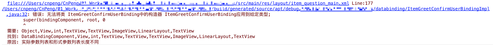

```
file:///Users/cnpeng/xxx/src/main/res/layout/item_question_main.xml Line:177
  
/Users/cnpeng/xxx/build/generated/source/apt/debug/xxx/databinding/ItemGreetConfirmUserBindingImpl.java:32: 

错误: 无法将类 ItemGreetConfirmUserBinding中的构造器 ItemGreetConfirmUserBinding应用到给定类型;
        super(bindingComponent, root, 0
        ^
  需要: Object,View,int,TextView,TextView,ImageView,LinearLayout,TextView
  找到: DataBindingComponent,View,int,TextView,TextView,TextView,ImageView,LinearLayout,TextView
  原因: 实际参数列表和形式参数列表长度不同
```



* 问题原因：

当前 xml 中有重名的id

* 解决方案：

修改当前 xml 中重名id
