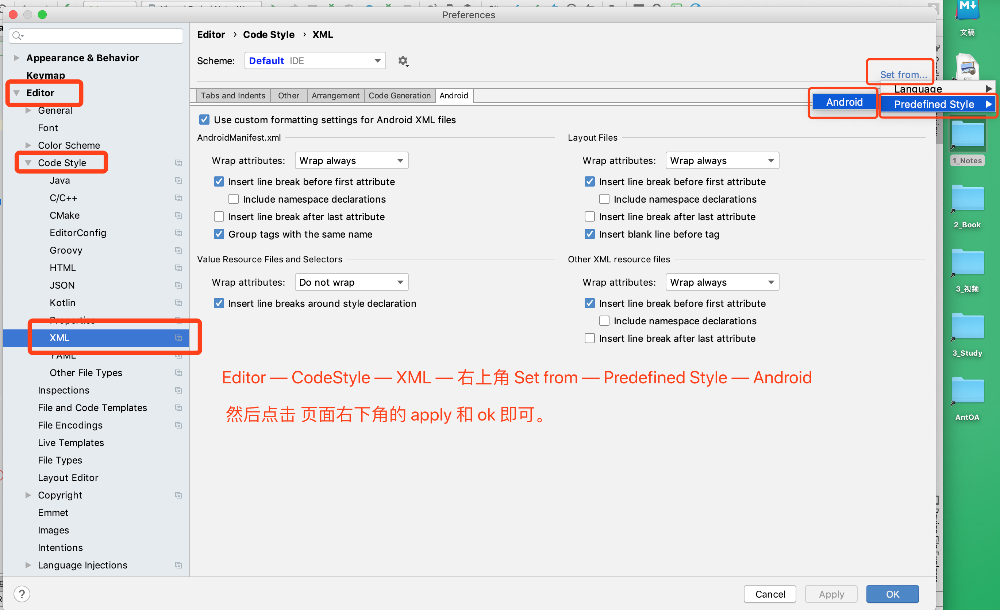

升级 AS 到 3.5 ，编辑完 xml 布局文件之后，执行自动格式化（ MAC 下快捷键，ALT+CMD+L ），但是，会发现，改变了布局文件的结构，整个界面已经不是我们想要的样子了。

解决方案：

参考链接：

[Android Studio 3.5 auto formatting/refactoring XML layouts changes order of views](https://stackoverflow.com/questions/57602902/android-studio-3-5-auto-formatting-refactoring-xml-layouts-changes-order-of-view)