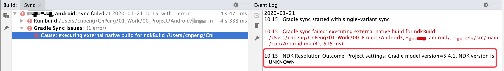
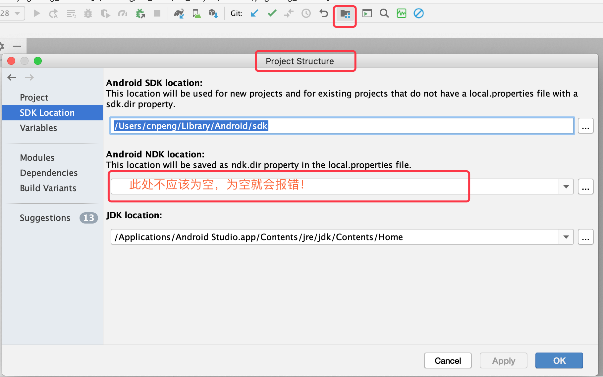
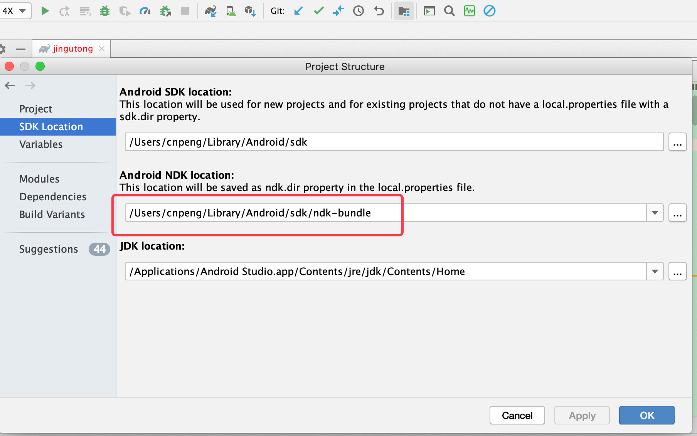
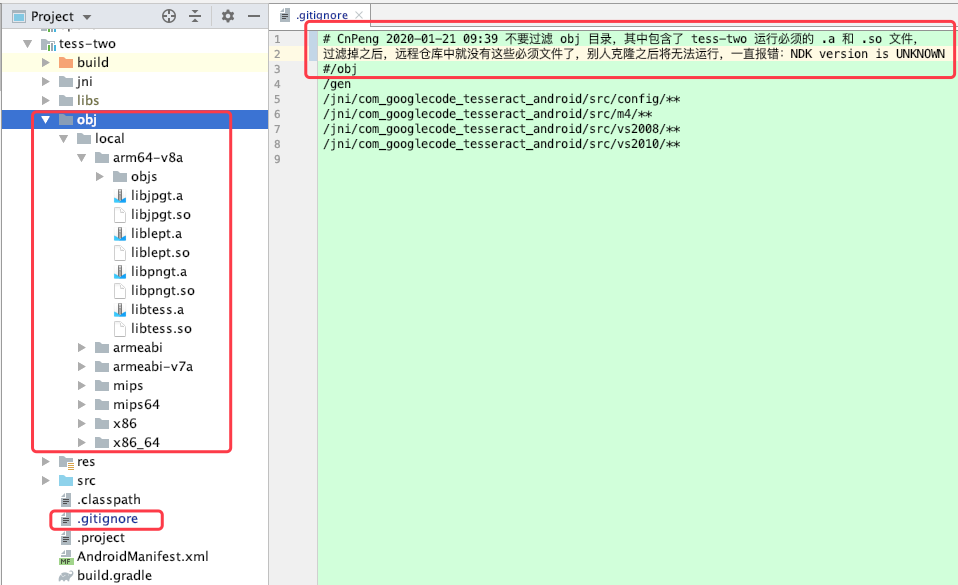

## 一、问题描述

从远程仓库拉取代码，然后通过 AndroidStudio 打开之后报如下错误：

## 二、解决步骤

### 1、确认项目是否已经配置了 NDK 路径

* 检查项目是否配置了 NDK 路径

* 配置好 NDK 路径之后的样子

### 2、确认依赖的与 NDK 相关包中的内容是否完整

我们当前的这个项目中，依赖了一个 tess-two 的 module , 其中 `/obj` 目录下存放了必须的 `.a` 和 `.so` 文件。但是这些核心文件没有提交到远程仓库，所以，从远程仓库克隆下来之后就不能正常编译，一直报错：NDK verision is UNKNOWN

 

## 三、其他相关 BUG

[Process 'command '/Users/cnpeng/Library/Android/sdk/ndk-bundle/ndk-build'' finished with non-zero exit value 2](32、finished with non-zero exit value 2.md)