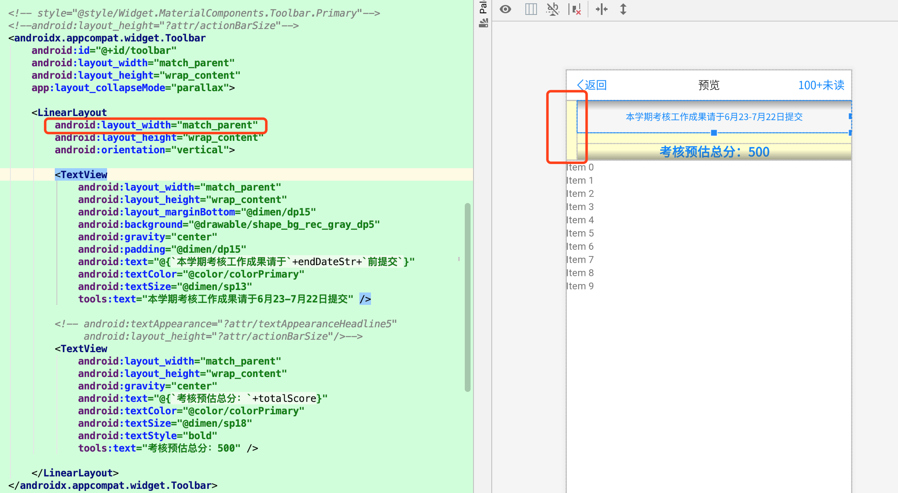

`ToolBar` 左侧默认有一个 15dp 的间距，具体如下图。

在下图中，即便我们将 `ToolBar` 的子 View 的宽度设置成 `matchParent` 也是有这个间距。



去除该间距的方案是为 `ToolBar` 设置如下属性：

```xml
app:contentInsetStart="@dimen/dp0"
```

完整示例如下：

```xml
<androidx.appcompat.widget.Toolbar
         android:id="@+id/toolbar"
         android:layout_width="match_parent"
         android:layout_height="wrap_content"
         app:contentInsetStart="@dimen/dp0"
         app:layout_collapseMode="parallax">

             <TextView
                 android:layout_width="match_parent"
                 android:layout_height="wrap_content"
                 android:gravity="center"
                 android:text="@{`考核预估总分：`+totalScore}"
                 android:textColor="@color/colorPrimary"
                 android:textSize="@dimen/sp18"
                 android:textStyle="bold"
                 tools:text="考核预估总分：500" />

</androidx.appcompat.widget.Toolbar>
```