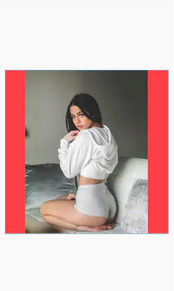
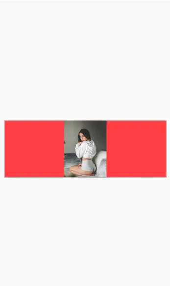
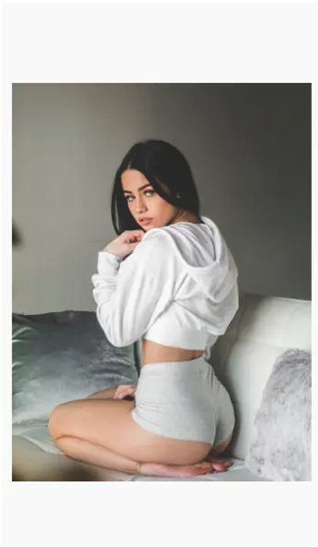
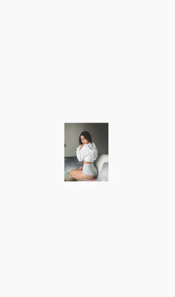

`android:adjustViewBounds` 的作用是调整 ImageView 的边界，使得 ImageView 和图片有一样的长宽比例。取值为 `true` 时，**只有当 ImageView 的一边固定，一边为 `wrap_content` 时取值才会生效**。

---

以下内容摘自：[《Android:谈谈最被误读的属性adjustViewBounds》](https://www.jianshu.com/p/49f8d5e5965b?utm_campaign=haruki)

今天，和大家聊聊 ImageView 上的 `adjustViewBounds` 属性。这个属性其实用的也比较多，可有意思的是，网上对这个属性的解释，大部分都是错误或者不准确的。

今天这篇文章，就结合我个人的理解，和大家聊聊 `adjustViewBounds` 到底是什么意思。

## 1.1 首先，澄清两个概念：ImageView 和图片

* `ImageView`：Android里用来显示图片的控件。ImageView 的长宽可以设定为固定值：比如，100dp 或 `match_parent`。也可以设定为不固定值：`wrap_content`。

* `ImageView的比例`：ImageView的长/宽

* `图片`：要显示在ImageView上的图片，起长宽由其物理 size 决定的。比如 200px*300px 等。

`图片的比例`：图片的长/宽

总之，ImageView 有自己的长宽，也有自己的原始比例（长/宽）。图片也有自己的长宽，有自己的原始比例。ImageView 和图片的长宽及其比例其实是独立的。**图片如何被显示在 ImageView 上，由scaleType、adjustViewBounds等属性共同决定。**

## 1.2 网上对adjustViewBounds的错误解释

了解完两个基本概念，接下来看看网上对 adjustViewBounds 都是怎么解释的。

首先，大多数介绍 adjustViewBounds 的文章，都会先搬出 Google 的官方介绍：

```
Adjust the ImageView's bounds to preserve the aspect ration of its drawable.
```

然后对上面英文的解释是：调整 ImageView 的界限来保持图片纵横比不变。

这个解释是错误的！

首先，adjustViewBounds 不管是设置成 true 还是 false，都是不会影响图片本身的比例的（长/宽）！注意，这里说的是长宽比例，而不是具体的长和宽。目前为止，只有 `scaleType=FIT_XY` 的时候才会有可能影响到图片的比例。

实际上，adjustViewBounds 影响的是 ImageView 的比例（不是图片的比例），所以，对于adjustViewBounds的定义应该是这样：

**调整 ImageView 的边界，使得ImageView和图片有一样的长宽比例。**

接下来我会用具体的例子给大家展示下adjustViewBounds的用法。

## 1.3 情况1，当ImageView的宽高都是固定值的时候，adjustViewBounds 属性无效

看下面这个例子：

```xml
    <ImageView
        android:layout_width="1000px"
        android:layout_height="1000px"
        android:background="@android:color/holo_red_light"
        android:adjustViewBounds="false"
        android:layout_gravity="center"
        android:src="@drawable/image_300_400">
    </ImageView>
```

首先，我有一个 ImageView，宽高都设成固定的值：1000px，这个 ImageView 的宽高比例就是1。

在这个 ImageView 上我要显示一个图片（image_300_400），宽300px，高400px，宽高比是3:4。

另外我给这个 ImageView 设置了红色的背景，方便大家查看 ImageView 和图片的关系。

在 ImageView 大小固定的时候，adjustViewBounds 的值无论设成什么，效果都是下面的样子：



通过上图，大家可以清楚的看到：ImageView 和图片都分别保持了自己原始比例（1:1和3:4），因为二者的比例不同，所以图片是不会撑满 ImageView 的，红色的部分就是 ImageView 没有被图片填满的部分（ImageView 的 background 是红色）。

在这个例子里，图片的比例虽然没有变，但是被拉伸了，这是因为 ImageView 的默认 scaleType 是`FIT_CENTER`，这个就是 `FIT_CENTER` 的效果。关于 ImageView 的 scaleType 的说明，可以参考这篇文章：[图文讲解Android ImageView的ScaleType，帮你彻底搞明白](https://www.jianshu.com/p/c0bfa575d163)

## 1.4 情况2，ImaegView 一边长度固定，另一边为 wrap_content 的情况


### 1.4.1 宽度固定，高度包裹内容，不启用自适应

我把上面的例子稍微改下，把 ImageView 的高度改成 `wrap_content`，adjustViewBounds 设为`false`：

```xml
   <ImageView
        android:layout_width="1000px"
        android:layout_height="wrap_content"
        android:background="@android:color/holo_red_light"
        android:adjustViewBounds="false"
        android:layout_gravity="center"
        android:src="@drawable/image_300_400">
    </ImageView>
```

出来的效果是这样的：



怎么样，是不是和你想的不一样？

要理解上面这个效果，要先理解 ImageView 的 `wrap_content` 是什么意思？

当 ImageView 的某一个边设置为 `wrap_content` 的时候，会根据内容的实际大小来决定实际长度。这里，就是根据图片的实际长度来决定。在这个例子中，图片的实际的高度是400px，所以 ImageView 的宽高就是 1000px 和 400px 。再加上 `FIT_CENTER`，呈现的效果就是这样。


### 1.4.2 宽度固定，高度包裹内容，启用自适应

下面我们把 adjustViewBounds 设为 true 试试，

```xml
    <ImageView
        android:layout_width="1000px"
        android:layout_height="wrap_content"
        android:background="@android:color/holo_red_light"
        android:adjustViewBounds="true"
        android:layout_gravity="center"
        android:src="@drawable/image_300_400">
    </ImageView>
```
    
现在的效果变成这个样子：



adjustViewBounds 属性终于生效了！因为这个值，ImageView 需要和图片有一样的宽高比，所以这时候ImageView 的高度为 1000*400/300。ImageView 的宽高比也变成了3:4，再加上 FIT_CENTER，图片可以完美的铺满整个 ImageView！没有一点红色背景露出。这也是我们大多数情况下想要的效果。

## 1.5 情况3，当 ImageView 的宽高都设置为 `wrap_content` 的情况

在这种情况下，adjustViewBounds 也是无效的。

```xml
   <ImageView
        android:layout_width="wrap_content"
        android:layout_height="wrap_content"
        android:background="@android:color/holo_red_light"
        android:adjustViewBounds="true"
        android:layout_gravity="center"
        android:src="@drawable/image_300_400">
    </ImageView>
```
    
这时候的效果是这样的：



前面说了，`wrap_content` 是用原始的图片尺寸显示，所以，这个时候 ImageView 的长宽和原始图片一样，都是 400px 和 300px。比例自然和图片也一样（4:3），所以这个时候图片也可以铺满整个ImageView。

## 1.6 总结：

综上所述，adjustViewBounds 只有在 ImageView 一边固定，一边为 `wrap_content`的时候才有意义。设置为true的时候，可以让ImageView的比例和原始图片一样，以达到让图片充满的 ImageView 的效果。
