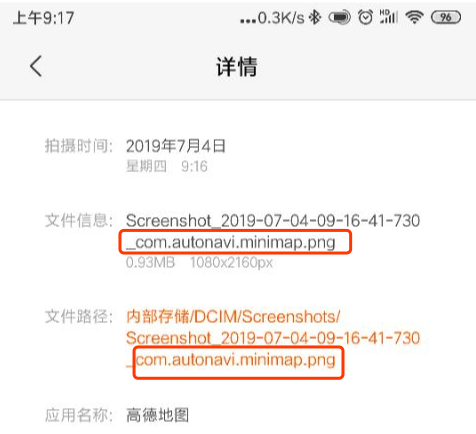

## 一、需求描述

- H5 通过 JSDK 的方式，传递一组坐标给原生，
- 原生判断本机是否安装了高德/百度地图。
- 如果没有安装提示安装，
- 如果已经安装，则解析坐标，并打开高德/百度地图，并携带坐标跳转到路径规划页面

## 二、代码实现

### 1、判断是否安装某APP

判断是否安装某 APP 时有如下两种方式，

- 一种是直接判断是否安装了包名为XXX的软件，
- 一种是先获取全部已安装的APP，然后遍历判断是否有包名为XX的APP

```java
 /**
  * 获取指定包的包信息
  *
  * @param pckName 包名称
  * @return 包信息
  */
 public static PackageInfo getPackageInfo(Context context, String pckName) {
     PackageInfo packInfo = null;
     try {
         // 获取packagemanager的实例
         PackageManager packageManager = context.getApplicationContext().getPackageManager();
         // 0代表是获取版本信息
         packInfo = packageManager.getPackageInfo(pckName, 0);
     } catch (Exception e) {
         e.printStackTrace();
     }
     return packInfo;
 }

 /**
  * 根据包名获取已安装的PackageInfo
  *
  * @return PackageInfo
  */
 public static PackageInfo getInstallPckInfoByPckName(Context context, String pckName) {
     PackageInfo packageInfo = null;
     PackageManager pckMgr = context.getApplicationContext().getPackageManager();
     List<PackageInfo> lstPackageInfo = pckMgr.getInstalledPackages(0);
     for (PackageInfo pckInfo : lstPackageInfo) {
         if (pckInfo.packageName.equals(pckName)) {
             return pckInfo;
         }
     }
     return packageInfo;
}
```

## 2、获取XX地图的包名

- 百度地图的包名为：`com.autonavi.minimap`
- 高德地图的包名为：`com.baidu.BaiduMap`

获取包名时有两种方式：

- 直接去对应的开放平台查阅文档
- 打开手机端的xx地图软件，然后截屏，然后从手机相册中查看图片详情，文件名中会包含包名信息（以小米手机为例，参考下图：）



## 3、从自己的APP跳转到XX地图软件

对应的官方文档：

* [高德开放平台文档——路径规划](https://lbs.amap.com/api/amap-mobile/guide/android/route)
* [百度开放平台文档——路径规划，具体参考2.3.2](https://lbsyun.baidu.com/index.php?title=uri/api/android#service-page-anchor9)

注意，随着时间推移，上述文档可能会有变更，当前时间为：2019-07-04

跳转的核心代码：

```java
String targetName="齐鲁软件园"
/**经度*/
String lng="117.131944"
/**纬度*/
String lat="36.673466"


 Intent intent = new Intent();
 intent.setAction(Intent.ACTION_VIEW);
 intent.addCategory(Intent.CATEGORY_DEFAULT);

 Uri uri = null;
 if (0 == mapType) {
     //将功能Scheme以URI的方式传入data——百度的路径规划
     uri = Uri.parse("baidumap://map/direction?src=andr.组织名.APP名&coord_type=wgs84&destination=name:" + targetName + "|latlng:" + lat + "," + lng);
 } else if (1 == mapType) {
     //将功能Scheme以URI的方式传入data——高德的路径规划
     uri = Uri.parse("amapuri://route/plan/?sourceApplication=校园集结号&dlat=" + lat + "&dlon=" + lng + "&dname=" + targetName + "&dev=1&t=0");
 }

if (null != uri) {
    intent.setData(uri);
    mActivity.startActivity(intent);
}
```

上述代码中只列举了高德/百度地图中路径规划的基本功能，更多功能可以通过参考对应的文档配置uri中的参数来实现。

**注意：**

- 在上述示例 uri 中，百度的 coord_type 表示坐标的加密方式，高德的 dev 表示坐标是否需要国测加密，这两个参数千万不要传错了，否则地点会出错。


## 4、定义JSDK方法接收H5传递的坐标信息

```java
/**
 * CnPeng:2019-07-03 10:06 打开手机中安装的导航/地图APP软件
 * jsonStr 中的内容和格式是与 H5 约定好的
 */
@JavascriptInterface
public void openMapApp(String jsonStr) {
     //jsonStr 示例 {"location":"117.131944,36.673466","address":"大山坡小广场"}
     try {
            JSONObject jsonObject = new JSONObject(localStr);
            // CnPeng 2019-07-03 10:07 解析经纬度坐标，并检查本机安装的导航软件，如果有底部弹窗，没有提示跳转
            String curLocation = jsonObject.getString("location");
            String targetName = jsonObject.getString("address");
            String[] locationArr = curLocation.split(",");

            String lng = locationArr[0].trim();
            String lat = locationArr[1].trim();
            Log.e("导航", "经/纬度--" + lng + "/" + lat + "||" + targetName);
	  }catch (JSONException e) {
            e.printStackTrace();
	  }
}
```

