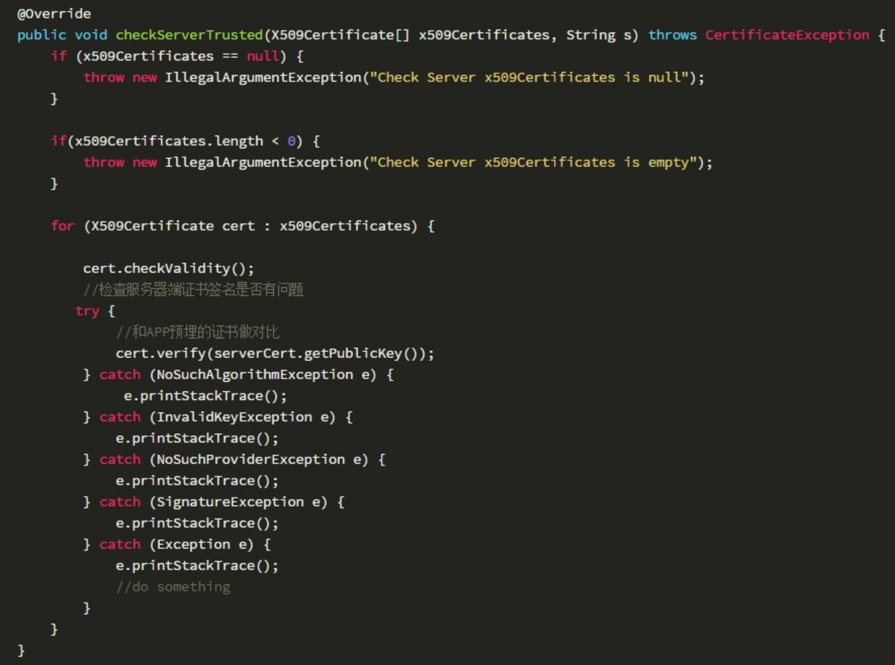
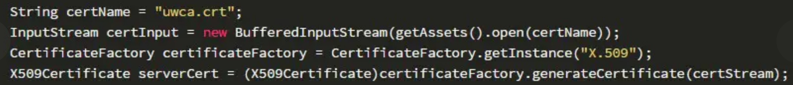

原文：[android https简介和证书认证](https://www.jianshu.com/p/ad450a10bd7c)

一：简介
HTTPS全称是HTTP over SSL/TLS，HTTP是应用层协议，TCP是传输层协议，在应用层和传输层之间，增加了一个安全套接层SSL/TLS。

TLS：基于 X.509 认证，他假定所有的数字证书都是由一个层次化的数字证书认证机构发出，即 CA。另外值得一提的是 TLS 是独立于 HTTP 的，任何应用层的协议都可以基于 TLS 建立安全的传输通道，如 SSH 协议。

证书：HTTPS网站所用的证书可向可信CA机构申请，不过这一类基本上都是商业机构，申请证书需要缴费，一般是按年缴费，费用因为CA机构的不同而不同。如果只是APP与后台服务器进行HTTPS通信，可以使用openssl工具生成自签发的数字证书，可以节约费用，不过得妥善保护好证书私钥，不能泄露或者丢失。HTTPS通信所用的数字证书格式为X.509。

二：代码证书认证
先看一下API：
SSLSocketFactory：默认的 SSLSocketFactory 校验服务器的证书时，会信任设备内置的100多个根证书。

TrustManager：校验服务器的证书，那么其实就是通过 X509ExtendedTrustManager 做校验的，更一般性的说是 X509TrustManager

以前的错误写法，直接信任所有证书：

```java
private static synchronized SSLSocketFactory getDefaultSSLSocketFactory() {
    try {
        SSLContext sslContext = SSLContext.getInstance("TLS");
        sslContext.init(null, new TrustManager[]{
                new X509TrustManager() {
                    public void checkClientTrusted(X509Certificate[] x509Certificates, String s) throws CertificateException {

                    }

                    public void checkServerTrusted(X509Certificate[] x509Certificates, String s) throws CertificateException {
                    }

                    public X509Certificate[] getAcceptedIssuers() {
                        return new X509Certificate[0];
                    }
                }
        }, null);
        return sslContext.getSocketFactory();
    } catch (GeneralSecurityException e) {
        throw new AssertionError();
    }
}
```

正确的写法1：真正实现TrustManger的checkServerTrusted()，对服务器证书域名进行强校验,




上面cert.verify(serverCert.getPublickey)，其中serverCert是APP的Asset中预埋的服务器端公钥证书，如果是以文件形式，其获取为如下形式：



正确的写法2：只有我们的 anchor.crt 才会作为信任的锚点，只有 anchor.crt 以及他签发的证书才会被信任。

```java
// 取到证书的输入流
InputStream is = new FileInputStream("anchor.crt");
CertificateFactory cf = CertificateFactory.getInstance("X.509");
Certificate ca = cf.generateCertificate(is);

// 创建 Keystore 包含我们的证书
String keyStoreType = KeyStore.getDefaultType();
KeyStore keyStore = KeyStore.getInstance(keyStoreType);
keyStore.load(null);
keyStore.setCertificateEntry("anchor", ca);

// 创建一个 TrustManager 仅把 Keystore 中的证书 作为信任的锚点
String algorithm = TrustManagerFactory.getDefaultAlgorithm();
TrustManagerFactory trustManagerFactory = TrustManagerFactory.getInstance(algorithm);
trustManagerFactory.init(keyStore);
TrustManager[] trustManagers = trustManagerFactory.getTrustManagers();

// 用 TrustManager 初始化一个 SSLContext
SSLContext sslContext = SSLContext.getInstance("TLS");
sslContext.init(null, trustManagers, null);
return sslContext.getSocketFactory();
```

