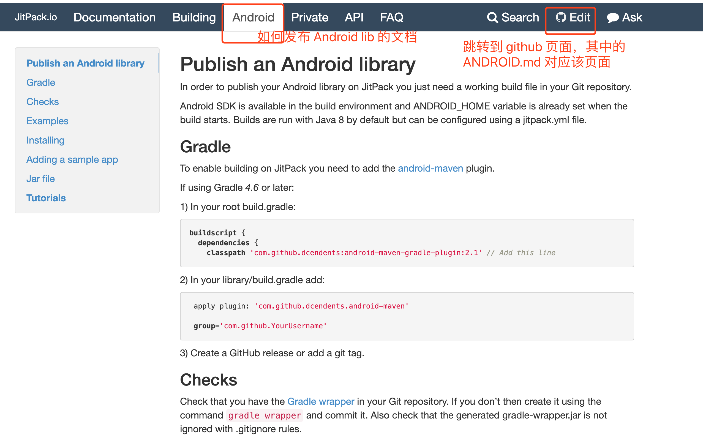
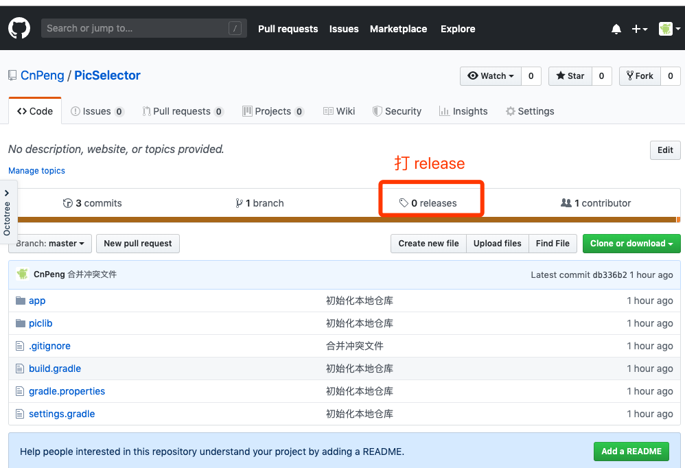
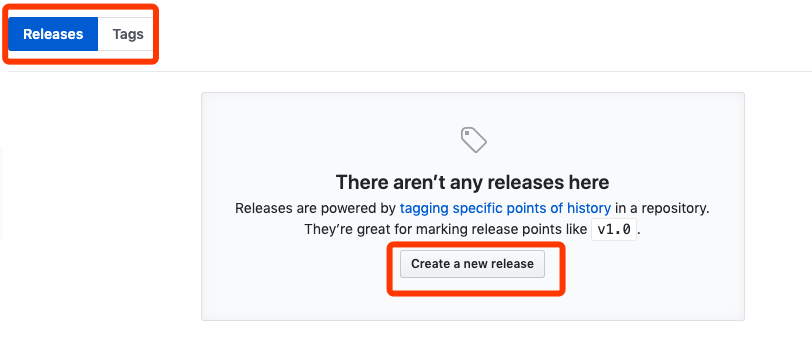
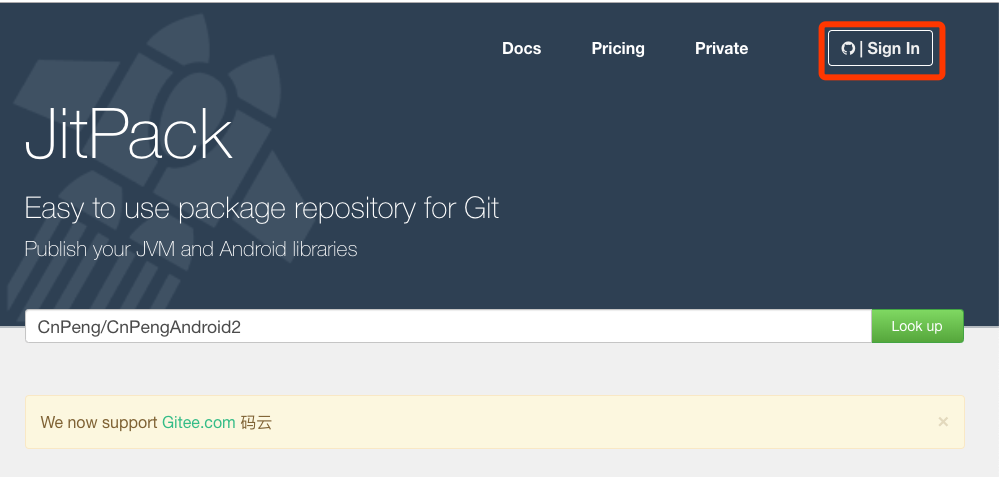
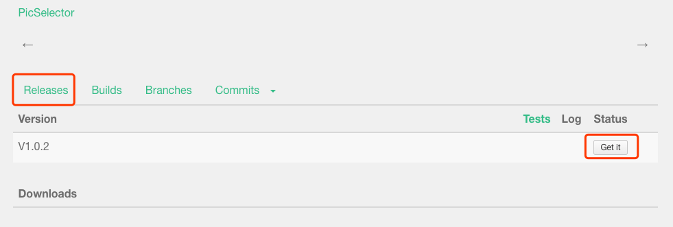
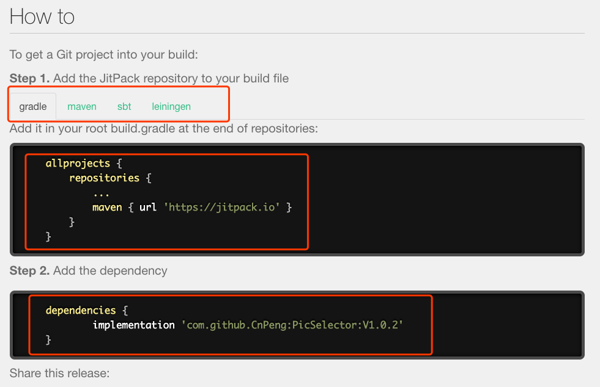
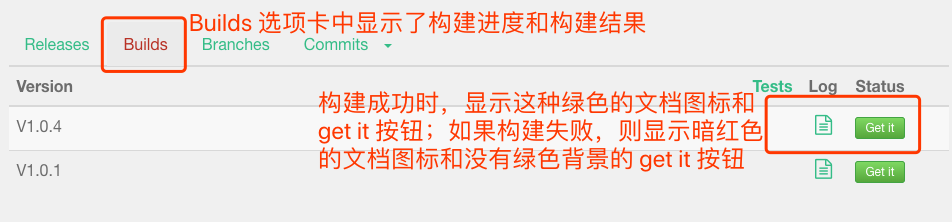

本文基于 [https://jitpack.io/docs/ANDROID/](https://jitpack.io/docs/ANDROID/) 整理

## 一、jitpack.id/docs 页面简单介绍

[https://jitpack.io/docs/](https://jitpack.io/docs/) 和 [https://github.com/jitpack/jitpack.io](https://github.com/jitpack/jitpack.io) 中的内容是同步的，下图是 `jitpack.id/docs` 中 《如何发布 Android lib》的文档 截图 




## 二、发布并引用的步骤

### 1、修改 project 的 build.gradle 

```xml
buildscript { 
  dependencies {
    classpath 'com.github.dcendents:android-maven-gradle-plugin:2.1' 
  }
}
```

根据 gradle 版本的不同，上面 plugin 的版本也不同。具体可以查阅 [android-maven](https://github.com/dcendents/android-maven-gradle-plugin)中的说明

### 2、修改 library module 的 build.gradle

```xml
// 这个是创建 library module 时默认添加的
apply plugin: 'com.android.library'

// 下面两个是新添加的
apply plugin: 'com.github.dcendents.android-maven'
// 固定格式 com.github.github用户名
group='com.github.CnPeng'
```

### 3、将本地代码提交到 github 

> 虽然 JitPack 也支持 github 以外的代码托管中心，但是，个人以为还是 github 方便，因为 JitPack 可以直接使用 github 账号登录，并直接读取对应的仓库信息。 

将本地代码提交到 github, 创建仓库和提交代码的步骤省略

然后打 release 或者 tag , 下面以 release 为示例：






### 4、使用 github 账号登录 JitPack

[jitpack.io 官方网站](https://jitpack.io/)



使用 github 账号登录之后，会直接读取 github 中的仓库信息，如下图


选中我们想要发布的一个仓库，然后下拉页面（我们选中了 PicSelector 仓库）,如下图：



在 上图中 的 release 选项卡下会直接显示我们之前打的 release 版本，然后直接点击右侧的 `get it` ，这样就 ok 了。实际上，如果之前没有打 release 版本，也可以基于其他几个选项卡进行构建，但这样的话，构建之后的引用方式也会随之发生变化。

### 5、如何引用

在上一步 `get it` 之后，页面会自动向下滚动，直接呈现出如何引用构建的仓库内容，如下图：



### 6、注意事项

#### （1）、在何处引用 jitpack.io 仓库
`Note: do not add the jitpack.io repository under buildscript`

这句话的意思是：添加引用时，不要在 buildscript 节点下引用 jitpack.io ，而必须是在 allprojects.repositories 中引用。即：

```xml
allprojects {
 repositories {
    jcenter()
    maven { url "https://jitpack.io" }
 }
}
```

#### (2)、添加示例APP时的注意事项

如果在 library module 的同仓库同目录下添加了 示例APP module，那么，该示例module 需要在其 build.gradle 文件中以如下方式引用该 library：

```xml
dependencies {
    compile project(':library的名字')
}
```

#### (3)、代码仓库的 .gitignore 文件中的注意事项

在代码仓库的 .gitignore 文件中，不要添加 `gradle 文件夹`（注意是 gradle 文件夹，不是 .gradle 文件夹） 、`gradlew 文件`、 `gradlew.bat 文件` , 也就是说，列举的这三项需要提交到 github 仓库中。如果不提交的话，在 JitPack 中 `get it` 时会构建失败。构建失败时的截图没有了，参考下图吧：



><font color="red">其实，这里我也不确定到底是因为没提交上述三个中的哪一个或哪几个导致的构建失败，后续再慢慢确认吧。</font> .gitignore 中的其他忽略规则如下：

```xml
# ----以下为自定义的过滤规则-----
.idea/*
*/.idea/
.gradle/*
*/.settings/
*/.DS_Store

# 这三个注释掉吧，不然，JitPack 中构建时会失败啊
#gradle/*
#gradlew
#gradlew.bat

#---- 以下为 github 创建的 Android 过滤规则-----
# Built application files
*.apk
*.ap_

# Files for the ART/Dalvik VM
*.dex

# Java class files
*.class

# Generated files
*/bin/
*/gen/
*/out/
bin/
gen/
out/

# Gradle files
*/.gradle/
*/build/
.gradle/
build/

# Local configuration file (sdk path, etc)
local.properties

# Proguard folder generated by Eclipse
proguard/

# Log Files
*.log

# Android Studio Navigation editor temp files
.navigation/

# Android Studio captures folder
*/captures/
captures/

# IntelliJ
*.iml
*/*.iml
.idea/workspace.xml
.idea/tasks.xml
.idea/gradle.xml
.idea/assetWizardSettings.xml
.idea/dictionaries
.idea/libraries
.idea/caches

# Keystore files
# Uncomment the following line if you do not want to check your keystore files in.
#*.jks

# External native build folder generated in Android Studio 2.2 and later
.externalNativeBuild

# Google Services (e.g. APIs or Firebase)
google-services.json

# Freeline
freeline.py
freeline/
freeline_project_description.json

# fastlane
fastlane/report.xml
fastlane/Preview.html
fastlane/screenshots
fastlane/test_output
fastlane/readme.md
```


## 三、其他参考：

- [《将jar或aar包发布到JitPack.io》](https://blog.csdn.net/haha223545/article/details/89955883)

- [《官方文档——创建 Android 库》](https://developer.android.com/studio/projects/android-library?hl=zh-cn)
