当我们想把某个功能[抽取成单独的 `module` 库](https://developer.android.google.cn/studio/projects/android-library?hl=zh-cn)实现复用时，有三种方式：

* 直接在项目中导入该 `module` 库，然后添加 `module` 依赖。
* [发布到网络](2、将aar发布到网络.md)，然后以 gradle 或 maven 的形式依赖。
* 将该 `module` 库导出为 `aar` 文件，其他项目中引入该 `aar` 文件即可。

前两种方式会暴露源码，可以给自己公司内部项目使用；第三种方式可以混淆源码，可以暴露给任意项目使用。

本文主要讨论的是 `module` 库中依赖了其他 `aar` 文件，然后我们将该 `module` 库再导出为 `aar` 时报错的问题。

## 3.1 问题现象

我们创建了一个 `library` , 在其中引用了 `aar` 文件。我们最终想把该 `library` 导出为一个 `aar` 文件供其他项目使用。

该 `library` 的结构如下：

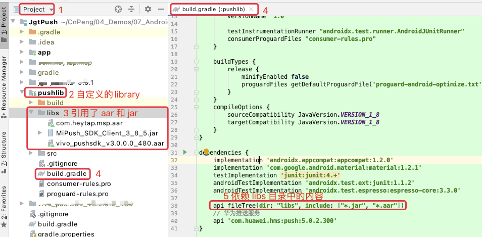

> * 虽然上图在 `libs` 目录下也引用了 `jar` , 但我们在生成该 `library` 对应的 `aar` 文件时，`jar` 包可以正常打入到 `aar` 包中。
> * gradle 中使用 `api` 依赖是为了实现依赖穿透。假如我们不导出 `aar` 文件，而是让当前项目中的 `app` 直接以 `module` 的方式依赖 `pushlib` ， 那么 `pushlib` 可以使用依赖包中的内容，`app` 也可以使用依赖包中的内容。

生成该 `library` 对应 `aar` 文件的方式如下：

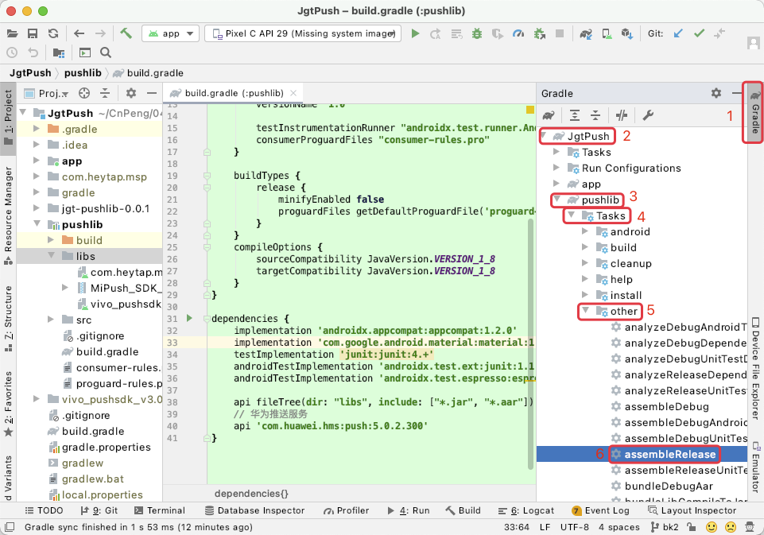

执行上图中的 `assmbleRelease` 时会出现如下错误：

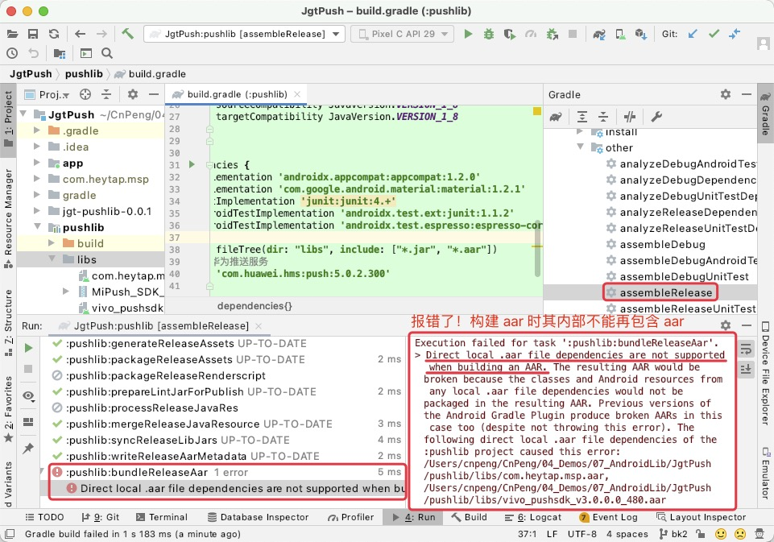

## 3.2 问题原因

前面一张图中具体的错误信息为：

>Execution failed for task ':pushlib:bundleReleaseAar'.
> 
> Direct local .aar file dependencies are not supported when building an AAR. The resulting AAR would be broken because the classes and Android resources from any local .aar file dependencies would not be packaged in the resulting AAR. Previous versions of the Android Gradle Plugin produce broken AARs in this case too (despite not throwing this error). The following direct local .aar file dependencies of the :pushlib project caused this error: /Users/cnpeng/CnPeng/04_Demos/07_AndroidLib/JgtPush/pushlib/libs/com.heytap.msp.aar, /Users/cnpeng/CnPeng/04_Demos/07_AndroidLib/JgtPush/pushlib/libs/vivo_pushsdk_v3.0.0.0_480.aar

重点是其中的 `Direct local .aar file dependencies are not supported when building an AAR.` ，意思是，直接依赖的 `aar` 文件不能再打入 `aar` 文件中。

## 3.3 解决方案

解决方式是以 `module` 的形式依赖 `aar` 文件，具体步骤如下：

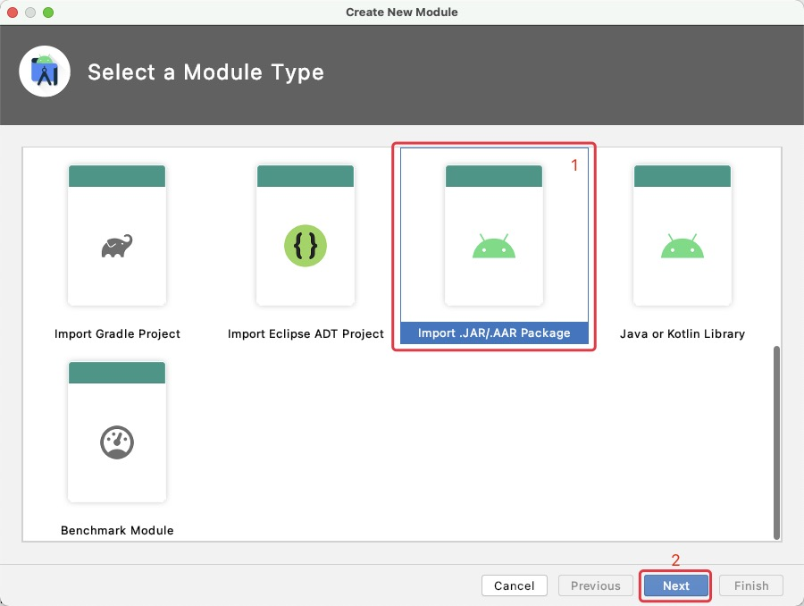

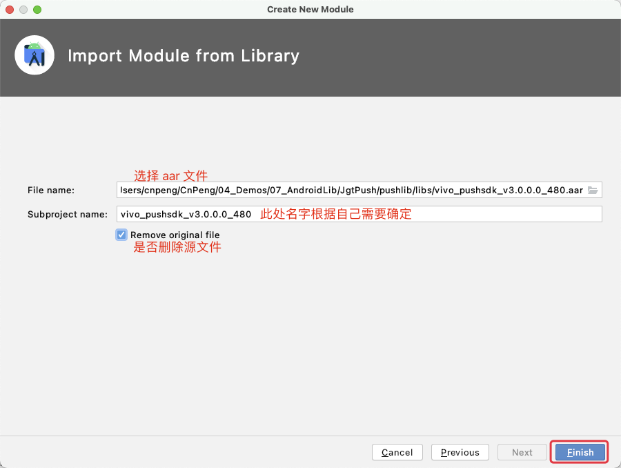

然后我们就看到下图左侧中刚刚以 `module` 形式导入的 `aar`。

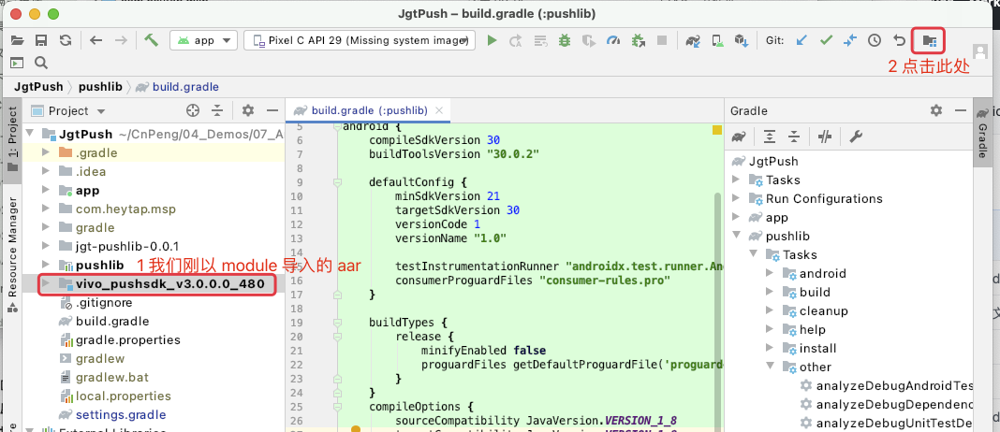

点击上图右上角的 `project struct` 图标之后，让我们自定义的 `library` 以 `module` 的形式依赖刚导入的 `aar`:

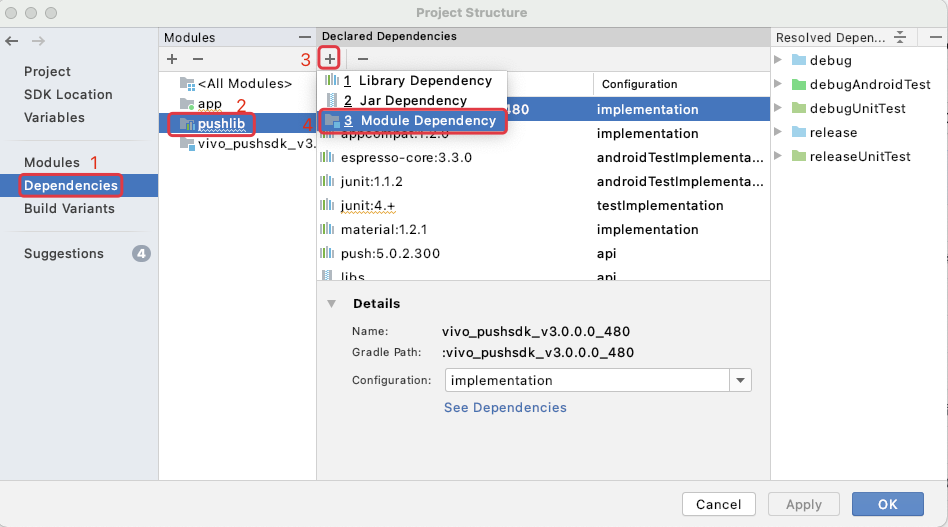

选择需要依赖的 `module`:

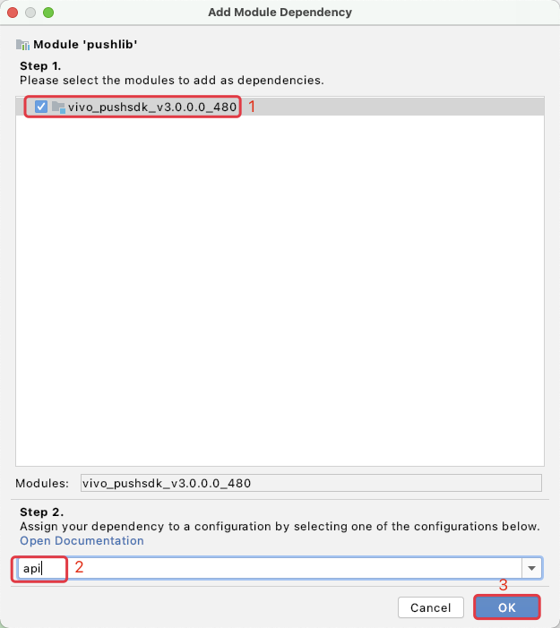

添加依赖成功之后，点击下图中的 `apply` 和 `ok`，让依赖最终生效：

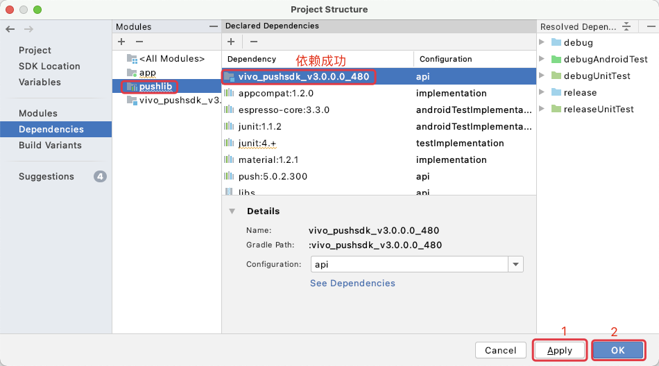

最终的项目结构如下：

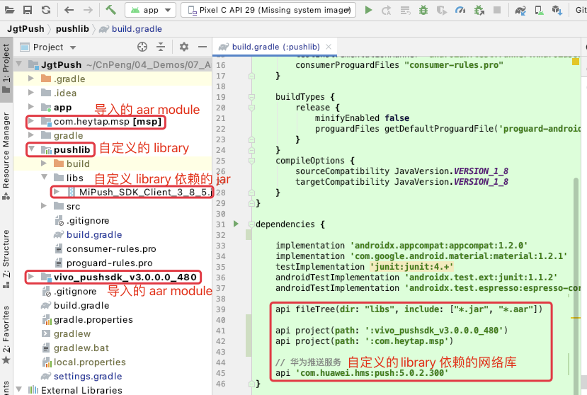

**如果有其他 `aar` 依赖项，重复上述操作，全部以 `module` 的形式导入并添加依赖。**

此时，我们再执行生成 `aar` 的 `gradle` 命令时就不再报错，如下图：

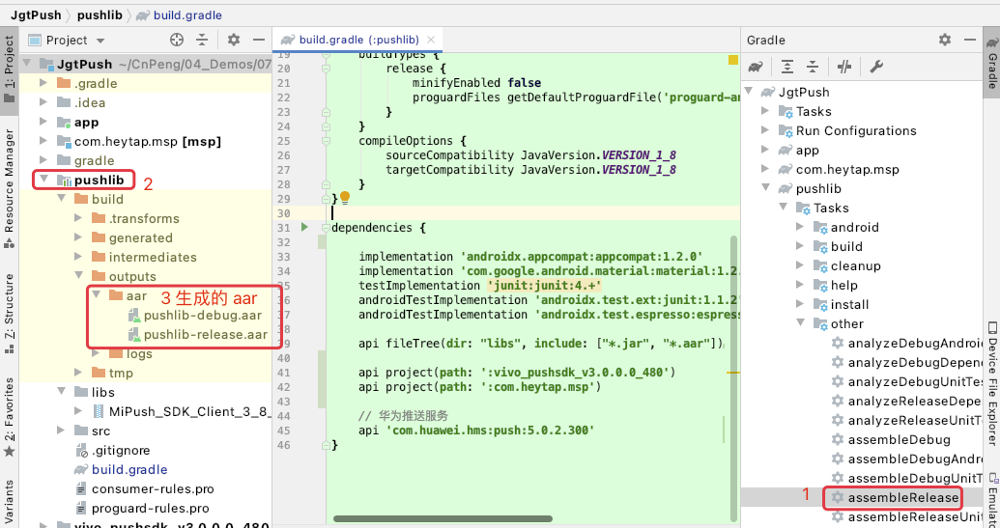

## 3.4 在项目中引用导出的 aar

将生成的 `aar` 文件导入到我们的项目中，并在 `gradle` 中添加依赖：

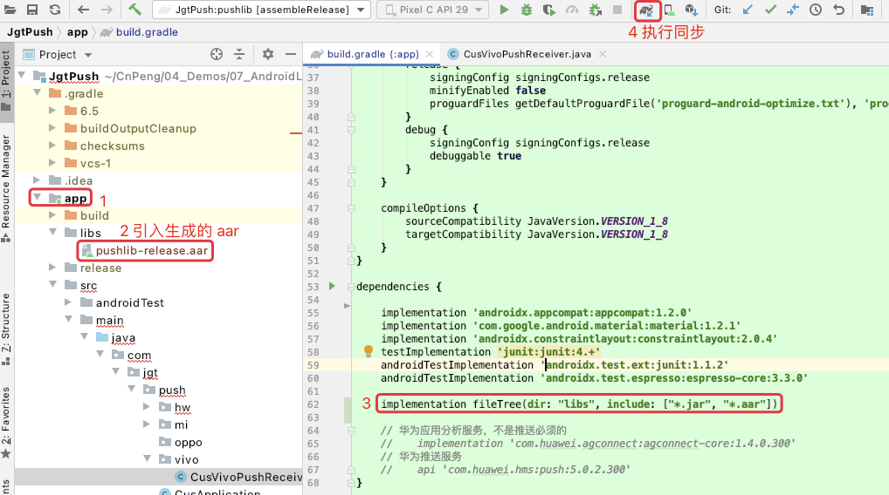

但是，我们此时会发现，**我们在项目中无法引用生成的 aar 包中所依赖的其他三方 aar !!!**，如下图：

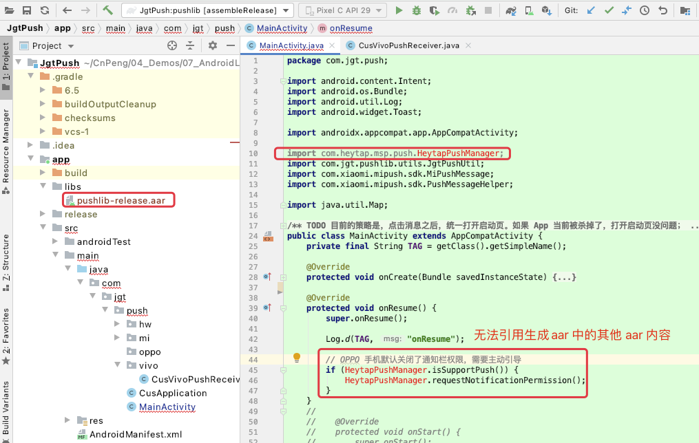

这是因为，我们在 `library` 中引用的其他 `aar` 资源内容并没有被加入到我们生成的 `aar` 中，那么如何解决该问题呢？请参考 [《4-fat-aar-android的使用.md》](4-fat-aar-android的使用.md)

 