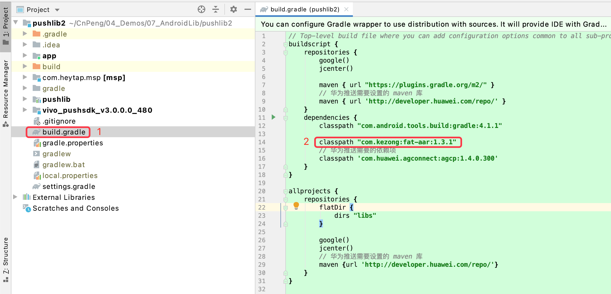
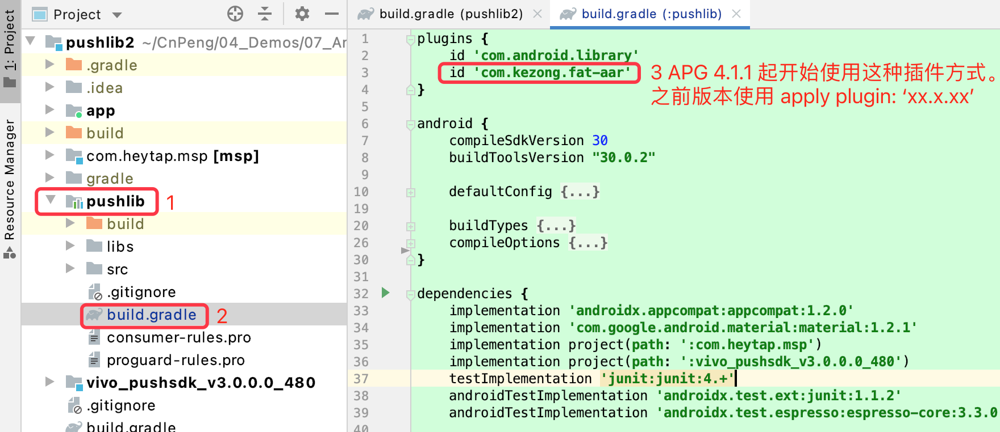
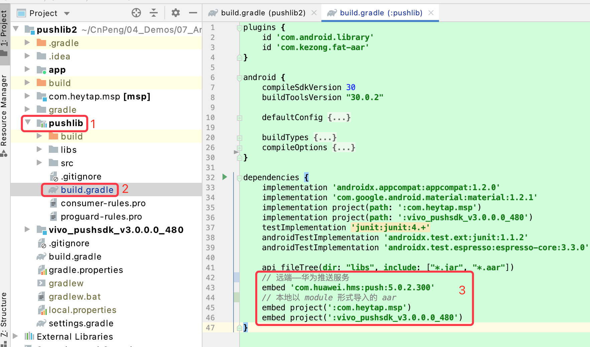

本文承接 [《3-library中包含aar时导出失败的解决》](3-library中包含aar时导出失败的解决.md)  一文，解决其末尾的 `无法引用嵌套 aar 资源` 的问题。

[《fat-aar-android》](https://github.com/kezong/fat-aar-android/blob/master/README_CN.md) 提供了将 `library` 以及它依赖的 `library` 一起打包成一个完整 `aar` 的解决方案。

如下内容参考 [《fat-aar-android》](https://github.com/kezong/fat-aar-android/blob/master/README_CN.md) 的文档整理。AS 版本：4.1.1 ，AGP 版本：4.1.1，Gradle 版本：6.5

## 4.1 修改项目的 gradle

修改我们编写 `library` 时所在项目的根 `gradle`，添加对 `classpath 'com.kezong:fat-aar:1.3.1'` 的依赖，如下图： 



## 4.2 修改 library 的 gradle

添加 `fat-aar` 插件命令 `apply plugin: 'com.kezong.fat-aar'` , 具体如下图：



然后以 `embed` 形式将我们需要打入 `aar` 包中的三方库内容进行依赖：



此时，我们再次执行导出 `aar` 的 `gradle` 命令就可以将三方依赖内容打包到我们生成的 `aar` 中，项目中引用该 `aar` 文件时，也可以使用其中嵌套的三方 `aar` 或远程仓库了。

## 4.3 补充
 
 下面这段内容摘自  [《fat-aar-android》](https://github.com/kezong/fat-aar-android/blob/master/README_CN.md) 的文档, 该示例详细说明了引用不同形式三方库方式。
 
```
dependencies {
    implementation fileTree(dir: 'libs', include: '*.jar')
    // java dependency——java 依赖项
    embed project(':lib-java')
    // aar dependency ——aar 依赖项1
    embed project(':lib-aar')
    // aar dependency —— aar 依赖项2
    embed project(':lib-aar2')
    // local full aar dependency, just build in flavor1 ——本地 aar 依赖，仅打包到 flavor1 变体中
    flavor1Embed project(':lib-aar-local')
    // local full aar dependency, just build in debug —— 本地 aar 依赖，仅打包到 debug 的 aar 中
    debugEmbed (name:'lib-aar-local2', ext:'aar')
    // remote jar dependency —— 远程 jar 依赖项
    embed 'com.google.guava:guava:20.0'
    // remote aar dependency —— 远程 aar 依赖项
    embed 'com.facebook.fresco:fresco:1.11.0'
    // don't want to embed in —— 不想打包的内容
    implementation('androidx.appcompat:appcompat:1.2.0')
}
```