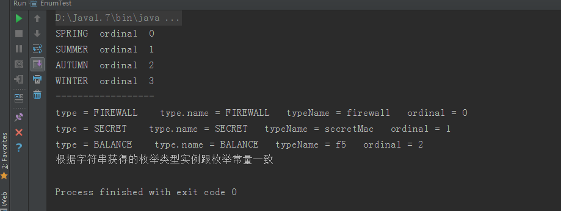

[原文链接：《Java 枚举(enum) 7种常见的用法》](http://blog.lichengwu.cn/java/2011/09/26/the-usage-of-enum-in-java/)

## 1.1 用法一：常量

在 JDK1.5 之前，我们定义常量都是： `public static fianl....` 。现在好了，有了枚举，可以把相关的常量分组到一个枚举类型里，而且枚举提供了比常量更多的方法。 

```java
public enum Color {  
  RED, GREEN, BLANK, YELLOW  
}  
``` 

## 1.2 用法二：switch

JDK1.6 之前的 switch 语句只支持 int,char,enum 类型，使用枚举，能让我们的代码可读性更强。 

```java
enum Signal {  
    GREEN, YELLOW, RED  
}  

public class TrafficLight {  
    Signal color = Signal.RED;  
    public void change() {  
        switch (color) {  
        case RED:  
            color = Signal.GREEN;  
            break;  
        case YELLOW:  
            color = Signal.RED;  
            break;  
        case GREEN:  
            color = Signal.YELLOW;  
            break;  
        }  
    }  
}  
```
 
## 1.3 用法三：向枚举中添加新方法

如果打算自定义自己的方法，那么**必须在 enum 实例序列的最后添加一个分号**。而且 Java 要求**必须先定义 enum 实例**。 

```java
public enum Color {  
    RED("红色", 1), 
    GREEN("绿色", 2), 
    BLANK("白色", 3), 
    YELLO("黄色", 4); 
     
    // 成员变量  
    private String name;  
    private int index;  
    
    // 构造方法  
    private Color(String name, int index) {  
        this.name = name;  
        this.index = index;  
    }  
    
    // 普通方法  
    public static String getName(int index) {  
        for (Color c : Color.values()) {  
            if (c.getIndex() == index) {  
                return c.name;  
            }  
        }  
        return null;  
    }  
    
    // get set 方法  
    public String getName() {  
        return name;  
    }  
    public void setName(String name) {  
        this.name = name;  
    } 
     
    public int getIndex() {  
        return index;  
    }  
    public void setIndex(int index) {  
        this.index = index;  
    }  
}  
```
 
## 1.4 用法四：覆盖枚举的方法

下面给出一个 `toString()` 方法覆盖的例子。 

```java
public enum Color {  
    RED("红色", 1), 
    GREEN("绿色", 2), 
    BLANK("白色", 3), 
    YELLO("黄色", 4);  
    
    // 成员变量  
    private String name;  
    private int index;  
    
    // 构造方法  
    private Color(String name, int index) {  
        this.name = name;  
        this.index = index;  
    }  
    
    //覆盖方法  
    @Override  
    public String toString() {  
        return this.index+"_"+this.name;  
    }  
}  
``` 

## 1.5 用法五：实现接口

所有的枚举都继承自 `java.lang.Enum` 类。由于 Java 不支持多继承，所以枚举对象不能再继承其他类。 

```java
public interface Behaviour {  
    void print();  
    String getInfo();  
}  

public enum Color implements Behaviour{  
    RED("红色", 1),
     GREEN("绿色", 2), 
     BLANK("白色", 3), 
     YELLO("黄色", 4);  
    
    // 成员变量  
    private String name;  
    private int index;  
    
    // 构造方法  
    private Color(String name, int index) {  
        this.name = name;  
        this.index = index;  
    }  
	
	 //接口方法  
    @Override  
    public String getInfo() {  
        return this.name;  
    }  
    
    //接口方法  
    @Override  
    public void print() {  
        System.out.println(this.index+":"+this.name);  
    }  
}  
```

## 1.6 用法六：使用接口组织枚举

```java
public interface Food {  
    enum Coffee implements Food{  
        BLACK_COFFEE,
        DECAF_COFFEE,
        LATTE,CAPPUCCINO  
    }  
    
    enum Dessert implements Food{  
        FRUIT, 
        CAKE, 
        GELATO  
    }  
}  
```

## 1.7 用法七：关于枚举集合的使用

`java.util.EnumSet` 和 `java.util.EnumMap` 是两个枚举集合。

* `EnumSet` 保证集合中的元素不重复；
* `EnumMap` 中的 `key` 是 `enum` 类型，而 `value` 则可以是任意类型。

关于这个两个集合的使用就不在这里赘述，可以参考 JDK 文档。

关于枚举的实现细节和原理请参考：

[参考资料：《ThinkingInJava》第四版](http://softbeta.iteye.com/blog/1185573)


## 1.8 其他补充

[以下内容摘自 CSDN](https://blog.csdn.net/m0_37286282/article/details/78473897?utm_medium=distribute.pc_relevant.none-task-blog-BlogCommendFromMachineLearnPai2-2.control&depth_1-utm_source=distribute.pc_relevant.none-task-blog-BlogCommendFromMachineLearnPai2-2.control)

### 1.8.1 使用示例

```java
package com.lxk.enumTest;  
  
/** 
 * Java枚举用法测试 
 * Created by lxk on 2016/12/15 
 */  
public class EnumTest {  
    public static void main(String[] args) {  
        forEnum();  
        useEnumInJava();  
    }  
  
    /** 
     * 循环枚举,输出ordinal属性；若枚举有内部属性，则也输出。(说的就是我定义的TYPE类型的枚举的typeName属性) 
     */  
    private static void forEnum() {  
        for (SimpleEnum simpleEnum : SimpleEnum.values()) {  
            System.out.println(simpleEnum + "  ordinal  " + simpleEnum.ordinal());  
        }  
        System.out.println("------------------");  
        for (TYPE type : TYPE.values()) {  
            System.out.println("type = " + type + "    type.name = " + type.name() + "   typeName = " + type.getTypeName() + "   ordinal = " + type.ordinal());  
        }  
    }  
  
    /** 
     * 在Java代码使用枚举 
     */  
    private static void useEnumInJava() {  
        String typeName = "f5";  
        TYPE type = TYPE.fromTypeName(typeName);  
        if (TYPE.BALANCE.equals(type)) {  
            System.out.println("根据字符串获得的枚举类型实例跟枚举常量一致");  
        } else {  
            System.out.println("大师兄代码错误");  
        }  
  
    }  
  
    /** 
     * 季节枚举(不带参数的枚举常量)这个是最简单的枚举使用实例 
     * Ordinal 属性，对应的就是排列顺序，从0开始。 
     */  
    private enum SimpleEnum {  
        SPRING,  
        SUMMER,  
        AUTUMN,  
        WINTER  
    }  
  
  
    /** 
     * 常用类型(带参数的枚举常量，这个只是在书上不常见，实际使用还是很多的，看懂这个，使用就不是问题啦。) 
     */  
    private enum TYPE {  
        FIREWALL("firewall"),  
        SECRET("secretMac"),  
        BALANCE("f5");  
  
        private String typeName;  
  
        TYPE(String typeName) {  
            this.typeName = typeName;  
        }  
  
        /** 
         * 根据类型的名称，返回类型的枚举实例。 
         * 
         * @param typeName 类型名称 
         */  
        public static TYPE fromTypeName(String typeName) {  
            for (TYPE type : TYPE.values()) {  
                if (type.getTypeName().equals(typeName)) {  
                    return type;  
                }  
            }  
            return null;  
        }  
  
        public String getTypeName() {  
            return this.typeName;  
        }  
    }  
}  
```

然后是测试的结果图：



### 1.8.2 比较

枚举类型对象之间的值比较，是可以使用 `==`，直接来比较值，是否相等的，不是必须使用 `equals` 方法。

具体参考：[《java 枚举类比较是用==还是equals？》](https://blog.csdn.net/qq_27093465/article/details/70237349)