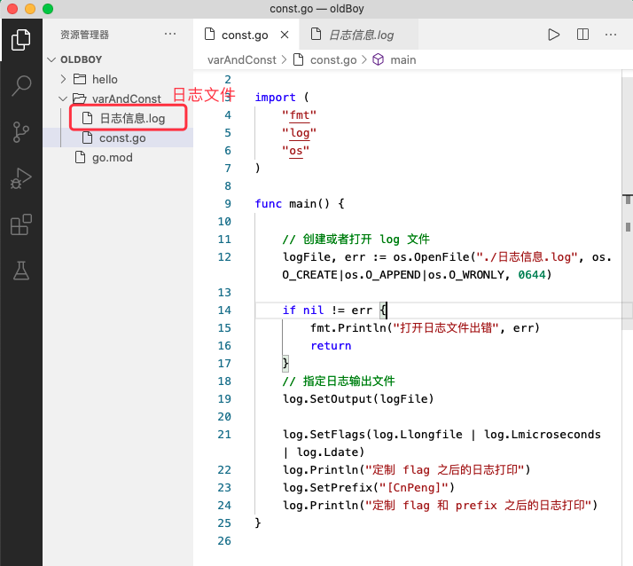

# 15 日志库

## 15.1 标准日志库 log

原文链接 《[Go语言标准库log介绍](https://www.liwenzhou.com/posts/Go/go_log/)》

Go 语言内置的 log 包实现了简单的日志服务。

### 15.1.1 使用 Logger

log 包定义了 Logger 类型，该类型提供了一些格式化输出的方法。本包也提供了一个预定义的“标准”logger，可以通过调用函数 `Print系列(Print|Printf|Println）`、`Fatal系列（Fatal|Fatalf|Fatalln）`、和 `Panic系列（Panic|Panicf|Panicln）`来使用，比自行创建一个 logger 对象更容易使用。

例如，我们可以像下面的代码一样直接通过 log 包来调用上面提到的方法，**默认会将日志信息打印到终端界面**：

```go
package main

import (
	"log"
)

func main() {
	log.Println("普通的日志打印")
	str := "日志打印"
	log.Printf("格式化的 %s", str)
	log.Fatalln("Fatal 日志打印")
	log.Panicln("Panic 日志打印")
}
```

编译并执行上面的代码会得到如下输出：

```
2020/09/17 08:21:23 普通的日志打印
2020/09/17 08:21:23 格式化的 日志打印
2020/09/17 08:21:23 Fatal 日志打印
exit status 1
```

* logger 会打印每条日志信息的日期、时间，默认输出到系统的终端。
* Fatal 系列函数会在写入日志信息后调用 `os.Exit(1)`。
* Panic系列函数会在写入日志信息后 panic。

### 15.1.2 配置 logger

#### 15.1.2.1 标准 logger 的配置

默认情况下的 logger 只会提供日志的时间信息，但是很多情况下我们希望得到更多信息，比如**记录该日志的文件名和行号**等。log 标准库中为我们提供了定制这些设置的方法。

log 标准库中的 `Flags 函数` 会返回标准 logger 的输出配置，而 `SetFlags函数` 用来设置标准 logger 的输出配置。

```go
func Flags() int
func SetFlags(flag int)
```

#### 15.1.2.2 flag 选项

log 标准库提供了如下的 flag 选项，它们是一系列定义好的常量。

```go
const (
    // 控制输出日志信息的细节，不能控制输出的顺序和格式。
    // 输出的日志在每一项后会有一个冒号分隔：例如2009/01/23 01:23:23.123123 /a/b/c/d.go:23: message
    Ldate         = 1 << iota     // 日期：2009/01/23
    Ltime                         // 时间：01:23:23
    Lmicroseconds                 // 微秒级别的时间：01:23:23.123123（用于增强Ltime位）
    Llongfile                     // 文件全路径名+行号： /a/b/c/d.go:23
    Lshortfile                    // 文件名+行号：d.go:23（会覆盖掉Llongfile）
    LUTC                          // 使用UTC时间
    LstdFlags     = Ldate | Ltime // 标准logger的初始值
)
```

下面我们在记录日志之前先设置一下标准logger的输出选项如下：

```go
package main

import (
	"log"
)

func main() {
	log.SetFlags(log.Llongfile | log.Lmicroseconds | log.Ldate)
	log.Println("定制 flag 之后的日志打印")
}
```

编译执行后得到的输出结果如下：

```go
2020/09/17 08:29:05.719377 /Users/cnpeng/CnPeng/04_Demos/12_Go/oldBoy/varAndConst/const.go:9: 定制 flag 之后的日志打印
```

#### 15.1.2.3 配置日志前缀

log标准库中还提供了关于日志信息前缀的两个方法：

```go
func Prefix() string
func SetPrefix(prefix string)
```

其中 `Prefix函数` 用来查看标准 logger 的输出前缀，`SetPrefix函数` 用来设置输出前缀。

```go
package main

import (
	"log"
)

func main() {
	log.SetFlags(log.Llongfile | log.Lmicroseconds | log.Ldate)
	log.Println("定制 flag 之后的日志打印")
	log.SetPrefix("[CnPeng]")
	log.Println("定制 flag 和 prefix 之后的日志打印")
}
```

上面的代码输出如下：

```go
2020/09/17 08:35:08.293025 /Users/cnpeng/CnPeng/04_Demos/12_Go/oldBoy/varAndConst/const.go:9: 定制 flag 之后的日志打印
[CnPeng]2020/09/17 08:35:08.293197 /Users/cnpeng/CnPeng/04_Demos/12_Go/oldBoy/varAndConst/const.go:11: 定制 flag 和 prefix 之后的日志打印
```

这样我们就能够在代码中为我们的日志信息添加指定的前缀，方便之后对日志信息进行检索和处理。

#### 15.1.2.4 配置日志输出位置

```go
func SetOutput(w io.Writer)
```

`SetOutput函数` 用来设置标准 logger 的输出目的地，默认是标准错误输出。

例如，下面的代码会把日志输出到同目录下的 `xx.log` 文件中。

```go
package main

import (
	"fmt"
	"log"
	"os"
)

func main() {

	// 创建或者打开 log 文件
	logFile, err := os.OpenFile("./日志信息.log", os.O_CREATE|os.O_APPEND|os.O_WRONLY, 0644)

	if nil != err {
		fmt.Println("打开日志文件出错", err)
		return
	}
	// 指定日志输出文件
	log.SetOutput(logFile)

	log.SetFlags(log.Llongfile | log.Lmicroseconds | log.Ldate)
	log.Println("定制 flag 之后的日志打印")
	log.SetPrefix("[CnPeng]")
	log.Println("定制 flag 和 prefix 之后的日志打印")
}
```



`日志信息.log` 文件中的内容如下：

```go
2020/09/17 08:40:57.335316 /Users/cnpeng/CnPeng/04_Demos/12_Go/oldBoy/varAndConst/const.go:22: 定制 flag 之后的日志打印
[CnPeng]2020/09/17 08:40:57.335490 /Users/cnpeng/CnPeng/04_Demos/12_Go/oldBoy/varAndConst/const.go:24: 定制 flag 和 prefix 之后的日志打印
```

如果要使用标准的 logger，我们通常会把上面的配置操作写到 init 函数中。

```go
func init() {
	logFile, err := os.OpenFile("./xx.log", os.O_CREATE|os.O_WRONLY|os.O_APPEND, 0644)
	if err != nil {
		fmt.Println("open log file failed, err:", err)
		return
	}
	log.SetOutput(logFile)
	log.SetFlags(log.Llongfile | log.Lmicroseconds | log.Ldate)
}
```

### 15.1.3 创建logger

log 标准库中还提供了一个创建新 logger 对象的构造函数–`New`，支持我们创建自己的 logger 示例。New函数的签名如下：

```go
func New(out io.Writer, prefix string, flag int) *Logger
```

New 创建一个 Logger 对象。其中，

* 参数 `out` 设置日志信息写入的目的地。
* 参数 `prefix` 会添加到生成的每一条日志前面。
* 参数 `flag` 定义日志的属性（时间、文件等等）。

举个例子：

```go
package main

import (
	"log"
	"os"
)

func main() {
	cusLog := log.New(os.Stdout, "[CnPeng]", log.Lshortfile|log.Ldate|log.Ltime)
	cusLog.Println("自定义的log对象输出日志")
}
```

将上面的代码编译执行之后，得到结果如下：

```go
[CnPeng]2020/09/17 08:48:34 const.go:10: 自定义的log对象输出日志
```

### 15.1.4 总结

Go 内置的 log 库功能有限，例如无法满足记录不同级别日志的情况，我们在实际的项目中根据自己的需要选择使用第三方的日志库，如 `logrus`、`zap` 等。

## 15.2 第三方日志库 logrus 使用

日志是程序中必不可少的一个环节，由于Go语言内置的日志库功能比较简洁，我们在实际开发中通常会选择使用第三方的日志库来进行开发。本文介绍了logrus这个日志库的基本使用。

logrus介绍
Logrus是Go（golang）的结构化logger，与标准库logger完全API兼容。

它有以下特点：

完全兼容标准日志库，拥有七种日志级别：Trace, Debug, Info, Warning, Error, Fataland Panic。
可扩展的Hook机制，允许使用者通过Hook的方式将日志分发到任意地方，如本地文件系统，logstash，elasticsearch或者mq等，或者通过Hook定义日志内容和格式等
可选的日志输出格式，内置了两种日志格式JSONFormater和TextFormatter，还可以自定义日志格式
Field机制，通过Filed机制进行结构化的日志记录
线程安全
安装
go get github.com/sirupsen/logrus
基本示例
使用Logrus最简单的方法是简单的包级导出日志程序:

package main

import (
  log "github.com/sirupsen/logrus"
)

func main() {
  log.WithFields(log.Fields{
    "animal": "dog",
  }).Info("一条舔狗出现了。")
}
进阶示例
对于更高级的用法，例如在同一应用程序记录到多个位置，你还可以创建logrus Logger的实例：

package main

import (
  "os"
  "github.com/sirupsen/logrus"
)

// 创建一个新的logger实例。可以创建任意多个。
var log = logrus.New()

func main() {
  // 设置日志输出为os.Stdout
  log.Out = os.Stdout

  // 可以设置像文件等任意`io.Writer`类型作为日志输出
  // file, err := os.OpenFile("logrus.log", os.O_CREATE|os.O_WRONLY|os.O_APPEND, 0666)
  // if err == nil {
  //  log.Out = file
  // } else {
  //  log.Info("Failed to log to file, using default stderr")
  // }

  log.WithFields(logrus.Fields{
    "animal": "dog",
    "size":   10,
  }).Info("一群舔狗出现了。")
}
日志级别
Logrus有七个日志级别：Trace, Debug, Info, Warning, Error, Fataland Panic。

log.Trace("Something very low level.")
log.Debug("Useful debugging information.")
log.Info("Something noteworthy happened!")
log.Warn("You should probably take a look at this.")
log.Error("Something failed but I'm not quitting.")
// 记完日志后会调用os.Exit(1) 
log.Fatal("Bye.")
// 记完日志后会调用 panic() 
log.Panic("I'm bailing.")
设置日志级别
你可以在Logger上设置日志记录级别，然后它只会记录具有该级别或以上级别任何内容的条目：

// 会记录info及以上级别 (warn, error, fatal, panic)
log.SetLevel(log.InfoLevel)
如果你的程序支持debug或环境变量模式，设置log.Level = logrus.DebugLevel会很有帮助。

字段
Logrus鼓励通过日志字段进行谨慎的结构化日志记录，而不是冗长的、不可解析的错误消息。

例如，区别于使用log.Fatalf("Failed to send event %s to topic %s with key %d")，你应该使用如下方式记录更容易发现的内容:

log.WithFields(log.Fields{
  "event": event,
  "topic": topic,
  "key": key,
}).Fatal("Failed to send event")
WithFields的调用是可选的。

默认字段
通常，将一些字段始终附加到应用程序的全部或部分的日志语句中会很有帮助。例如，你可能希望始终在请求的上下文中记录request_id和user_ip。

区别于在每一行日志中写上log.WithFields(log.Fields{"request_id": request_id, "user_ip": user_ip})，你可以向下面的示例代码一样创建一个logrus.Entry去传递这些字段。

requestLogger := log.WithFields(log.Fields{"request_id": request_id, "user_ip": user_ip})
requestLogger.Info("something happened on that request") # will log request_id and user_ip
requestLogger.Warn("something not great happened")
日志条目
除了使用WithField或WithFields添加的字段外，一些字段会自动添加到所有日志记录事中:

time：记录日志时的时间戳
msg：记录的日志信息
level：记录的日志级别
Hooks
你可以添加日志级别的钩子（Hook）。例如，向异常跟踪服务发送Error、Fatal和Panic、信息到StatsD或同时将日志发送到多个位置，例如syslog。

Logrus配有内置钩子。在init中添加这些内置钩子或你自定义的钩子：

import (
  log "github.com/sirupsen/logrus"
  "gopkg.in/gemnasium/logrus-airbrake-hook.v2" // the package is named "airbrake"
  logrus_syslog "github.com/sirupsen/logrus/hooks/syslog"
  "log/syslog"
)

func init() {

  // Use the Airbrake hook to report errors that have Error severity or above to
  // an exception tracker. You can create custom hooks, see the Hooks section.
  log.AddHook(airbrake.NewHook(123, "xyz", "production"))

  hook, err := logrus_syslog.NewSyslogHook("udp", "localhost:514", syslog.LOG_INFO, "")
  if err != nil {
    log.Error("Unable to connect to local syslog daemon")
  } else {
    log.AddHook(hook)
  }
}
意：Syslog钩子还支持连接到本地syslog（例如. “/dev/log” or “/var/run/syslog” or “/var/run/log”)。有关详细信息，请查看syslog hook README。

格式化
logrus内置以下两种日志格式化程序：

logrus.TextFormatter logrus.JSONFormatter

还支持一些第三方的格式化程序，详见项目首页。

记录函数名
如果你希望将调用的函数名添加为字段，请通过以下方式设置：

log.SetReportCaller(true)
这会将调用者添加为”method”，如下所示：

{"animal":"penguin","level":"fatal","method":"github.com/sirupsen/arcticcreatures.migrate","msg":"a penguin swims by",
"time":"2014-03-10 19:57:38.562543129 -0400 EDT"}
注意：，开启这个模式会增加性能开销。

线程安全
默认的logger在并发写的时候是被mutex保护的，比如当同时调用hook和写log时mutex就会被请求，有另外一种情况，文件是以appending mode打开的， 此时的并发操作就是安全的，可以用logger.SetNoLock()来关闭它。

gin框架使用logrus
// a gin with logrus demo

var log = logrus.New()

func init() {
	// Log as JSON instead of the default ASCII formatter.
	log.Formatter = &logrus.JSONFormatter{}
	// Output to stdout instead of the default stderr
	// Can be any io.Writer, see below for File example
	f, _ := os.Create("./gin.log")
	log.Out = f
	gin.SetMode(gin.ReleaseMode)
	gin.DefaultWriter = log.Out
	// Only log the warning severity or above.
	log.Level = logrus.InfoLevel
}

func main() {
	// 创建一个默认的路由引擎
	r := gin.Default()
	// GET：请求方式；/hello：请求的路径
	// 当客户端以GET方法请求/hello路径时，会执行后面的匿名函数
	r.GET("/hello", func(c *gin.Context) {
		log.WithFields(logrus.Fields{
			"animal": "walrus",
			"size":   10,
		}).Warn("A group of walrus emerges from the ocean")
		// c.JSON：返回JSON格式的数据
		c.JSON(200, gin.H{
			"message": "Hello world!",
		})
	})
	// 启动HTTP服务，默认在0.0.0.0:8080启动服务
	r.Run()
}

