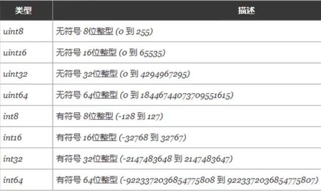
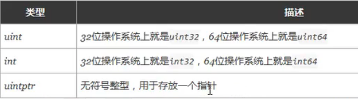
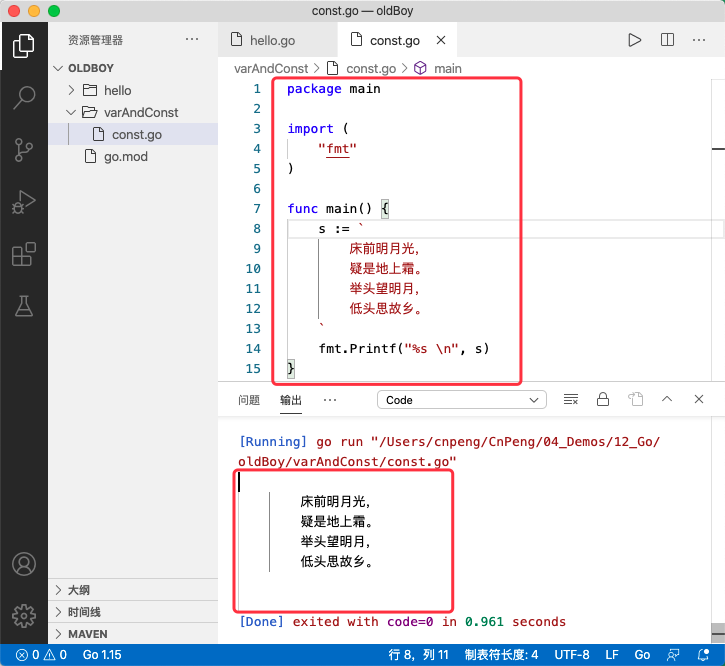

# 3 基本数据类型

基本数据类型包括：整型、浮点型、布尔型、字符串。

除以上基本类型之外，还有 数组、切片、结构体、函数、map、通道 等。


## 3.1 整型

### 3.1.1 整型

整型分为：`int8`、`int16`、`int32`、`int64` ，以及对应的无符号整型：`uint8`、`uint16`、`uint32`、`uint64`

其中 `unit8` 对应其他语言中的 `byte` 类型；`int16` 对应 C 语言中的 `short` 类型；`int64` 对应 C  语言中的 `long` 类型。

各数据类型及对应的取值关系如下：



特殊整型：



>注意: 获取对象的长度时，内建的 `len()` 函数返回的长度可以根据不同平台的字节长度进行变化。实际使用中，切片或 map 的元素数量等都可以直接使用 int 来表示 。

### 3.1.2 八进制和十六进制

```go
package main

import (
	"fmt"
)

func main() {
	// 声明十进制数.
	var a = 10
	// %d 为十进制数的占位符，表示输出十进制数——10
	fmt.Printf("%d \n", a)
	// %b 为二进制数的占位符，输出二进制数——1010
	fmt.Printf("%b \n", a)
	// %o 为八进制数的占位符，输出八进制数——12
	fmt.Printf("%o \n", a)
	// %x 为十六进制数的占位符，输出十六进制数——a
	fmt.Printf("%x \n", a)
	// %T 表示获取某个变量的类型_int
	fmt.Printf("%T \n", a)

	// 声明八进制数，以 0 开头
	b := 077
	// 63
	fmt.Printf("%d \n", b)
	//111111
	fmt.Printf("%b \n", b)
	// 77
	fmt.Printf("%o \n", b)
	// 3f
	fmt.Printf("%x \n", b)
	// int
	fmt.Printf("%T \n", b)

	// 声明 16 进制数，以 0x开头
	c := 0xff
	// 255
	fmt.Printf("%d \n", c)
	// 11111111
	fmt.Printf("%b \n", c)
	// 377
	fmt.Printf("%o \n", c)
	// ff
	fmt.Printf("%x \n", c)
	// int
	fmt.Printf("%T \n", c)

	// 显示声明为 int8 类型，否则，默认 int 类型
	d := int8(9)
	// 9
	fmt.Printf("%d \n", d)
	// 1001
	fmt.Printf("%b \n", d)
	// 11
	fmt.Printf("%o \n", d)
	// 9
	fmt.Printf("%x \n", d)
	// int8
	fmt.Printf("%T \n", d)

	// %v 表示获取某个变量的值——int8,9
	fmt.Printf("d 的类型为：%T，值为: %v", d, d)
}
```

## 3.2 浮点型

go 语言支持两种浮点型数，`float32` 和 `float64`. 

这两种浮点型数据格式遵循 `IEEE 754` 标准， float32 的浮点数的最大范围约为 `3.4e38` ，可以使用常量定义：`math.MaxFloat32`。float64 的浮点数的最大范围约为 `1.8e308`, 可以使用常量定义 `math.MaxFloat64`

```go
package main

import (
	"fmt"
	"math"
)

func main() {
	// %f 为浮点数的占位符，
	fmt.Printf("%f \n", math.MaxFloat32)
	fmt.Printf("%f \n", math.MaxFloat64)

	var a = 1.2345
	// 默认 floa64
	fmt.Printf("%T \n", a)

	var b = float32(1.2345)
	// 显示声明为 float32
	fmt.Printf("%T \n", b)
}
```

## 3.3 复数

* 复数实际上是有两个实数（浮点数）的组合，一个表示实部（real），一个表示虚部（imag）。
* 虚部需要添加 `i` 作为后缀。
* `real(复数)`可以获取实部 ，`imag(复数)` 可以获取虚部
* 有 `complex64` 和 `complex128` 两种类型，complex64 的实部和虚部为 32 位，complex128 的实部和虚部为 64 位。

```go
package main

import "fmt"

func main() {
	// 1、声明一个复数
	var v1 complex64
	// 虚部数据需要后缀 i
	v1 = 3.2 + 12i
	fmt.Println("v1=", v1)

	// 2、自动推导类型的复数
	v2 := 3.3 + 2.0i
	fmt.Printf("v2的类型为：%T \n", v2)
	fmt.Println("v2的值为：", v2)

	// 3、获取复数的实部和虚部: real(复数)，imag(复数)
	fmt.Println("v2的实部为：", real(v2), "v2的虚部为：", imag(v2))
}
```

运行结果：

```
cnpeng$ go run Day1.go 
v1= (3.2+12i)
v2的类型为：complex128 
v2的值为： (3.3+2i)
v2的实部为： 3.3 v2的虚部为： 2
```


## 3.4 布尔类型

### 3.4.1 布尔类型

go 语言中以 `bool` 声明布尔类型数据。布尔类型仅有 `true` 和 `false` 两种值。

注意：

* 布尔类型变量的默认值为 false
* go 语言中不允许将整型强制转换为布尔类型
* 布尔型数据无法参与数值运算，与无法与其他类型进行转换。

### 3.4.2 补充：格式化输出的总结

fmt 包的 `Printf()` 格式化输出可以使用下面的格式化符号：

格式|含义
---|---
`%%`| `%` 字面量
`%b` | 二进制整数值(基数为2)，或者是(高级的)用科学计数法表示的指数为2的浮点数
`%c` | 字符型。可以把输入的数字按照 ASCII 码转换为对应的字符。
`%d` | 十进制数值(基数为10)
`%e` | 以科学计数法 e 表示的浮点数或者复数值
`%E` | 以科学计数法 E 表示的浮点数或者复数值
`%f` | 以标准计数法表示的浮点数或者复数值
`%g` | 以`%e`或者`%f`表示的浮点数或者复数，任何一个都以最为紧凑的方式输出
`%G` | 以 `%E`或者`%f`表示的浮点数或者复数，任何一个都以最为紧凑的方式输出
`%o`| 以八进制表示的数字
`%p`| 以十六进制表示的值的地址，前缀为 0x, 字母使用小小的 a-f 表示
`%s`| 字符串
`%t`| 以 true 或者 false 输出布尔值
`%T`| 获取数据类型。
`%U`| 用 Unicode 表示法表示的整型码点。默认值为四个数字字符
`%v`| 使用默认格式输出的内置或自定义类型的值。或者时使用期望类型的 `String()` 方式输出的自定义值。
`%#v` | 如果输出的字符串，该字符串会被双引号包裹起来
`%x`| 以十六进制表示的整型值, a-f 使用小写
`%X`| 以十六进制表示的整型值， A-F 使用大写 

```go
package main

import (
	"fmt"
)

func main() {
	var str = "abc"
	// "abc" 
	fmt.Printf("%#v \n", str)
}
```

## 3.4 字符串

go 语言中的字符串以原生数据类型出现，使用字符串就想使用其他原生数据类型（int、bool、float32、float64 等）一样。

go 语言中字符串的内部实现使用了 `UTF-8` 编码。**字符串的值使用双引号 `" "` 包裹**（ go 语言中，只有使用单引号 `' '` 包裹的是字符）。

### 3.4.1 字符串转义符

转义符|含义
---|---
`\r` | 回车符（返回行首）
`\n` | 换行符
`\t` | 制表符
`\'` | 单引号
`\"` | 双引号
`\\` | 反斜杠

> 1字节=8Bit ，即1字节表示八个二进制位，也就是 八个 01——01010101
> 一个 UTF-8 编码的汉字通常占用三个字节，偏僻字可能会占四个字节。

```go
package main

import (
	"fmt"
)

func main() {
	// 打印 windows 下的一个文件目录，需要使用转义字符
	// 输出结果："D:\Go\src\code.github.cnoeng\stu"
	fmt.Printf("\"D:\\Go\\src\\code.github.cnoeng\\stu\"")
}
```

### 3.4.2 多行字符串（原样字符串）

go 语言中要定义一个多行字符串时，使用 `反引号` (即键盘左上角数字一左侧的那个按键) 包裹。也叫原样字符串，输入啥样，输出就啥样。

```go
package main

import (
	"fmt"
)

func main() {
	s := `
		床前明月光，
		疑是地上霜。
		举头望明月，
		低头思故乡。
	`
	fmt.Printf("%s \n", s)
}
```



```go
package main

import (
	"fmt"
)

func main() {
	s := `D:\Go\src\code.github.cnoeng\stu`
	// D:\Go\src\code.github.cnoeng\stu 
	fmt.Printf("%s \n", s)
}
```

### 3.4.3 字符串的常用操作

方法|含义
---|---
`len(str)` | 获取字符串的长度 
`+ 或 fmt.Sprintf()` | 拼接字符串
`strings.Split` | 分割
`strings.contains` | 判断是否包含 
`strings.HasPrefix`、`strings.HasSuffix` | 前缀、后缀的判断 
`strings.Index()`、`strings.LastIndex()` | 子串出现的位置 
`strings.Join(a[]string,sep string)` | join 操作 （拼接）

>字符串是由  byte 字节组成，所以字符串的长度就是 byte 字节的长度。

```go
package main

import (
	"fmt"
	"strings"
)

func main() {
	s := `张三`
	// 6 
	fmt.Println(len(s))
	
	// 字符串拼接
	s1 := "李四"
	// fmt.Printf 只能输出到终端
	// 张三李四
	fmt.Printf("%s \n", s+s1)
	// 张三李四
	fmt.Printf("%s%s \n", s, s1)
	// fmt.Sprintf 可以将拼接后的值返回给变量
	s2 := fmt.Sprintf("%s%s \n", s, s1)
	// 张三李四
	fmt.Printf("%s \n", s2)

	// 字符串分割
	s3 := "/Users/cnpeng/CnPeng/04_Demos/12_Go"
	splitS := strings.Split(s3, "/")
	// [ Users cnpeng CnPeng 04_Demos 12_Go]
	fmt.Printf("%s \n", splitS)

	// 是否包含——true
	fmt.Println(strings.Contains(s2, "张三"))

	// 前缀和后缀——true
	fmt.Println(strings.HasPrefix(s2, "张"))
	// true
	fmt.Println(strings.HasSuffix(s2, "四"))

	// 子串位置——0
	fmt.Println(strings.Index(s2, "张"))
	// 9
	fmt.Println(strings.LastIndex(s2, "四"))

	// Join 拼接——+Users+cnpeng+CnPeng+04_Demos+12_Go
	fmt.Println(strings.Join(splitS, "+"))
}
``` 


### 3.4.4 byte 和 rune 类型

组成每个字符串的元素叫做字符。可以通过遍历或者单个获取字符串元素获得字符。字符使用单引号包裹，如：

```go
var a := '中'
var b := 'x'
```

go 语言中的字符有如下两种：

* `uint8` 类型，或者叫 `byte` 类型，代表了 ASCII 码的一个字符。
* `rune` 类型，代表一个 `UTF-8` 字符。一个 `rune` 字符由一个或多个 byte 组成。

当需要处理中文、日文或其他复合字符时，需要使用 `rune` 类型。`rune` 类型实际是一个 `int32`

```go
package main

import (
	"fmt"
)

func main() {
	s := "中国"

	// 普通遍历方式得到的是 byte ，最终输出结果为：228——ä184——¸173——­229——å155——›189——½
	for i := 0; i < len(s); i++ {
		fmt.Printf("%v——%c", s[i], s[i])
	}

	fmt.Println()

	// range 遍历得到的数 rune ，最终结果为：20013——中22269——国
	for _, c := range s {
		fmt.Printf("%v——%c", c, c)
	}
	fmt.Println()
}
```

因为 `UTF-8` 编码下一个中文汉字由 3-4 个字节组成，所以我们不能简单的按照字节去遍历一个包含中文的字符串，否则就会出现上面第一个遍历中的结果。

### 3.4.5 修改字符串

字符串是不能直接修改的。

字符串底层是一个 byte 数组，所以可以和 `[]byte` 类型相互转换。

修改字符串时，需要先将其转换成 `[]rune` 或 `[]byte`, 修改完成后再转换为 string。无论哪种转换都会重新分配内存，并复制字节数组。

```go
package main

import (
	"fmt"
)

func main() {

	s1 := "big"
	byteS1 := []byte(s1)
	byteS1[0] = 'p'
	// pig
	fmt.Println(string(byteS1))

	s2 := "白萝卜"
	runeS2 := []rune(s2)
	runeS2[0] = '红'
	//红萝卜
	fmt.Println(string(runeS2))
}
```

## 3.5 类型转换和类型别名


### 3.5.1 类型转换

Go 语言中不允许隐式转换，所有类型转换必须显示声明，而且转换只能发生在两种相互兼容的类型之间。

```go
package main

func main() {
	var a byte = 97
	//显示类型转换
	var b int = int(a)
	
	//隐式类型转换，报错
	// var c int = a
	
	//类型不兼容，int 不能转为 bool
	//var d bool = bool(b)
	fmt.Println(d)
}
```

### 3.5.2 类型别名


* 为现有的类型定义别名，方便调用。关键字 `type`

( 在 Swift 中也有这种类型别名，特别是对函数类型定义别名很有用)

```go
package main

import "fmt"

func main() {
	//1、为 int64 起一个类型别名为，bigint
	type bigint int64
	var x bigint = 100

	//2、同时定义多个类型别名
	type (
		myint int
		mystr string
	)

	var y myint = 11
	var z mystr = "12"

	fmt.Println(x, y, z)
	fmt.Printf("x,y,z 的类型分别为：%T , %T , %T \n ", x, y, z)
}
```

运行结果：

```
cnpeng$ go run Day1.go 
100 11 12
x,y,z 的类型分别为：main.bigint , main.myint , main.mystr 
```


