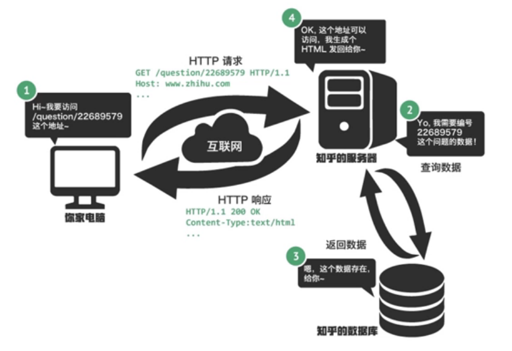
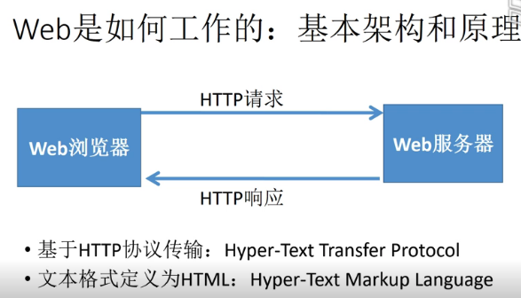
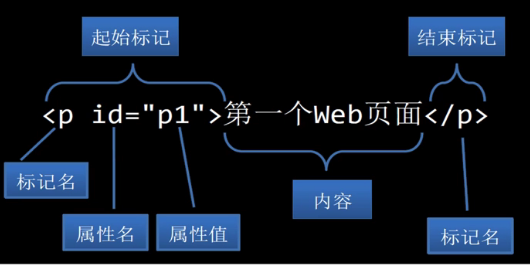
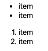
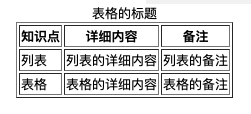
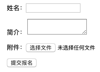
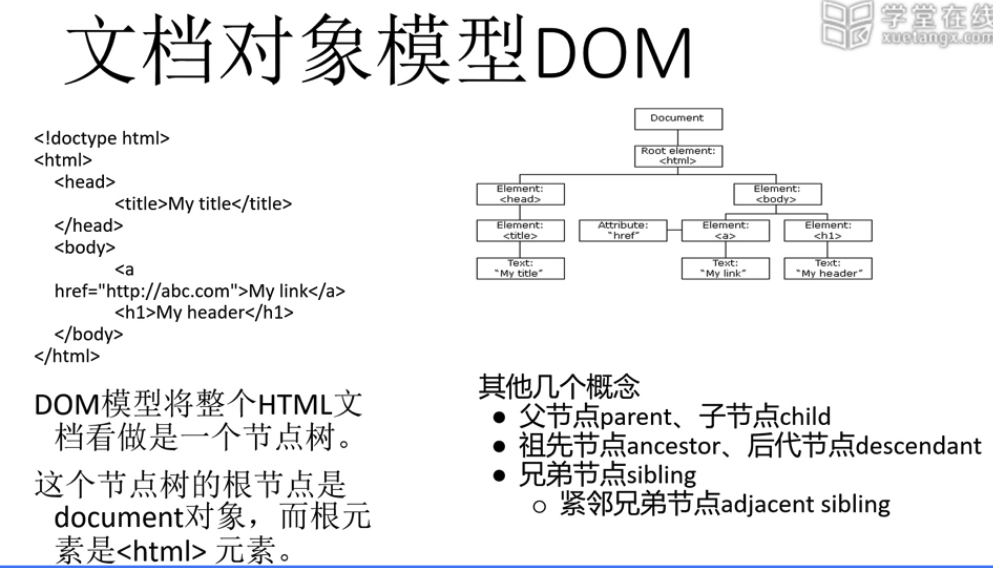
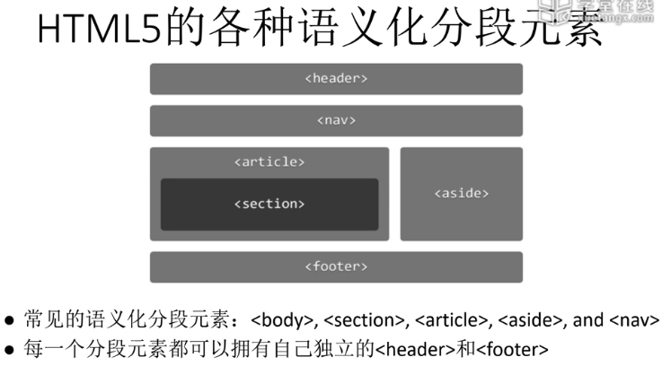
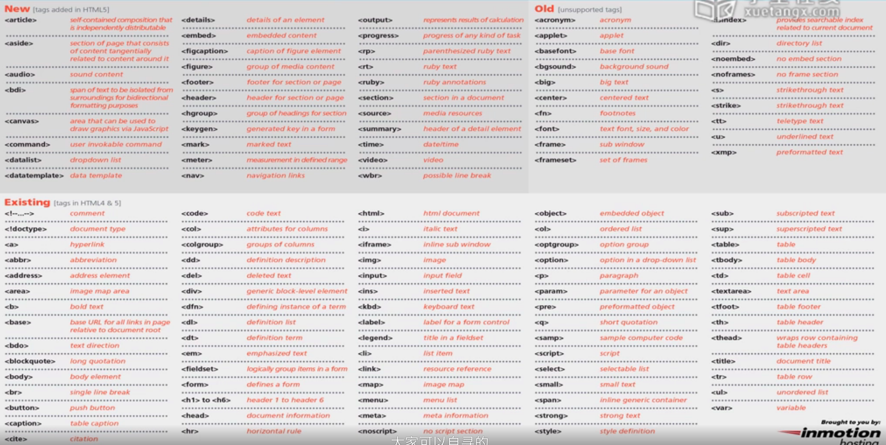

## 2.1 内容介绍

### 2.1.1 内容介绍

* 参考书 《CSS设计指南-第三版》
* 参考网站 [https://developer.mozilla.org/zh-CN/](https://developer.mozilla.org/zh-CN/)
* 参考网站 [https://htmlreference.io/](https://htmlreference.io/)
* 参考网站 [https://cssreference.io/](https://cssreference.io/)

开发工具：Visual studio code

调试工具：Chrome DevTools 

### 2.1.2 Web是如何工作的：基本架构和原理

Web 工作流程示意：



Web 基本架构和原理：



## 2.2 HTML 基本要素（标记、元素、内容、属性）

### 2.2.1 基本要素介绍

第一个简单的 HTML 页面：

```html
<!doctype html>
<html>
<head>
    <meta charset="UTF-8"/>
    <title>第一个HTML页面</title>
</head>
<body>
    <h1>Hello HTML and CSS</h1>
</body>
</html>
```

HTML 文件的基本结构包括：文档类型声明、文档头、文档体、文档元素。



> 在实际工作中，标记和元素不做区别。

### 2.2.2 单标记元素

单标记元素通常不包含内容。部分示例如下：

* `<meta charset="UTF-8"/>`
* ``
* `<link rel="stylesheet" type="text/css" href="some.css">`

> HTML 中可以不加末尾的结束标记 `/`，但 XHTML 中要求必须有。通常最好加上。

### 2.2.3 全局属性

即所有 HTML 元素都可以添加的属性。如下：

* accesskey
* class
* contenteditable
* contextmenu
* dir
* draggable
* dropzone
* hidden
* id
* itemid
* itemprop
* itemref
* itemscope
* itemtype
* lang
* spellcheck
* style
* tabindex
* title
* translate

## 2.3 HTML 文档类型、注释、HEAD

### 2.3.1 HTML 文档类型和注释

HTML 文档的第一行必须使用 `<!DOCTYPE>` 来声明该文档的类型，即告知 Web 浏览器该 HTML 文档是依据哪个版本的 HTML 规范来编写的。


HTML 中注释的格式为：`<!-- 这里写注释的具体内容 -->`

### 2.3.2 HTML head 及相关标记

在 HTML 的 `<head></head>` 中可以定义如下内容：

* 定义文档的编码：
	* ` <meta charset="UTF-8" />`
* 定义文档的 title 和小 icon
	* `<title>这是文档标题</title>`
	* `<link rel="shortcut icon" type="image/x-icon" href="/favicon.ico" </head>`
* 为 SEO 定义 keywords 和 description
	* `<meta name="keywords" content="keyword1,keyword2,keyword3"/>`
    * `<meta name="description" content="how to describe the document"/>`
* 定义文档的样式规则
	* `<link rel="stylesheet" type="text/css" href="some.css"/>`
    * `<style type="text/css">这里写我们自定义的样式规则</style>`
* 定义文档的 javascript 代码
	* `<script type="text/javascript" src="some.js"></script>`
    * `<script type="text/javascript">这里写自定义的 javascript 脚本内容</script>`

## 2.4 HTML 标题、段落和文本格式化

* 标题：`<h1>、<h2>、<h3>、<h4>、<h5>、<h6>`
* 段落：`<p>`
* 换行：`<br>`
* 水平线：`<hr>`

文本格式化相关的部分元素：

效果| 代码 | 显示效果
---|---|---
加粗 | `<b>Bold text</b>` | <b>Bold text</b>
斜体 | `<i>Italic text</i>` | <i>Italic text</i>
加粗（重要文本）| `<strong>Important text</strong>` | <strong>Important text</strong>
斜体（强调文本）| `<em>Emphasized text</em>` | <em>Emphasized text</em>
小文本 | `<small>Smaller text</small>` |  <small>Smaller text</small>
带删除线的文本 | `<del>(deleted text)</del>`  | <del>(deleted text)</del>
被插入的文本（带下划线） | `<ins>(inserted text)</ins>` | <ins>(inserted text)</ins>
插入代码块 | ` <code> </code>` | 
引用一句话 | `<q>引用一句话</q>` | <q>引用一句话</q>
引用一段话 | `<blockquote>引用一段话</blockquote>` | <blockquote>引用一段话</blockquote> 


## 2.5 HTML 图片 image 和超链接 Hyperlink

### 2.5.1  img 元素

``

* `src` 属性指定图片的路径，可以是网络路径，也可以是本地的相对或绝对路径
* `alt` 表示图片加载失败时的占位文本，通常必须添加

### 2.5.2 HTML 超链接

#### 2.5.2.1 文档外链接

* 将文本作为超链接

`<a href="https://gitee.com/CnPeng_1/LearningNotes">这是一个超链接</a>`

* 将图片作为超链接触发体

```html
<a href="https://gitee.com/CnPeng_1/LearningNotes">
     
</a>
```

* 发送邮件 

```html
<a href="mailto:893612134@qq.com">
    点击触发本地邮件客户端给 href 中的用户发送邮件
</a>
```

* 打开相对/绝对路径下的链接

```html
<a href="/pic/001.png">
    点击展示相对/绝对路径中的文件
</a>
```

#### 2.5.2.2 文档内导航

```html
<a href="#faq">点击跳转到当前文档内元素id为faq的元素位置——锚点</a>

<a href="#">点击跳转到页面顶部</a>

<a href="https://xxx.xx.com#faq">点击跳转到指定页面的 id 为 faq 的元素区域</a>
```

## 2.6 HTML 布局

### 2.6.1 HTML 列表 List 和 表格 Table 

#### 2.6.1.1 列表

* 无序列表

```html
<ul>
       <li>item</li>
       <li>item</li>
</ul>
```

* 有序列表

```html
<ol>
        <li>item</li>
        <li>item</li>
</ol>
```

有序列表和无序列表的显示效果如下：



> 有序列表和无序列表的效果可以通过 css 来修改。它们通常用来表示线性数据结果，如一组数据内容、导航栏的各个子项，下拉列表的各个子项等

`<li>` 中除了可以普通文本，还可以嵌套 `<ul>` 或 `<ol>` 从而展示一个树形的数据结构


#### 2.6.1.2 Table

`<table>` 用来表示表结构，可以添加 css 、边框 等效果。其子元素有：

* `<caption>>` 表格的标题
* `<tr>` 表格的行
* `<th>` 表头
* `<td>` 单元格

```html
<table border="1">
        <caption>表格的标题</caption>
        <tr>
            <th>知识点</th>
            <th>详细内容</th>
            <th>备注</th>
        </tr>
        <tr>
            <td>列表</td>
            <td>列表的详细内容</td>
            <td>列表的备注</td>
        </tr>
        <tr>
            <td>表格</td>
            <td>表格的详细内容</td>
            <td>表格的备注</td>
        </tr>
    </table>
```



其他和 Table 相关的元素：

* 对多行进行分组 `<thead>` 、`<tbody>`、`<tfoot>` 
* 对多列进行分组 `<colgroup>`、`<col>`


### 2.6.2 HTML 的 div 和 span

HTML 中的最常见的容器元素是 div 和 span

* `<div>` 是块级容器（block container）
* `<span>` 是行内容器 (inline container)

>* 块级容器/元素 就是单独占一块的容器/元素
>* 行内容器/元素 就是和其他容器/元素在同一行的容器/元素

> 部分场景下可能会使用 table 作为容器元素，但不推荐使用。


## 2.7 HTML 表单 Form

`<form>` 元素为用户输入创建 HTML 表单，用于向服务器提交数据。

```html
    <form action="/course/reg.do" method="POST" enctype="multipart/form-data">
        <p>姓名：<input type="text" /></p>
        <p>简介： <textarea></textarea></p>
        <p>附件：<input type="file" /> </p>
        <p><input type="submit" value="提交报名" /></p>
    </form>
```

效果如下：



 * `<input type="text" />` 是单行文本输入
 * `<textarea></textarea>` 多行文本输入
 *  `<input type="file" />` 选择文件
 *  `<input type="submit" value="提交报名" />` 提交按钮
 
 `<form>` 中 ：
 
 * `action` 表示要触发哪个服务器接口
* `mehotd` 表示网络请求方式
* `enctype` 表示将数据传递给服务器时的数据编码方式。（有文件上传时使用 multipart）


## 2.8 文档对象模型 DOM 




## 2.9 HTML5 最佳实践与全部标记总览

### 2.9.1 HTML5 中语义化分段元素



* 常见的语义化分段元素有：`<body>`、`<section>`、`<article>`、`<aside>`、`<nav>`。
* 每一个分段元素都可以拥有自己独立的 `<header>` 和 `<footer>`

### 2.9.2 HTML5 中最佳实践与全部标记总览

#### 2.9.2.1 最佳实践

* 根据应用场景和需求，建立合适的 HTML 标记结构，选择合适的 HTML 标记元素
* 不要忘记文档类型声明，文档开头应该有 `<!doctype html>`
* 不要忘记字符编码声明，如 `<head>` 元素中应加入 `<meta charset="UTF-8">`
* 不要使用 HTML5 不再支持的 Tag, 如 `<center>`、`<font>`、`<basefont>`、`<big>` 等
* 不要使用 HTML5 中不再支持的 Tag 属性，如 table 、img 等标记的 align 属性、border 属性。




## 2.10 示例：开发和上线一个简单的在线个人简历

需要完成两项内容：

* 使用 HTML 编写个人简历网页
* 上传到 Web 服务器发布

具体内容省略（原视频讲解的太笼统了，所以。。。）
