## 3.1 CSS 规则基本语法

### 3.1.1 HTML 中应用 CSS 的三种方式

* 文档内样式，即在 `<head>` 元素中添加 `<style>`  元素，只对当前文档生效。示例如下：

```html
<head>
    <meta charset="UTF-8" />
    <title>这是文档标题</title>
    <style>
        a{
            color: yellowgreen;
        }
    </style>
</head>

<body>
    <a href="www.baidu.com" target="_blank"> 点击跳转到百度</a>
</body>
```

* 元素的行内样式，即通过元素的 `style` 属性来实现，只对当前元素生效。示例如下：

```html
 <a href="www.baidu.com" style="color: red;"> 点击跳转到百度</a>
```

* 外部样式文件，即将 `<style>` 内容抽取到单独的样式文件中（css 文件）并使用 link 引用。引用方式如下：

```html
<head>
    <meta charset="UTF-8" />
    <link rel="stylesheet" type="text/css" href="xxx.css"/>
</head>
```

### 3.1.2 CSS 基本语法

```html
选择器/选择器组{
	属性1:属性值1;
	属性2:属性值2;
}
```

选择器组中如果有一项选择器出错，则该样式无效。如：

```css
/* 这是一组选择器，ol后面多了一个点，所以该样式既不会对 ul 生效，也不会对 ol 生效 */
ul,ol..info{
    list-style-type: none;
}
```

## 3.2 CSS 选择器

[参考：https://www.w3.org/TR/selectors/#selectors](https://www.w3.org/TR/selectors/#selectors)

### 3.2.1 简单选择器（Type、ID、Class）

包括 Type 选择器、ID 选择器、Class 选择器。

* Type 选择器即元素/标签选择器，匹配的是元素/标签名称，如：

```html
a {
    color: red;
}
```
* ID 选择器，匹配的是元素/标签的 ID 名称，如：

```html
<head>
    <style>
        /* #id名称表示该样式匹配指定 id  */
        #baidu {
            color: green;
        }
    </style>
</head>

<body>
    <!--通过 id 属性指定 id 名称 -->
    <a id="baidu" href="www.baidu.com" target="_blank"> 点击跳转到百度</a>
</body>
```
* class 选择器，匹配元素/标签的类名。如：

```html
<head>
    <meta charset="UTF-8" />
    <style>
        /* 使用 .类名 进行匹配 */
        .outline {
            color: red;
            font-weight: bold;
            font-style: italic;
            text-decoration: underline;
        }
        /* 匹配类名中同时包含 outline 和 abc 的元素 */
        .outline .abc {
            background-color: aquamarine;
        }
    </style>
</head>

<body>
    <!-- 使用 class 属性指定类名 -->
    <a class="outline" href="www.baidu.com" target="_blank"> 点击跳转到百度</a>
    <p class="outline">普通文本</p>
    <strong class="outline">强调文本</strong>
    <!-- 可以指定多个类名 -->
    <h3 class="outline abc">标题3</h3>
</body>
```

### 3.2.2 属性选择器

属性选择器| 含义| 备注
---|---|---
`E[foo]` | 选取带有 foo 属性的 E 标签 | 
`E[foo="bar"]` | 选取带有 foo 属性，且其值为 bar 的 E 标签 | id="bar" 
`E[foo~="bar"]` | 选取带有 foo 属性，且其值包含 bar , 并且多个值之间使用空格间隔的 E 标签 | class="bar bar1" 
`E[foo^="bar"]` |  选取带有 foo 属性，且其值以字符串 bar 开头的 E 标签 | 可选取 bar1
`E[foo$="bar"]` | 选取带有 foo 属性，且其值以字符串 bar 结尾的 E 标签 | 可选取 1bar
`E[foo*="bar"]` | 选取带有 foo 属性，且其值包含字符串 bar 的 E 标签 | 可选取 xbar   bar1  1bar1
`E[foo|="en"]` | 选取带有 foo 属性，且其值以 en 开头，或者以 en 开头并且用 `-` 连接的 E 标签 | 可选取 en，en-US，en-scouse


* 选中带有 `disabled` 属性的 input 标签

```html
<head>
    <meta charset="UTF-8" />
    <style>
        input[disabled] {
        	/* 光标放到该输入框时会显示一个禁用的标识 */
            cursor: not-allowed;
        }
    </style>
</head>

<body>
    <label>
    留言：<input type="text" disabled/>
    </label>
    <label>
    联系方式：<input type="text"/>
    </label>
</body>
```

* 选取包含 href 属性，且其值以 `#` 开头的 a 元素

```html
<head>
    <meta charset="UTF-8" />
    <style>
        a[href^="#"] {
            background-color: yellow;
        }
    </style>
</head>

<body>
    <footer>
        <p>
            <a href="#">回到文档顶部</a>
        </p>

        <p>
            <a href="#edu-info">跳转到 id 为 edu-info 的元素位置——页面内锚点</a>
        </p>
        <p>
            <a href="https://www/baidu/com">跳转到百度</a>
        </p>
    </footer>
</body>
``` 

### 3.2.3 上下文选择器

基于 DOM 中的元素之间的排列关系：子元素、父元素、后代元素、兄弟元素、紧邻兄弟元素

上下文选择器| 含义 
---|---
`e1 e2` | 选取 e1 的后代元素中的 e2 元素 (即 e1 的下级、下下级、下下下级... 中的 e2 元素)
`e1>e2` | 仅选取 e1 中的子元素 e2（即 e1 下一级中的 e2 元素）
`e1~e2` | 仅选取 e1 后面的兄弟元素 e2。（即与 e1 平级的 e2 元素，且 e1 在前，e2 在后）
`e1+e2` | 仅选取 e1 后面的紧邻兄弟元素。

 `.className`  的完整写法为 `*.className` ，是 class 选择器，选中的是 class 名称为  className 的元素。

`[disabled]` 的完整写法为 `*[diabled]` , 是属性选择器，选择包含 disabled 属性的元素。

```html
<head>
    <meta charset="UTF-8" />
    <style>
        /* 选取 id 为 cusID 的 ul 元素，然后选取其所有后代元素中的 li 元素 */
        ul#cusID li {
            color: blue;
        }
        /* 选取 id 为 cusID 的 ul 元素，然后选取其子元素中的 li 元素 */
        ul#cusID>li {
            background-color: yellow;
        }
        /* 选取 id 为 cusID 的 ul 元素，然后选取其子元素的后代元素中的 li 元素  */
        ul#cusID>* li {
            background-color: aquamarine;
        }
    </style>
</head>

<body>
    <ul id="cusID">
        <li>1-1</li>
        <li>1-2</li>
        <li>1-3</li>
        <ul>
            <li>2-1</li>
            <li>2-2</li>
            <ul>
                <li>2-1</li>
                <li>2-2</li>
            </ul>
        </ul>
    </ul>
</body>
``` 

### 3.2.4 伪类选择器

伪类选择器分为：结构化的伪类选择器 和 UI伪类选择器。

#### 3.2.4.1 结构化的伪类选择器

* `e:first-child` : 当 e 元素是其父元素的第一个子元素时，选中该元素。
* `e:last-child` : 当 e 元素是其父元素的最后一个子元素时，选中该元素。
* `e:nth-child(n)`: 当 e 元素是子父元素的第 n 个子元素时，选中该元素。

示例如下：

```html
<head>
    <meta charset="UTF-8" />
    <style>
        ul#cusID>li:first-child {
            background-color: red;
        }
        
        ul#cusID>li:last-child {
            background-color: aquamarine;
        }
        /* 仅更改偶数行的背景色 */
        
        ul#cusID>li:nth-child(2n) {
            background-color: yellow;
        }
    </style>
</head>

<body>
    <ul id="cusID">
        <li>1-1</li>
        <li>1-2</li>
        <li>1-3</li>
        <ul>
            <li>2-1</li>
            <li>2-2</li>
        </ul>
    </ul>
</body>
```

效果如下：


#### 3.2.4.2 UI 伪类选择器

当元素处于某种特殊的交互状态时被选中。如：

* `a:visited` 表示已访问过的链接
* `a:link` 表示未访问过的链接
* `e:hover` 表示鼠标悬停在 e 元素上时的状态
* `e:focus` e 元素获取焦点
* `e:checked` e 元素被选中
* `e:active` e 元素被激活
* `e:target` 通过锚点等跳转到 e 元素时


```html

<head>
    <meta charset="UTF-8" />
    <style>
        a:visited {
            background-color: aquamarine;
        }
        
        a:link {
            background-color: yellow;
        }
        
        a:hover {
            background-color: wheat;
            color: red;
        }
    </style>
</head>

<body>
    <a href="#">回到页面顶部</a>
    <p></p>
    <a href="http://www.baidu.com">百度</a>
</body>
```

### 3.2.5 伪元素选择器

* `E::first-letter` 选中 E 元素中的第一个字符（E 既可以表示一个具体元素，也可以是其他的选择器规则）
* `E::first-line` 选中第一行
* `E::before` 在 E 元素之前
* `E::after` 在 E 元素之后

```html
<head>
    <meta charset="UTF-8" />
    <style>
        p::first-line {
            color: red;
        }
        
        p::first-letter {
            background-color: yellowgreen;
        }
        
        h3::before {
            /* 插入内容 --- */
            content: "---";
            /* 该颜色仅对新插入的内容生效 */
            color: red;
        }
    </style>
</head>

<body>
    <p>
        2020年6月24日下午18：57分 我正在通过 学堂在线 学习前端教程，当前看的内容是清华大学的 《前端攻城狮》。

        <h3>伪类选择器</h3>
        <h3>伪元素选择器</h3>
    </p>
</body>
```

运行效果如下：


## 3.3 CSS 的级联 Cascading 和 继承

### 3.3.1 级联的规则

级联 Cascading 算法即 CSS 的优先级算法，当多个选择器同时指向一个元素时，优先选用那个选择器。具体如下：`ID > Class > Type`。

#### 3.3.1.1按 `I-C-T` 规则匹配优先级

实际应用中，一个选择器中可能是 ID、Class 和 Type 的组合，这种情况下，就遵循 `I-C-T` 的规则。此处的 `I` 指 ID 选择器的个数，`C` 指 Class选择器、属性选择器、伪类选择器的总个数，`T` 指 Type 选择器和伪元素选择器的个数。 两个组合选择器比较时，会先比较 `I`，`I` 值越大，则优先级越高；如果 `I` 一致，则继续比较 `C`, 同理 `C` 值大的优先级高；在 `C` 也一致的情况下，再比较 `T`。

> `I-C-T` 规则称为特指度，即 specifity

```html
<head>
    <meta charset="UTF-8" />
    <style>
        /* I-C-T : 0-1-0 */
       .cusH3{
           color: red;
       }

       /* I-C-T : 0-0-1 */
       h3{
           color: blue;
       }

    </style>
</head>

<body>
    <p>
        2020年6月24日下午18：57分 我正在通过 学堂在线 学习前端教程，当前看的内容是清华大学的 《前端攻城狮》。

        <!-- 在 style 中 .cusH3 样式的 I-C-T 大于 h3 样式，所以。。。 -->
        <h3 class="cusH3">三号标题-1</h3>
        <h3>三号标题-2</h3>
    </p>

</body>
```

运行效果如下：


**当 `I-C-T` 一致时，默认情况下，后定义（后加载）的样式优先级高。**


#### 3.3.1.2 `!important` 指定优先加载

我们可以通过 `!important`  指定优先加载某个选择器中，如下：

```html
<head>
    <meta charset="UTF-8" />
    <style>
        /* I-C-T : 0-1-0 */
        .cusH3 {
            color: red;
        }
        /* I-C-T : 0-0-1 */
        h3 {
            color: blue !important;
        }
    </style>
</head>

<body>
    <p>
        2020年6月24日下午18：57分 我正在通过 学堂在线 学习前端教程，当前看的内容是清华大学的 《前端攻城狮》。

        <!-- 在 style 中 .cusH3 样式的 I-C-T 大于 h3 样式，所以。。。 -->
        <h3 class="cusH3">三号标题-1</h3>
        <h3>三号标题-2</h3>
    </p>

</body>
```

运行效果如下：


在上述示例代码中，虽然 `.cusH3` 样式的 `I-C-T` 大于 `h3` 样式，但是，后者指定了 `!important`，所以，最终生效的还是 `h3` 样式。

> 如果都加了 `!important` ，则仍然按照 `I-C-T` 规则判断优先级。

#### 3.3.1.3 按样式的来源匹配

样式的来源分为：浏览器默认的样式、用户设置的样式、开发者代码中声明的样式。

都没有加 `!important` 时，从低到高依次为：浏览器默认样式 > 用户设置的样式 >开发者代码中声明的样式

如果都加了 `!important`，从高到低依次为：开发者代码中声明的样式 > 用户设置的样式 > 浏览器默认样式


### 3.3.2 继承的规则

如果子元素设置了样式，则使用该样式；否则，使用其父元素的样式，这就是样式的继承。

```html
<head>
    <meta charset="UTF-8" />
    <style>
        body {
            font-size: 18px;
        }
    </style>
</head>

<body>
    <p>
        2020年6月24日下午18：57分 我正在通过 学堂在线 学习前端教程，当前看的内容是清华大学的 《前端攻城狮》。

        <!-- 在 style 中 .cusH3 样式的 I-C-T 大于 h3 样式，所以。。。 -->
        <h3 class="cusH3">三号标题-1</h3>
        <h3>三号标题-2</h3>
    </p>
</body>
```

运行效果如下：


## 3.4 font 相关的属性

* `font-family`
* `font-size`
* `font-style`
* `font-weight`
* `font-variant`
* `font`

### 3.4.1 `font-family`

```html
<p style="font-family: Georgia, 'Times New Roman', Times, serif;">
    2020年6月28日上午8：37分 我正在通过 学堂在线 学习前端教程，当前看的内容是清华大学的 《前端攻城狮》。
</p>
```

* 可以有多个字体，后面的字体通常是作为备用——如果前面的字体不生效，则使用后面的字体
* 多个字体之间使用 `,` 分割，末尾的字体需要添加 `;`
* 字体名称中包含空格时，需要用单引号包裹


#### 3.4.1.1 通用英文字体如下（即备用的默认字体）：

字体|含义|示例
---|---|---
`serif` |衬线字体，在字的笔画开始、结束的地方有额外的装饰（比如加上一个轻微的勾)，且笔画的粗细会有所不同。| Georgia、Times New Roman
`sans serif` | 无衬线字体, 即没有额外装饰的字体。|  Arial、Tahoma、Verdana
`monospace` | 等宽字体，每个字符占据的宽度一致 | 
`cursive` | 手写体，或草书体 | 
`fantasy` | 魔幻字体 |

[点击可以查看各字体在不同系统中的兼容状态：A complete collection of web safe CSS font stacks.](https://www.cssfontstack.com/)

#### 3.4.1.2 中文字体及其英文对照 

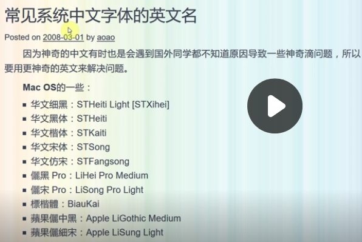

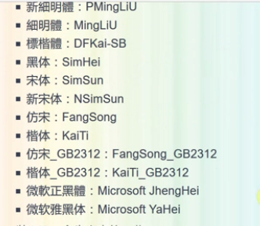

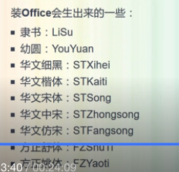

### 3.4.2 `font-size`

```html
<body>
    <p style="font-family: Georgia, 'Times New Roman', Times, serif; font-size: 18px;" >
        2020年6月28日上午19：49分 我正在通过 学堂在线 学习前端教程，当前看的内容是清华大学的 《前端攻城狮》。
    </p>
</body>
```


### 3.4.3 `font-style`

```html
<body>
    <p style="font-family: Georgia, 'Times New Roman', Times, serif; font-size: 18px; font-style: italic;">
        2020年6月28日上午19：49分 我正在通过 学堂在线 学习前端教程，当前看的内容是清华大学的 《前端攻城狮》。
    </p>
</body>
```


### 3.4.4 `font-weight`

```html
<body>
    <p style="font-family: Georgia, 'Times New Roman', Times, serif; font-size: 18px; font-style: italic;font-weight: bolder;">
        2020年6月28日上午19：49分 我正在通过 学堂在线 学习前端教程，当前看的内容是清华大学的 《前端攻城狮》。
    </p>
</body>
```

### 3.4.5 `font`

`font` 是对多个 `font-xx` 的简写方式，其要求如下：

* 必须要有 `font-size` 和 `font-family` 的对应取值，否则不生效
* `font-size` 的取值必须在 `font-family` 的前面
* 斜体、加粗等字体效果必须在 `font-size` 的取值之前 (斜体和加粗之间的顺序没有要求)
* 多个属性值之间使用空格分开

```html
 <body>
    <p style="font-family: Georgia, 'Times New Roman', Times, serif; font-size: 18px; font-style: italic;font-weight: bolder;">
        2020年6月28日上午19：49分 我正在通过 学堂在线 学习前端教程，当前看的内容是清华大学的 《前端攻城狮》。
    </p>

    <p style="font:italic bold 18px Georgia,'Times New Roman',Times,serif;">使用 font 合并多个 font-xx 属性，效果等价于上一个 p 元素中的内容</p>
</body>
```

## 3.5 text 相关的属性

* `color`
* `text-indent`
* `letter-spacing`
* `word-spacing`
* `text-decoration`
* `text-align`
* `vertical-align`
* `line-height`
* `text-transform`
* `text-shadow`
* `white-space`
* `text-overflow`
* `word-wrap`
* `word-break`

### 3.5.1 `color`

```html
<head>
    <meta charset="UTF-8" />
    <style>
        #p1 {
            border: 1px solid blue;
            color: red;
        }
        
        #p2 {
            /* 边框颜色默认与文本颜色一致 */
            border: 1px solid;
            /* 也可以使用 #ff0000 来标色颜色 */
            color: rgb(255, 0, 0);
        }
    </style>
</head>

<body>
    <p id="p1">text相关的属性1</p>
    <p id="p2">text相关的属性2</p>
</body>
```

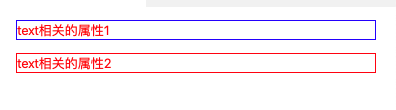


### 3.5.2 `text-indent` 缩进

```html
<head>
    <meta charset="UTF-8" />
    <style>
        p {
        	 /* 32px 即两个字符的宽度，也就是说一个字符占 16px */
            text-indent: 32px;
        }
    </style>
</head>

<body>
    <p id="p1">text相关的属性1</p>
    <p id="p2">text相关的属性2</p>
</body>
```

### 3.5.3 `letter-spacing` 字间距

```html
<head>
    <meta charset="UTF-8" />
    <style>
        p {
            letter-spacing: 2px;
        }
    </style>
</head>

<body>
    <p id="p1">text相关的属性1</p>
    <p id="p2">text相关的属性2</p>
</body>
```

### 3.5.4 `word-spacing` 词间距

```html
<head>
    <meta charset="UTF-8" />
    <style>
        p {
            /* 仅对英文单词有效 */
           word-spacing: 20px;
        }
    </style>
</head>

<body>
    <p id="p1">text相关的属性1</p>
    <p id="p2">attrs about text</p>
</body>
```

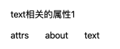

### 3.5.5 `line-height`

```html
<head>
    <meta charset="UTF-8" />
    <style>
        #p1 {
            border: 1px solid red;
            line-height: 30px;
        }
        
        #p2 {
            border: 1px solid;
        }
        
        h3 {
            background-color: yellow;
            /* 通过 line-height 可以实现标题的垂直居中；如果不加单位直接写 50 ，则默认是 字体大小的倍数  */
            line-height: 50px;
            font-size: 17px;
        }
    </style>
</head>

<body>
    <p id="p1">text相关的属性1text相关的属性1text相关的属性1text相关的属性1text相关的属性1text相关的属性1</p>
    <p id="p2">text相关的属性2text相关的属性2text相关的属性2text相关的属性2text相关的属性2text相关的属性2</p>
    <h3>
        3号标题
    </h3>
</body>
```

效果如下：

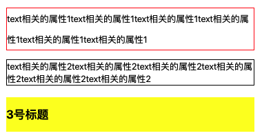

```html

<head>
    <meta charset="UTF-8" />
    <style>
        /* 16px/24px 中前面的 16px 表示字体大小，后面的 24px 表示行高 */
        
        #p1 {
            font: 16px/24px Georgia，Times, 'Times New Roman', serif;
        }
        
        #p2 {
            /* 16px/1.5 中前面的 16px 表示字体大小，后面的 1.5 表示行高是字体的1.5被，即 16*1.5=24 */
            font: 16px/1.5 Georgia，Times, 'Times New Roman', serif;
        }
    </style>
</head>

<body>
    <p id="p1">text相关的属性1text相关的属性1text相关的属性1text相关的属性1text相关的属性1text相关的属性1</p>
    <p id="p2">text相关的属性2text相关的属性2text相关的属性2text相关的属性2text相关的属性2text相关的属性2</p>
</body>
```

效果如下：

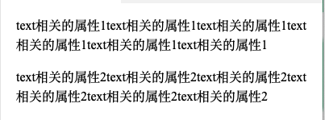

### 3.5.6 `text-decoration` 文本装饰线

文本装饰线取值|含义
---|---
`none` | 没有线
`underline` | 下划线
`overline` | 上划线
`line-through` | 中划线

```html

<head>
    <meta charset="UTF-8" />
    <style>
        #p1 {
            text-decoration: line-through;
        }
        
        #p2 {
           text-decoration: underline;
        }

        #p3{
            text-decoration: overline;
        }

        a{
            text-decoration: none;
        }
    </style>
</head>

<body>
    <p id="p1">中划线</p>
    <p id="p2">下划线</p>
    <p id="p3">上划线</p>
    <a href="www.baidu.com">这是没有下划线的超链接</a>
</body>
```

效果如下：

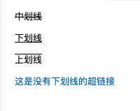

### 3.5.7 `text-align` 

通常作用于 块级元素，该属性可继承，其常用取值如下：

取值|含义
---|---
left | 左对齐
right | 右对齐
center | 居中对齐
justify | 两端对齐

```html

<head>
    <meta charset="UTF-8" />
    <style>
        #p1 {
            text-align: left;
        }
        
        #p2 {
            text-align: right;
        }
        
        #p3 {
            text-align: center;
        }
        
        #p4 {
            text-align: justify;
        }
    </style>
</head>

<body>
    <p id="p1">
        text-align对齐方式的介绍,分为左对齐、右对齐、居中对齐、两端对齐。
    </p>

    <p id="p2">这个是右对齐</p>

    <p id="p3"> 这个是居中对齐 </p>

    <p id="p4">
        两端对齐比较特殊。其特殊性在于，会把内容进行拉伸。使得字间距会变大。其中如果有图片，justify 对图片不生效。
        </img>
    </p>
</body>
```

效果如下：

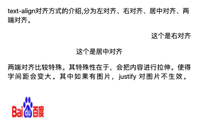

### 3.5.8 `vertical-align`

通常作用于某一个具体的行内元素或表格内的元素。

#### 3.5.8.1 baseLine 等字体相关知识

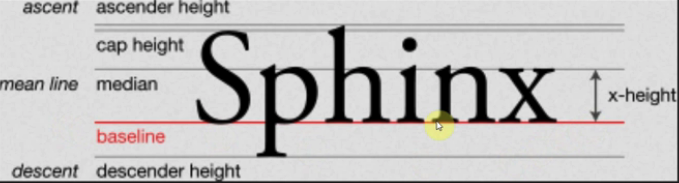

* baseline 基线，即英文书写时的基准参考线
*  mean line 中线，表示 `a` `n` `x` 等小个头字母的顶端线。中线和基线之间的高度即为 x-height
* cap height 大写顶端对齐线，即所有字母大写时的顶端基准线

字体的垂直对齐取值为 middle 时，是以的 baseline 和 median 之间的中分线为基准的，即 `x-height/2`  的位置。


#### 3.5.8.2 `vertical-align`

常见取值：

取值 | 含义| 备注
---|---|---
baseline | 与文本的基线对齐 ，默认值| 
top | 与文本所在行盒子的顶端对齐
bottom | 与文本所在行盒子的底部对齐
middle | 与文本的中间线对齐（即 baseline 和 median 的中分线）
`text-top` | 与文本的顶部对齐
`text-bottom` | 与文本的底部对齐

也可以取具体的数值，表示以默认的基线为基准向上偏移；也可以取百分比，表示以默认的基线为基准向上偏移 `百分比*行高` 。

```html
<head>
    <meta charset="UTF-8" />
    <style>
        span {
            background-color: rgba(201, 167, 17, 0.952);
        }
        
        #img1 {
            vertical-align: baseline;
        }
        
        #img2 {
            vertical-align: middle;
        }
        
        #img3 {
            vertical-align: bottom;
        }
        
        #img4 {
            vertical-align: top;
        }
    </style>
</head>

<body>
    <span>
        vertical-align: baseline;</img> vertical-align: baseline;
    </span>

    <p></p>

    <span>
        vertical-align: middle;</img> vertical-align: middle;
    </span>

    <p></p>

    <span>
        vertical-align: bottom;</img> vertical-align: bottom;
    </span>

    <p></p>

    <span>
        vertical-align: top</img> vertical-align: top
    </span>

</body>
```

效果如下：

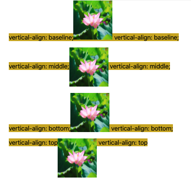


## 3.6 盒模型以及 `box-sizing`

[参考链接:盒模型](https://developer.mozilla.org/zh-CN/docs/Learn/CSS/Building_blocks/The_box_model)

### 3.6.1 盒模型

boder、margin、padding、width、height

CSS中组成一个块级盒子需要:

* `Content box`: 这个区域是用来显示内容，大小可以通过设置 width 和 height.
* `Padding box`: 包围在内容区域外部的空白区域； 大小通过 padding 相关属性设置。
* `Border box`: 边框盒包裹内容和内边距。大小通过 border 相关属性设置。
* `Margin box`: 这是最外面的区域，是盒子和其他元素之间的空白区域。大小通过 margin 相关属性设置。

示意图如下：


在标准模型中，如果你给盒设置 width 和 height，实际设置的是 content box。 padding 和 border 再加上设置的宽高一起决定整个盒子的大小。 

假设定义了 width, height, margin, border, and padding:

```html
.box {
  width: 350px;
  height: 150px;
  margin: 25px;
  padding: 25px;
  border: 5px solid black;
}
```

如果使用标准模型，宽度 = 410px (350 + 25 + 25 + 5 + 5)，高度 = 210px (150 + 25 + 25 + 5 + 5)，padding 加 border 再加 content box，然后就得到盒子的尺寸。如下图:


>margin 不计入实际大小 —— 当然，它会影响盒子在页面所占空间，但是影响的是盒子外部空间。盒子的范围到边框为止 —— 不会延伸到margin。

浏览器通常会默认为元素添加一个默认的 1em（即 16px) margin，如下图：

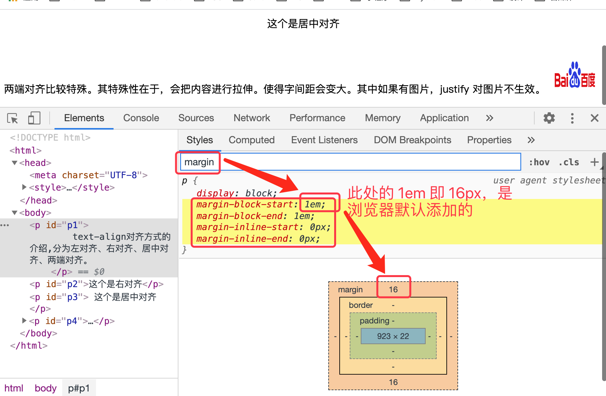

### 3.6.2 `box-sizing` 等的设置

#### 3.6.2.1 margin 的设置

代码 | 含义
---|---
`margin:32px;`  | 同时设置四个方向的 margin
`margin-top:32px;` | 设置顶部 margin 
`margin-bottom:32px;` | 设置底部 margin 
`margin-left:32px;`  | 设置左侧 margin 
`margin-right:32px;` | 设置右侧 margin
`margin:16px 32px 16px 32px;` | 同时设置上、右、下、左侧的 margin
`margin:16px 32px;` | 设置上下侧的 margin 为 16px，右左侧的 margin 为 32px

#### 3.6.2.2 border 的设置

代码 | 含义
---|---
`border:1px solid blue;` | 边框宽度为 1px, 颜色为 蓝色
`border-width:5px;` | 设置边框宽度
`border-style:dashed;` | 设置变宽样式为虚线（dotted 为点线）
`border-color:red` | 设置边框颜色
`border-bottom: 2px dashed red;` | 设置下方的边线为 2px宽，虚线，红色
`border-bottom-width: 3px;` | 设置下方边框的宽度
`border-bottom-style: dotted;` | 设置下方边框的样式
`border-bottom-color: red;` | 设置下方边框的颜色

#### 3.6.2.3 `box-sizing`

取值 | 含义
---|---
`content-box` | 默认值，盒子的大小会随着 padding 和 border 的变化而变化，此时的 width 和 height 仅指内容的宽高
`border-box` | 此时 width 和 height 是指盒子的宽高， 包含 border 和 padding，此时盒子的大小就不会变化

### 3.6.3 其他

`box-shadow` 、`border-radius` 、`border-image`

## 3.7 垂直外边距折叠（Collapsing margins）

[参考：collapsing-margins](https://www.w3.org/TR/CSS2/box.html#collapsing-margins)

常见有：紧邻兄弟元素外边距的折叠、父子元素外边距的折叠等

```html
<head>
    <meta charset="UTF-8" />
    <style>
        ul>li {
            margin-top: 20px;
            margin-bottom: 20px;
        }
    </style>
</head>

<body>
    <ul>
        <li>垂直外边距折叠——紧邻兄弟元素</li>
        <li>垂直外边距折叠——紧邻兄弟元素</li>
        <li>垂直外边距折叠——紧邻兄弟元素</li>
    </ul>
</body>
```

显示效果：

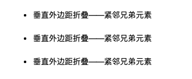

通过浏览器查看合并效果，如下图：

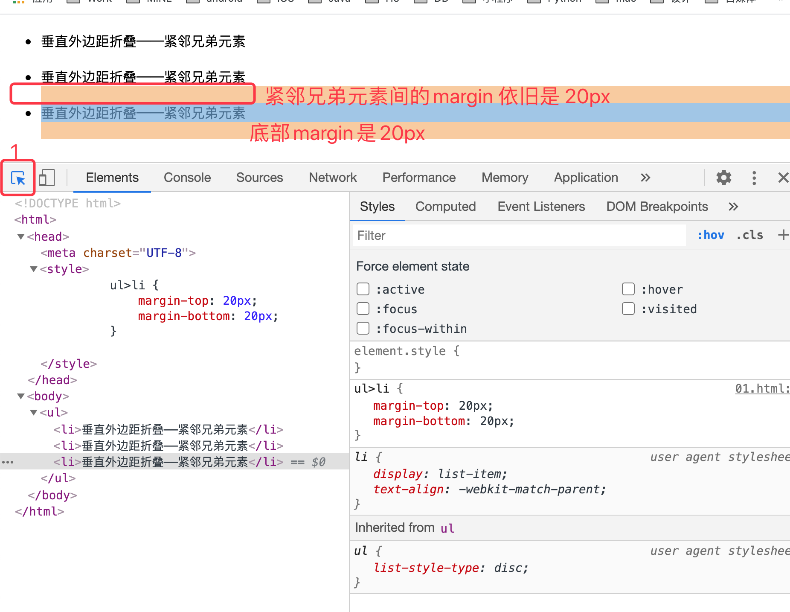

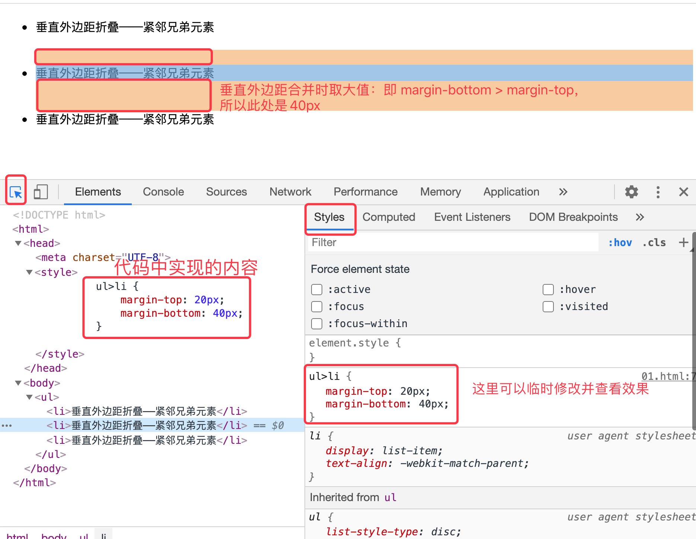

## 3.8 display 属性

[Web 开发技术/CSS（层叠样式表）/display](https://developer.mozilla.org/zh-CN/docs/Web/CSS/display)

重点掌握的取值有：`inline`、`block`、`inline-block`、`none`

### 3.8.1 通过 display 转换行内元素和块级元素

* 转为 block 块级元素1

```html
<head>
    <meta charset="UTF-8" />
    <style>
        #a3 {
            display: block;
        }
    </style>
</head>

<body>
    <a id="a1" href="">这是一个 a 标签1</a>
    <a id="a2" href="">这是一个 a 标签2</a>

    <a id="a3" href="">这是一个 a 标签3</a>

    <a id="a4" href="">这是一个 a 标签4</a>
    <a id="a5" href="">这是一个 a 标签5</a>

</body>
```

`a` 标签是一个行内元素，也就是说，默认情况下，多个 `a` 标签是在一行显示的。

我们为上面的 `a3` 设置了 `display:block` 之后，`a` 就变成了块级元素，也就是说，id 为 a3 的 `a` 标签会独占一行，如下图：

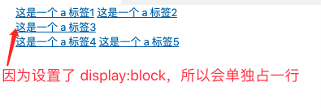

* 转为 block 块级元素2 

```html
<head>
    <meta charset="UTF-8" />
    <style>
        #a3 {
            /* 只有将行内元素变为 block 块级元素后，才可以设置块级元素的相关属性：宽、高、margin 等 */
            display: block;
            width: 250px;
            height: 80px;
            background-color: aquamarine;
            margin: 20px;
        }
    </style>
</head>

<body>
    <a id="a1" href="">这是一个 a 标签1</a>
    <a id="a2" href="">这是一个 a 标签2</a>

    <a id="a3" href="">这是一个 a 标签3</a>

    <a id="a4" href="">这是一个 a 标签4</a>
    <a id="a5" href="">这是一个 a 标签5</a>
</body>
```

效果如下：

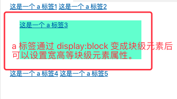

* 转为 `inline-block` 行内块元素

```html

<head>
    <meta charset="UTF-8" />
    <style>
        #a3 {
            /* 只有将行内元素变为 block 块级元素后，才可以设置块级元素的相关属性：宽、高、margin 等 */
            display: inline-block;
            width: 250px;
            height: 80px;
            background-color: aquamarine;
            margin: 20px;
        }
    </style>
</head>

<body>
    <a id="a1" href="">这是一个 a 标签1</a>
    <a id="a2" href="">这是一个 a 标签2</a>

    <a id="a3" href="">这是一个 a 标签3</a>

    <a id="a4" href="">这是一个 a 标签4</a>
    <a id="a5" href="">这是一个 a 标签5</a>
</body>
```

效果如下：

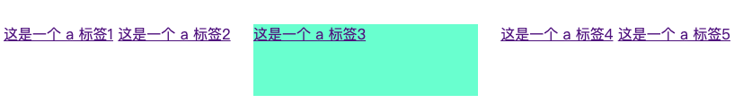

* 通过 `display:none` 实现隐藏

```html
<head>
    <meta charset="UTF-8" />
    <style>
       #li3{
        	/* 为块级元素设置 none 后，可以实现隐藏 */
           display: none;
       }
    </style>
</head>

<body>
    <ul>
        <li>第1行</li>
        <li>第2行</li>
        <li id="li3">第3行</li>
        <li>第4行</li>
    </ul>
</body>
```

效果如下:

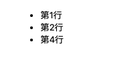

### 3.8.2 查看 display

查看 display 的方式如下：

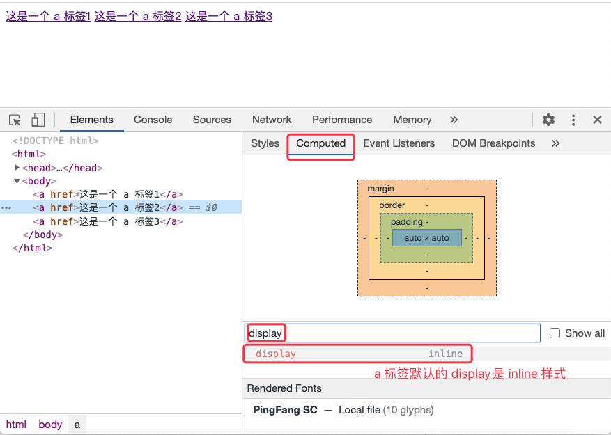

从浏览器临时修改 display 并查看效果：

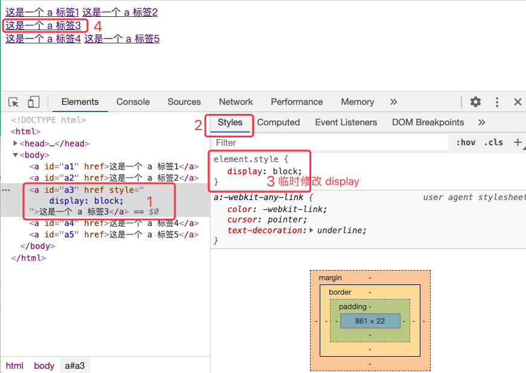

## 3.9 背景相关的属性

属性 | 含义
---|---
`background-color: ` | 背景颜色
`background-image` | 背景图片
`background-repeat` | 背景重复平铺模式
`background-position` | 背景的位置
`background-size` | 背景大小
`background` | 综合写法

### 3.9.1 `background-repeat` 和 `background-position`

```html
<head>
    <meta charset="UTF-8" />
    <style>
        body {
            height: 300px;
            /* 将背景设置为在线图片 */
            background-image: url('http://img5.imgtn.bdimg.com/it/u=1575754275,563397194&fm=26&gp=0.jpg');
            /* repeat--平铺(默认值)，no-repeat 不平铺 */
            background-repeat: no-repeat;
            /* 第一个值还可以是 left、right, 第二个值还可以为 top、bottom */
            background-position: center center;
            /* 相对于当前容器 x 轴 30%,y 轴 50% 的位置   */
            /* background-position: 30% 50%; */
            /* 还可以是相对于左上角的具体坐标值 */
            /* background-position: 100px 100px; */
        }
    </style>
</head>

<body>
</body>
```

效果如下：

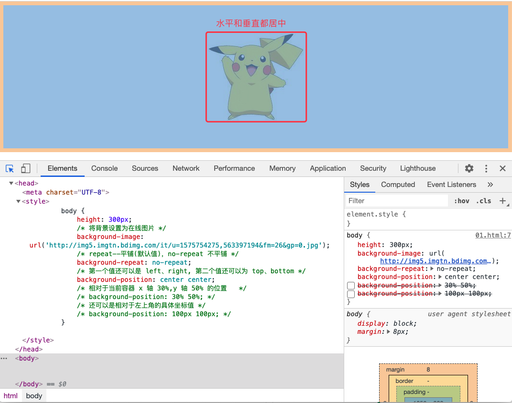

### 3.9.2 `background-size` 

取值|含义
---|---
`background-size: auto;` | 默认值，图片有多大就显示多大
`background-size: contain;` | 等比缩放，直到宽高中有一项满屏（图片还能显示全）
`background-size: cover;` | 等比缩放，宽高都铺满为止（图片可能会显示全）

还可以取百分比或具体数值，如下：

```html
<head>
    <meta charset="UTF-8" />
    <style>
        body {
            height: 300px;
            background-image: url('http://img5.imgtn.bdimg.com/it/u=1575754275,563397194&fm=26&gp=0.jpg');
            background-repeat: no-repeat;
            background-position: center center;
            /* 指定具体数值 */
            /* background-size: 100px 300px; */
            /* 基于控件宽高尺寸设置背景的大小 */
            background-size: 50% 30%;
        }
    </style>
</head>

<body>
</body>
```

运行效果如下：

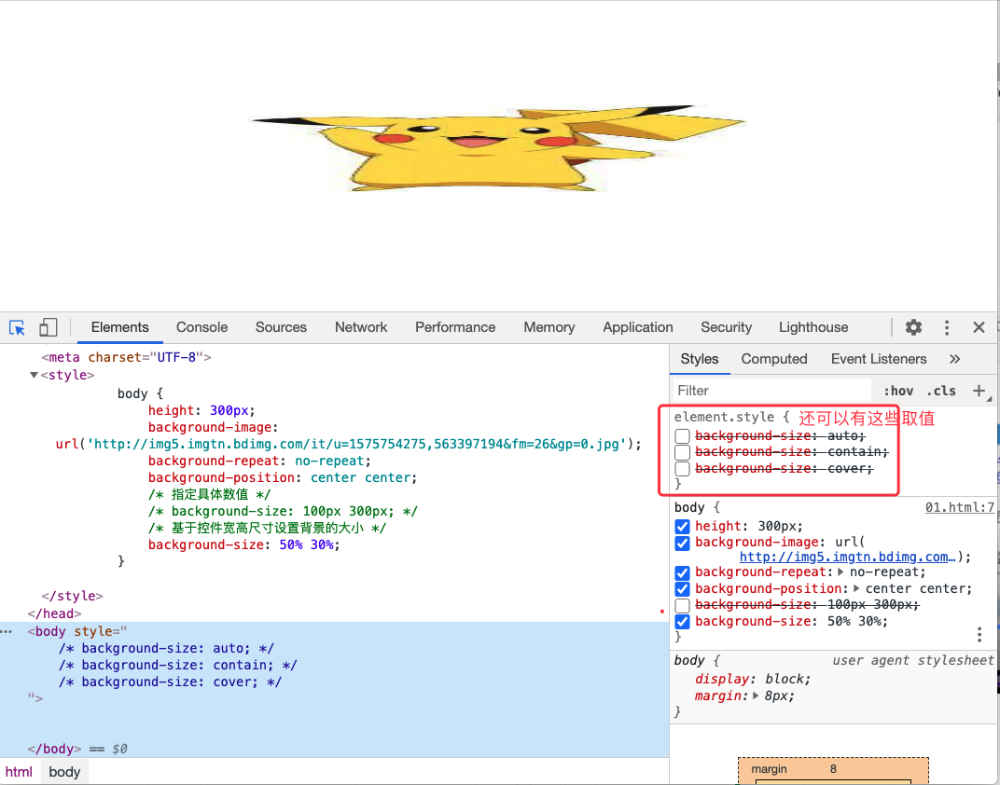

### 3.9.3 ``background`

```html
<head>
    <meta charset="UTF-8" />
    <style>
        body {
            height: 300px;
            /* 分别设置了 image、repeat、position、color */
            background: url('http://img5.imgtn.bdimg.com/it/u=1575754275,563397194&fm=26&gp=0.jpg') no-repeat center center #ffc;
            /* background-size 需要单独定义 */
            background-size: contain;
        }
    </style>
</head>

<body>
</body>
```

运行效果如下：

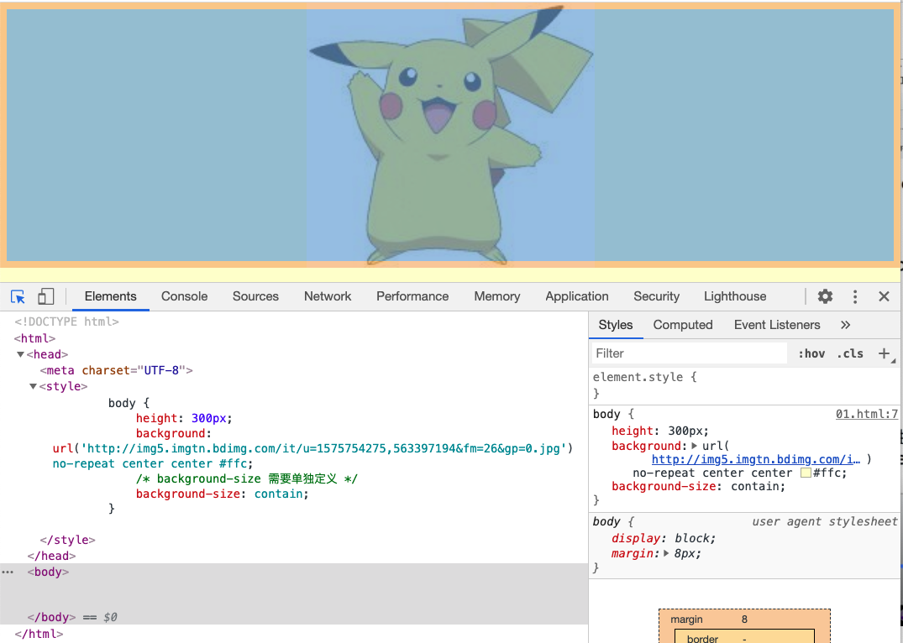

### 3.9.4 其他背景相关的属性

`background-attachment`、`background-clip` 、`background-origin` 
