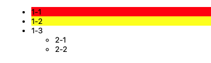
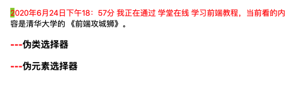
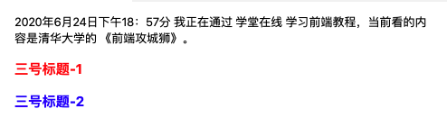
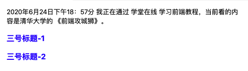
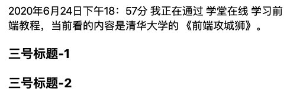

## 3.1 CSS 规则基本语法

### 3.1.1 HTML 中应用 CSS 的三种方式

* 文档内样式，即在 `<head>` 元素中添加 `<style>`  元素，只对当前文档生效。示例如下：

```html
<head>
    <meta charset="UTF-8" />
    <title>这是文档标题</title>
    <style>
        a{
            color: yellowgreen;
        }
    </style>
</head>

<body>
    <a href="www.baidu.com" target="_blank"> 点击跳转到百度</a>
</body>
```

* 元素的行内样式，即通过元素的 `style` 属性来实现，只对当前元素生效。示例如下：

```html
 <a href="www.baidu.com" style="color: red;"> 点击跳转到百度</a>
```

* 外部样式文件，即将 `<style>` 内容抽取到单独的样式文件中（css 文件）并使用 link 引用。引用方式如下：

```html
<head>
    <meta charset="UTF-8" />
    <link rel="stylesheet" type="text/css" href="xxx.css"/>
</head>
```

### 3.1.2 CSS 基本语法

```html
选择器/选择器组{
	属性1:属性值1;
	属性2:属性值2;
}
```

选择器组中如果有一项选择器出错，则该样式无效。如：

```css
/* 这是一组选择器，ol后面多了一个点，所以该样式既不会对 ul 生效，也不会对 ol 生效 */
ul,ol..info{
    list-style-type: none;
}
```

## 3.2 CSS 选择器

[参考：https://www.w3.org/TR/selectors/#selectors](https://www.w3.org/TR/selectors/#selectors)

### 3.2.1 简单选择器（Type、ID、Class）

包括 Type 选择器、ID 选择器、Class 选择器。

* Type 选择器即元素/标签选择器，匹配的是元素/标签名称，如：

```html
a {
    color: red;
}
```
* ID 选择器，匹配的是元素/标签的 ID 名称，如：

```html
<head>
    <style>
        /* #id名称表示该样式匹配指定 id  */
        #baidu {
            color: green;
        }
    </style>
</head>

<body>
    <!--通过 id 属性指定 id 名称 -->
    <a id="baidu" href="www.baidu.com" target="_blank"> 点击跳转到百度</a>
</body>
```
* class 选择器，匹配元素/标签的类名。如：

```html
<head>
    <meta charset="UTF-8" />
    <style>
        /* 使用 .类名 进行匹配 */
        .outline {
            color: red;
            font-weight: bold;
            font-style: italic;
            text-decoration: underline;
        }
        /* 匹配类名中同时包含 outline 和 abc 的元素 */
        .outline .abc {
            background-color: aquamarine;
        }
    </style>
</head>

<body>
    <!-- 使用 class 属性指定类名 -->
    <a class="outline" href="www.baidu.com" target="_blank"> 点击跳转到百度</a>
    <p class="outline">普通文本</p>
    <strong class="outline">强调文本</strong>
    <!-- 可以指定多个类名 -->
    <h3 class="outline abc">标题3</h3>
</body>
```

### 3.2.2 属性选择器

属性选择器| 含义| 备注
---|---|---
`E[foo]` | 选取带有 foo 属性的 E 标签 | 
`E[foo="bar"]` | 选取带有 foo 属性，且其值为 bar 的 E 标签 | id="bar" 
`E[foo~="bar"]` | 选取带有 foo 属性，且其值包含 bar , 并且多个值之间使用空格间隔的 E 标签 | class="bar bar1" 
`E[foo^="bar"]` |  选取带有 foo 属性，且其值以字符串 bar 开头的 E 标签 | 可选取 bar1
`E[foo$="bar"]` | 选取带有 foo 属性，且其值以字符串 bar 结尾的 E 标签 | 可选取 1bar
`E[foo*="bar"]` | 选取带有 foo 属性，且其值包含字符串 bar 的 E 标签 | 可选取 xbar   bar1  1bar1
`E[foo|="en"]` | 选取带有 foo 属性，且其值以 en 开头，或者以 en 开头并且用 `-` 连接的 E 标签 | 可选取 en，en-US，en-scouse


* 选中带有 `disabled` 属性的 input 标签

```html
<head>
    <meta charset="UTF-8" />
    <style>
        input[disabled] {
        	/* 光标放到该输入框时会显示一个禁用的标识 */
            cursor: not-allowed;
        }
    </style>
</head>

<body>
    <label>
    留言：<input type="text" disabled/>
    </label>
    <label>
    联系方式：<input type="text"/>
    </label>
</body>
```

* 选取包含 href 属性，且其值以 `#` 开头的 a 元素

```html
<head>
    <meta charset="UTF-8" />
    <style>
        a[href^="#"] {
            background-color: yellow;
        }
    </style>
</head>

<body>
    <footer>
        <p>
            <a href="#">回到文档顶部</a>
        </p>

        <p>
            <a href="#edu-info">跳转到 id 为 edu-info 的元素位置——页面内锚点</a>
        </p>
        <p>
            <a href="https://www/baidu/com">跳转到百度</a>
        </p>
    </footer>
</body>
``` 

### 3.2.3 上下文选择器

基于 DOM 中的元素之间的排列关系：子元素、父元素、后代元素、兄弟元素、紧邻兄弟元素

上下文选择器| 含义 
---|---
`e1 e2` | 选取 e1 的后代元素中的 e2 元素 (即 e1 的下级、下下级、下下下级... 中的 e2 元素)
`e1>e2` | 仅选取 e1 中的子元素 e2（即 e1 下一级中的 e2 元素）
`e1~e2` | 仅选取 e1 后面的兄弟元素 e2。（即与 e1 平级的 e2 元素，且 e1 在前，e2 在后）
`e1+e2` | 仅选取 e1 后面的紧邻兄弟元素。

 `.className`  的完整写法为 `*.className` ，是 class 选择器，选中的是 class 名称为  className 的元素。

`[disabled]` 的完整写法为 `*[diabled]` , 是属性选择器，选择包含 disabled 属性的元素。

```html
<head>
    <meta charset="UTF-8" />
    <style>
        /* 选取 id 为 cusID 的 ul 元素，然后选取其所有后代元素中的 li 元素 */
        ul#cusID li {
            color: blue;
        }
        /* 选取 id 为 cusID 的 ul 元素，然后选取其子元素中的 li 元素 */
        ul#cusID>li {
            background-color: yellow;
        }
        /* 选取 id 为 cusID 的 ul 元素，然后选取其子元素的后代元素中的 li 元素  */
        ul#cusID>* li {
            background-color: aquamarine;
        }
    </style>
</head>

<body>
    <ul id="cusID">
        <li>1-1</li>
        <li>1-2</li>
        <li>1-3</li>
        <ul>
            <li>2-1</li>
            <li>2-2</li>
            <ul>
                <li>2-1</li>
                <li>2-2</li>
            </ul>
        </ul>
    </ul>
</body>
``` 

### 3.2.4 伪类选择器

伪类选择器分为：结构化的伪类选择器 和 UI伪类选择器。

#### 3.2.4.1 结构化的伪类选择器

* `e:first-child` : 当 e 元素是其父元素的第一个子元素时，选中该元素。
* `e:last-child` : 当 e 元素是其父元素的最后一个子元素时，选中该元素。
* `e:nth-child(n)`: 当 e 元素是子父元素的第 n 个子元素时，选中该元素。

示例如下：

```html
<head>
    <meta charset="UTF-8" />
    <style>
        ul#cusID>li:first-child {
            background-color: red;
        }
        
        ul#cusID>li:last-child {
            background-color: aquamarine;
        }
        /* 仅更改偶数行的背景色 */
        
        ul#cusID>li:nth-child(2n) {
            background-color: yellow;
        }
    </style>
</head>

<body>
    <ul id="cusID">
        <li>1-1</li>
        <li>1-2</li>
        <li>1-3</li>
        <ul>
            <li>2-1</li>
            <li>2-2</li>
        </ul>
    </ul>
</body>
```

效果如下：



#### 3.2.4.2 UI 伪类选择器

当元素处于某种特殊的交互状态时被选中。如：

* `a:visited` 表示已访问过的链接
* `a:link` 表示未访问过的链接
* `e:hover` 表示鼠标悬停在 e 元素上时的状态
* `e:focus` e 元素获取焦点
* `e:checked` e 元素被选中
* `e:active` e 元素被激活
* `e:target` 通过锚点等跳转到 e 元素时


```html

<head>
    <meta charset="UTF-8" />
    <style>
        a:visited {
            background-color: aquamarine;
        }
        
        a:link {
            background-color: yellow;
        }
        
        a:hover {
            background-color: wheat;
            color: red;
        }
    </style>
</head>

<body>
    <a href="#">回到页面顶部</a>
    <p></p>
    <a href="http://www.baidu.com">百度</a>
</body>
```

### 3.2.5 伪元素选择器

* `E::first-letter` 选中 E 元素中的第一个字符（E 既可以表示一个具体元素，也可以是其他的选择器规则）
* `E::first-line` 选中第一行
* `E::before` 在 E 元素之前
* `E::after` 在 E 元素之后

```html
<head>
    <meta charset="UTF-8" />
    <style>
        p::first-line {
            color: red;
        }
        
        p::first-letter {
            background-color: yellowgreen;
        }
        
        h3::before {
            /* 插入内容 --- */
            content: "---";
            /* 该颜色仅对新插入的内容生效 */
            color: red;
        }
    </style>
</head>

<body>
    <p>
        2020年6月24日下午18：57分 我正在通过 学堂在线 学习前端教程，当前看的内容是清华大学的 《前端攻城狮》。

        <h3>伪类选择器</h3>
        <h3>伪元素选择器</h3>
    </p>
</body>
```

运行效果如下：



## 3.3 CSS 的级联 Cascading 和 继承

### 3.3.1 级联的规则

级联 Cascading 算法即 CSS 的优先级算法，当多个选择器同时指向一个元素时，优先选用那个选择器。具体如下：`ID > Class > Type`。

#### 3.3.1.1按 `I-C-T` 规则匹配优先级

实际应用中，一个选择器中可能是 ID、Class 和 Type 的组合，这种情况下，就遵循 `I-C-T` 的规则。此处的 `I` 指 ID 选择器的个数，`C` 指 Class选择器、属性选择器、伪类选择器的总个数，`T` 指 Type 选择器和伪元素选择器的个数。 两个组合选择器比较时，会先比较 `I`，`I` 值越大，则优先级越高；如果 `I` 一致，则继续比较 `C`, 同理 `C` 值大的优先级高；在 `C` 也一致的情况下，再比较 `T`。

> `I-C-T` 规则称为特指度，即 specifity

```html
<head>
    <meta charset="UTF-8" />
    <style>
        /* I-C-T : 0-1-0 */
       .cusH3{
           color: red;
       }

       /* I-C-T : 0-0-1 */
       h3{
           color: blue;
       }

    </style>
</head>

<body>
    <p>
        2020年6月24日下午18：57分 我正在通过 学堂在线 学习前端教程，当前看的内容是清华大学的 《前端攻城狮》。

        <!-- 在 style 中 .cusH3 样式的 I-C-T 大于 h3 样式，所以。。。 -->
        <h3 class="cusH3">三号标题-1</h3>
        <h3>三号标题-2</h3>
    </p>

</body>
```

运行效果如下：




**当 `I-C-T` 一致时，默认情况下，后定义（后加载）的样式优先级高。**


#### 3.3.1.2 `!important` 指定优先加载

我们可以通过 `!important`  指定优先加载某个选择器中，如下：

```html
<head>
    <meta charset="UTF-8" />
    <style>
        /* I-C-T : 0-1-0 */
        .cusH3 {
            color: red;
        }
        /* I-C-T : 0-0-1 */
        h3 {
            color: blue !important;
        }
    </style>
</head>

<body>
    <p>
        2020年6月24日下午18：57分 我正在通过 学堂在线 学习前端教程，当前看的内容是清华大学的 《前端攻城狮》。

        <!-- 在 style 中 .cusH3 样式的 I-C-T 大于 h3 样式，所以。。。 -->
        <h3 class="cusH3">三号标题-1</h3>
        <h3>三号标题-2</h3>
    </p>

</body>
```

运行效果如下：



在上述示例代码中，虽然 `.cusH3` 样式的 `I-C-T` 大于 `h3` 样式，但是，后者指定了 `!important`，所以，最终生效的还是 `h3` 样式。

> 如果都加了 `!important` ，则仍然按照 `I-C-T` 规则判断优先级。

#### 3.3.1.3 按样式的来源匹配

样式的来源分为：浏览器默认的样式、用户设置的样式、开发者代码中声明的样式。

都没有加 `!important` 时，从低到高依次为：浏览器默认样式 > 用户设置的样式 >开发者代码中声明的样式

如果都加了 `!important`，从高到低依次为：开发者代码中声明的样式 > 用户设置的样式 > 浏览器默认样式


### 3.3.2 继承的规则

如果子元素设置了样式，则使用该样式；否则，使用其父元素的样式，这就是样式的继承。

```html
<head>
    <meta charset="UTF-8" />
    <style>
        body {
            font-size: 18px;
        }
    </style>
</head>

<body>
    <p>
        2020年6月24日下午18：57分 我正在通过 学堂在线 学习前端教程，当前看的内容是清华大学的 《前端攻城狮》。

        <!-- 在 style 中 .cusH3 样式的 I-C-T 大于 h3 样式，所以。。。 -->
        <h3 class="cusH3">三号标题-1</h3>
        <h3>三号标题-2</h3>
    </p>
</body>
```

运行效果如下：



## 3.4 font 相关的属性

TODO V2.1

## 3.5 text 相关的属性

## 3.6 `text-align` 和 `vertical-align`

## 3.7 盒模型以及 `box-sizing`

## 3.8 垂直外边距折叠问题

## 3.9 display 属性

## 3.10 背景相关的属性