## 6.1 JavaScript 的基本知识

> 该视频内容是基于 《JavaScript高级程序设计》讲解的，需要参考该书补充相关知识点。

### 6.1.1 JS 的模块划分

JS 可以分为三个模块：

* ECMAScript , 即 js 本身。通常所说的 ES5 ，即 ECMAScript 5；ES6 即 ECMAScript 2015，发布于 2015 年，在 ES5 的基础上添加了大量的语法和功能。
* DOM，即针对 HTML 编程的接口标准
* BOM，即 浏览器对对象操作的接口，操作的是浏览器本身，如浏览器的位置、大小等。

> 该视频教程中除非特殊说明，否则默认都是 ES 5 

### 6.2 浏览器内核划分

浏览器内容可以分为两块：

* 渲染引擎，如 Blink 、Webkit
* JS 引擎，如果 V8、Chakra

### 6.3 常用工具

* Visual Studio Code , 可用于编辑 C++、C# 等面向对象的语言
* Chrome DevTools ，即 Chrome 浏览器中的开发工具
	* Mac 下打开开发工具的快捷键是：`Cmd + Shift + c`
	* Win 下打开开发工具的快捷键是：	`Ctrl + Shift + c`

### 6.4 注意事项

#### 6.4.1 标识符

即 变量、函数的名称。

* 第一个字符必须是一个字⺟、下划线 `_` 或一个美元符号 `$`
* 其他字符可以是字⺟、下划线、美元符号或数字

> UNDERSCORE.JS 、jQuery

#### 6.4.2 strict mode

即开启严格模式（是 ES 中增加的）。在代码中添加 `"use strict";` 即表示开启严格模式。

有两种使用方式：

* 全局使用。在文件一开始的时候就声明该语句，如下：

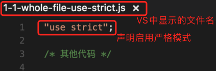

* 局部使用。在某个函数内部声明，如下：

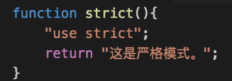


#### 6.4.3 不要省略 `;` 和 `{}`

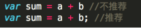

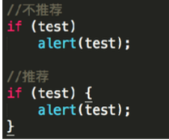


#### 6.4.4 局部变量和全局变量

定义局部变量时，前面需要前缀 `var` 关键字，没有该关键字即认为其是全局变量。 

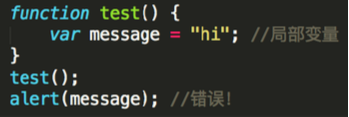

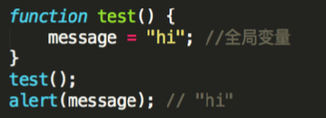


## 6.2 JavaScript 数据类型

### 6.2.1 数据类型概述

有五种基本数据类型：`Undefined`、`Null`、`Boolean`、`Number`、`String`

一种引用数据类型：`Object`

ES 中不支持自定义类型。

### 6.2.2 `typeof` 运算符

`typeof` 用于检测 JS 中的变量的数据类型。

有两种使用格式：`typeof a` , `typeof(a)`

返回值包括：`"undefined"`、`"boolean"`、`"string"`、`number`、`object`、`function`、

### 6.2.3 数据类型介绍

#### 6.2.3.1 Undefined

Undefined 是一个特殊的值，当一个变量声明但未初始化时，就会被赋予 `undefined` 值。如：

```javascript
var message;
// true
alert(message == undefined);

//true
typeof(message) == "undefined";
```

#### 6.2.3.2 Null

* 空对象指针
* 当一个变量是为了保存一个**对象**，但没办法立即初始化的时候，应该为之分配⼀个 null 值。


#### 6.2.3.3 Boolean

其他数据类型向布尔值的转化规则:

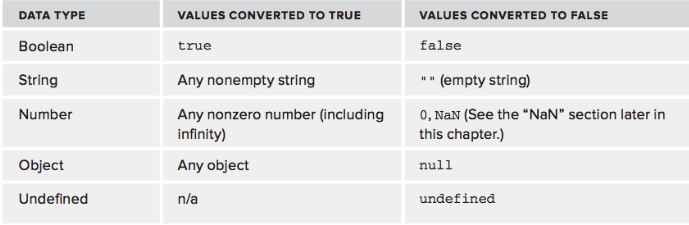

* 空字符串会转换为 false
* 非 0 的 Number 类型会转化为 true
* Object 非 null 即为 true
* Undefined 在任何情况下都会转换为 false

#### 6.2.3.4 Number 和 String

首先要介绍一个特殊的值：`NaN`, 是 Not a Number 的简称，是 Number 中的一个值。

* 任何涉及 `NaN`的操作都会返回 `NaN`
* `NaN` 与任何值都不相等，包括 `NaN` 本身

数据类型转化的函数：

`Number()`、 `parseInt()`、 `parseFloat()`

`String()`、 `toString`

#### 6.2.3.5 Object 

创建 Object 实例的方法如下：

```javascript
// 推荐写法
var obj = new Object(); 
// 不推荐的写法
var obj = new Object();
```

Object 类型所具有的任何属性和⽅方法也同样存在于更更具体的对象中。

* `constructor` 保存着用户构建当前对象的函数
*  `hasOwnProperty(propertyName)` 检查当前对象实例中是否存在指定的属性（而不是判断实例原型)
*  isPrototypeOf(object) 
*  propertyIsEnumerable(propertyName) 
*  toLocaleString()
* toString() 
* valueOf()

### 6.2.4 代码演示

#### 6.2.4.1 typeof

* 通过 Vs 编辑代码，并通过其内置的控制台执行 js 文件:

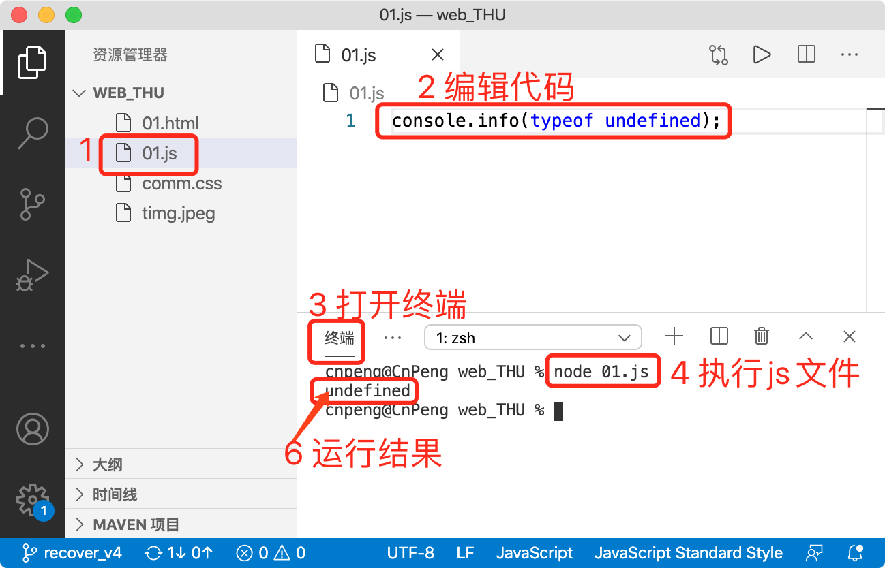

> 上图中执行 js 文件时使用了 node 命令，这是 js 本地的运行环境。

* 通过 Chrome DevTools 编辑并执行:

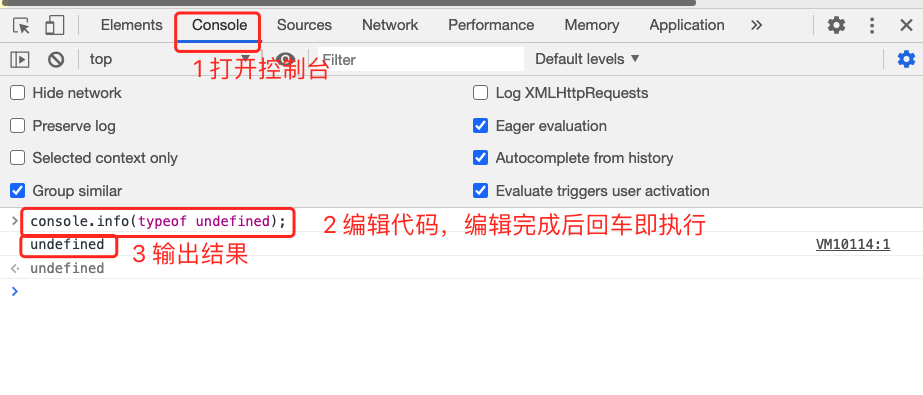

* 以 Vs 的调试模式运行js代码

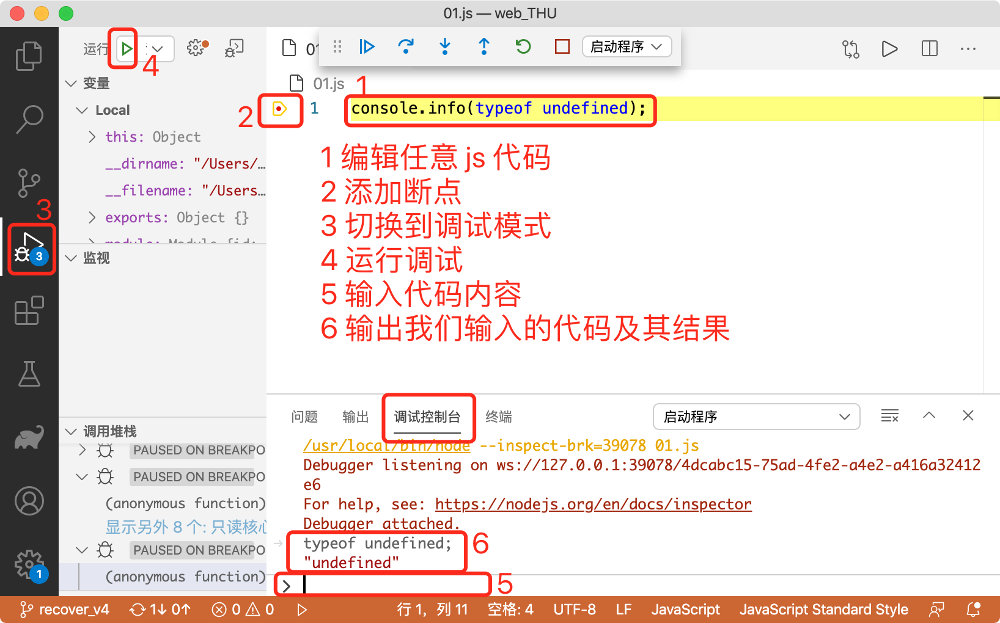


命令内容|输出结果|备注
---|---|---
`typeof undefined; `| "undefined" |
`typeof 1` | "number" | 
`typeof true` | "boolean" | 
`typeof "javascript"` | "string" | 
`typeof (new Object());` | "object" | 
`typeof (new Array()); `| "object" | typeof 仅能侦测到 object 一级，无法确认是哪一种 object
`typeof (function(){}); `| "function" | 
`typeof null; `| "object" |  null 是一个空对象，所以会得到 “object”

如上表，`typeof ()` 仅能得到六种字符串结果：`"undefined" `、`"number"`、`"string"`、`"boolean"`、` "object" `、`"function"`


#### 6.2.4.2 类型转化

##### 6.2.4.2.1 Boolean 类型的转化

命令|结果|备注
---|---|---
`Boolean(0);` | false | Number 类型转换为 Boolean 时，非 0 为 true
`Boolean(1); `| true | Number 类型转换为 Boolean 时，非 0 为 true
`Boolean(""); `| false | String 类型转换为 Boolean 时，非空串为 true
`Boolean("javaScript");` | true |  String 类型转换为 Boolean 时，非空串为 true
`Boolean(null); `| false | Object 类型转换为 Boolean 时，非 null 为 true
`Boolean(new Object());` | true  | Object 类型转换为 Boolean 时，非 null 为 true
`Boolean(new Array());` | true  | Object 类型转换为 Boolean 时，非 null 为 true (Array 也是一种对象)
`Boolean(undefined);` | false | undefined 类型转换为 Boolean 时为 false

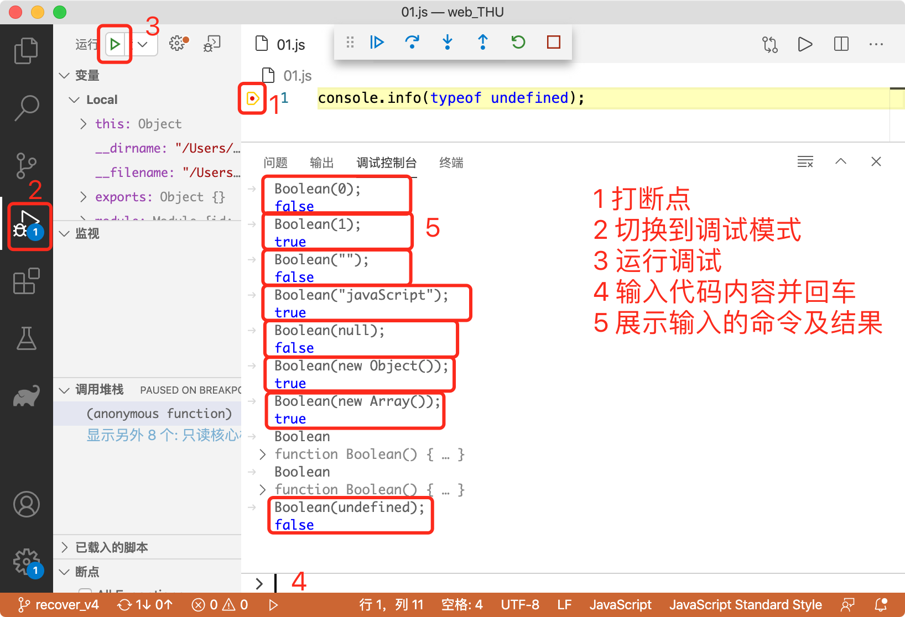

##### 6.2.4.2.2 Number 类型的转化

使用 `parseInt()、parseFloat()` 等函数

命令|结果|备注
---|---|---
`parseInt(""); `| NaN | 空串转换得到 NaN (not a number)
`parseInt("12abc"); `| 12 | 以数字开头的字符串仅截取其数字部分
`parseInt("a12b")` | NaN | 非数字开头的字符串转换得到 NaN
`parseInt("0xA");` | 10 | `0x` 开头的字符串代表 16 进制，会先转换为 16 进制的数值，然后再转换为 10 进制数值
`parseInt(0xA);` | 10 | 16 进制数值转为 10 进制
`parseInt(10,16);` | 16 | 第一个参数表示数值，第二个表示进制；即将 16 进制的 10 转换为 10 进制数
`parseInt(10,8);` | 8 | 第一个参数表示数值，第二个表示进制；即将 8 进制的 10 转换为 10 进制数
`parseInt(22.5);` | 22 | 将 Float 类型的数值转换为 Int 时，仅保留小数点前面的数据


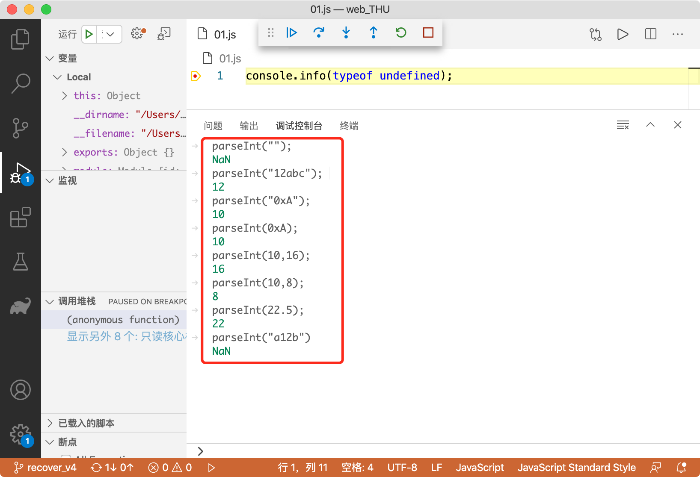

##### 6.2.4.2.3 String 类型的转换

如果值有 `toString()` 时直接调用该方法即可转换为 String。如：

```javascript
var a = new Object(); 
// 输出结果："[object Object]"
a.toString();
```

命令 | 结果
--- |---
`String(1);` | "1"
`String(null);` | "null"
`String(undefined);` | "undefined"

## 6.3 JavaScript 运算符

### 6.3.1 一元运算符

#### 6.3.1.1 递增、递减操作符
* `++` ，`--`

#### 6.3.1.2 一元加和减操作符

一元加和一元减操作符放在数值前面，如：

```javascript
var num = 25;
// num 依旧是 25.
num = +25;
```

一元加操作符

* 放在数值前面，对数据不会产生影响；
* 放在非数值前面，会向 `Number()` 函数一样对该值进行转换。即，布尔值 true 和 false 会被转换为 1 和 0 ；字符串值以数字开头时会截取数字部分，非字符串开头时得到 NaN ；对象类型数据则先调用他们的 `valueof()` 或 `toString()` 方法，然后再转换。

```javascript
var s1 = "01";
var s2 = "1.1";
var s3 = "z";
var b = false;
var f = 1.1;
var o = {
    valueOf: function () {
        return -1;
    }
};

// 得到 1
s1 = +s1;
// 得到 1.1 
s2 = +s2;
// 得到 NaN 
s3 = +s3
// 得到 0
b = +b;
// 依旧是 1.1
f = +f;
// 得到 -1 
o = +o;
```

一元减操作符，主要用于表示负数。如 :

```javascript
var num = 25;
num = -num;
```

在将一元减操作符

* 放在数值前面时，该数值会变成负数
* 放在非数值前面时，会先按照一元加操作的规则转换为数值，然后再取该数的负值。示例如下：

```javascript
var s1 = "01";
var s2 = "1.1";
var s3 = "z";
var b = false;
var f = 1.1;
var o = {
    valueOf: function () {
        return -1;
    }
};

// 得到 -1
s1 = -s1;
// 得到 -1.1 
s2 = -s2;
// 得到 NaN 
s3 = -s3
// 得到 0
b = -b;
// 依旧是 -1.1
f = -f;
// 得到 1 
o = -o;
```

### 6.3.2 布尔运算符

#### 6.3.2.1 逻辑非

由操作符 `!` 表示，会**先将它的操作数转换为一个布尔值，然后再对其求反**。也就是说，其遵循如下规则：

* 如果操作数是一个对象，返回 false 
* 如果操作数是一个空字符串返回 true, 如果是一个非空字符串则返回 false 
* 如果操作数是 0 返回 true; 如果是非 0 数值 (含 Indinity )，则返回 false 
* 如果操作数是 null 返回 true
* 如果操作数是 NaN 返回 true
* 如果操作数是 undefined，返回 true 

基于以上规则，`!!` 的作用等价于对操作数执行 `Boolean()` 转换。

#### 6.3.2.2 逻辑与

逻辑与操作符使用 `&&` 表示，有两个操作数。

逻辑与操作符可以应用于任何类型的操作数。当其中一个操作数不是布尔值时，逻辑与的操作就不一定会返回布尔值，具体遵循如下规则:

* 如果第一个操作数是对象，则返回第二个数
* 如果第二个操作数是对象，则只有在第一个操作数的求职结果为 true 时才会返回该对象。
* **如果两个操作数都是对象，则返回第二个操作数**
* 如果有一个操作数是 null， 则返回 null
* 如果有一个操作数是 NaN, 则返回 NaN 
* 如果有一个操作数是 undefined , 则返回 undefined

逻辑与操作属于短路操作，即如果第一个操作数能够决结果，则不会对第二个操作数求值。

* `&&` : 短路操作（if-else）

#### 6.3.2.3 逻辑或

逻辑或操作符由 `||` 表示，有两个操作数。

与逻辑与类型，如果有一个操作数不是布尔值，逻辑或的返回值也不一定时布尔值。具体遵循如下规则：

* 如果第一个操作数是对象，则返回第一个操作数
* 如果第一个操作数的求值结果为 false，则返回第二个操作数
* **如果两个操作数都是对象，则返回第一个操作数**
* 如果两个操作数都是 null 则返回 null
* 如果两个操作数都是 NaN 则返回 NaN
* 如果两个操作数都是 undefined 则返回 undefined 

逻辑或也是短路操作，如果第一个操作数的求值结果为 true ,就不会对第二个操作数求值了。

逻辑或经常用于给变量或者方法中的参数提供默认值。如：`var a = b || 1;`

### 6.3.3 相等运算符

* `==` 、`!=` 会先将两边的数值类型转换成一致类型再比较
* `===` 、`!==` 仅做比较不做转换，也就是说，要求类型和数值必须一致。

#### 6.3.3.1 相等和不等比较符

`==` 和 `!=` 在做比较时会先将操作数转换成一致的数据类型（即强制类型转换），然后再进行比较。

在转换不同的数据类型时，遵循如下规则：

* 如果有一个操作数是布尔类型，则在比较相等性之前先将其转换为数值：false--0, true--1
* 如果一个操作数是字符串，另一个操作数是数值，则会先将字符串转换为数值
* 如果一个操作数是对象，另一个操作数不是，则调用对象的  `valutOf()` 方法，用得到的基本类型值按照前面的规则进行比较。

在进行比较时，遵循如下规则：

* null 和 undefined 是相等的
* 比较相等性之前，不能将 null 和 undefined 转换成其他任何值
* 如果有一个操作数是 NaN , 则相等操作符返回 false , 而不相等则返回 true。注意：**即使两个操作数都是 NaN，相等操作符也会返回 false，就是这么规定的！！！**
* 如果两个操作数都是对象，则比较他们是不是同一个对象。如果两个操作数都指向同一个对象，则相等操作符返回 true， 否则返回 false。

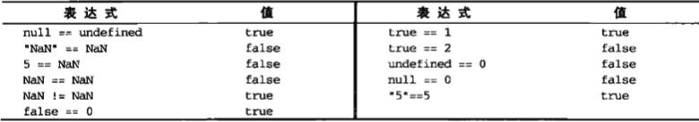

#### 6.3.3.2 全等和不全等

`===` 和 `!==` 比较的是未经转换的操作数。

### 6.3.4 其他运算符

* 位运算符: `~ 、&、|、^、<<、>>、>>>`
* 乘性运算符：`*、/、%`
* 加性运算符：`+、-`
* 关系运算符：`>、>=、<=、<`
* 条件运算符：`?:`
* 赋值运算符：`=`
* 逗号运算符：`,`

以上内容需要参考 《JavaScript高级程序设计》一书进行补充。

### 6.3.5 示例代码

#### 6.3.5.1 一元加运算符

* 字符串前面使用一元加运算符

```javascript
// 第一个参数表示查看类型，第二个参数表示输出值
console.info(typeof(+"1"), +"1");
```

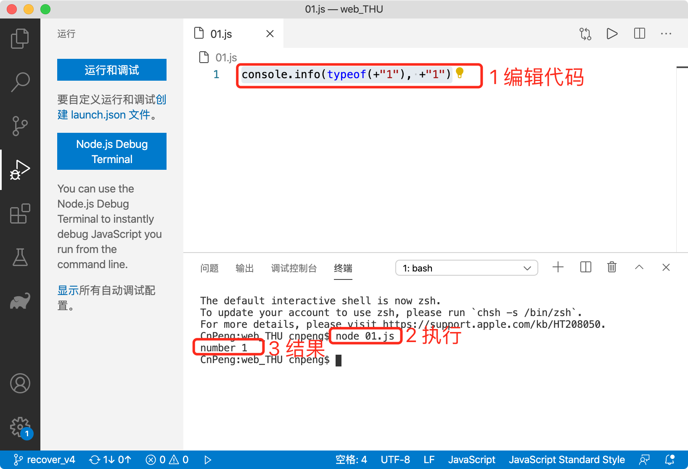

* 数值与字符串相加

通过这种方式可以将数值快速转换为字符串。

```javascript
var a = 1;
var b = a + "";
//输出 b 的类型及 b 的值
console.info(typeof(b), b)
```

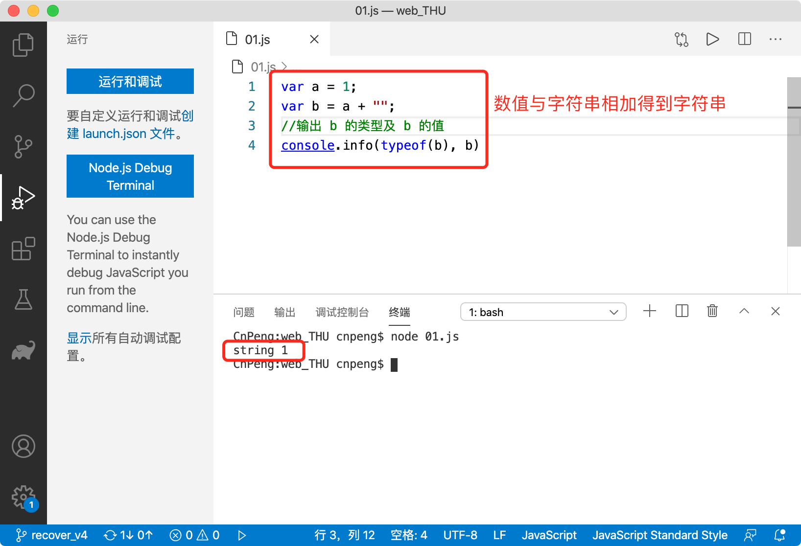


#### 6.3.5.2 逻辑运算符

* 逻辑非运算符

可以用于向 Boolean 的转换

```javascript
// !"" 表示将 “” 转换为布尔值然后取反，得到 true；再加一个 ！则得到 false , 所以，!!"" 效果等价于 Boolean("")
console.info(!!"")
```

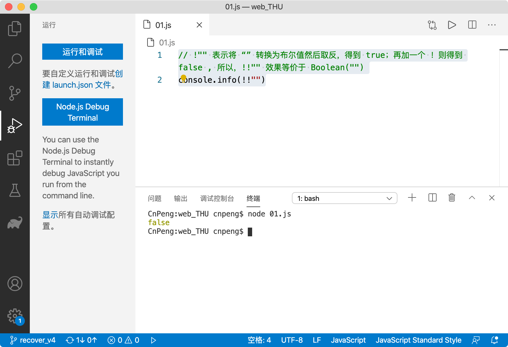

* 逻辑与运算符

可以用来替代 if-else

```javascript
var a = 1;
// if (true) {
//     a = 2;
// }
// 该语句效果等同于上面的 if 判断，注意括号不要省略
true && (a = 2);
console.info(a)
```

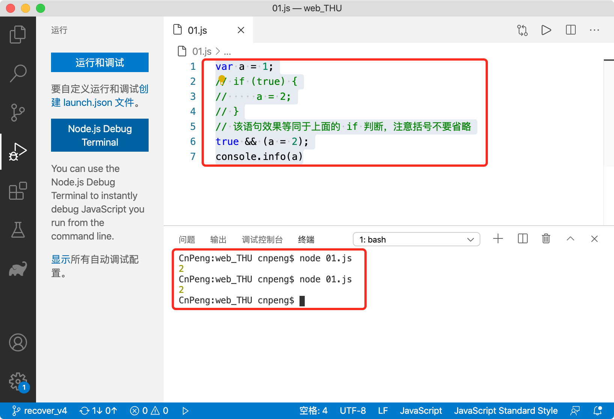 

* 逻辑或运算符

> 可以用来设置默认值

```javascript
function score(s) {
    // 如果 s 有值就返回 s，否则返回 5 ，即把 5 作为默认返回值 
    return s || 5
}
console.info(score(3))
console.info(score())
```

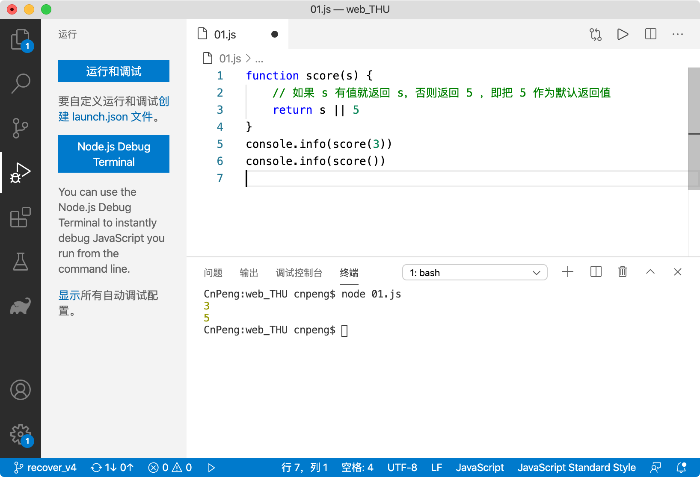

#### 6.3.5.3 三元运算符

可用于替代 if-else

```javascript
function fib(n) {
    // if (n < 2) {
    //     return n;
    // } else {
    //     return fib(n - 1) + fib(n - 2);
    // }

    // 该三元运算符的效果等同于上面的 if-else
    return n < 2 ? n : fib(n - 1) + fib(n - 2)
}
console.info(fib(6))
```

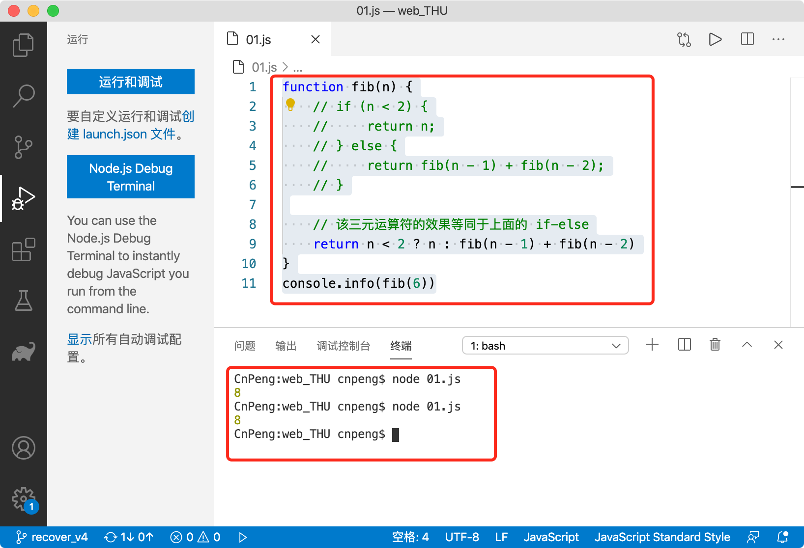


## 6.4 JavaScript 语句

### 6.4.1 表达式语句

#### 6.4.1.1 一般表达式语句

```javascript
1 + 2 + 3;
3 * (1 + 2 + 3);
void (1 + 2 + 3);
eval('1+2+3');
// 单值表达式语句
2;
// 空值语句
;
```

#### 6.4.1.2 赋值语句

```javascript
a = 1 + 2;
```

#### 6.4.1.3 声明语句

```javascript
var a = 1 + 2;
```

声明语句和赋值语句的区别

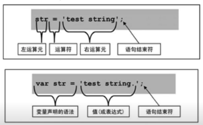

#### 6.4.1.4 函数调用语句

```javascript
//1、具名函数直接调用
function foo() { }
foo();

// 2、匿名函数通过引用来调用
fooRef = function () { }
fooRef();

// 3、没有引用的匿名函数的调用方法——1
(function () {
    //...
}());

// 4、没有引用的匿名函数的调用方法——2
(function () {
    //...
})();

// 5、没有引用的匿名函数的调用方法——3。void 语句的返回值为 undefined
void function () {
    //...
}();
```

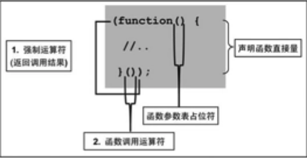

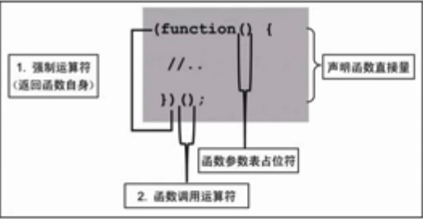


### 6.4.2 流程控制语句

#### 6.4.2.1 `for-in`

```javascript
for (var proName in window) { 
    document.write(proName);
}
```

`for-in` 遍历时没有顺序

#### 6.4.2.2 with

with 可以将代码的作用域设置到一个特定的对象中，其基本语法格式为：`with (expression) statement;`

定义 with 语句的目的是为了简化多次编写同一个对象的工作，如下面的例子所示：

```javascript
var qs = location.search.substr(1);
var hostName = location.hostname;
var url = location.href;
```

上面几行代码都包含 location 对象， 所以，可以使用 with 语句进行简化，如下：

```javascript
with(location) {
    var qs = search.substr(1);
    var hostName = hostname;
    var url = href;
}
```

> 尽量不要使用 with ，strict 模式下会报错；而且对其他人来说不易读；而且性能不高。

#### 6.4.2.3 其他语句

* if
* do-while
* while
* for
* break、continue
* switch
* label

上述语句可以参考 《JavaScript 高级程序设计》 一书中的介绍。

#### 6.4.2.4 语句的异常处理

* 捕获异常

```javascript
try {
    tryStatements;
} catch (exception) {
    catchStatements;
} finally { 
    finallyStatements;
};
```

* 抛出异常

```javascript
throw error;
```

### 6.4.3 返回值问题

#### 6.4.3.1 无返回值的语句

以下语句都是没有返回值的。

```javascript
// 空语句
;
// 变量声明
var a = b;
// 函数声明
function a() { }
// 控制子句
break/continue/label
```

eval 用来执行一批语句，并且**返回最后执行的有返回值的语句的结果**。

```javascript
// 返回 3 ，即 1+2。因为后面的语句都没有返回值
eval('1+2; var x=5;;;;; function f(){}')
// 返回 void 0 的返回值——undefined
eval('1+2; var x=5;; function f(){}; void 0')
```


## 6.5 JavaScript 函数

函数的基本格式 `function (a,b,c) {...}`

### 6.5.1 函数的参数（arguments）

#### 6.5.1.1 `arguments` 介绍 

* `arguments` 表示所有参数，像数组，但不是数组
* `arguments.length`——获取传入参数的个数
* 可以使用下标获取指定索引的参数

#### 6.5.1.2 练习题

写出 `console.log` 的值，并分析为什么是这样的结果？在不同的 JS 解析引擎中是否都是相同的结果呢？

```javascript
// 示例1
function b(x, y, a) {
    arguments[2] = 10;
    console.log(a);
}
b(1, 2, 3);

// 示例2：
function b(x, y, a) {
    "use strict";
    arguments[2] = 10;
    console.log(a);
}
b(1, 2, 3);
```

“use strict” 表示启用严格模式。

执行结果及分析如下：

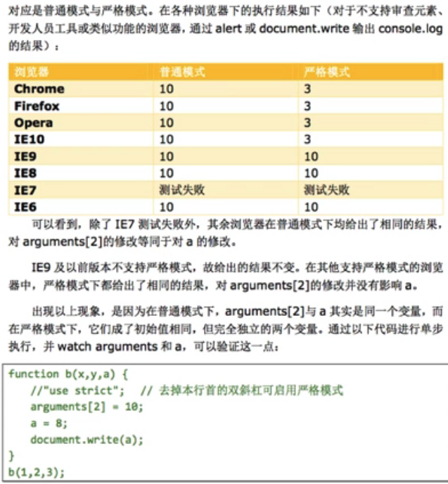

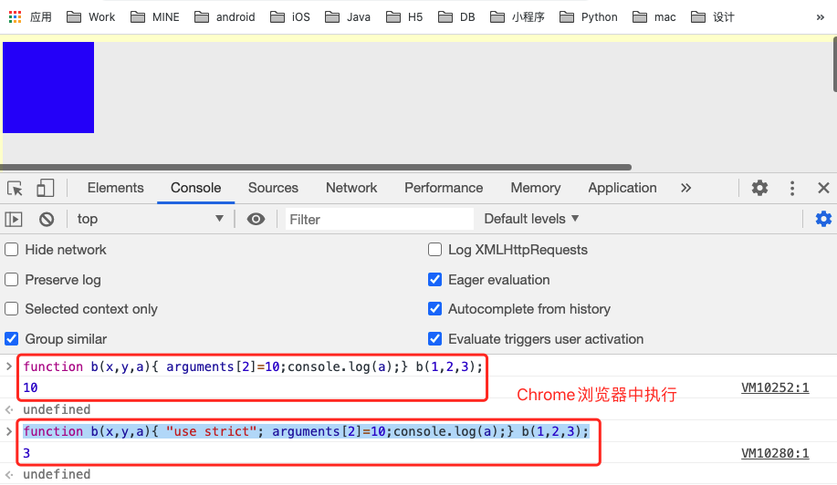

### 6.5.2 ECMAScript 中的参数都是值传递

#### 6.5.1.1 简单数据类型

简单数据类型即布尔、字符串、数值，他们必然是值传递。

```javascript
var num1 = 5;
var num2 = num1;
```

num1 和 num2 在栈中的结构如下： 

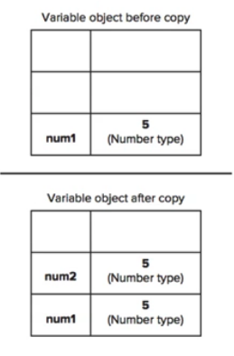

#### 6.5.1.2 引用数据类型

```javascript
var obj1 = new Object();
var obj2 = obj1;
obj1.name = "张三";
alert(obj2.name);
```

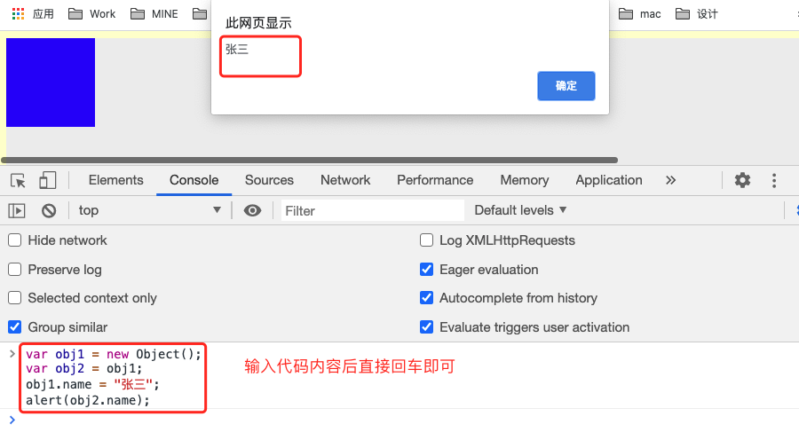

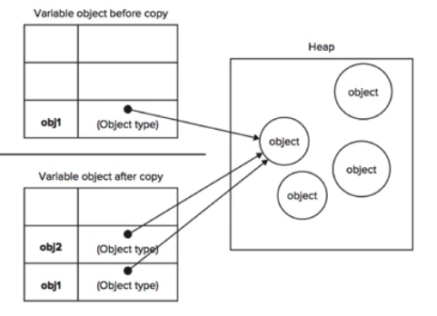

如上图，左侧表格模拟的是栈，如果模拟的是堆。

obj1 创建后，会在堆内存储具体对象，然后栈中引用该对象的地址值；当我们把 obj1 赋值给 obj2 时，实际是复制了堆内存中对象的地址值。也就是说，obj1 和 obj2 的值都指向堆内存中的同一个地址值。所以，当修改 obj1 中的属性值时，obj2 中的属性值也会随之变化。

**对于引用类型数据，所谓的值传递是指的地址值传递。**

#### 6.5.1.3 示例

```javascript
function addTen(num) {
    num += 10;
    return num;
}
var count = 20;
var result = addTen(count);

// 20
alert(count);
// 30
alert(result);
```

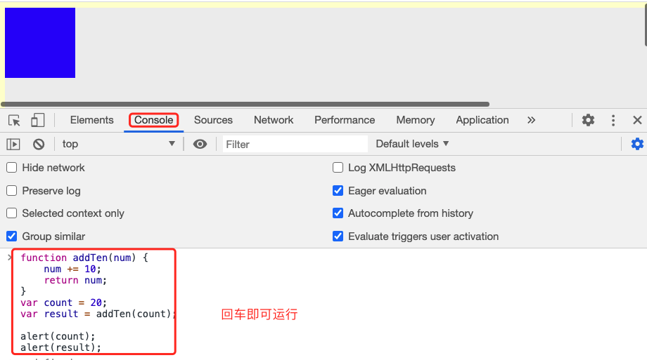

```javascript
function setName(obj) { 
    obj.name = "张三";
}
var person = new Object();
setName(person);

// 张三
alert(person.name);
```

```javascript
function setName(obj) {
    obj.name = "张三";
    obj = new Object();
    obj.name = "李四";
}
var person = new Object();
setName(person);

// 张三——因为是值传递，所以，setName 函数中改变 obj 对象后， person 对象并不会改变。
alert(person.name);
```

基于以上示例，**我们在理解函数的值传递时，把 `arguments` 当做一个函数内的局部变量即可。**

### 6.5.3 重载

ES 中函数没有重载。因为 ES 中没有函数签名的概念，所以，当函数重名时，后定义的函数会覆盖先前定义的函数。但是，ES 中可以模拟函数重载。

使用模拟函数重载来编写一个具有如下功能的函数：

* 如果输入参数大于三个，返回最后一个参数
* 如果输入参数小于三个且全部为数字，返回排序后的数组，如果最后一个数为奇数则降序排列，反之升序排列
* 如果输入参数小于三个且包含字符串，则将所有参数强转为字符串连接返回。

```javascript
function myFunc() {
    var argLen = arguments.length;
    if (argLen > 3) {
        return arguments[argLen - 1];
    } else if (argLen < 3) {
        // 是否全为数字
        var numFlag = true;
        // 是否包含字符串
        var strFlag = false;
        for (arg in arguments) {
            if (typeof (arg) != "number") {
                numFlag = false
            }

            if (typeof (arg) == "string") {
                strFlag = true;
                break;
            }
        }

        if (numFlag) {
            // 全是数字
            // 换成数组
            var argsArr = [].slice.call(arguments, 0);
            if (argsArr[argLen - 1] % 2 == 0) {
                // 尾数为偶数，升序排列
                return argsArr.sort(function (a, b) { return a - b; });
            } else {
                return argsArr.sort((a, b) => b - a);
            }
        } else if (strFlag) {
            // 包含字符串
            var resultStr = "";
            for (var i = 0; i < argLen; i++) {
                resultStr += String(arguments[i]);
            }
            return resultStr;
        }
    }
}
```