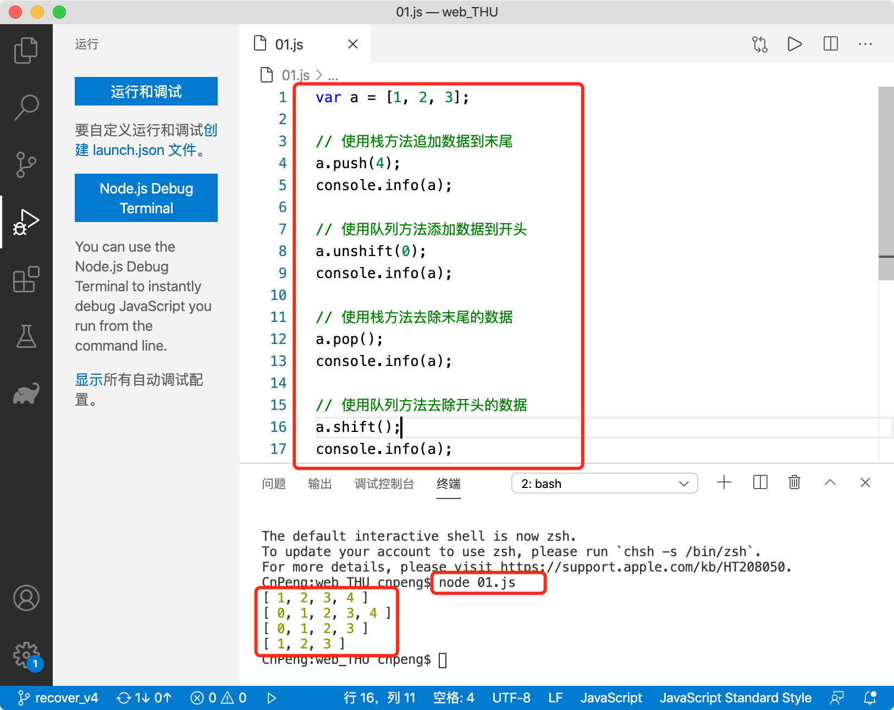
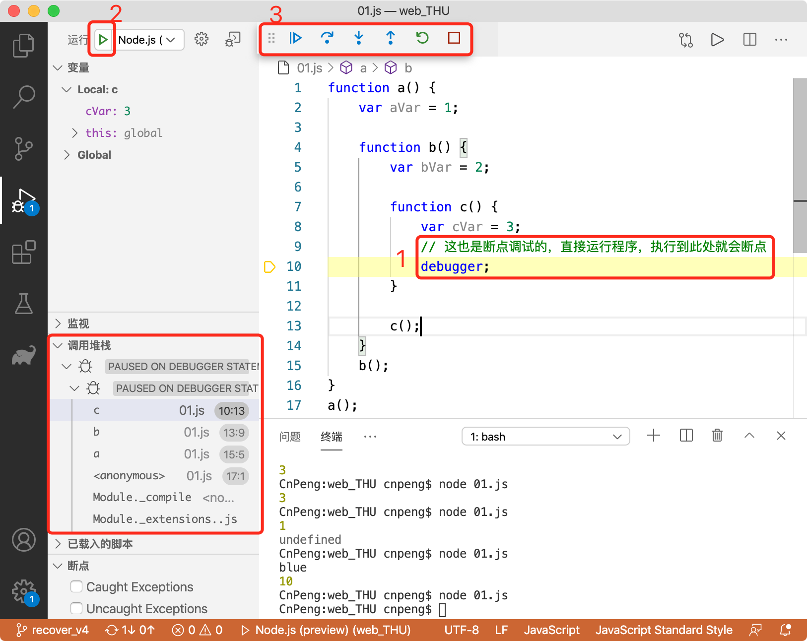
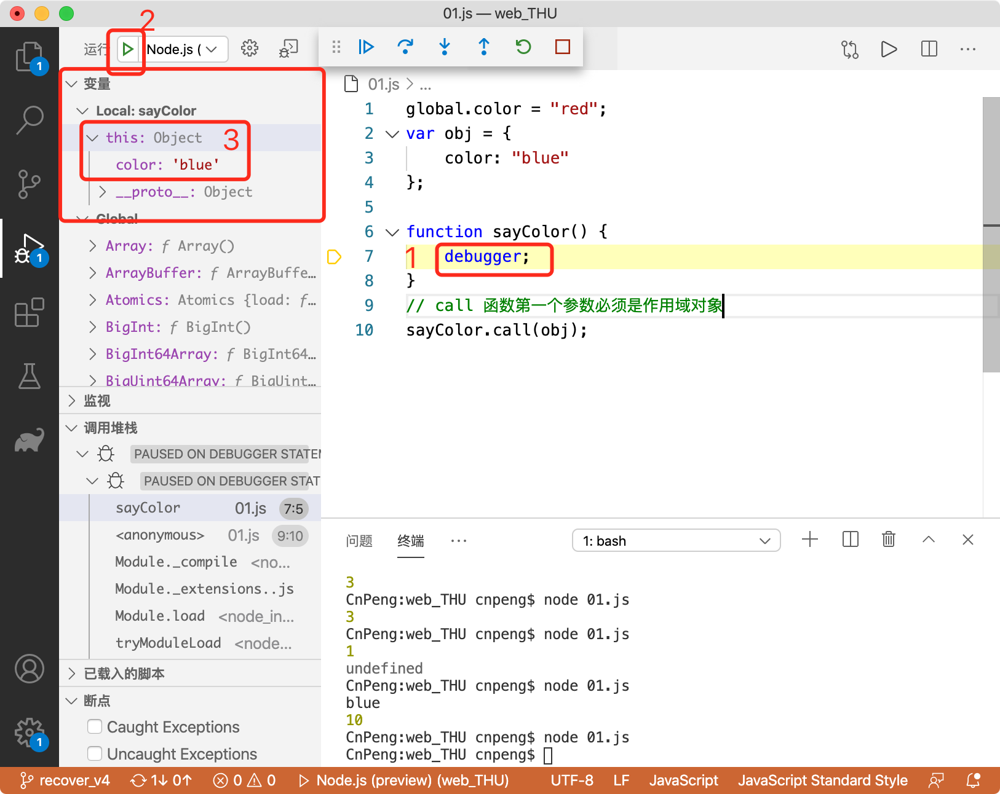
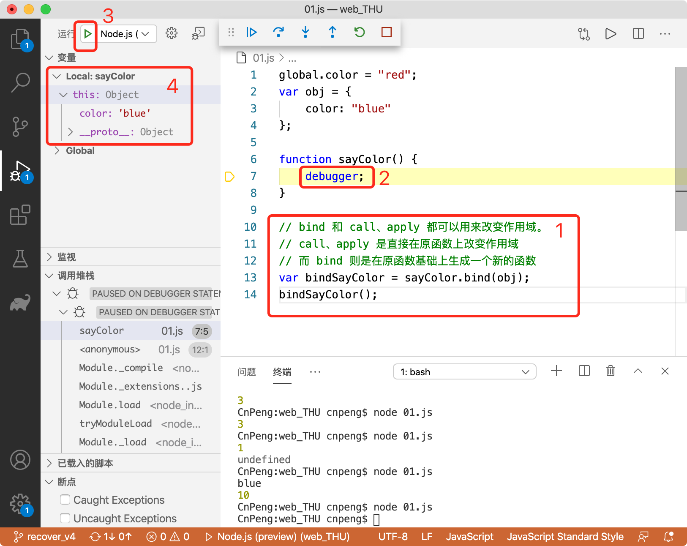
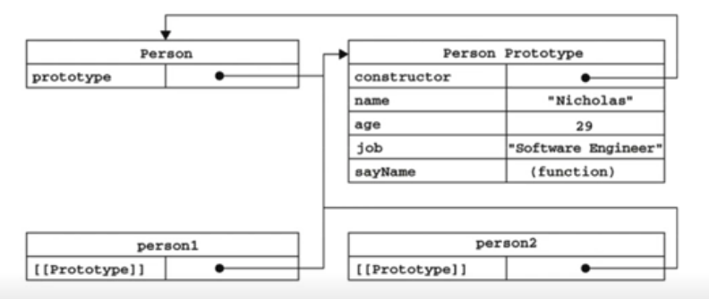
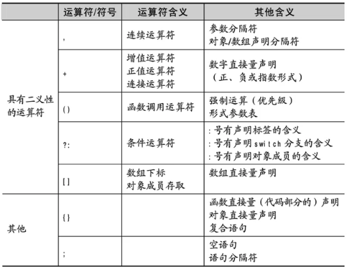
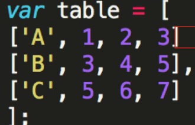
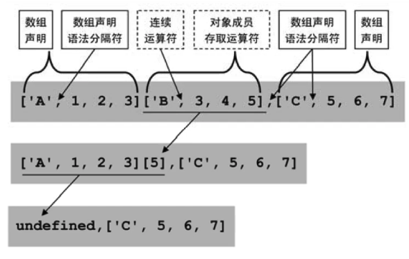

> 本章内容很多地方都需要看书补充。

## 7.1 JavaScript 引用类型

### 7.1.1 Object

#### 7.1.1.1 创建对象的方式

* 使用构造函数

```javascript
// 方式1
var person = new Object();
person.name = "张三";
person.age = 29;
```

* 对象字面量表示法

```javascript
// 方式2 多个属性间使用逗号间隔，属性名称可以用双引号括起来，如 "name":"李四"
var person2 = {
    name: "李四",
    age: 29
};

// 方式3 
var person3 = {
    "name": "李四",
    "age": 29
};

// 方式4
var person4 = {};
person4.name = "王五";
person4.age = 22;
```

`{}` 等价于 `new Object()`

#### 7.1.1.2 访问属性的方式：

* 通过 `obj.属性` 的方式访问（点表示法）

```javascript
alert(person.name);
```

* 通过 `obj[“属性”]` 的方式访问（方括号表示法）

必须使用双引号或单引号对要访问的属性进行包裹。

```javascript
alert(person2['name']);

alert(person2["name"]);
```

方括号表示法还可以通过变量来访问属性，如：

```javascript
// CnPeng 这种的实际使用场景是啥？这种方式没大看懂
var propertyName = "xxx";
alert(person2['propertyName']);
```

当属性名中包含非数字非字母或者包含关键字或保留字时，也可以通过方括号表示法来访问：

```javascript
// 被访问的属性中间包含空格
person["fist name"] = "Jack";
```


>《JavaScript 高级程序设计》中不推荐使用方括号表示法，除非必须使用变量来访问属性。

**我们经常使用对象来承载可选参数，而用具名的形参来传递必要的参数。**

### 7.1.2 Array

TODO

>typeof 与 instanceof 的区别主要在于：
>
>* `typeof` 用于判断是基本类型还是引用类型
>* `instanceof` 用于判断是具体的那种类型的对象。 


### 7.1.3 Date 类型


`+new Date()` 可以快速获取时间戳字符串。

### 7.1.4 RegExp 类型

### 7.1.5 Function
 
 函数声明与函数表达式：
 
 * 函数声明：
 
```javascript
function sum(num1, num2) { 
    return num1 + num2;
}

alert(sum(1, 2));
```
 
  * 函数表达式
 
```javascript
var sum = function (num1, num2) {
    return num1 + num2;
};

alert(sum(1, 2));
```

通过函数声明方式创建的函数可以放在调用语句之前，也可以放在调用语句之后。

但是通过函数表达式声明的函数必须在调用语句之前。
 
### 7.1.6 基本包装类型


### 7.1.7 单例内置对象


### 7.1.8 示例

#### 7.1.8.1 配置对象

当要给函数传递多个参数时，可以使用对象替代。

```javascript
function setTeacher(obj) {
    alert(obj.school);
}

setTeacher({
    name: "张三",
    age: 22,
    leesson: "语文",
    from: "山东",
    school:"山大"
});
```

#### 7.1.8.2 数组

##### 7.1.8.2.1 栈方法和队列方法

栈方法：后进先出。队列方法：先进先出。

```javascript
var a = [1, 2, 3];

// 使用栈方法追加数据到末尾
a.push(4);
console.info(a);

// 使用队列方法添加数据到开头
a.unshift(0);
console.info(a);

// 使用栈方法去除末尾的数据
a.pop();
console.info(a);

// 使用队列方法去除开头的数据
a.shift();
console.info(a);
```



##### 7.1.8.2.2 排序方法

```javascript
var a = [1, 2, 3];
// 倒序
a.reverse();
console.info(a);

var b = [1, 3, 2, 4];
// 升序
b.sort((a, b) => a - b);
console.info(b);

// 降序，参数也可以简化为：(a,b)=>b-a
b.sort(function (a, b) {
    return b - a;
});
console.info(b);
```

##### 7.1.8.2.3 迭代方法

介绍 for 以外的其他迭代方法。

```javascript
var b = [1, 3, 2, 4];

// 遍历
b.forEach(function (num, index) {
    console.info(index, num);
});

// filter 返回一个满足条件的新数组
var cArr = b.filter(function (num) {
    return num > 2;
});
console.info(cArr);

// map 返回对元素处理后的新数组
var dArr = b.map(function (num) {
    return num * 2;
});
console.info(dArr);

// 逗号后面的 0 表示初始值。初次计算时会传递给 num1，遍历并执行加法时，会把上次的结果作为 num1，把当前遍历到的数据作为 num2 
var sum = b.reduce(function (num1, num2) {
    return num1 + num2;
}, 0);
console.info(sum);

var eArr = b.reduce(function (result, num) {
    // 修改元素，让他们都 *2, 并追加到 result 中
    result.push(num * 2);
    return result;
}, []);
console.info(eArr);
```

##### 7.1.8.2.4 函数

函数中最重要的两个对象：`arguments`——函数参数、`this`——函数运行时的作用域。

* arguments

```javascript
function factorial(num) { 
    if (n <= 1) {
        return 1;
    } else { 
        // 递归调用, 当函数名发生变化时，这里也需要改。
        return num * factorial(num - 1);
    }
}

function factorial2(num) {
    if (n <= 1) {
        return 1;
    } else {
        // 使用 arguments.callee 替代函数名,这样即便修改了函数名这里也不需要修改
        return num * arguments.callee(num - 1);
    }
}
```

**注意：在严格模式下，使用 arguments 的 callee 和 caller 方法时会报错。**

* this

```javascript
// 定义全局变量 color。global 是全局对象
global.color = "red";
// 定义对象
var obj = {
    color: "blue"
};

function sayColor() {
    console.info(this.color);
}

// 打印 red
sayColor();
// 打印 blue
obj.sayColor = sayColor;
obj.sayColor();
```

每个函数都包含两个非继承而来的方法：`apply()`、`call()`。这两个方法都是在特定的作用域中调用函数，实际上等于设置函数体内 this 对象的值。

* `apply()` 方法

`apply()` 方法接收两个参数，一个是在其中运行函数的作用域，另一个是参数数组。第二个参数可以是 Array 实例，也可以是 arguments 对象。

```javascript
// 定义对象
var obj = {
    color: "blue"
};

function sayColor() {
    console.info(this.color);
}

// apply 和 call 可以只接收一个 作用域 对象
sayColor.call(obj);
sayColor.apply(obj);
```

```javascript
function sum(num1, num2) {
    return num1 + num2;
}

function callSum1(num1, num2) {
    // arguments 隐式的指向 num1 和 num2
    return sum.apply(this, arguments);
}

function callSum2(num1, num2) {
    // 手动构建数组
    return sum.apply(this, [num1, num2]);
}
console.info(callSum1(1, 2));
console.info(callSum2(1, 2));
```


* `call()` 方法

`call()` 方法与 `apply()` 方法作用相同，它们的区别在于接收参数的方式不同。`call()` 第一个参数也是 this, 如果还需要其他参数，则这些参数需要逐个列举出来，也就是说，`call()` 需要显示声明其接收的每一个参数。

```javascript
// 定义对象
var obj = {
    color: "blue"
};

function sayColor() {
    console.info(this.color);
}

// apply 和 call 可以只接收一个 作用域 对象
sayColor.call(obj);
sayColor.apply(obj);
```

```javascript
function sum(num1, num2) {
    return num1 + num2;
}

function callSum(num1, num2) {
    return sum.call(this, num1, num2);
}
console.info(callSum(1, 2));
```


## 7.2 JavaScript 作用域


### 7.2.1 作用域链

作用域链是指变量或函数在生效范围内的一种顺序结构。

```javascript
var color = "blue";

function changeColor() {
    var anotherColor = "red";

    function swapColor() {
        var tempColor = anotherColor;
        anotherColor = color;

        // 此处可以访问 color、anotherColor、tempColor
    }

    // 此处可以访问 color、anotherColor
    swapColor();
}

// 此处仅能访问 color
changeColor();
```

作用域链示意图:


### 7.2.2 作用域——this


作用域即某个变量或函数生效的范围。

this 永远指向最后调用它的对象。

```javascript
var a = {
    b: 1,
    c: function () {
        console.info(this.b);
    }
};

a.c();

b = 2;
console.info(this.b);
```

### 7.2.3 没有块级作用域

在其他类 C 的语言中，if 语句的花括号中声明的变量仅在花括号内有效，或括号内的代码执行完毕后，其中的变量就会被销毁。但在 JavaScript 中，if 语句中的变量声明会将变量添加到当前的执行环境中。如下：

```javascript
if (true) {
    var color = "blue";
}
// 会输出 blue
console.info(color);
```

在 for 语句中也是如此，变量 i 在语句执行完之后再当前执行环境中依旧有效。如下：

```javascript
for (var i = 0; i < 10; i++) {
    // 执行相应逻辑
}
// 会输出 i 最后的值 10
console.info(i);
```

>在 JS 中如果想让某个变量仅在大括号内有效，则该大括号对应的仅能是函数。

### 7.2.4 闭包

参考原书 `7.2 闭包`

**闭包**：是指有权访问另一个函数作用域中变量的函数。

### 7.2.5 示例代码

#### 7.2.5.1 作用域链

```javascript
function a() {
    var aVar = 1;

    function b() {
        var bVar = 2;

        function c() {
            var cVar = 3;
            // 这也是断点调试的，直接运行程序，执行到此处就会断点
            debugger;
        }

        c();
    }
    b();
}
a();
```




#### 7.2.5.2 作用域

```javascript
global.color = "red";
var obj = {
    color: "blue"
};

function sayColor() {
    debugger;
}
// call 函数第一个参数必须是作用域对象
sayColor.call(obj);
```




```javascript
global.color = "red";
var obj = {
    color: "blue"
};

function sayColor() {
    debugger;
}

// bind 和 call、apply 都可以用来改变作用域。
// call、apply 是直接在原函数上改变作用域
// 而 bind 则是在原函数基础上生成一个新的函数
var bindSayColor = sayColor.bind(obj);
bindSayColor();
```



#### 7.2.5.3 闭包

未使用闭包时的函数：

```javascript
function applyArr() {
    var arr = [];

    // 因为 js 中没有块级作用域，所以，arr.push 存储的匿名函数最终持有的都是 10
    for (var i = 0; i < 10; i++) {
        arr.push(
            function () {
                return i;
            }
        );
    }
    return arr;
}

var arr = applyArr();
var b = arr[1]();
var c = arr[2]();

// 输出 10 
console.info(b);
// 输出 10 
console.info(c);
```

使用闭包之后：

```javascript
function applyArr() {
    var arr = [];

    for (var i = 0; i < 10; i++) {
        // 创建匿名自执行程序，从而形成了闭包
        // 这样 arr.push 持有的函数内部就会持有每次传入的 i 
        (function (index) {
            arr.push(
                function () {
                    return index;
                }
            );
        })(i);
    }
    return arr;
}

var arr = applyArr();
var b = arr[1]();
var c = arr[2]();

// 输出 1
console.info(b);
// 输出 2
console.info(c);
```

## 7.3 面向对象的 JavaScript

参考原书第 6 章。

TODO 

### 7.3.1 对象属性

#### 7.3.1.1 定义对象属性的方式：

```javascript
person = new Object();
person.a = 1;
person["b"] = 2;
console.info(person.a);

person2 = { c: 3 };
console.info(person2.c);
```

#### 7.3.1.2 数据属性

定义数据属性时，需要使用 `Object.defineProperty()` 函数，该函数接收三个参数：

* 需要定义属性的对象
* 属性名称
* 属性值和其他设置。
	*  `configurable` : 表示能否通过 delete 删除属性从而重新定义属性，能否修改属性的特性，或者能否把属性修改为访问器属性。前面例子中直接在对象上定义的属性的 `configurable` 默认值都为 true。
	*  `enumerable`：表示能否通过 `for-in` 循环返回属性。前面例子中直接在对象上定义的属性的 `enumerable` 默认值都为 true。
	*  `writable`: 表示能否修改属性的值。前面例子中直接在对象上定义的属性的 `writable ` 的默认值都为 true.
	*  `value`: 表示属性的数据值。默认值为 undefined。

在调用 `Object.defineProperty()` 时，如果不做指定，`configurable`、`enumerable`、`writable` 默认值都是false.

```javascript
var person = {};
Object.defineProperty(person, "name", {
    writable: false,
    value: "张三"
});

// 张三
console.info(person.name);

person.name = "李四";
// 张三——因为前面定义了 name 属性是不可写的：writable: false,
console.info(person.name);
```

#### 7.3.1.3 访问器属性

定义访问器属性时，也需要使用 `Object.defineProperty()` 函数，该函数接收三个参数：

* 需要定义属性的对象
* 属性名称
* 属性值和其他设置。
	*  `configurable` : 表示能否通过 delete 删除属性从而重新定义属性，能否修改属性的特性，或者能否把属性修改为访问器属性。前面例子中直接在对象上定义的属性的 `configurable` 默认值都为 true。
	*  `enumerable`：表示能否通过 `for-in` 循环返回属性。前面例子中直接在对象上定义的属性的 `enumerable` 默认值都为 true。
	*  `get` 函数: 表示读取属性时需要调用的函数，默认值 `undefined`
	*  `set` 函数: 表示设置属性时需要调用的函数，默认值为 undefined。

在调用 `Object.defineProperty()` 时，如果不做指定，`configurable`、`enumerable`默认值都是false.


```javascript
var book = {
    _year: 2004,
    edition: 1
}

Object.defineProperty(book, "year", {
    get: function () {
        // 此处的 this 代表传入的 book 对象
        return this._year;
    },
    set: function (newValue) {
        if (newValue > 2004) {
            this._year = newValue;
            this.edition += newValue - 2004;
        }
    }
});

book.year = 2005;
// 返回 2
console.info(book.edition);
```

### 7.3.2 创建对象

#### 7.3.2.1 工厂模式

将创建对象的过程抽取到函数中。该模式解决了创建多个相似对象的问题，但却没有解决对象识别的问题——判断一个对象的类型。

```javascript
function createPerson(name, age, job) { 
    var obj = new Object();
    obj.name = name;
    obj.age = age;
    obj.job = job;
    obj.sayName = function () {
        console.info(name);
    };
    return obj;
}
var person1 = createPerson("张三", 22, "码农");
var person2 = createPerson("李四",22,"医生");
```

#### 7.3.2.2 构造函数模式

构造函数首字母必须大写，非构造函数首字母小写。

##### 7.3.2.2.1  构造函数模式

```javascript
function Person(name, age, job) {
    this.name = name;
    this.age = age;
    this.job = job;
    this.sayName = function () {
        console.info(name);
    };
}
var person1 = new Person("张三", 22, "码农");
var person2 = new Person("李四", 22, "医生");
```

上面的例子中，person1 和 person2 分别保存着 Person 的一个不同的实例。这两个对象都有一个 `constructor` (构造函数)属性，该属性指向 Person, 如下：

```javascript
// true
console.info(person1.constructor == Person);
// true
console.info(person2.constructor == Person);
```

对象的 `constructor` 属性最初是用来标识对象类型的。但是，检测对象类型时，还是 `instanceof` 更准确。我们上面创建的 person1 和 person2 既是 `Object` 的示例，也是 `Person` 的实例，如下：

```javascript
// 下列四个语句都得到 true
console.info(person1 instanceof Person);
console.info(person1 instanceof Object);

console.info(person2 instanceof Person);
console.info(person2 instanceof Object);
```

上述示例代码中，之所以都返回 true , 是因为所有对象都继承自 Object。

创建自定义的构造函数一位置将来可以将它的实例标识为一种特定的类型，这就是构造函数模式比工厂模式好的地方。

##### 7.3.2.2.2 把构造函数当做函数

构造函数本质上也是一个函数，所以，也可以直接调用。

下列示例代码基于前面的构造函数模式示例：

```javascript
// 将构造函数当做构造函数使用
var person1 = new Person("张三", 23, "职业1");
person1.sayName();

// 将构造函数作为普通函数使用——此时得到的变量会被 window 持有
// 该代码块需要从浏览器中测试，并且需要将 sayName 函数体改为 alert
Person("李四", 24, "职业2");
window.sayName();

// 在另一个对象的作用域中调用
var obj = new Object();
Person.call(obj, "王五", 25, "职业三");
obj.sayName();
```

##### 7.3.2.2.3 特殊情况

```javascript
function a() {
    return 1;
}
// true
console.info(new a() instanceof a);

function b() {
    return {};
}
// false
console.info(new b() instanceof b);

function c() { }
// true
console.info(new c() instanceof c);
```

#### 7.3.2.3 原型模式

##### 7.3.2.3.1 原型模式

我们创建的每个函数都有一个 `prototype（原型）` 属性，该属性是一个指针，指向一个对象，而该对象的用途是包含可以由特定类型的所有实例共享的属性和方法。

按字面意思理解，`prototype` 就是通过调用构造函数而创建的那个对象实例的原型对象。

**使用原型对象可以让所有对象实例共享它所包含的属性和方法**，也就是说，不必再构造函数中定义对象实例的信息，而是可以将这些信息直接添加到原型对象中。如下： 

```javascript
function Person() { }

Person.prototype.name = "张三";
Person.prototype.age = 23;
Person.prototype.job = "driver";
Person.prototype.sayName = function () {
    // alert(this.name);  
    console.info(this.name);
};

var person1 = new Person();
// 输出 张三
person1.sayName();

var person2 = new Person();
// 输出 张三
person2.sayName();

// 输出 true 
// alert(person1.sayName==person2.sayName);
console.info(person1.sayName == person2.sayName);
```



##### 7.3.2.3.2 原型属性和实例属性

**通过原型模式添加的属性叫做原型属性；通过原型模式构建的对象添加的属性叫做实例属性。**

虽然可以通过对象实例访问保存在原型中的值，但却不能通过对象实例重写该值；

如果我们在实例中添加了一个属性，而该属性与实例原型中的属性同名，那么，实例属性会屏蔽原型属性——即通过该实例访问该属性时会返回实例属性值，其他实例访问该属性时依旧返回原型属性值。如下：

```javascript
function Person() { }

Person.prototype.name = "张三";
Person.prototype.age = 23;
Person.prototype.job = "driver";
Person.prototype.sayName = function () {
    // alert(this.name);  
    console.info(this.name);
};

var person1 = new Person();
person1.name = "李四";
// 输出 李四
person1.sayName();

var person2 = new Person();
// 输出 张三
person2.sayName();
```

在实例属性和原型属性重名时，我们可以使用 `delete` 删除实例属性：

```javascript
function Person() { }

Person.prototype.name = "张三";
Person.prototype.age = 23;
Person.prototype.job = "driver";
Person.prototype.sayName = function () {
    // alert(this.name);  
    console.info(this.name);
};

var person1 = new Person();
person1.name = "李四";
// 输出 李四
person1.sayName();
delete person1.name
// 输出 张三
person1.sayName();

var person2 = new Person();
// 输出 张三
person2.sayName();
``` 

使用 `hasOwnProperty()` 方法可以检测一个属性是实例属性还是原型属性，当是实例属性时会返回 true .

```javascript
function Person() { }

Person.prototype.name = "张三";
Person.prototype.age = 23;
Person.prototype.job = "driver";
Person.prototype.sayName = function () {
    // alert(this.name);  
    console.info(this.name);
};

var person1 = new Person();
var person2 = new Person();

// false
console.info(person1.hasOwnProperty("name"));
// false
console.info(person2.hasOwnProperty("name"));

person1.name = "李四";
person1.sayName();
// true
console.info(person1.hasOwnProperty("name"));
// false
console.info(person2.hasOwnProperty("name"));

delete person1.name
// 输出 张三
person1.sayName();
// false
console.info(person1.hasOwnProperty("name"));
// false
console.info(person2.hasOwnProperty("name"));
```

##### 7.3.2.3.3 原型与 in 操作符

有两种使用 in 操作符的方式：单独使用和在 `for-in` 循环中使用。

单独使用时，`in` 操作符会在通过对象访问给定属性时返回 true , 不论该属性是实例属性还是原型属性。

```javascript
function Person() { }

Person.prototype.name = "张三";
Person.prototype.age = 23;
Person.prototype.job = "driver";
Person.prototype.sayName = function () {
    // alert(this.name);  
    console.info(this.name);
};

var person1 = new Person();

// true
console.info("name" in person1);

person1.name = "李四";
person1.sayName();
// true
console.info("name" in person1);

delete person1.name
// true
console.info("name" in person1);

// false
console.info("sex" in person1);
```

由于只要实例中包含指定的属性， in 操作符就会返回 true；而如果该指定的属性是实例属性，`hasOwnProperty()` 会返回 true 。那么，当 in 操作符返回 true，`hasOwnProperty()` 返回 false 时，我们就可以认为该属性是 原型属性。如下：

```javascript
function hasPrototypeProperty(obj, attrName) { 
    return (attrName in obj) && !obj.hasOwnProperty(attrName);
}
```

在使用 `for-in` 循环时，返回的是所有可以通过对象访问的、可枚举的属性，这些属性包括实例属性和原型属性。

```javascript
var obj = {
    toString: function () {
        return "my obj";
    }
};

Object.defineProperty(obj, "name", {
    enumerable: false,
    value: "张三"
})

for (var property in obj) {
	// 仅显示 toString  
    console.info(property);
    alert(property);
}
```

#### 7.3.2.4 组合使用构造函数模式和原型模式

属性放在构造中，方法放在原型中。

```javascript
function Person(name, age, job) {
    this.name = name;
    this.age = age;
    this.job = job;
    this.friends = ["王五", "李四"];
}

Person.prototype = {
    constructor: Person,
    sayName: function () {
        alert(this.name);
    }
}

var person1 = new Person("张三", 23, "job1");
var person2 = new Person("赵大", 21, "job2");

person1.friends.push("王二麻子");
// 王五、李四、王二麻子
alert(person1.friends);
// 王五、李四
alert(person2.friends);

// false
alert(person1.friends == person2.friends);
// true
alert(person1.sayName == person2.sayName);
```

### 7.3.3 继承

#### 7.3.3.1 原型链继承

ES 中描述了原型链的概念，并将其做为实现继承的主要方法。其基本思想是**利用原型让一个引用类型继承另一个引用类型的属性和方法。**

```javascript
function SuperType() {
    this.colors = ["red", "blue", "green"];
}

SuperType.prototype.getSuperValue = function () {
    return this.prototype;
};

function SubType() { }

// 创建父类实例，并将其赋值给子类的原型，从而实现了继承
SubType.prototype = new SuperType();

// 在子类中添加自定义方法
SubType.prototype.getSubValue = function () {
    return this.subproperty;
};
// 重写父类的方法
SubType.prototype.getSuperValue = function () {
    return false;
}
var instance1 = new SubType();
instance1.colors.push("black");
var instance2 = new SubType();
// 输出 [`red`,`blue`,`green`,`black`]
console.info(instance2.colors);

// false, true 因此，colors 是 instance1 的原型属性。 
console.info(instance1.hasOwnProperty("colors"),"colors" in instance1);
```

上述代码中，`SubType.prototype = new SuperType();` 创建父类实例，并将其赋值给子类的原型，从而实现了继承。其本质是重写原型对象，代之以一个新类型的示例。这样，SubType 就持有了存在于 SuperType 实例中的属性和方法。

上述代码中也存在一个问题：上述代码中，当 SubType 通过原型链继承了 SuperType 之后，SubType.propertype 就变成了 SuperType 的一个实例，因此它就拥有了一个它自己的 colors 属性。由于引用类型值的原型属性会被所有实例共享，所以，所有 SubType 的实例都会共享这一个  colors 属性，这就是为什么我们在上述代码中修改 instance1 的 colors 时 instacne2 中的 colors 也会发生变化的原因。

原型链继承的另一个问题是，在创建子类型的实例时，无法向超类/父类的构造函数中传递参数。

实际编码中很少会单独使用原型链继承。

#### 7.3.3.2 借用构造函数实现继承

也叫伪造对象或经典继承。其基本思想是：**在子类型构造函数的内部调用超类型的构造函数。**

由于函数只不过是在特定环境中执行代码的对象，所以通过 `apply()` 和 `call()` 方法也可以在新创建的对象上执行构造函数。

```javascript
function SuperType() {
    this.colors = ["red", "blue", "green"];
}

function SubType() {
	// 通过 call 实现继承
    SuperType.call(this);
}

var instance1 = new SubType();
instance1.colors.push("black");
// [ 'red', 'blue', 'green', 'black' ]
console.info(instance1.colors);

var instance2 = new SubType();
// [ 'red', 'blue', 'green' ]
console.info(instance2.colors);

// true true
console.info(instance1.hasOwnProperty("colors"), "colors" in instance1);
```

在子类的构造方法中通过调用父类的 `call()` 或 `apply()` 方法实现继承时， 实际上是在新创建的 SubType 实例的环境下调用了 SuperType 的构造函数。这样，在构建 SubType 的实例时就会执行 SuperType 函数中定义的所有对象初始化的代码。因此，SubType 的每个实例都会拥有自己的 colors 属性副本。

借用构造函数实现继承时，还可以向父类中传递参数：

```javascript
function SuperType(name) {
    this.name = name;
}

function SubType() {
    SuperType.call(this, "张三");
    this.age = 23;
}
var instance = new SubType();
// 张三
console.info(instance.name);
// 23
console.info(instance.age);
```

构造函数模式存在的一个固有问题是：无法实现函数复用。而且，在超类/父类的原型中定义的方法，对子类是不可见的。

在实际编码中也很少使用这种通过构造函数实现继承的方式。


#### 7.3.3.3 组合继承

也叫伪经典继承，是将原型链和构造函数结合到一起的一种方式。其基本思路是：**使用原型链实现对原型属性和方法的继承，而通过借用构造函数实现对实例属性的继承。** 这样，既可以通过在原型上定义方法实现函数的复用，又能够保证每个实例都有它自己的属性。

```javascript
function SuperType(name) {
    this.name = name;
    this.colors = ["red", "blue", "green"];
}

SuperType.prototype.sayName = function () {
    console.info(this.name);
};

function SubType(name, age) {
    // 继承属性——构造继承
    SuperType.call(this, name);
    this.age = age;
}
// 继承方法——原型链继承
SubType.prototype = new SuperType();

SubType.prototype.sayAge = function () {
    console.info(this.age);
};

var instance1 = new SubType("张三", 23);
instance1.colors.push("black");
// [ 'red', 'blue', 'green', 'black' ]
console.info(instance1.colors);
// 张三
instance1.sayName();
// 23
instance1.sayAge();

var instance2 = new SubType("李四", 24);
// ['red', 'blue', 'green']
console.info(instance2.colors);
// 李四
instance2.sayName();
// 24
instance2.sayAge();
```

这种组合方式避免了原型链继承和构造函数继承的缺点，整合了他们的优点，所以实际使用中常用这种方式。

## 7.4 JavaScript 语言的二义性

* 运算符的二义性:



* 错误示例：

下列代码中是一个错误示例，在一个数组后面漏掉了一个逗号分隔符，由于 JS 运算符的二义性，所以编译器在编写时不会直接报错，只有在运行时才会出现异常：



在程序运行时，其解析过程和结果如下：

