## 8.1 DOM 编程

DOM--文档对象模型，是针对 HTML 和 XML  文档的一个 API（应用程序编程接口）。它描绘了一个层次化的节点树，允许开发人员添加、移除和修改页面的某一部分。

### 8.1.1 DOM 基础

#### 8.1.1.1 节点层级

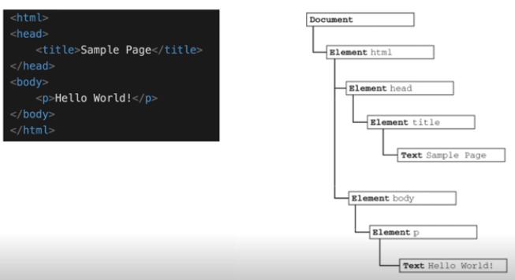

* Document 节点
* Element 节点（元素节点）
* Text 节点（文本节点）

#### 8.1.1.2 节点类型

节点类型及其对应的值：（括号中的数值为类型对应的值）

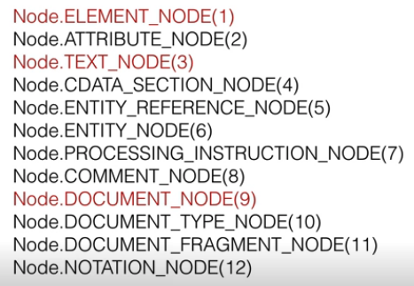

#### 8.1.1.3 判断元素节点

```javascript
// 如果是 1 表示是 Element 节点（元素节点）
if (someNode.nodeType == 1) {
    // 获取节点名称——即元素名称（html标签名称）
    value = someNode.nodeName;
}
```

#### 8.1.1.4 节点关系

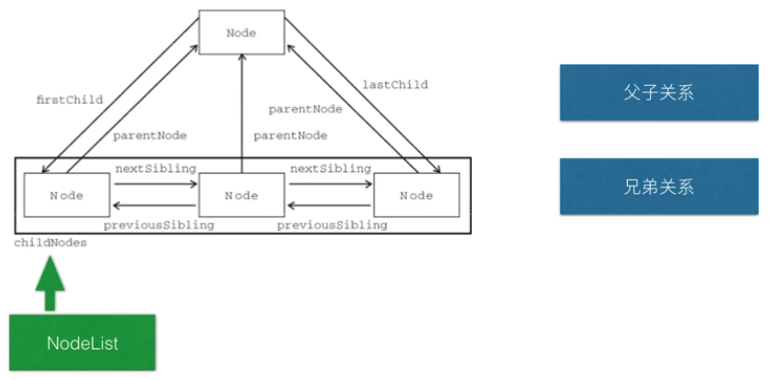

#### 8.1.1.5 NodeList

访问 NodeList 中的节点：

```javascript
//方式1
someNode.childNodes[0];
//方式2
someNode.childNodes.item(1);

// 将 NodeList 转换成数组
var arrayOfNodes = Array.prototype.slice.call(someNode.childNodes, 0);
```

上述代码中转换成数组的方式也适用于 Arguments : `Array.prototype.slice.call(arguments, 0);`


### 8.1.2 Document 节点

#### 8.1.2.1 Document 节点特征

* nodeType 的值为 `9`
* nodeName 的值为 `#document`
* nodeValue 的值为 `null`
* parentNode 的值为 `null`
* ownerDocument 的值为 `null`
* 其子节点可能是一个 DocumentType（最多一个）、Element（最多一个）、ProcessingInstruction 或 Comment


#### 8.1.2.2 Document 节点

```html
<html>
	<body>
	</body>
</html>
```

在 html 中 `<html>` 元素是 document 的唯一子节点。

对于上述代码，下列获取子节点的代码都会返回 true:

```javascript
var html = document.documentElement;

alert(html === document.childNodes[0]);
alert(html === document.firstChild);
```

#### 8.1.2.3 Document 节点属性

属性|作用
---|---
document.title | 文档标题（页面标题）
document.referrer | 获取来源页面的 URL（从哪个页面进入当前页面的），可以判断页面是否被盗链
document.domain | 获取域名
document.URL | 获取当前页面完整的 URL

### 8.1.3 DOM 元素节点

#### 8.1.3.1 DOM 元素节点默认属性

```html
<div id="someDiv" class="cls" title="text" lang="en" dir="ltr"></div>
```

* `element.id` // 在上述代码中取到的值为 someDiv
* `element.className` // cls
* `element.title`  // text
* `element.lang` // en
* `element.dir`  // ltr

#### 8.1.3.2 访问自定义属性

```html
< div id="someDiv" class="cls"  title="text"  lang="en" dir="ltr"  myAttr="val"> < /div>
```

上面的 `myAttr` 是自定义属性。对于默认属性和自定义属性我们都可以通过 `element.getAttribute("属性名")` 来获取对应的属性值。

```javascript
element.getAttribute("id")
element.getAttribute("class")
element.getAttribute("title")
element.getAttribute("lang")
element.getAttribute("dir")
element.getAttribute("val")
```

也就是说，对于默认属性我们有两种获取属性值的方式，一种是直接通过 `element.xx` 获取，一种是通过 `element.getAttribute("xx")`

除了有 `getAttribute("xx")` , 对应的还有 `setAttribute()` 和 `removeAttribute()`

### 8.1.4 DOM 操作

#### 8.1.4.1 DOM 创建

创建 div 节点：

```javascript
document.createElement("div")
```

#### 8.1.4.2 DOM 节点添加

* 添加新节点：

```javascript
var returnedNode = someNode.appendChild(newNode);
// true
alert(returnedNode == newNode);
// true
alert(someNode.lastChild == newNode);
```

* 添加已有节点

```javascript
var returnedNode = someNode.appendChild(someNode.firstChild);
// false
alert(returnedNode == someNode.firstChild);
// true
alert(returnedNode == someNode.lastChild);
```

上述代码中 `someNode.appendChild(someNode.firstChild);` 相当于把第一个子节点挪到了最后。因为**同一个 DOM 节点不能出现在文档的不同位置**


#### 8.1.4.3 DOM 节点插入

```javascript
// 插入后成为最后一个子节点
returnedNode = someNode.insertBefore(newNode, null);
// true
alert(newNode == someNode.lashChild);

// 插入后成为第一个子节点
var returnedNode2 = someNode.insertBefore(newNode, someNode.firstChild);
// true
alert(returnedNode2 == newNode);
// true
alert(newNode == someNode.firstChild);

// 插入到最后一个子节点的前面
returnedNode3 = someNode.insertBefore(newNode, someNode.lashChild);
// true
alert(newNode == someNode.childNodes[someNode.childNodes.length - 2]);
```

#### 8.1.4.4 DOM 节点替换

```javascript
// 替换第一个子节点
var returnedNode = someNode.replaceChild(newNode, someNode.firstChild);
//替换最后一个子节点
var returnedNode2 = someNode.replaceChild(newNode, someNode.lastChild);
```

#### 8.1.4.5 DOM 节点删除

```javascript
// 移除第一个子节点
var formerFirstChild = someNode.removeChild(someNode.firstChild);
// 移除最后一个子节点
var formerLastChild = someNode.removeChild(someNode.lastChild);
```

#### 8.1.4.6 DOM 节点克隆

```html
<ul>
    <li>item1</li>
    <li>item2</li>
    <li>item3</li>
</ul>
```

```javascript
// 深克隆——克隆全部子节点
var deepList = myList.cloneNode(true);
// 浅克隆——只克隆当前节点，不克隆子节点
var shallowList = myList.cloneNode(false);
```

#### 8.1.4.7 DOM 节点的高效访问

* innerHTML
* outerHTML

```html
<ul>
    <li>List item 0</li>
    <li>List item 1</li>
    <li>List item 2</li>
    ...
    <li>List item 9</li>
</ul>
```

创建包含多个 li 元素的 ul 元素

```javascript
for (var x = 0; x < 10; x++) {
    var li = document.createElement("li");
    li.innerHTML = "List item " + x;
    listNode.appendChild(li);
}
```

上面这种方式每创建一个 li 元素就通过 `listNode.appendChild(li);` 追加到视图，这样导致的问题就是每次追加都会刷新视图，效率不高。可以使用下面的方式：

```javascript
var html = "";
for (var x = 0; x < 10; x++) {
    html += "<li> List item " + x + "</li>";
}
listNode.innerHTML = html;
```

上述代码中先创建好对应的 html 结构语句，然后一次性追加到父节点中。

> outerHTML 的使用需要参考原书进行补充

#### 8.1.4.8 DOM 节点的高效访问2

* DocumentFragment

```javascript
var frag = document.createDocumentFragment();
for (var x = 0; x < 10;x++) { 
    var li = document.createElement("li");
    li.innerHTML = "List item " + x;
    frag.appendChild(li);
}
listNode.appendChild(frag);
```

#### 8.1.4.9 innerHTML 和 DocumentFragment 的对比

```html
<ul>
    <li>List item -1</li>
    <li>List item 0</li>
    <li>List item 1</li>
    <li>List item 2</li>
    ...
    <li>List item 9</li>
</ul>
```

在已有 `<li>List item -1</li>` 的前提下，再向其中追加后面的节点。

> 下面的代码仅是 for 循环中的核心部分，完整代码可参考前两个小节的内容。

```javascript
// 使用 innerHTML 的方式
listNode.innerHTML += html;

// documentFragment的方式
listNode.appendChild(frag);
```

`+=` 方式会改变挂在到 li 上的事件。而 documentFragment 的方式则不会修改事件。

### 8.1.5 DOM 查找

即 DOM 元素的查找

#### 8.1.5.1 普通方法

* `document.getElementById` //理论上来说不应该会有 id 重复的元素，如果有，则返回第一个
* `document.getElementsByTagName` 


#### 8.1.5.2 特殊集合

* `document.anchors`
* `document.forms`
* `document.images`
* `document.links`


```javascript

```

#### 8.1.5.3 querySelector

```javascript
// 获取 body 元素
var body = document.querySelector("body");
// 获取 id 为 myDiv 的元素
var myDiv = document.querySelector("#myDiv");
// 获取类名为 selected 的第一个元素
var selected = document.querySelector(".selected");
// 获取类名为 button 的第一个图像元素
var img = document.querySelector("img.button");
```
#### 8.1.5.4 querySelectorAll

返回一个 NodeList 

```javascript
// 获取 myDiv 中所有的 em 元素(类似于 getElementsByTagName("em"))
var ems = document.getElementById("myDiv").querySelectorAll("em");
// 获取类名为 selected 的所有元素
var selecteds = document.querySelectorAll(".selected");
// 获取所有 p 元素中的 strong 元素
var strongs = document.querySelectorAll("p strong");
```


### 8.1.6 DOM 级别

* DOM1 定义了 HTML 和 XML 文档的底层结构，前面几个小节的内容都是 DOM 1 中的。
* DOM2 和 DOM3 扩展了 DOM1 ，引入了更多的交互能力，也支持了更高级的 XML 特性。

以下内容基于 DOM2 和 DOM3

#### 8.1.6.1 样式处理

任何支持 style 特性的 HTML 元素在 JavaScript 中都有一个对应的 style 属性。该 style 对象是 `CssStyleDeclaration` 的实例，包含着通过 HTML 的 style 特性指定的所有样式信息，但不包含与外部样式表或嵌入样式表经层叠而来的样式。

常见的 CSS 属性及其在 style 对象中对应的属性名称：

CSS属性|JavaScript属性
---|---
`background-image` | `style.backgroundImage`
`color` | `style.color`
`display`| `style.display`
`font-family` | `style.fontFamily`

注意：

* 如果 CSS 属性名中有中划线，则使用 JS 中的 style 属性访问时，需要将其转换成驼峰格式
* CSS 中的 float 属性在 JS 中是保留字，DOM2 规定在 JS 中使用 `cssFloat` 替代，Firefox、Safari、Opera、Chrome 都支持该属性，但 IE 支持的则是 `styleFloat` 

通过 JS 的 style 对象为元素设置相关属性：

```javascript
var myDiv = document.getElementById("myDiv");
// 改变背景色
myDiv.style.backgroundColor = "red";
// 设置宽高信息
myDiv.style.width = "100px";
myDiv.style.height = "100px";
// 设置边框
myDiv.style.border = "1px solid black";
```

获取通过 HTML 中的 style 设置的属性值：

```html
<div id="myDiv" style="background-color:blue;width:10px;height:25px"></div>
```

```javascript
alert(myDiv.style.backgroundColor);
alert(myDiv.style.width);
alert(myDiv.style.height);
```

#### 8.1.6.2 计算样式

虽然 style 对象能够提供支持 style 特性的任何元素的样式信息，但它不包含那些从其他样式表层叠而来并且影响到当前元素的样式信息。

DOM2 增强了 `document.defaultView` ，提供了 `getComputedStyle()` 方法。该方法接收两个参数：需要计算样式的元素和一个伪元素字符串（例如：`:after`），如果不需要伪元素信息，那么第二个参数可以为 null 。

`getComputedStyle()` 返回一个 `CSSStyleDeclaration` 对象（与 style 属性的类型相同），其中包含当前元素的所有计算的样式。

示例如下：

```html
<!DOCTYPE html>
<html>

<head>
    <title>ComputedStyle</title>
    <style type="text/css">
        #myDiv {
            background-color: blue;
            width: 100px;
            height: 200px;
        }
    </style>
</head>
<body>
    <div id="myDiv" style="background-color: red; border: 1px solid black;"></div>
</body>

</html>
``` 

```javascript
var myDiv = document.getElementById("myDiv");
var computedStyle = document.defaultView.getComputedStyle(myDiv, null);

// red
alert(computedStyle.backgroundColor);
// 100px
alert(computedStyle.width);
// 200px
alert(computedStyle.height);
// 部分浏览器中会返回 1px solid black
alert(computedStyle.border);
```
### 8.1.7 元素大小

#### 8.1.7.1 偏移

元素的偏移量包括元素在屏幕上占用的所有可见的空间。

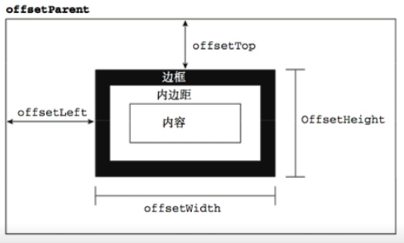

通过上图中的四个重要属性可以的得到元素的偏移量：

属性名称|含义
---|---
`offsetHeight` | 元素在垂直方向上占用的空间大小，以像素为单位。包括元素的高度、（可见的）水平滚动条的高度、上边框高度和下边框高度。
`offsetWidth` | 元素在水平方向上占用的空间大小，以像素为单位。包括元素的宽度、（可见的）垂直滚动条的宽度、左边框和右边框的宽度。
`offsetLeft` | 元素的左外边框到包含元素的左内边框之间的像素距离
`offsetTop` | 元素的上外边框到包含元素的上内边框之间的像素距离

```javascript

```

#### 8.1.7.2 客户区大小

元素的客户区大小（client dimension）指的是元素内容及其内边距所占据的空间大小。

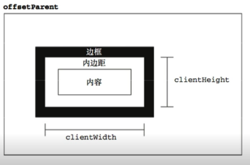

属性名|含义
---|---
`clientWidth` | 元素内容区宽度加上左右内边距宽度
`clientHeight` | 元素内容区高度加上上下内边距高度

```javascript

```

#### 8.1.7.3 滚动大小

滚动大小（scroll dimension）指的是包含滚动内容的元素的大小。

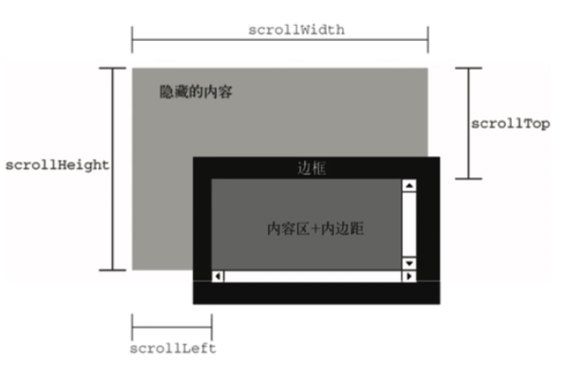

属性|含义
---|---
`scrollHeight` | 在没有滚动条的情况下，元素内容的总高度
`scrollWidth` | 在没有滚动条的情况下，元素内容的总宽度 
`scrollLeft` | 被隐藏在内容区域左侧的像素数，通过设置该属性可以改变元素的滚动位置 
`scrollTop` | 被隐藏在内容区域上方的像素数，通过设置该属性可以改变元素的滚动位置  

```javascript

```

#### 8.1.7.4 确定元素大小

IE、FireFox3+、Safari4+、Opera 9.5 及 Chrome 为每个元素都提供了一个 `getBoundingClientRect()` 方法。该方法会返回一个矩形对象，包含四个属性：left、top、right、bottom。这些属性指定了元素在页面中相对于视口（浏览器的可见区域）的位置。

注意：IE8 及更早版本认为文档的左上角坐标是 `(2,2)`, 而 IE9 及其他浏览器则将 `(0,0)` 作为起点坐标。

```javascript

```

#### 8.1.7.5 图片懒加载示例

以上讲述的元素大小内容在以下场景中会有较频繁的使用：

* 图片懒加载问题

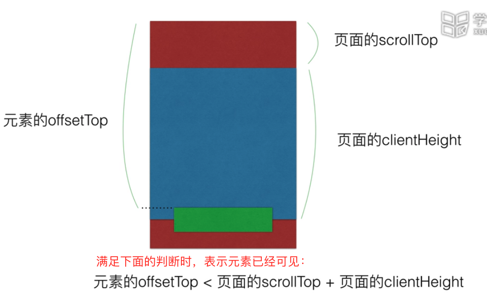

未做懒加载的情况：

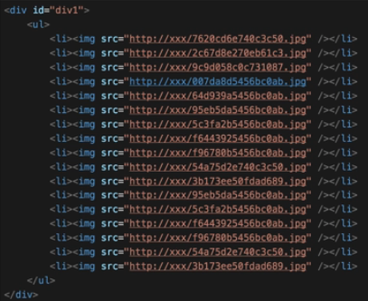

上图中直接定义图片，这样页面显示的时候会比较消耗流量，客户体验不好，而且会存在性能问题。

使用懒加载时需要先使用 `data-src` 替代 `src`:

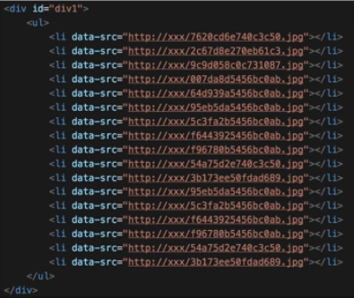

然后通过如下代码加载图片：

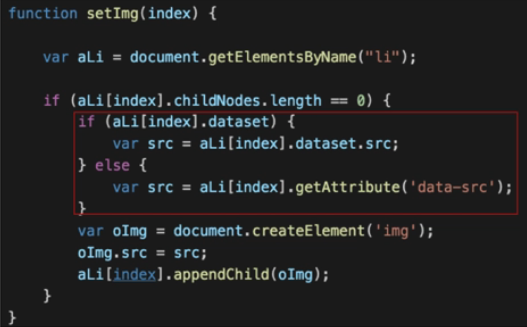

获取元素距离页面顶部的距离：

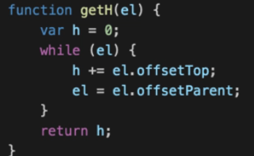

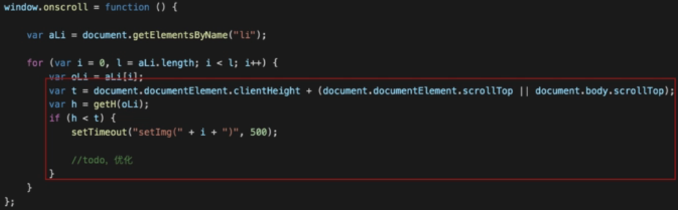


## 8.2 事件

JS 与 HTML 之间的交互时通过事件实现的。事件就是文档或浏览器窗口中发生的一些特定的交互瞬间。

### 8.2.1 事件流

**事件流**用来判断页面中的哪一部分拥有某个特定的事件，它描述的是从页面中接收事件的顺序。

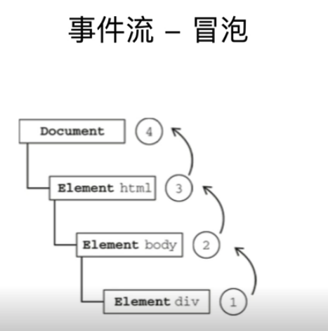

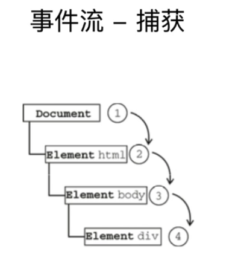

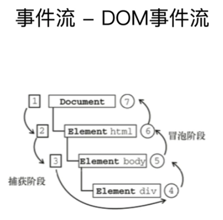

DOM 事件流是对冒泡事件流和捕获事件流的整合。

### 8.2.2 事件处理

事件就是用户或浏览器自身执行的某种动作。如 click、load、mouseover 都是事件的名称，响应某个事件的函数就叫做事件处理程序（或事件侦听器）。

事件处理程序的名字以 `on` 开头，因此 click 事件对应的处理程序为 `onclick`，load 事件对应的处理程序为 `onload`。

#### 8.2.2.1 HTML 事件处理程序

#### 8.2.2.2 DOM0 事件处理程序

#### 8.2.2.3 DOM2 事件处理程序

#### 8.2.2.4 IE 事件处理程序

#### 8.2.2.5 跨浏览器的事件处理程序


### 8.2.3 事件对象

#### 8.2.3.1 DOM 中的事件对象

#### 8.2.3.2 IE 中的事件对象

#### 8.2.3.3 跨浏览器的事件对象


### 8.2.4 事件类型

### 8.2.5 事件代理


## 8.3 JSON 和服务端通信
