2020-01-03

文中内容基于：[黑马/传智播客的《Web前端入门教程》](http://yun.itheima.com/course/267.html)中的 CSS 部分。

* [WebStorm使用指南](https://www.jetbrains.com/help/webstorm/getting-started-with-webstorm.html)
* [WebStorm激活参考](https://www.cnblogs.com/zzguan/p/11669895.html)

## 一、CSS基本介绍

###(1)、概念介绍

原 H5 中结构和样式混乱，所以需要 CSS 样式。

基本原则：结构和样式分离，即H5 只写结构，CSS 写样式

**CSS （Cascading Sytle Sheets）层叠样式表，也叫 级联样式表**。主要用于设置 HTML  页面中文本内容（字体、大小、对齐方式等）、图片的外形（宽高、边框、边距等）以及其他版面布局和外观系那是样式。

### (2)、基本格式

CSS 的基本格式如下

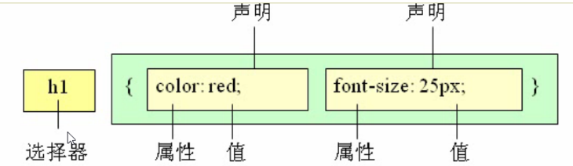

在上图中，

* `选择器`即 H5 标签对象，
* `{ }` 花括号内是需要修改的属性和值
* 属性和值以 `键值对` 的形式展现，二者之间使用 `：` 冒号分隔
* 多个 `键值对` 之间，使用英文 `;` 分号分隔


###(3)、示例

* 页面结构体放在 `<body></body>` 之间
* 页面样式（CSS）根标签为 `<style> </style>`, 放在 `<head></head>` 之间，

```html
<!DOCTYPE html>
<html lang="en">
<head>
    <meta charset="UTF-8">
    <title>V3 体会 CSS 样式 </title>
    <style>
        h1 {
            color: orange;
        }

        p {
            color: #f0f;
        }
    </style>
</head>
<body>
	<h1>这是一号标题</h1>
	<p>这是 p 段落内容</p>
</body>
</html>
```

上述代码的显示结果如下：


## 二、字体样式

* `font-size` 字号大小
* `font-family` 字体
* `CSS Unicode` 字体
* `font-weight` 字体粗细
* `font-style` 字体风格
* `font` 综合设置字体样式（重要）

### (1)、`font-size` 字号大小

* 相对的长度单位

单位|说明
---|---
em | 相对于当前对象内文本的字体尺寸
px | 像素，最常用，并且也推荐使用

* 绝对长度单位

单位|说明
---|---
in | 英寸
cm | 厘米
mm | 毫米
pt | 点

* 尽量使用偶数字号，ie6 等老版本的浏览器使用奇数字号会有问题
* 

示例：

```html
<!DOCTYPE html>
<html lang="en">
<head>
    <meta charset="UTF-8">
    <title>V5-字体大小</title>
    <style>
        h2 {
            font-size: 20px;
            color: pink;
        }

        h4 {
            font-size: 20px;
            color: orange;
        }

        p {
            font-size: 14px;
        }
    </style>
</head>
<body>
<h2>企业简介</h2>
<h4>公司由来</h4>
<p>公司由来的一堆介绍文本</p>

</body>
</html>
```
代码显示结果如下：

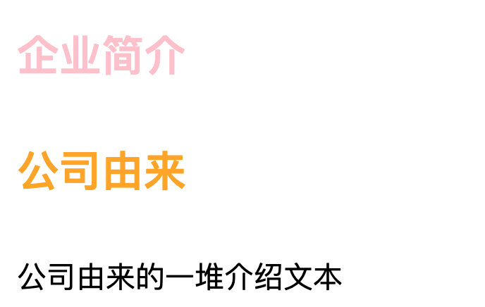

### (2)、`font-family` 字体

####(1)、字体基本介绍
网页中常用的字体有 ：微软雅黑、宋体、黑体等

* **可以同时指定多个字体，多个字体之间使用 英文逗号 `,` 隔开**，如果浏览器不支持前面的字体，会自动尝试后面的字体，直到找到合适的字体。
* 字体为汉字时需要加上英文双引号`" "`, 字体为英文时不需要引号。
* 设置字体时，英文字体通常在中文字体之前。
* 如果字体名称中有 空格、`#`、`$` 等符号时，该字体必须使用英文双引号括起来，比如 `font-family:"Times New Roman"`
* 尽量使用系统默认字体（宋体和微软雅黑），保证在任何用户的浏览器中都可以正确显示。

```html
<!DOCTYPE html>
<html lang="en">
<head>
    <meta charset="UTF-8">
    <title>V6-字体</title>
    <style>
        h2 {
            font-size: 20px;
            color: pink;
            font-family: sans-serif, "Microsoft YaHei", "宋体";
        }
    </style>
</head>
<body>
<h2>企业简介</h2>
</body>
</html>
```

####(2)、Unicode 字体

* 尽量使用 Unicode 字体，兼容性更好；
* 而且必须要有 微软雅黑和宋体，因为大部分系统都支持这两种。

部分浏览器中直接使用字体的中文名称可能会有编码问题，为了避免这个情况，我们除了可以使用字体的英文名称以外，还可以使用该字体的 Unicode 编码。

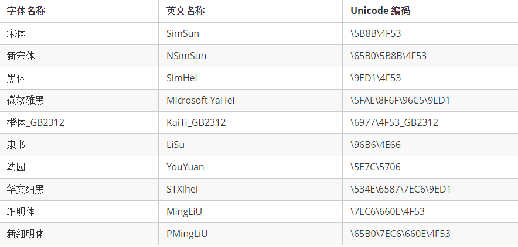

```html
<!DOCTYPE html>
<html lang="en">
<head>
    <meta charset="UTF-8">
    <title>V7-字体</title>
    <style>
        h4 {
            font-size: 20px;
            color: orange;
            font-family: "\5B8B\4F53", serif;
        }
    </style>
</head>
<body>
<h2>企业简介</h2>
<h4>公司由来</h4>
</body>
</html>
```

### (3)、CSS 的注释

CSS 的注释格式为：`/* 注释内容*/`

### (4)、`font-weight` 字体粗细

字体加粗除了使用 `<b></b>` 和 `<strong></strong>` 标签之外，也可以使用 CSS 样式来实现。

`font-weight` 用于定义字体的粗细，属性值有:

*  `normal` 、
* `bold`、
* `bolder`、
* `lighter` 
* 或者 100-900 (需要是 100 的整数倍)，通常数字 `400` 等价于 `normal` , `700` 等价于 `bold`

```html
<!DOCTYPE html>
<html lang="en">
<head>
    <meta charset="UTF-8">
    <title>V9-字体大小</title>
    <style>
        p {
            font-weight: bold;
        }

        strong {
            /*将 strong 修改为普通粗细*/
            font-weight: normal;
        }

        b {
            /*将 b 修改为普通粗细*/
            font-weight: 400;
        }
    </style>
</head>
<body>
<strong>企业简介</strong>
<br/>
<b>公司由来</b>
<p>公司由来的一堆介绍文本</p>

</body>
</html>
```

显示效果如下：

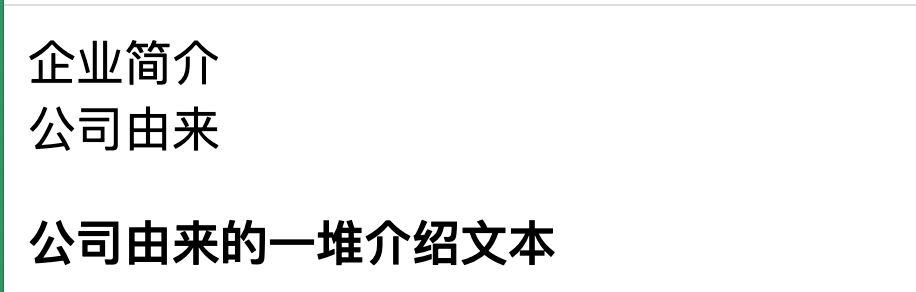

### (5)、`font-style` 字体风格

字体的倾斜可以用 `<i></i>`、`<em></em>` 之外，也可以使用 CSS 来实现

`font-style` 用于定义字体风格，如：斜体、倾斜、或正常字体，其属性值如下：

* `normal` 默认值，标准字体样式
* `italic` 斜体
* `oblique` 倾斜

```html
<!DOCTYPE html>
<html lang="en">
<head>
    <meta charset="UTF-8">
    <title>V9-字体大小</title>
    <style>
        p {
            /*设置倾斜字体*/
            font-style: italic;
        }

        em {
            /*将斜体变为正常字体*/
            font-style: normal;
        }

    </style>
</head>
<body>
</p><i>公司简介</i></p>
<p><em>公司由来</em></p>
<p>公司由来的一堆介绍文本</p>

</body>
</html>
```

显示效果：

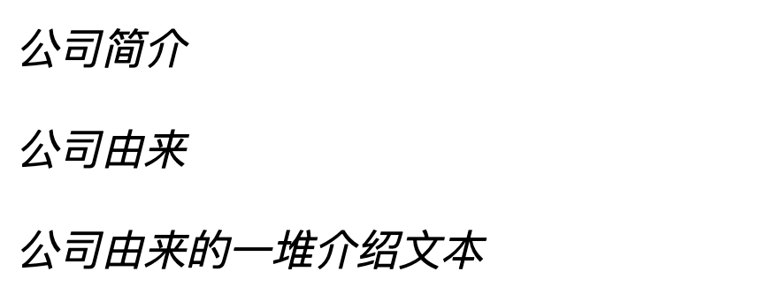

### (6)、`font` 字体综合设定

`font` 用于对字体样式进行综合设置，其基本语法如下：

```
选择器{ font: font-style  font-weight  font-size/line-height font-family;}
```

* 使用 `font` 时，必须按上面语法格式中的顺序书写，不能更换顺序，各属性之间以空格分开
* 不需要设置的属性可以省略，但 `font-size` `font-family` 必须要有，否则 `font` 属性无效

```html
<!DOCTYPE html>
<html lang="en">
<head>
    <meta charset="UTF-8">
    <title>V9-字体大小</title>
    <style>
        p {
            /* font 中的固定顺序为：font-style  font-weight  字号  字体;
                多属性之间使用空格分开，顺序不能调整；不需要的内容可以省略，但
                字号和字体必须要有
            */
            font: italic normal 14px "Microsoft YaHei";
            color: red;
        }

        i {
            font: 16px "Microsoft YaHei";
            color: yellowgreen;
        }

    </style>
</head>
<body>
</p><i>公司简介</i></p>
<p><em>公司由来</em></p>
<p>公司由来的一堆介绍文本</p>

</body>
</html>
```

显示效果：

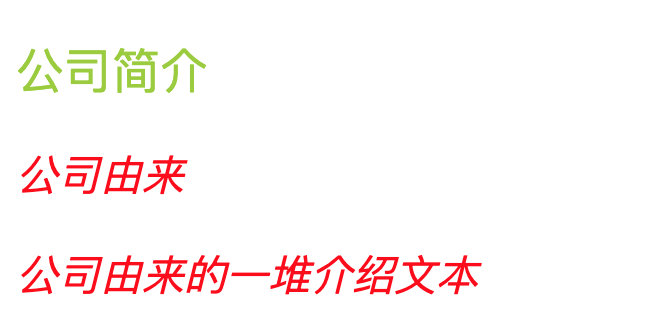

## 三、chrome 调试工具

在 Chrome 浏览器页面中右击空白处，然后选择 `检查`

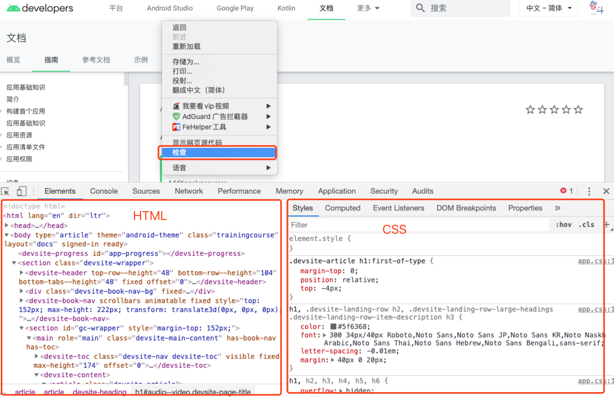

在上图中，左侧为 html 源码内容（即 页面结构），右侧为 CSS 内容.

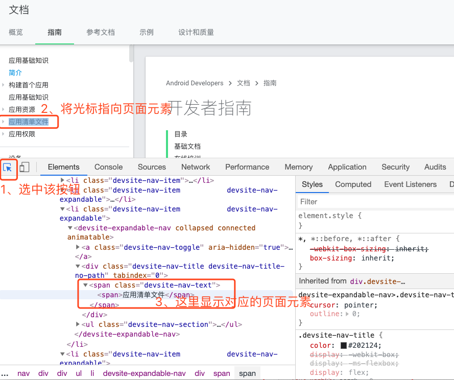

在上图中，先点击 `1` 位置的箭头，然后将光标放到页面元素上，然后在 html 源码区域就会显示当前选中的页面元素源码。

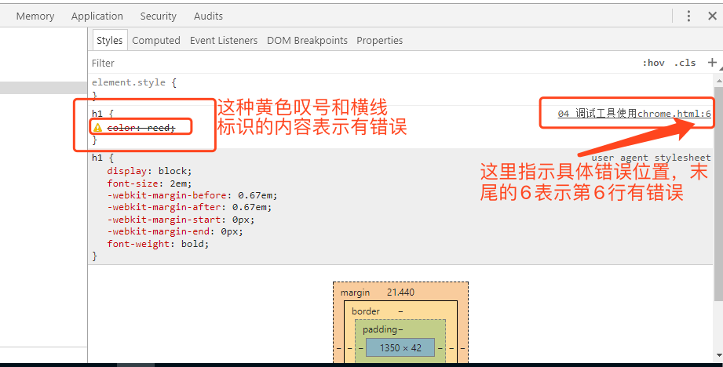

如上图所示，如果 CSS 样式中有问题，那么就会显示一个黄色的叹号提示以及对应的横线样式，并会在最右侧显示错误的具体位置。

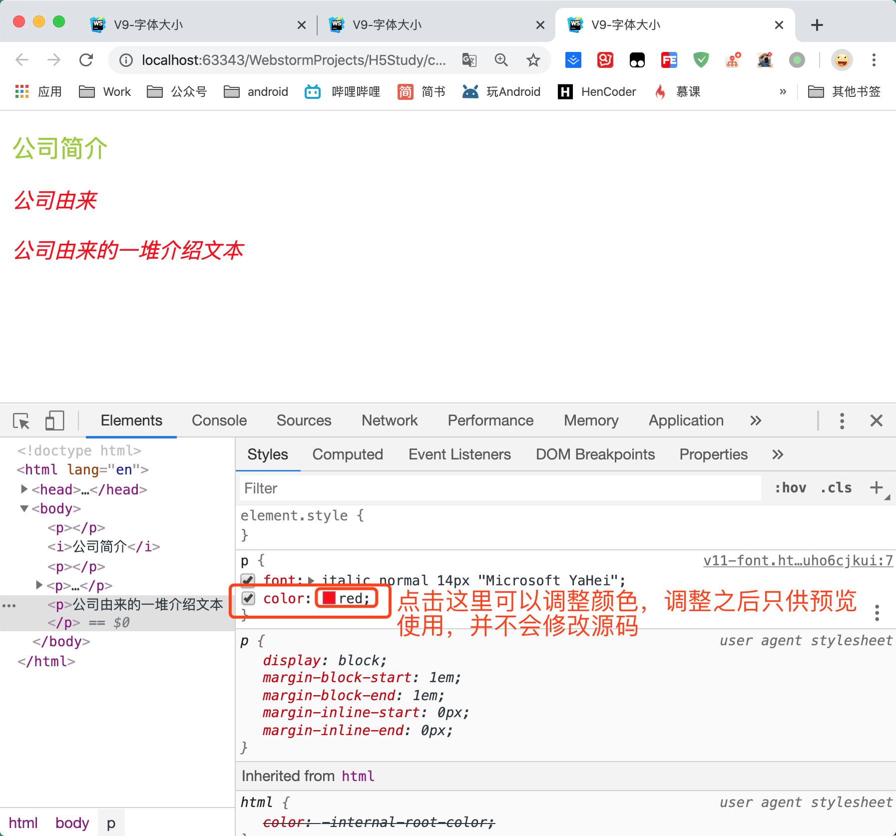

如上图，我们可以直接在调试工具中修改 CSS 的内容，修改之后界面会随之发生变化，但这种修改只针对预览有效，不会修改源码。


## 四、选择器（重点）

要想将 CSS 样式应用于特定的 HTML  元素，首先需要找到该目标元素。在 CSS 中，执行该任务的样式规则被称为 `选择器 (选择符)`。

### (1)、标签选择器（元素选择器）

**标签选择器**是指用 HTML 标签名称作为选择器，按标签名称分类，为页面中某一类标签指定统一的 CSS 样式。其基本语法格式如下：

* `标签名 { 属性1:属性值1 ; 属性2:属性值2 ; 属性3:属性值3;  }` 
* 或者  `元素名 { 属性1:属性值1 ; 属性2:属性值2 ; 属性3:属性值3;  }` 

标签选择器最大的有点是：能快速为页面中同类型的标签统一样式，同时这也是它的缺点——不能设计差异化样式。

```html
<!DOCTYPE html>
<html lang="en">
<head>
    <meta charset="UTF-8">
    <title>V9-字体大小</title>
    <style>
        p {
            /*以标签分类的称为 标签选择器*/
            font: italic normal 14px "Microsoft YaHei";
            color: red;
        }

        div {
            /*以标签分类的称为 标签选择器*/
            font: 16px "Microsoft YaHei";
            color: yellowgreen;
        }

    </style>
</head>
<body>
<p>白展堂</p>
<p>吕秀才</p>
<p>李大嘴</p>

<div>鸣人</div>
<div>佐助</div>
<div>卡卡西</div>
</body>
</html>
```

### (2)、类选择器

#### 1)、类选择器

类选择器使用 `英文句号 . ` 进行标识，后面紧跟类名，其基本语法格式为:`.类名 { 属性1:属性值1 ; 属性2:属性值2 ; 属性3:属性值3; }`  

标签调用时使用 `class=“类名”` 即可。

类选择器最大的优势是可以为元素对象定义单独或相同的样式。

```html
<!DOCTYPE html>
<html lang="en">
<head>
    <meta charset="UTF-8">
    <title>V9-字体大小</title>
    <style>
        .mingren {
            /*声明类样式*/
            color: red;
        }

        .zuozhu {
            color: yellowgreen;
        }

        .kakaxi {
            font-size: 24px;
        }
    </style>
</head>
<body>

<!--调用类样式-->
<div class="mingren">鸣人</div>
<div class="zuozhu">佐助</div>
<div class="kakaxi">卡卡西</div>
</body>
</html>
```

显示效果：

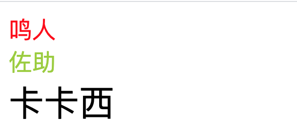

#### 2)、CSS 标签命名规范

* 长名称或词组可以使用**中横线 - **为选择器命名
* 不建议使用**下划线 _** 来命名 CSS 选择器。（可能会有兼容问题）
* 不要用纯数字或者中文命名

#### 3)、课堂案例--Google 的 logo

```html
<!DOCTYPE html>
<html lang="en">
<head>
    <meta charset="UTF-8">
    <title>V9-字体大小</title>
    <style>
        span {
            font-size: 26px;
        }

        .c-blue {
            color: blue;
        }

        .c-red {
            color: red;
        }

        .c-orange {
            color: orange;
        }

        .c-green {
            color: green;
        }
    </style>
</head>
<body>
<span class="c-blue">G</span>
<span class="c-red">o</span>
<span class="c-orange">o</span>
<span class="c-blue">g</span>
<span class="c-green">l</span>
<span class="c-red">e</span>
</body>
</html>
```
显示效果如下： 

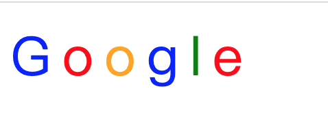

### (3)、多类名选择器

`<div class="cover  J-cover"></div>`，像这种一个 HTML 元素引用多个类名的情况，就称为多类名选择器。多用于负责的页面布局中。

* 样式显示效果与 HTML 元素中类名的先后顺序无关，而是**取决于 CSS 样式书写的上下顺序**
* 各类名之间使用空格分开。

```html
<!DOCTYPE html>
<html lang="en">
<head>
    <meta charset="UTF-8">
    <title>V9-字体大小</title>
    <style>
        .font-14 {
            font-size: 14px;
        }

        .font-20 {
            font-size: 20px;
        }

        .c-red {
            color: red;
        }
    </style>
</head>
<body>
<!--多类名选择器，使用空格分割-->
<div class="font-14 c-red">亚瑟</div>
<!--在 style 中 font-20 后定义，所以，最终 font-20 生效-->
<div class="font-14 font-20">刘备</div>
<!--在 style 中 font-20 后定义，所以，font-20 为最终效果-->
<div class="font-20 font-14 c-red">安其拉</div>
</body>
</html>
```

显示效果：

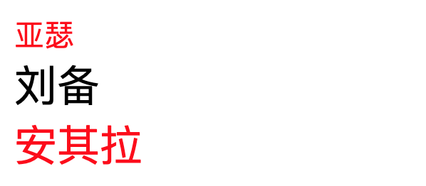

### (4)、`id` 选择器

`id  选择器` 使用 `#` 进行标识，后面紧跟 `id 名称` , 其基本语法为：`#id 名 { 属性1:属性值1 ; 属性2:属性值2; 属性3:属性值3; }`

* 该语法中，`id 名` 即为 HTML 元素的 id 属性值，
* 大多数 HTML 元素都可以定义 id 属性，
* 元素的 id 是唯一的，只能对应文档中某一个具体的元素

> id 选择器的用法基本等同于类选择器。

```html
<!DOCTYPE html>
<html lang="en">
<head>
    <meta charset="UTF-8">
    <title>V9-字体大小</title>
    <style>
        <!--标签选择器，以#开头-- >
        #big-bear {
            font-size: 14px;
            color: red;
        }

        .small-bear {
            color: green;
            font-size: 20px;
        }

    </style>
</head>
<body>
<div id="big-bear">熊大</div>
<div class="small-bear">熊二</div>
</body>
</html>
```

显示效果：

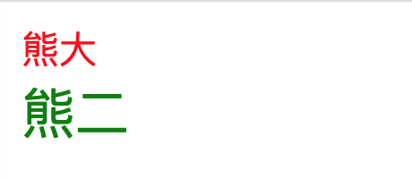

### (5)、`id` 选择器和类选择器的区别

* **类选择器** 好比人的名字，是可以重复使用的——重名
* **id选择器** 好比人的身份证号，是不会重复的，一人只能有一个身份证号

### (6)、通配符选择器

通配符选择器用 `*` 表示，是所有选择器中作用范围最广的，能匹配页面中所有的元素，其基本语法如下：

`* { 属性1:属性值1; 属性2:属性值2; 属性3:属性值3; }`

```html
<!DOCTYPE html>
<html lang="en">
<head>
    <meta charset="UTF-8">
    <title>V9-字体大小</title>
    <style>
        * {
            /*通配符选择器会改变全部，慎用*/
            font-size: 14px;
            color: red;
        }
    </style>
</head>
<body>
<p>熊大</p>
<div>熊二</div>
<span>光头强</span>
</body>
</html>
```


### (7)、伪类选择器

伪类选择器用于向某些选择器添加特殊的效果。比如给链接添加特殊效果，比如可以选择第1个，第 N 个元素。

伪类选择器使用 `冒号 :` 标识，比如：`:link { }`

#### 1)、链接伪类选择器

* `:link`  未访问的链接
* `:visited` 已经访问过的链接
* `:hover` 鼠标移到链接上
* `:active` 点击未松开时

书写的时候，他们的顺序不能颠倒，按照 `lvha` 顺序书写——记忆法：`lv 的包包就是 hao`

```html
<!DOCTYPE html>
<html lang="en">
<head>
    <meta charset="UTF-8">
    <title>V21-链接伪类选择器</title>
    <style>
        a:link {
            font-size: 14px;
            color: red;
        }

        a:visited {
            font-size: 18px;
            color: gray;
        }

        a:hover {
            font-size: 22px;
            color: green;
        }

        a:active {
            font-size: 24px;
            color: blue;
        }
    </style>
</head>
<body>
链接伪类选择器
<div><a href="#"> 点击有惊喜1</a></div>
</body>
</html>
```

显示效果1：未点击时的状态：


显示效果2：点击之后的状态：

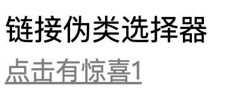

实际使用时，下面这种用法更多：

```html
<!DOCTYPE html>
<html lang="en">
<head>
    <meta charset="UTF-8">
    <title>V21-链接伪类选择器</title>
    <style>
        a {
            /*标签选择器*/
            font-weight: 700;
            font-size: 22px;
            color: gray;
        }

        a:hover {
            /*链接伪类选择器*/
            color: red;
        }
    </style>
</head>
<body>
链接伪类选择器
<div><a href="#"> 点击有惊喜1</a></div>
</body>
</html>
```		


#### 2)、结构(位置)伪类选择器

结构伪类选择器是 CSS3 中增加的内容。

* `:first-child`  选取属于其父元素的首个子元素的指定选择器
* `:last-child`  选取属于其父元素的最后一个子元素的指定选择器
* `:nth-child(n)`  选取属于其父元素第 N 个子元素的选择器，不关心子元素的类型
* `:nth-last-child(n)` 选取属于其父元素的倒数第 N 个子元素，不区分元素的类型
* 前面两个中的 `n` 可以是数字、关键词或公式

 ```html
<!DOCTYPE html>
<html lang="en">
<head>
    <meta charset="UTF-8">
    <title>V21-链接伪类选择器</title>
    <style>
        li:first-child {
            color: red;
            font-size: 14px;
        }

        li:last-child {
            color: orange;
            font-size: 24px;
        }

        li:nth-child(3) {
            color: magenta;
            font-size: 18px;
        }

        li:nth-last-child(3) {
            color: blue;
            font-size: 22px;
        }

        li:nth-child(even) {
            /*第偶数个元素的位置伪类选择器，传递 odd 则是选择第奇数个元素*/
            color: green;
            font-size: 20px;
        }

        li:nth-child(7n) {
            /*第8的倍数位置元素的伪类选择器，也可以传递诸如:2n+1 这种表达式*/
            font-size: 20px;
            color: pink;
        }
    </style>
</head>
<body>
<ul>
    <li>第1个子元素</li>
    <li>第2个子元素</li>
    <li>第3个子元素</li>
    <li>第4个子元素</li>
    <li>第5个子元素</li>
    <li>第6个子元素</li>
    <li>第7个子元素</li>
</ul>
</body>
</html>
 ```
 
 显示效果如下：
 
 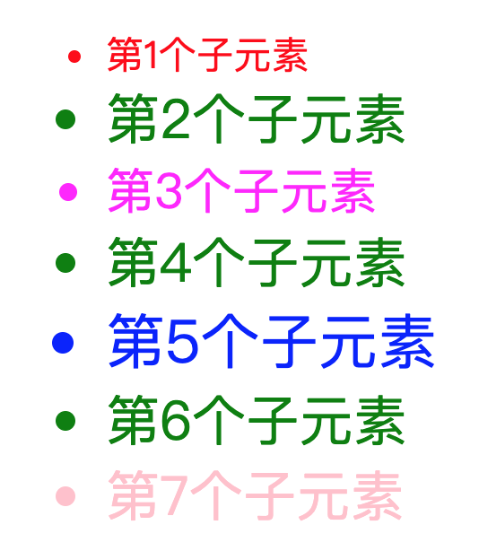


#### 3)、目标伪类选择器

目标伪类选择器用 `:target` 表示，可以用于选取当前活动的目标元素。

```html
<!DOCTYPE html>
<html lang="en">
<head>
    <meta charset="UTF-8">
    <title>V26-目标伪类选择器</title>
    <style>
        :target {
            /*目标选择器，作用于当前被选中的标签*/
            color: red;
        }
    </style>
</head>
<body>
<h4>
    <a href="#p1">标题1 </a>
</h4>
<h4>
    <a href="#p2">标题2 </a>
</h4>
<h4>
    <a href="#p3">标题3 </a>
</h4>
<h4>
    <a href="#p4">标题4 </a>
</h4>
<p id="p1"> 标题1的描述</p>
<p id="p2"> 标题2的描述</p>
<p id="p3"> 标题3的描述</p>
<p id="p4"> 标题4的描述</p>
</body>
</html>
```  

显示效果——初始进入页面的效果：

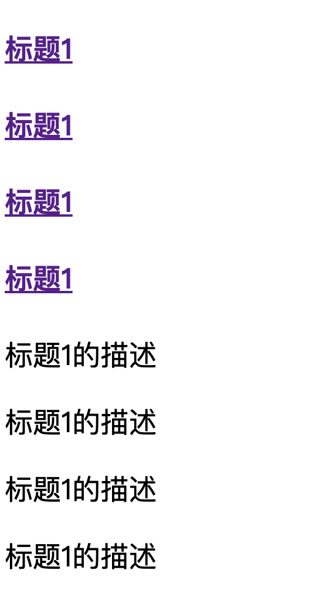

显示效果——某个内容被选中时的效果：

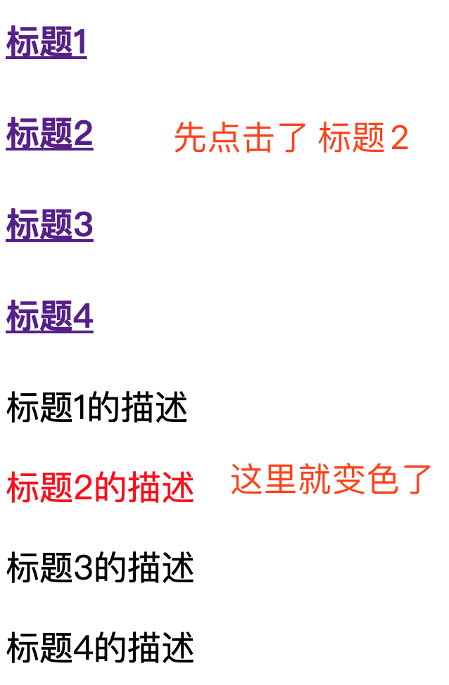

## 五 、CSS 外观属性

### (1)、`color` 文本颜色

`color` 用于定义文本颜色，其取值有如下三种类型：

* 预定义的颜色值，如 `red` 、`blue` 、`green` 等
* 十六进制颜色值（最常用的方式），如 `#FF0000` 等
* RGB 代码，如 红色可以表示为 `rgb(255,0,0)` 或 `rgb(100%,0%,0%)`

需要注意：使用 RGB 代码时，如果某项取值为 0 ，百分号 `%` 也不能省略 

```html
<!DOCTYPE html>
<html lang="en">
<head>
    <meta charset="UTF-8">
    <title>V27-文本颜色</title>
    <style>
        .c-red {
            color: red;
        }

        .c-green {
            /*等价于：#00FF00 , 两两相同可以简写为 #0F0*/
            color: #0F0;
        }

        #c-blue {
            color: rgb(0%, 0%, 100%)
        }
    </style>
</head>
<body>

<p class="c-red"> 标题1的描述</p>
<p class="c-green"> 标题2的描述</p>
<p id="c-blue"> 标题3的描述</p>
</body>
</html>
```

显示效果如下：

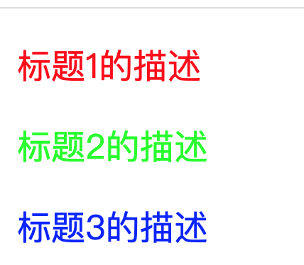

### (2)、`line-height` 行间距

`line-height` 用于设置行间距，即 字符之间的垂直距离。通常称为行高。常用的属性值单位有三种：

* 像素值 `px` (最常用)
* 相对值 `em`
* 百分比 `%`

通常情况下，行距比字号大 7 或 8 个像素即可。

```html
<!DOCTYPE html>
<html lang="en">
<head>
    <meta charset="UTF-8">
    <title>V27-文本颜色</title>
    <style>
        .c-red {
            color: red;
            font-size: 22px;
            line-height: 30px;
        }

        .c-green {
            /*等价于：#00FF00 , 两两相同可以简写为 #0F0*/
            color: #0F0;
            font-size: 13px;
            line-height: 20px;
        }

        #c-blue {
            color: rgb(0%, 0%, 100%)
        }

    </style>
</head>
<body>

<p class="c-red">
    标题1的描述标题1的描述标题1的描述标题1的描述标题1的描述</p>
<p class="c-green"> 标题2的描述标题2的描述标题2的描述标题2的描述标题2的描述标题2的描述标题2的描述</p>
<p id="c-blue"> 标题3的描述</p>
</body>
</html>
```

显示效果如下：

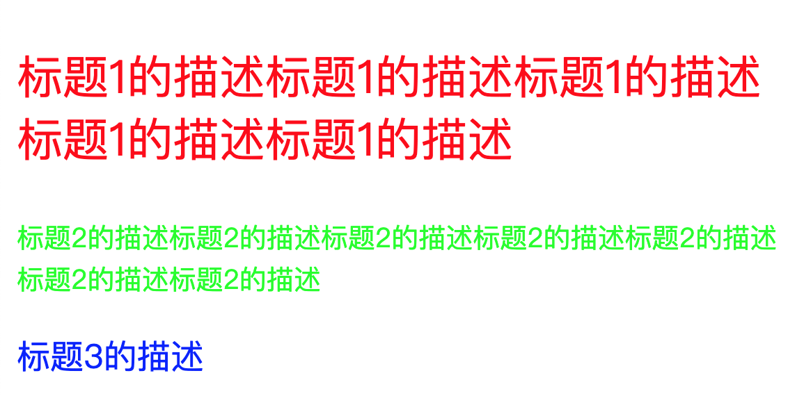


### (3)、`text-align` 水平对齐方式

`text-align` 用于设置文本内容的水平对齐，相当于 HTML 中的 `align` 对齐。取值有：

* `left` 左对齐（默认值）
* `right` 右对齐
*  `center` 居中对齐

```html
<!DOCTYPE html>
<html lang="en">
<head>
    <meta charset="UTF-8">
    <title>V27-文本颜色</title>
    <style>
        h4 {
            text-align: center;
        }

        #align-right {
            text-align: right;
        }

        .align-left {
            text-align: left;
        }
    </style>
</head>
<body>
<h4>这是标题1</h4>
<p class="align-left"> 标题1的描述</p>
<p id="align-right"> 标题1的描述</p>
</body>
</html>
```

显示效果：

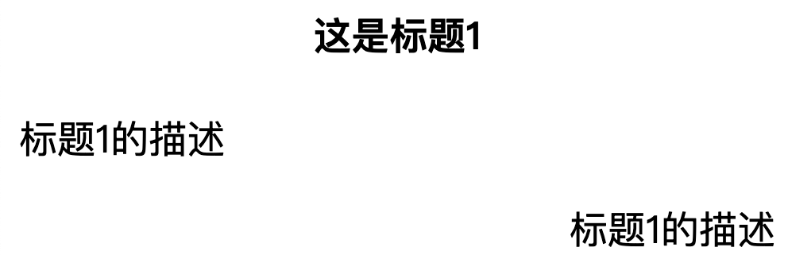

 
### (4)、`text-indent` 首行缩进

`text-indent` 用于设置文本的**首行缩进**，取值有：

* 可以是不同单位的数值
* `em` 字符宽度的倍数
* 相对于浏览器窗口宽度的百分比（%）
* 允许使用负值
* 建议使用 `em` 作为设置单位。`1em=1个汉字的宽度` 。

```html
<!DOCTYPE html>
<html lang="en">
<head>
    <meta charset="UTF-8">
    <title>V28-首行缩进</title>
    <style>
        .align-left {
            text-align: left;
            text-indent: 2em;
        }
    </style>
</head>
<body>
<p>普通文本无缩进普通文本无缩进普通文本无缩进普通文本无缩进普通文本无缩进</p>
<p class="align-left"> 首行缩进两个字符首行缩进两个字符首行缩进两个字符首行缩进两个字符</p>
<p class="align-left">ON THE 24th of February, 1810, the look-out at Notre-Dame de la Garde signalled the three-master,
    the Pharaon from Smyrna, Trieste, and Naples.</p>
</body>
</html>
```


### (5)、`letter-spacing` 字间距

`letter-spacing` 用于定义字间距（中英文字符均可以），即字符与字符之间的空白。取值可以是不同单位的数值，允许使用负值，默认为 `normal`

```html
<!DOCTYPE html>
<html lang="en">
<head>
    <meta charset="UTF-8">
    <title>V28-首行缩进</title>
    <style>
        .letter-spacing {
            letter-spacing: 8px;
        }
    </style>
</head>
<body bgcolor="#87ceeb">
<p>普通文本字间距</p>
<p class="letter-spacing">修改普通文本字间距</p>

</body>
</html>
```

显示效果：

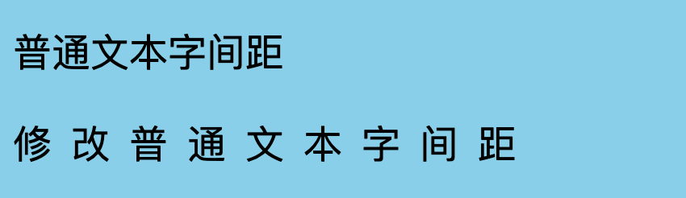


### (6)、`word-spacing` 单词间距

`word-spacing` 用于**定义英文单词之间的间距，对中文字符无效。** 取值可以为不同单位的数值，允许使用负值，默认为 `normal`。

```html
<!DOCTYPE html>
<html lang="en">
<head>
    <meta charset="UTF-8">
    <title>V28-首行缩进</title>
    <style>
        .word-spacing {
            word-spacing: 10px;
        }
    </style>
</head>
<body bgcolor="#87ceeb">
<p class="word-spacing">词间距对汉字无效</p>
<p>ON THE 24th of February, 1810, the look-out at Notre-Dame de la Garde signalled the
    three-master, the Pharaon from Smyrna, Trieste, and Naples.</p>
<p class="word-spacing">ON THE 24th of February, 1810, the look-out at Notre-Dame de la Garde signalled the
    three-master, the Pharaon from Smyrna, Trieste, and Naples.</p>
</body>
</html>
```

显示效果：

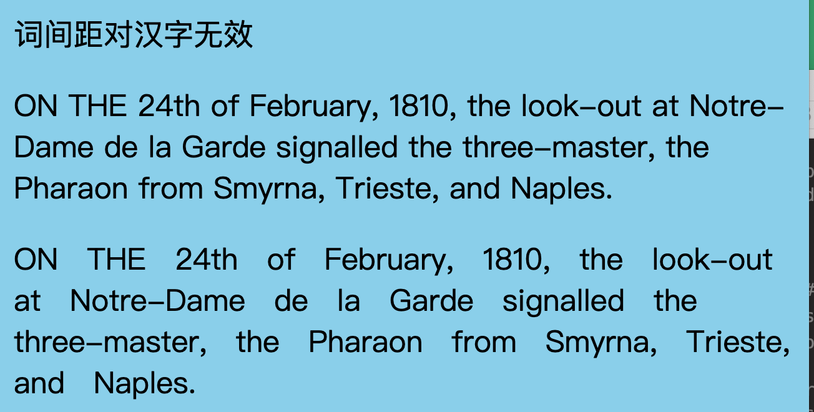

### (7)、`word-break` 自动换行

取值有：

* `normal` 使用浏览器默认的换行规则
* `break-all` 允许在单词内换行
* `keep-all` 只能在半角空格或连字符处换行

```html
<!DOCTYPE html>
<html lang="en">
<head>
    <meta charset="UTF-8">
    <title>V28-首行缩进</title>
    <style>
        .word-break-normal {
            word-break: normal;
        }

        .word-break-all {
            word-break: break-all;
        }

        .word-break-keep-all {
            word-break: keep-all;
        }

    </style>
</head>
<body bgcolor="#87ceeb">
<p class="word-break-normal">ON THE 24th of February, 1810, the look-out at Notre-Dame de la Garde signalled the
    three-master, the Pharaon from Smyrna, Trieste, and Naples.</p>
<p class="word-break-all">ON THE 24th of February, 1810, the look-out at Notre-Dame de la Garde signalled the
    three-master, the Pharaon from Smyrna, Trieste, and Naples.</p>
<p class="word-break-keep-all">ON THE 24th of February, 1810, the look-out at Notre-Dame de la Garde signalled the
    three-master, the Pharaon from Smyrna, Trieste, and Naples.</p>
</body>
</html>
```

显示效果：


### (9)、颜色半透明

在 CSS3 中可以给文字设置半透明颜色，格式为：`color : rgba (r,g,b,a)` ，其中的 `a` 即 `alpha` 透明度。

`r`、`g`、`b` 的取值范围是 `0~255`，`a` 的取值范围是 `0~1` 之间的小数。

```html
<!DOCTYPE html>
<html lang="en">
<head>
    <meta charset="UTF-8">
    <title>V28-首行缩进</title>
    <style>
        .c-red {
            color: rgb(100%, 0%, 0%);
        }

        .c-red-alpha {
            color: rgba(255, 0, 0, 0.5);
        }
    </style>
</head>
<body bgcolor="#87ceeb">
<p class="c-red">普通文本</p>
<p class="c-red-alpha">半透明文本</p>

</body>
</html>
```

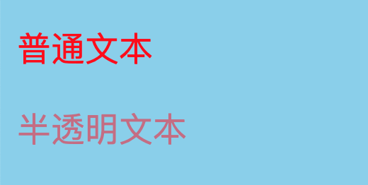

### (10)、文字阴影

`text-shadow` 表示文字阴影效果，是 CSS3 中增加的内容。语法格式为：`text-shadow : 水平位置 垂直位置 模糊距离 阴影颜色;`

属性|描述
---|---
`h-shadow` | 必需，水平阴影的位置，允许负值
`v-shadow` | 必需，垂直阴影的位置，允许负值
`blur` | 可选，模糊的距离
`color` | 可选，阴影的颜色

```html
<!DOCTYPE html>
<html lang="en">
<head>
    <meta charset="UTF-8">
    <title>V28-首行缩进</title>
    <style>
        #shadow1 {
            font-size: 20px;
            text-shadow: 4px 4px 4px rgba(255, 0, 0, 0.8);
        }

        #shadow2 {
            font-size: 20px;
            text-shadow: 1px 2px 3px rgba(255, 0, 0, 0.8);
        }

        #shadow3 {
            font-size: 20px;
            text-shadow: 1px 2px;
        }
    </style>
</head>
<body bgcolor="#87ceeb">
<p>普通文本</p>
<p id="shadow1">阴影文本1</p>
<p id="shadow2">阴影文本2</p>
<p id="shadow3">阴影文本3</p>

</body>
</html>
```

显示效果：

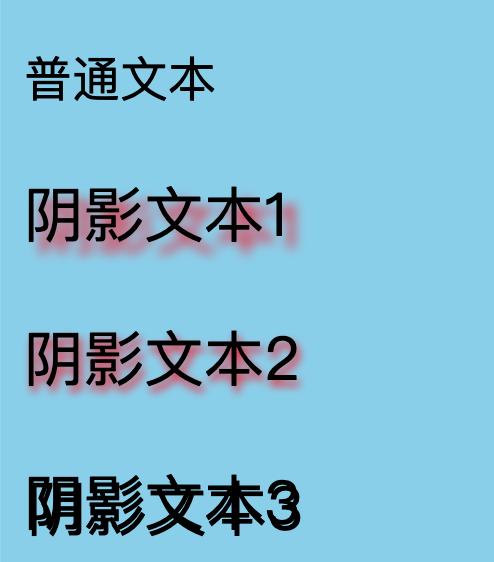

### (11)、综合案例

* 在使用链接伪类标签时，可以使用 `a:hover{ }` , 但这样会对全部的 `<a></a>` 生效。
* 也可以使用 `.链接类名:hover{ }` , 这样**只对对应类名的 `<a></a>` 生效**
           
```html
<!DOCTYPE html>
<html lang="en">
<head>
    <meta charset="UTF-8">
    <title>V31-综合案例</title>
    <style>
        body {
            color: #3e3e3e;
        }

        h1 {
            font-size: 20px;
            font-weight: normal;
            text-align: center;
        }

        div {
            font-size: 12px;
            text-align: center;
        }

        .news-source {
            color: #ff620e;
        }

        #look-num {
            color: green;
        }

        .collect {
            color: yellow;
        }

        .collect:hover {
            /*在使用链接伪类标签时，可以使用 a:hover ,这样会对全部的 <a></a> 生效
            也可以使用 .链接类名:hover , 这样只对对应类名的 <a></a> 生效 */
            color: red;
            font-size: 15px;
        }

        p {
            font-size: 14px;
            text-indent: 2em;
            line-height: 22px;
        }

        em {
            /*让倾斜的内容正常显示*/
            color: #51b7eb;
            font-style: normal;
        }

    </style>
</head>
<body bgcolor="#C5ECFF">

<h1>山东舰文创全球首发</h1>
<div>2020年1月08日 16:16 &nbsp;&nbsp;&nbsp;&nbsp; 来源:
    <span class="news-source"> 百度新闻</span>
    <a href="#" id="look-num">666人查看</a>
    <a href="#" class="collect">收藏本文</a>
</div>
<hr/>

<p>
    <em>[央视网消息]</em>：昨天（7日），中国首艘国产航空母舰山东舰舰徽舰标设计理念及相关文创产品全球首发仪式在军事博物馆举行，中国军事文创从这里迈开步伐。
</p>
</body>
</html>
```

显示效果:

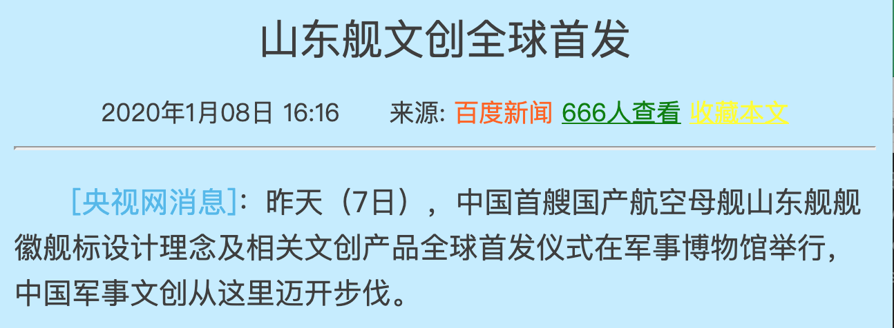

---

## 六 、引入 CSS 样式表

根据 CSS 样式表的书写位置，样式表可以分为：内部样式表（内嵌式）、行内样式表（内联式）、外部样式表（外链式）。

### (1)、内部样式表

`内部样式表` 就是指将 CSS 代码写在 HTML 文档的 `head` 头部标签中, 并且用 `style` 标签定义，基本语法如下：

```html
<head>
    <style type="text/css">
        标签名: { 属性1 : 属性值1; 属性2 : 属性值2;}
    </style>
</head>
```

* `style` 标签通常位于 `head` 标签中的 `title` 标签之后，也可以放在 HTML 文档的任意位置（不推荐）。
* 在 html5 中可以省略 `type="text/css"` 

### (2)、行内样式表（内联样式）

`行内样式` 又称为：内联样式、行间样式。是通过**标签的 style 属性** 来设置元素的样式。其基本语法格式如下：

`<标签名 style="属性1 : 属性值1 ; 属性2 : 属性值2;">内容</标签名>`

* 任何 HTML 标签都有可以用来设置行内样式的 `style` 属性，其书写规范同普通 CSS 样式。
* 行内样式只对其所在的标签及嵌套在其中的子标签起作用。
* 通常适用于样式比较少的情况

```html
<!DOCTYPE html>
<html lang="en">
<head>
    <meta charset="UTF-8">
    <title>1-内嵌样式表</title>
</head>
<body>

<div style="color: red">行内样式表</div>

</body>
</html>
```


### (3)、外部样式表（外链式）

将所有的样式放到一个或多个以 `.css` 为扩展名的外部样式表文件中，通过 `link` 标签将外部样式表文件链接到 HTML 文档中，这些 `.css` 文件就称为`外部样式表` 又称 `外链式样式表`。

基本语法如下：

```html
<head>
	<link href="css文件的路径" type="text/css" rel="stylesheet"/>
</head>
``` 

* **link 是自闭合标签**
* `link` 标签需要放在 `head` 头部标签中，并且必须制定 `link` 标签的三个属性，分别为:
	* `href` 定义所链接外部样式表文件的 url , 可以是相对路径，也可以是绝对路径。
	* `type` 定义所链接文档的类型，在这里需要制定为 `text/CSS` ，表示链接的外部文件为 CSS 样式表。
	* `rel` 定义当前文档与被链接文档之间的关系，在这里需要指定为 `stylesheet` ，表示被链接的文档是一个样式表文件。

html 文件内容：

```html
<!DOCTYPE html>
<html lang="en">
<head>
    <meta charset="UTF-8">
    <title>2-外链样式表</title>
    <link href="style.css" type="text/css" rel="stylesheet"/>
</head>
<body>

<div>外链样式表</div>

</body>
</html>
```	 

css 文件内容：

```css
div {
    color: red;
}
```

显示结果：

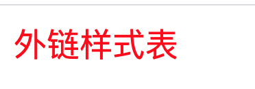

### (4)、三种样式表总结

样式表|优点|缺点|使用情况|控制范围
---|---|---|---|---
行内样式表 | 书写方便，权重高 | 没有实现样式和结构分离 | 较少 | 控制一个标签（少）
内部样式表 | 部分结构和样式相分离 | 没有彻底分离 | 较多 | 控制一个页面（中）
外部样式表 | 完全实现结构和样式相分离 | 需要引入 | 最多，推荐 | 控制整个站点（多）

  

## 七 、标签显示模式（display）

### (1)、块级元素（`block-level`）

每个块元素通常会独自**占一整行或多行**，可以对其设置宽度、高度、对齐等属性，常用于网页布局和网页结构的搭建。

常见的块元素有 `<h1>~<h6>`、 `<p>`、 `<div>`、 `<ul>`、 `<ol>` 、`<li>`  

块级元素的特点如下：

* 总是从新行开始
* **高度、行高、外边距以及内边距都可以控制**
* 宽度默认是容器的 100%
* 可以容纳内联元素和其他块元素

### (2)、行内元素（`inline-level`）

`行内元素` 也叫 `内联元素` ，不占有独立的区域，仅靠自身的字体大小和图像尺寸来支撑结构，一般不可以设置宽度、高度、对齐方式等属性，常用于控制页面中文本的样式。

常见的行内元素有：`<a>`、`<strong>`、`<b>`、`<em>`、`<i>`、`<del>`、`<s>`、`<ins>`、 `<u>`、`<span>` 等。

行内元素的特点：

* 和相邻行内元素在一行上
* **高、宽无效，但水平方向的 `padding` 和 `margin` 可以设置，垂直方向的无效。**
* 默认宽度就是它本身内容的宽度。
* 行内元素只能容纳文本或者其他行内元素。（`<a>` 标签除外）

注意:

* 只有文字才能组成段落，因此 `<p>` 内不能放块级元素，同理，还有 `<h1>`、`<h2>`、`<h3>`、`<h4>`、`<h5>`、`<h6>`、`<dt>` ，他们都是文字类块级标签，里面不能再放其他块级元素
* 链接内部不能再放链接

### (3)、行内块元素（`inline-block`）

在行内元素中，有几个特殊的标签 ``、`<input/>`、`<dt>`, 可以对他们设置宽高和对齐属性，有些资料中会把他们称为 `行内块元素`。

行内块元素的特点有：

* 和相邻行内元素（行内块）在同一行，但是之间会有空白间隙
* 默认宽度就是它本身内容的宽度
* **高度、行高、外边距以及其内边距均可以控制**

### (4)、标签显示模式转换

* 块转行内：`display:inline;`
* 行内转块：`display:block;`
* 块、行内元素转为行内块：`display:inline-block;`

```html
<!DOCTYPE html>
<html lang="en">
<head>
    <meta charset="UTF-8">
    <title>3-显示模式</title>
    <style>
        div {
            /*div 是块级元素，强制转为行内元素*/
            display: inline;
        }

        span {
            /*span 是行内元素。强制改为 块元素*/
            display: block;
        }

        a {
            /*强制修改 行内元素 为 行内块元素*/
            display: inline-block;
            width: 150px;
        }
    </style>
</head>
<body bgcolor="#C5ECFF">

<div>div是块元素</div>
<div>div是块元素</div>
<div>div是块元素</div>

<span>span是行内元素</span>
<span>span是行内元素</span>
<span>span是行内元素</span>

<a href="#">a是行内元素</a>
<a href="#">a是行内元素</a>
<a href="#">a是行内元素</a>

</body>
</html>
```

显示效果:

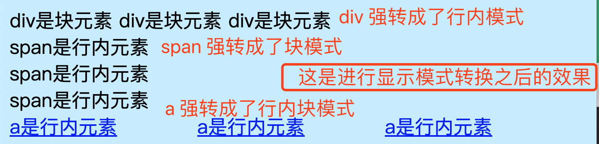

## 八、CSS 复合选择器

CSS 复合选择器是由两个或多个基础选择器通过不同方式组合而成的，目的是为了可以选择更准确更精细的目标元素标签。

### (1)、交集选择器

交集选择器是由两个选择器构成，其中第一个为 `标签选择器`，第二个为 `类（class）选择器`，两个选择器之间不能有空格。如 `h3.special`，表示选择的是 类名为 `.special` 的 h3 标签。

书写格式如下：

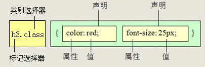 

>相对使用较少，不推荐使用。

```html
<!DOCTYPE html>
<html lang="en">
<head>
    <meta charset="UTF-8">
    <title>3-显示模式</title>
    <style>
        .c-red {
            color: red;
        }

        p.c-red {
            /*交集选择器，p 标签在引用时，直接使用 class="c-red" 即可*/
            font-size: 22px;
            font-weight: bold;
        }
    </style>
</head>
<body bgcolor="#C5ECFF">
<div class="c-red">熊大</div>
<p class="c-red">熊二</p>
</body>
</html>
```

显示效果：

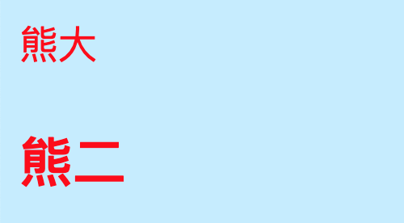

### (2)、并集选择器

并集选择器（CSS 选择器分组）是各个选择器通过 `逗号 , ` 链接而成的，任何形式的选择器（包括标签选择器、class 类选择器、id 选择器等）都可以作为并集选择器的一部分。

如果某些选择器定义的样式完全相同，或部分相同，就可以利用并集选择器为它们定义相同的 CSS 样式。也就是说，并集选择器通常用于集体声明。

并集选择器的语法格式如下:

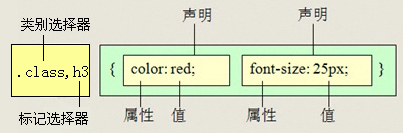

如：`.one , p , #test { color : #F00; }` 表示 `.one` 、`p` 、`#test` 这三个选择器都会执行将颜色变为红色的操作。

 ```html
 <!DOCTYPE html>
<html lang="en">
<head>
    <meta charset="UTF-8">
    <title>3-显示模式</title>
    <style>
        /*多个并集选择器通常竖着写*/
        #bear-small,
        span,
        div,
        .king {
            color: red;
            font-size: 18px;
            font-weight: normal;
        }

    </style>
</head>
<body bgcolor="#C5ECFF">
<div>熊大</div>
<p id="bear-small">熊二</p>
<span>光头强</span>
<h1>还有谁？</h1>
<h1 class="king">吉吉大王</h1>
</body>
</html>
 ```
 
 显示效果：
 
 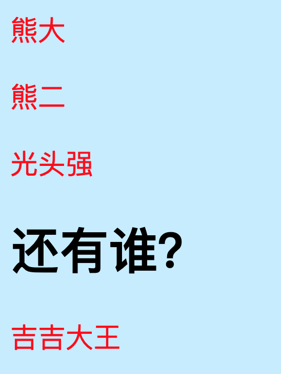

### (3)、后代选择器

`后代选择器`又称为`包含选择器`, 用来选择元素或元素组的后代，其写法就是**把外层标签写在前面，内层标签写在后面，中间用空格分隔**。当标签发生嵌套时，内层标签就成为外层标签的后代。

其书写格式如下:

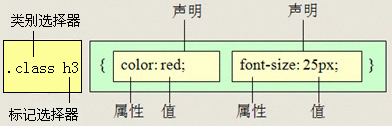

也可以按照这种格式写： `  div p {  color: red ;  font-size: 18px; }` ,  表示将 `div` 内部的 `p` 设置成红色，并修改字号为 18px。

注意：**这里的后代包括儿子、孙子、重孙子等。**

```html
<!DOCTYPE html>
<html lang="en">
<head>
    <meta charset="UTF-8">
    <title>3-显示模式</title>
    <style>
        /*后代选择器写法1*/
        div p {
            color: red;
            font-size: 18px;
            font-weight: normal;
        }

        /*后代选择器写法2*/
        .big-bear p {
            color: green;
            font-weight: bold;
            font-style: italic;
        }
    </style>
</head>
<body bgcolor="#C5ECFF">

<div>
    <p>熊大</p>
</div>
<div class="big-bear">
    <div>
    <p>熊二</p>
    </div>
</div>

</body>
</html>
```

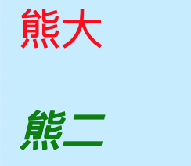

### (4)、子元素选择器

`子元素选择器` 只能选择某个元素的子元素。其写法是 **把父级标签写前面，子级标签写后面，中间跟一个 `>` 连接**。注意，**符号左右需要各保留一个空格**。

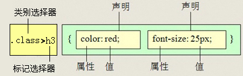

注意：这里说的 `子` 仅指儿子，不包含孙子或重孙子。

如：`.demo > h3 {color : red}` ，表示 `h3` 是 `.demo` 的一级子标签，将其修改为红色

```html
<!DOCTYPE html>
<html lang="en">
<head>
    <meta charset="UTF-8">
    <title>3-显示模式</title>
    <style>
        .nav li{
            color: green;
        }

        .nav > li {
            color: red;
        }
    </style>
</head>
<body bgcolor="#C5ECFF">

<ul class="nav">
    <li> 一级列表使用子元素选择器
        <ul>
            <li>二级列表</li>
            <li>二级列表</li>
            <li>二级列表</li>
        </ul>
    </li>
</ul>

</body>
</html>
```
显示效果如下:

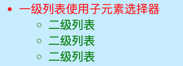

### (5)、测试题

要求：在不修改代码的前提下，

* 1、设置 登录 为红色，同时主导航栏中的所有连接改为蓝色
* 2、主导航栏和测导航栏中的文字都设置成 微软雅黑 14px
* 3、主导航栏中的一级菜单连接文字的颜色为绿色

```html
<!DOCTYPE html>
<html lang="en">
<head>
    <meta charset="UTF-8">
    <title>3-显示模式</title>
    <style>

    </style>
</head>
<body bgcolor="#C5ECFF">

<div class="nav">
    <ul>
        <li><a href="#">公司首页</a></li>
        <li><a href="#">公司简介</a></li>
        <li><a href="#">公司产品</a></li>
        <li>
            <a href="#">联系我们</a>
            <ul>
                <li><a href="#">公司邮箱</a></li>
                <li><a href="#">公司电话</a></li>
            </ul>
        </li>
    </ul>
</div>

<div class="site-nav">
    <div class="site-l">左侧导航朗</div>
    <div class="site-r"><a href="#">登录</a></div>
</div>

</body>
</html>
```

显示效果如下:


样式代码如下:

```html
<style>
        .site-r > a {
            /*子元素选择器*/
            color: red;
        }

        .nav a {
            /*后代选择器*/
            color: orange;
        }

        .nav,
        .site-nav {
            /*并集选择器*/
            /*font-family: "Microsoft YaHei";*/
            /*font-size: 14px;*/
            /*下面这一行是上面两行的简写模式*/
            font: 14px "Microsoft YaHei";
        }

        .nav > ul > li > a {
            /*子元素选择器*/
            color: green;
        }
    </style>
```

### (6)、属性选择器

选取带有某些指定属性的标签，基本格式为 `标签名[属性名]{ }`

选择器| 含义|
---|---|
`E[attr]` | 选取使用了 attr 属性的 E 标签|
`E [attr=val]`| 选取 attr 属性的值为 val 的 E  标签
`E [attr*=val]` | 属性值中包含 val 字符并且在 **任意** 位置的 E 标签
`E [attr^=val]` | 属性值中包含 val 字符并且在 **开始** 位置的 E 标签
`E [attr$=val]` | 属性值中包含 val 字符并且在 **结束** 位置的 E 标签

示例1：

```html
<!DOCTYPE html>
<html lang="en">
<head>
    <meta charset="UTF-8">
    <title>14-属性选择器</title>
    <style>
        a[title] {
            color: red;
        }

        input[type=text]{
            color: red;
        }

    </style>
</head>
<body bgcolor="#C5ECFF">
<a href="#" title="这是谷歌">谷歌</a>
<a href="#">百度</a>

<input type="text" value="请输入">
<input type="submit">
<input type="reset">
</body>
</html>
```

显示效果：

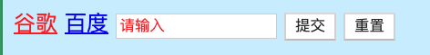

示例2：

```html
<!DOCTYPE html>
<html lang="en">
<head>
    <meta charset="UTF-8">
    <title>14-属性选择器2</title>
    <style>
        div[class^=font] {
            /* 属性值以 font 开头的 */
            color: red;
        }

        div[class$=font] {
            /* 属性值以 font 结尾的 */
            color: green;
        }

        div[ class*="text"] {
            /*属性值的任意位置包含 text 文本的*/
            color: #ff620e;
        }

    </style>
</head>
<body bgcolor="#C5ECFF">

<div class="font1">属性选择器示例2-class=font1</div>
<div class="font2">属性选择器示例2 class=font2</div>
<div class="1font">属性选择器示例2 class=1font</div>
<div class="2font">属性选择器示例2 class=2font</div>
<div class="text-style">属性选择器示例2 class=text-style</div>
<div class="style-text">属性选择器示例2 class=style-text</div>
<div class="style-text-s">属性选择器示例2 class=style-text-s</div>
</body>
</html>
```

显示效果:

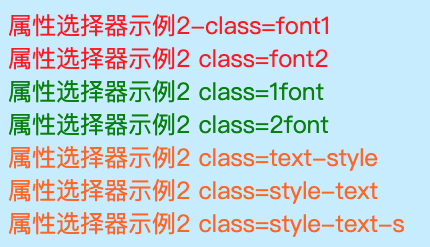


### (7)、伪元素选择器

格式|含义
---|---
`E::first-letter{ }` | 选择文本的第一个单词或字（英文中是单词，中日韩文中是字）
`E::first-line{ }` | 选择文本第一行
`E::selection` | 可改变选中文本的样式

```html
<!DOCTYPE html>
<html lang="en">
<head>
    <meta charset="UTF-8">
    <title>14-属性选择器2</title>
    <style>
        p:first-letter {
            /* 选择第一个单词或字*/
            color: red;
            font-size: 18px;
        }

        p:first-line {
            /*选择第一行*/
            color: green;
            font-size: 14px;
        }

        p::selection {
            /*更改被选中文本的样式*/
            color: #ff620e;
            font-size: 16px;
        }

    </style>
</head>
<body bgcolor="#C5ECFF">
<P>
    随便写一点文本内容，测试伪元素选择器。This is first letter.
</P>
</body>
</html>
```

显示效果:

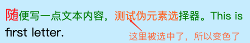

> `E:after` 和 `E:before` 在旧版本中是伪元素，CSS3 的规范中 `:` 用来表示伪类，`::` 用来表示伪元素，但在高版本浏览器下  `E:after` 和 `E:before` 会被自动识别为  `E::after` 和 `E::before`, 这样做的目的是为了做兼容。

```html
<!DOCTYPE html>
<html lang="en">
<head>
    <meta charset="UTF-8">
    <title>14-属性选择器2</title>
    <style>
       div:before{
           content: "在div内容的前面插入，";
       }
        div:after{
            content: "  在div的后面补上。";
        }

    </style>
</head>
<body bgcolor="#C5ECFF">

<div>今年。</div>

</body>
</html>
```

显示效果如下:

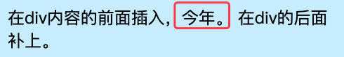

* 类选择器、伪类选择器、伪元素选择器格式对比

格式|含义
---|---
 `.xxx` |表示类选择器
 `:xxx` |表示伪类选择器
 `::xxx` |表示伪元素选择器 

## 九、CSS 背景（background）

### (1)、背景颜色（` background-color`）

```html
<!DOCTYPE html>
<html lang="en">
<head>
    <meta charset="UTF-8">
    <title>14-属性选择器2</title>
    <style>
        div {
            background-color: #51b7eb;
        }
    </style>
</head>
<body bgcolor="#C5ECFF">

<div>这是div</div>

</body>
</html>
```

显示效果:

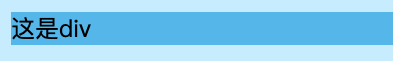

### (2)、背景图片（`background-image`）

```html
<!DOCTYPE html>
<html lang="en">
<head>
    <meta charset="UTF-8">
    <title>18-背景图片</title>
    <style>
        div {
            height: 160px;
            width: 300px;
            background-image: url("../../assets/image/small_logo.png");
        }
    </style>
</head>
<body bgcolor="#C5ECFF">
<div>这是div</div>
</body>
</html>
```

显示效果:


CSS背景图片与CSS文件的位置:

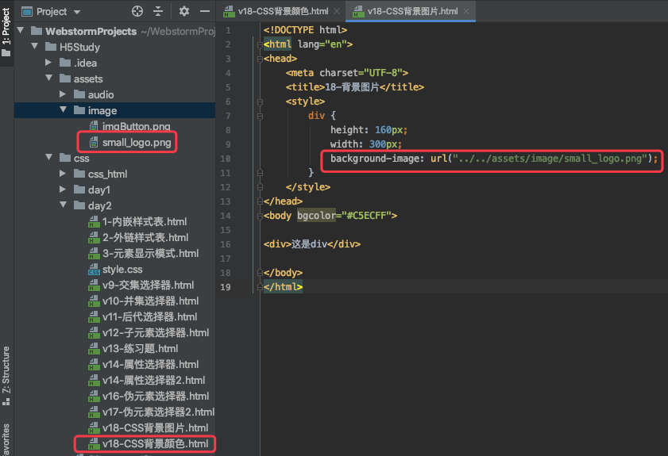

### (3)、背景图片的平铺（`background-repeat`）

```html
<!DOCTYPE html>
<html lang="en">
<head>
    <meta charset="UTF-8">
    <title>18-背景图片</title>
    <style>
        div {
            height: 160px;
            width: 300px;
            background-repeat: no-repeat;
            background-color: pink;
            background-image: url("../../assets/image/small_logo.png");
        }
    </style>
</head>
<body bgcolor="#C5ECFF">

<div>背景图片不平铺： background-repeat: no-repeat;</div>

</body>
</html>
```

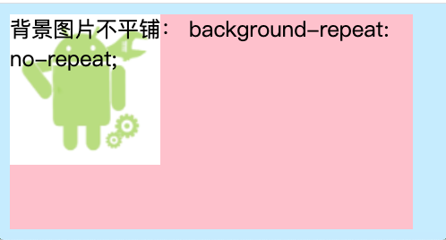

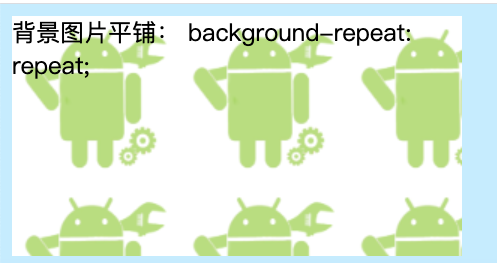

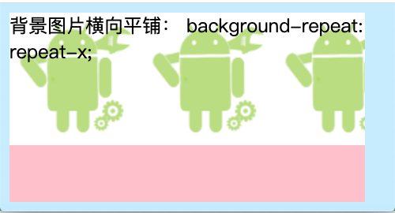


### (4)、背景位置（`background-position`）

语法格式:

* `background-position: length  length;`
* `background-position: position  position;`

参数:

* length : 百分数 | 由浮点数数字和单位标识符组成的长度值
* position : top | center | bottom | left | right 

说明:

* 设置或检索对象的背景图像位置时，必须先指定 `background-image` 属性，默认值为 : `(0% 0%)`
* 如果只指定了一个值，该值将用于横向坐标；纵向坐标默认 50% ，第二个值是用来设置纵向坐标的
* 当使用精确值 px 或其他单位时可以使用 `-15px` 之类的负数。

注意:

* position 后面是 X 坐标和 Y 坐标，可以使用方位名词或者精确单位。
* 如果 position 后面都是方位名词，二者不区分顺序，即 `top center` 等价于 `center top`
* 如果精确单位和方位名词混合使用，则必须是 X 坐标在前，Y 坐标在后。比如：`background-position : 15px top`, 则 15px 是控制 X  坐标，top 控制 Y 坐标。 而 ` background-position: center 15px;` 则表示  X 坐标居中，Y 坐标距顶部 15px.

示例1：

```html
<!DOCTYPE html>
<html lang="en">
<head>
    <meta charset="UTF-8">
    <title>20-背景位置</title>
    <style>
        div {
            height: 200px;
            width: 180px;
            background-image: url("../../assets/image/small_logo.png");
            background-repeat: no-repeat;
            background-color: pink;
            /* background-position: center top; 等价于 background-position: top center;*/
            background-position: top center;
        }

    </style>
</head>
<body bgcolor="#C5ECFF">

<div>背景图片居于 top center</div>

</body>
</html>
```

显示效果如下:

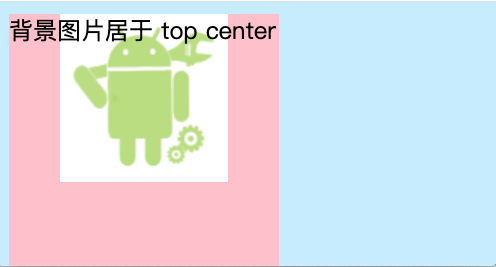

示例2：

```html
<!DOCTYPE html>
<html lang="en">
<head>
    <meta charset="UTF-8">
    <title>20-背景位置</title>
    <style>
        div {
            height: 200px;
            width: 180px;
            background-image: url("../../assets/image/small_logo.png");
            background-repeat: no-repeat;
            background-color: pink;
            /* 方位只写一个时，控制 X 坐标，Y 坐标默认居 50%*/
            background-position:  right;
        }

    </style>
</head>
<body bgcolor="#C5ECFF">

<div>背景图片居于  right</div>

</body>
</html>
```

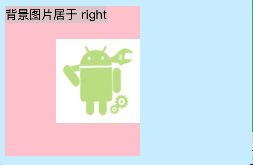

示例3：

```html
<!DOCTYPE html>
<html lang="en">
<head>
    <meta charset="UTF-8">
    <title>20-背景位置</title>
    <style>
        div {
            height: 200px;
            width: 180px;
            background-image: url("../../assets/image/small_logo.png");
            background-repeat: no-repeat;
            background-color: pink;
            background-position: 10% 20%;
        }

    </style>
</head>
<body bgcolor="#C5ECFF">

<div>背景图片居于 10% 20%</div>

</body>
</html>
```

显示效果:

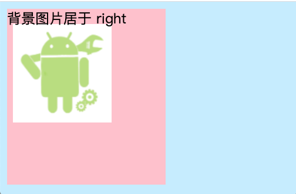

示例4:

```html
<!DOCTYPE html>
<html lang="en">
<head>
    <meta charset="UTF-8">
    <title>20-背景位置</title>
    <style>
        div {
            height: 200px;
            width: 180px;
            background-image: url("../../assets/image/small_logo.png");
            background-repeat: no-repeat;
            background-color: pink;
            background-position: 20px 40px;
        }

    </style>
</head>
<body bgcolor="#C5ECFF">

<div>背景图片居于 20px 40px</div>

</body>
</html>
```

显示效果：

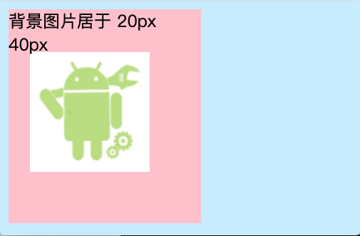

示例5:

```html
<!DOCTYPE html>
<html lang="en">
<head>
    <meta charset="UTF-8">
    <title>20-背景位置</title>
    <style>
        div {
            height: 200px;
            width: 180px;
            background-image: url("../../assets/image/small_logo.png");
            background-repeat: no-repeat;
            background-color: pink;
            background-position: 20px 20%;
        }

    </style>
</head>
<body bgcolor="#C5ECFF">

<div>背景图片居于 20px 20%</div>

</body>
</html>
```

显示效果:

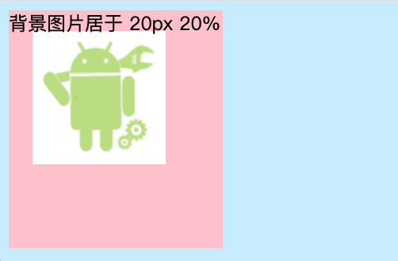

示例6:

```html
<!DOCTYPE html>
<html lang="en">
<head>
    <meta charset="UTF-8">
    <title>20-背景位置</title>
    <style>
        div {
            height: 200px;
            width: 180px;
            background-image: url("../../assets/image/small_logo.png");
            background-repeat: no-repeat;
            background-color: pink;
            background-position: 15px center;
        }

    </style>
</head>
<body bgcolor="#C5ECFF">

<div>背景图片居于 left 20%</div>

</body>
</html>
```

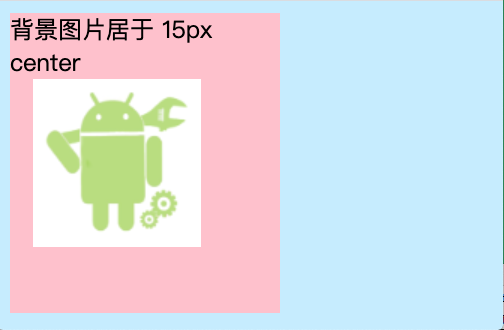


### (5)、背景附着（`background-attachment`）

* 用来设置背景图片是随着界面元素内容滚动还是固定。取值有：`scroll` 、`fixed`.
* `background-attachment` 默认值 `scroll`, 即 背景会滚动; `fixed` 表示背景固定不动

```html
<!DOCTYPE html>
<html lang="en">
<head>
    <meta charset="UTF-8">
    <title>22-CSS 背景案例</title>
    <style>
        div {
            height: 200px;
            width: 260px;
            background-image: url("../../assets/image/imgButton.png");
            background-repeat: no-repeat;
            background-color: pink;
            background-position: left -25px;
            background-attachment: scroll;
        }

    </style>
</head>
<body bgcolor="#C5ECFF">

<div>
    background-position: left -25px;
    <br>
    background-attachment: scroll;

    <br>
    <br>
    background-position: left -25px;
    <br>
    background-attachment: scroll;

    <br>
    <br>
    background-position: left -25px;
    <br>
    background-attachment: scroll;

    <br>
    <br>
    background-position: left -25px;
    <br>
    background-attachment: scroll;

    <br>
    这是最后一句了，后面没有了
</div>

</body>
</html>
```

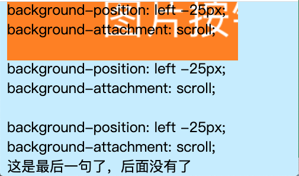

### (6)、背景简写（`background`）

`background` 属性可以组合 背景颜色、背景图地址、背景平铺模式、背景附着模式、背景位置。官方对于这些组合的书写顺序没做要求。但建议按如下格式书写：

`background : transparent  url(image.png)   repeat-y  scroll  50%  0 ` 

即：`background : 背景颜色  背景图片 背景平铺  背景滚动  背景位置 `

```html
<!DOCTYPE html>
<html lang="en">
<head>
    <meta charset="UTF-8">
    <title>22-CSS 背景案例</title>
    <style>
        div {
            height: 200px;
            width: 260px;
            /*background-image: url("../../assets/image/imgButton.png");*/
            /*background-repeat: no-repeat;*/
            /*background-color: pink;*/
            /*background-position: left -25px;*/
            /*background-attachment: scroll;*/
            /*上面的内容可以简写为下面的一句代码*/
            background: pink url("../../assets/image/small_logo.png") no-repeat scroll 50% bottom;
        }

    </style>
</head>
<body bgcolor="#C5ECFF">

<div>
    background-position: left -25px;
    <br>
    background-attachment: scroll;

    <br>
    <br>
    background-position: left -25px;
    <br>
    background-attachment: scroll;

    <br>
    <br>
    background-position: left -25px;
    <br>
    background-attachment: scroll;

    <br>
    <br>
    background-position: left -25px;
    <br>
    background-attachment: scroll;

    <br>
    这是最后一句了，后面没有了
</div>

</body>
</html>
```

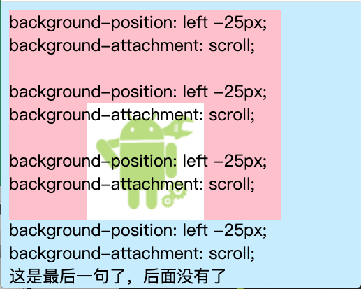


### (7)、背景透明（CSS3）

CSS3 支持背景半透明的写法，语法格式为：`background : rgba (0 , 0 , 0 , 0.3);`

`r`、`g`、`b` 的取值范围是 `0~255`，`a` 取值范围 `0~1` 之间。背景半透明是指 **盒子** 背景半透明，内容不受影响。

```html
<!DOCTYPE html>
<html lang="en">
<head>
    <meta charset="UTF-8">
    <title>25-CSS 背景半透明</title>
    <style>
        body {
            background: #C5ECFF url("../../assets/image/small_logo.png") no-repeat top;
        }

        div {
            height: 80px;
            background: rgba(0, 0, 0, 0.5);
        }

    </style>
</head>
<body>
<div>
    背景半透明

    div {
        height: 80px;
        background: rgba(0, 0, 0, 0.5);
    }

</div>
</body>
</html>
```

显示效果如下：

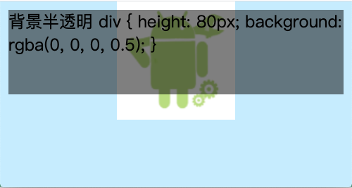

### (8)、背景缩放（`background-size`）-CSS3

通过 `background-size` 设置**背景图片的尺寸**，如同设置 img 的尺寸一样，在移动 Web 开发中做屏幕适配应用非常广泛。其参数设置如下：

* 可以设置长度单位（px）或百分比（设置百分比时参照盒子的宽高）, 只写一个值时为等比例缩放，写两个值则按照设置值缩放。
* 设置为 `cover` 时，会自动调整缩放比例，保证图片始终填充满背景区域，如有溢出部分则会被隐藏。
* 设置为 `contain` 时会自动调整缩放比例，保证图片始终完整显示在背景区域。

#### 1）、背景未缩放的示例

```html
<!DOCTYPE html>
<html lang="en">
<head>
    <meta charset="UTF-8">
    <title>26-CSS 背景缩放</title>
    <style>
        body {
            background-color: #C5ECFF
        }

        div {
            width: 260px;
            height: 160px;
            background: pink url("../../assets/image/small_logo.png") no-repeat top left;
            /*background-size: contain;*/
        }
    </style>
</head>
<body>
<div>
    背景未做缩放
</div>
</body>
</html>
``` 

背景未做缩放时的效果：

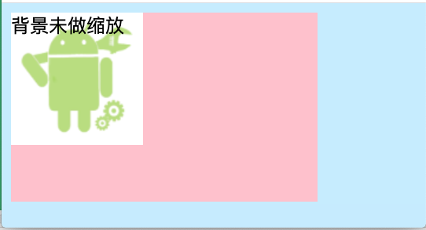
 
#### 2）、按照指定的值缩放背景
 
 ```html
 <!DOCTYPE html>
<html lang="en">
<head>
    <meta charset="UTF-8">
    <title>26-CSS 背景缩放</title>
    <style>
        body {
            background-color: #C5ECFF
        }

        div {
            width: 260px;
            height: 160px;
            background: pink url("../../assets/image/small_logo.png") no-repeat top left;
            /* 设置背景图片的具体大小 */
            background-size: 180px 200px;
        }
    </style>
</head>
<body>
<div>
    背景未做缩放
</div>
</body>
</html>
 ```
 
 显示效果：
 
 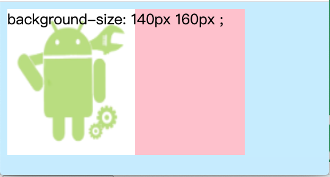
 
#### 3）、背景等比例缩放

```html
/* 只设置一个值时 等比例缩放*/
background-size: 140px ;
``` 
 
 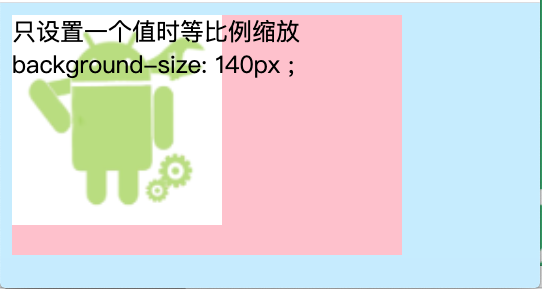
 
#### 4）、使用百分比实现背景等比例缩放

```html
/* 只设置一个值时 等比例缩放*/
background-size: 50%;
``` 
 
  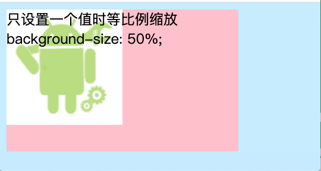
 
#### 5）、保证盒子全都被背景图填充--`cover`

```html
    background-size: cover;
``` 
 
 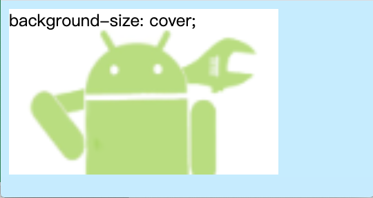
  
#### 6）、保证背景图片能显示完整--`contain`

```html
    background-size: contain;
``` 
 
 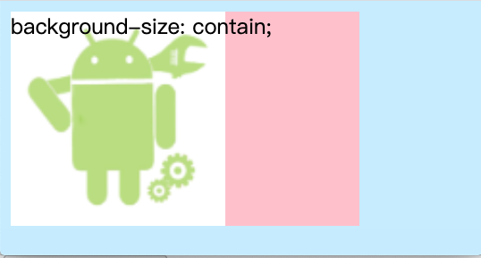
 


### (9)、多背景（CSS3）

以逗号分隔可以设置多背景，多用于自适应布局。

* 一个元素可以设置多重背景图像
* 每组属性之间使用逗号分隔。
* 如果设置的多重背景图之间存在交集，先添加的会覆盖后添加的（即 先添加的显示权重高）
* 为了避免背景色将图像盖住，背景色通常定义在最后一组。

核心代码为：

```html
 background: url("../../assets/image/small_logo.png") no-repeat top left,
            pink url("../../assets/image/imgButton.png") no-repeat top left;
```

完整示例如下 :

```html
<!DOCTYPE html>
<html lang="en">
<head>
    <meta charset="UTF-8">
    <title>26-CSS 背景缩放</title>
    <style>
        body {
            background-color: #C5ECFF
        }

        div {
            height: 300px;
            background: url("../../assets/image/small_logo.png") no-repeat top left,
            pink url("../../assets/image/imgButton.png") no-repeat top left;
        }
    </style>
</head>
<body>
<div>
    background-size: contain;
</div>
</body>
</html>
```

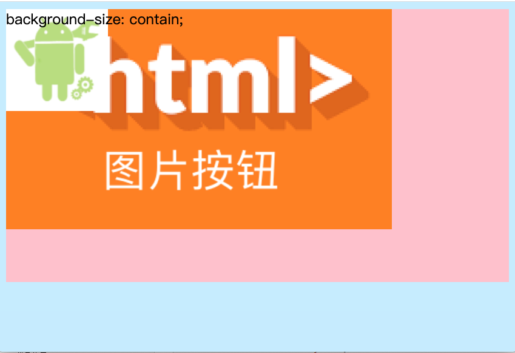

### (10)、凹凸文字

同设置多重背景一样，也可以为文本设置多重阴影 `text-shadow`，从而实现凹凸文字效果。 多个阴影效果之间也是使用 逗号 分割。

```html
<!DOCTYPE html>
<html lang="en">
<head>
    <meta charset="UTF-8">
    <title>v28-CSS多背景图.html</title>
    <style>
        body {
            background-color: #cccc
        }

        div{
            /* 700 表示加粗程度*/
            font: 700 50px "Microsoft YaHei";
            color: #ccc;
        }

        /*伪类选择器*/
        div:first-child{
            /* 水平位置 垂直位置 模糊距离 阴影颜色*/
            text-shadow: 2px 2px 1px #000 ,  -1px -1px 1px #fff ;
        }

        /*伪类选择器*/
        div:last-child{
            /* 水平位置 垂直位置 模糊距离 阴影颜色*/
            text-shadow:  -2px -2px 1px #000 ,1px 1px 1px #fff ;
        }

    </style>
</head>
<body>
<div>
    凸起的文字
</div>
<div>
    凹下去的文字
</div>
</body>
</html>
```

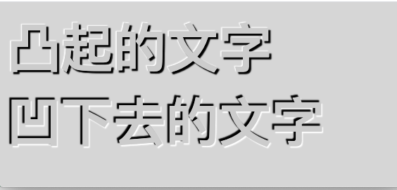

### (11)、示例-王者荣耀导航栏

* 当盒子只有一行文本并且 `line-height` 和 `height` 一致时，可以实现文本的垂直居中。
* `text-decoration` 用于给链接修改装饰效果，取值如下：

取值|含义
---|---
`none` | 去除下划线
`underline` | 添加下划线
`overline` | 添加上划线
`line-through` | 添加删除线（横向穿过文本的线）

```html
<!DOCTYPE html>
<html lang="en">
<head>
    <meta charset="UTF-8">
    <title>v28-CSS多背景图.html</title>
    <style>
        body {
            background-color: #cccc
        }

        a {
            width: 80px;
            height: 35px;
            /* 转为行内块元素之后，宽高才能生效*/
            display: inline-block;
            background: #51b7eb;
            text-align: center;
            /* line-height 与 height 一致时，就可以使文字实现垂直居中*/
            line-height: 35px;
            text-decoration: none;
        }

        a:hover {
            color: red;
            background: url("../../assets/image/small_logo.png") no-repeat;
            background-size: cover;
        }

    </style>
</head>
<body>
<a href="#">专区说明</a>
<a href="#">申请资格</a>
<a href="#">兑换奖励</a>
<a href="#">下载游戏</a>
</body>
</html>
```

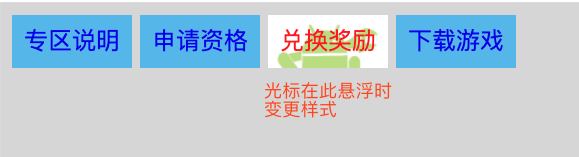

## 十、CSS 三大特性

层叠性、继承性、优先级

### (1)、CSS 层叠性

CSS 层叠性即 CSS 样式的叠加，多个样式中指定了同一属性时，以最后一个样式中的属性值为准。

```html
<!DOCTYPE html>
<html lang="en">
<head>
    <meta charset="UTF-8">
    <title>v28-CSS多背景图.html</title>
    <style>
        body {
            background-color: #C5ECFF
        }

        div {
            color: green;
            font: 18px "Microsoft YaHei";
        }

        div {
            color: red;
        }
    </style>
</head>
<body>
<div>
    多个样式中的指定了相同属性，以最后一个样式中的属性值为准
</div>
</body>
</html>
```

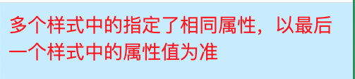

### (2)、CSS 继承性

* 父标签中的样式会对子标签生效，即继承性
* 可以被子标签继承的样式属性有：以 `text-` 、`font-`、`line-` 三者开头的属性，`color` 属性

```html

<!DOCTYPE html>
<html lang="en">
<head>
    <meta charset="UTF-8">
    <title>v28-CSS多背景图.html</title>
    <style>
        body {
            background-color: #C5ECFF
        }

        div {
            color: red;
            font: 18px "Microsoft YaHei";
        }

    </style>
</head>
<body>
<div>
    <p>父标签的样式会对子标签生效——继承性</p>
</div>
</body>
</html>
```

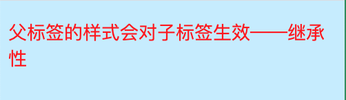

### (3)、CSS 优先级

#### 1）、优先级
定义 CSS 样式时，经常会出现两个或多个规则应用在同一个标签上，此时就存在优先级的问题：

* 继承样式的权重为 0 ， 即在嵌套结构中，不管父元素样式的权重多大，被子元素继承时，它的权重都为 0。也就是说，子元素定义的样式会覆盖继承的样式。
* 行内样式优先，应用 style 属性的元素，其行内样式的权重非常高，可以理解为大于 100，总之，它拥有比上面提高的选择器都大的优先级。
* **权重相同时，CSS 遵循就近原则**。也就是说靠近元素的样式具有最大的优先级，或者说排在最后的样式优先级最大。
* CSS 定义了一个 **!important** 命令，该命令被赋予最大的优先级。也就是说不管权重如何以及样式位置的远近，**!important** 都具有最大优先级。


#### 2)、CSS 特殊性（Specificity）

关于 CSS 权重，我们需要一套计算公式去计算，这就是 `CSS Specificity`, 我们称为 `CSS 特性` 或 `非凡性`。它是一个衡量 CSS 值优先级的一个标准，具体规范如下：

优先级 用一个四位的数字串来表示，更像四个级别，值从左到右，**左面的最大**，一级大于一级，数位之间没有进制，级别之间不可超越。

> CnPeng： 直白的说就是，1 的位置越靠左，权重越大，优先级越高。

类别 | 优先级
---|---
标签选择器 | 0,0,0,1
类/伪类选择器 | 0,0,1,0
id 选择器| 0,1,0,0
行内样式选择器 (标签内直接定义 style) | 1,0,0,0
`!important` | ∞ 无穷大

```html
<!DOCTYPE html>
<html lang="en">
<head>
    <meta charset="UTF-8">
    <title>v28-CSS多背景图.html</title>
    <style>
        .c-blue {
            /*类和伪类选择器的优先级相同，倒数第二，高于标签选择器*/
            color: pink;
        }

        div {
            /*标签选择器，优先级最低*/
            color: red;
            font: 18px "Microsoft YaHei";
        }

        #id-one {
            /* id  选择器优先级高于类和伪类选择器 */
            color: #00FF00;
        }

        div{
            /*后缀 !important 的优先级最高*/
            color: black !important;
        }
    </style>
</head>
<body>
<!-- style="color:orange" 表示行内样式，优先级排第二，次于 !important -->
<div class="c-blue" id="id-one" style="color: orange">CSS 优先级</div>
</body>
</html>
```


#### 3）、权重叠加


```html
<!DOCTYPE html>
<html lang="en">
<head>
    <meta charset="UTF-8">
    <title>v28-CSS多背景图.html</title>
    <style>
        li {
            /* 权重系数为：0001*/
            color: red;
        }

        ul li {
            /*权重系数为 0001+0001=0002 ——权重叠加*/
            color: green;
        }

    </style>
</head>
<body bgcolor="#C5ECFF">

<nav>
    <ul>
        <li>李白</li>
        <li>杜甫</li>
        <li>李贺</li>
    </ul>
</nav>
</body>
</html>
```

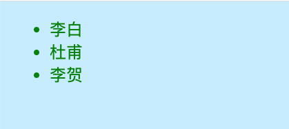


权重叠加示例：

选择器| 叠加后的权重 | 说明
---|---|---
`div ul li` | 0,0,0,3 | 
`.nav ul li` | 0,0,1,2 | 0,0,1,0 + 0,0,0,1 + 0,0,0,1 = 0,0,1,2
`a:hover` | 0,0,0,1 | 0,0,0,1 + 0,0,1,0 = 0,0,1,1
`.nav a` | 0,0,1,1 | 0,0,1,0 + 0,0,0,1 = 0,0,1,1
`#nav p` | 0,1,0,1 | 0,1,0,1 + 0,0,0,1 = 0,1,0,1

注意: 

* **权重叠加时，数位之间没有进制。如：`0,0,0,5` + `0,0,0,5` = `0,0,0,10` , 而不是 `0,0,1,0`。**也就是说， 10个 div 叠加后的权重并不会高于一个 类选择器。
* 继承的权重是 0 

权重总结（自上往下优先级依次降低）

* 使用 `!important` 声明的选择器
* 内嵌在标签中的 `style` 声明样式
*  ID 选择器
*  类选择器、伪类选择器、属性选择器、伪元素选择器
*  元素选择器（即 标签选择器）
*  通用选择器

> *  同一类选择器遵循就近原则
> * 权重是优先级的算法，叠加是优先级的表现。 


#### 4)、继承的权重为 0

```html
<!DOCTYPE html>
<html lang="en">
<head>
    <meta charset="UTF-8">
    <title>v28-CSS多背景图.html</title>
    <style>

        li {
            /*权重系数为 0001+0001=0002 ——权重叠加*/
            color: green;
        }

        .nav-style{
            color: red;
        }

        p {
            color: pink;
        }

    </style>
</head>
<body bgcolor="#C5ECFF">

<nav class="nav-style">
    <ul>
        <li>继承的权重为0：li 会继承设置在 nav 上的样式，但因为继承的权重为0，
            并且 li 设置了单独的样式，所以，li 中内容的颜色为 li 样式中设置的颜色。</li>
    </ul>
</nav>

<p>
    <a href="#">选择器继承</a>
</p>
</body>
</html>
```

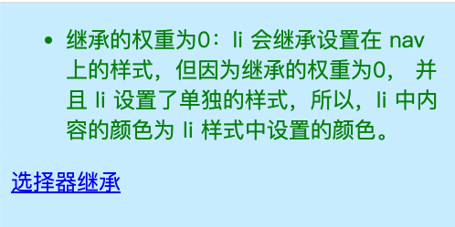

### (5)、CSS 权重测试题

#### 1）、

```html
<!DOCTYPE html>
<html lang="en">
<head>
    <meta charset="UTF-8">
    <title>v28-CSS多背景图.html</title>
    <style>
        #father #son {
            color: blue;
        }

        #father p.c2 {
            color: black;
        }

        div.c1 p.c2 {
            color: red;
        }

        #father {
            color: green !important;
        }

    </style>
</head>
<body bgcolor="#C5ECFF">
<div id="father" class="c1">
    <p id="son" class="c2">
        这一行字时啥颜色的呢？
    </p>
</div>
</body>
</html>
```

#### 2）、

```html
<!DOCTYPE html>
<html lang="en">
<head>
    <meta charset="UTF-8">
    <title>v28-CSS多背景图.html</title>
    <style>

        p {
            color: red;
        }

        #father {
            color: green !important;
        }

    </style>
</head>
<body bgcolor="#C5ECFF">
<div id="father">
    <p>
        这一行字时啥颜色的呢？
    </p>
</div>
</body>
</html>
```

#### 3）、

```html
<!DOCTYPE html>
<html lang="en">
<head>
    <meta charset="UTF-8">
    <title>v28-CSS多背景图.html</title>
    <style>

        div p {
            /* 0,0,0,1 + 0,0,0,1 = 0,0,0,2 */
            color: red;
        }

        #father {
            /* 0,1,0,0 */
            color: green !important;
        }

        p.c2 {
            /* 0,0,0,1 + 0,0,1,0=0,0,1,1 */
            color: blue;
        }

    </style>
</head>
<body bgcolor="#C5ECFF">
<div id="father" class="c1">
    <p class="c2">
        这一行字时啥颜色的呢？
    </p>
</div>
</body>
</html>
```
> **继承的权重为 0！！**

#### 4）、

```html
<!DOCTYPE html>
<html lang="en">
<head>
    <meta charset="UTF-8">
    <title>v28-CSS多背景图.html</title>
    <style>

        div div {
            color: red;
        }

        div {
            color: blue;
        }

    </style>
</head>
<body bgcolor="#C5ECFF">
<div>
    <div>
        <div>
            这一行字时啥颜色的呢？
        </div>
        </p>
    </div>
</body>
</html>
```
#### 5）、

```html
<!DOCTYPE html>
<html lang="en">
<head>
    <meta charset="UTF-8">
    <title>v28-CSS多背景图.html</title>
    <style>
        div div div div div div div div div div div div {
            color: red;
        }
        .me {
            color: blue;
        }
    </style>
</head>
<body bgcolor="#C5ECFF">
<div>
    <div>
        <div>
            <div>
                <div>
                    <div>
                        <div>
                            <div>
                                <div>
                                    <div>
                                        <div>
                                            <div class="me">
                                                这一行字时啥颜色的呢？
                                            </div>
                                        </div>
                                    </div>
                                </div>
                            </div>
                        </div>
                    </div>
                </div>
            </div>
        </div>
    </div>
</div>
</body>
</html>
```
#### 6）、

```html
<!DOCTYPE html>
<html lang="en">
<head>
    <meta charset="UTF-8">
    <title>v28-CSS多背景图.html</title>
    <style>
        .c1 .c2 div {
            /* 0010+0010+0001 = 0021*/
            color: blue;
        }

        div #box3 {
            color: yellow;
        }

        #box1 div {
            color: red;
        }

    </style>
</head>
<body bgcolor="#C5ECFF">
<div id="box1" class="c1">
    <div id="box2" class="c2">
        <div id="box3" class="c3">
            这一行字时啥颜色的呢？
        </div>
    </div>
</div>
</body>
</html>
```

> **权重相同时，采用就近原则**

## 十一、盒子模型（CSS 重点）

**CSS 中最核心的三个大模块为：盒子模型、浮动、定位。**（这三个必须要精通）

`盒子模型` 就是把 HTML 页面中的元素看做是一个矩形的盒子，或者是盛放内容的容器。

每个盒子都由元素内容、内边距（padding）、边框（border）和 外边距（margin） 组成。

### (1)、网页布局的本质

把网页元素放入盒子中，然后利用 CSS 摆放盒子的过程就是**网页布局**。


### (2)、盒子模型（Box Model）

盒子模型=盒子边框+内边距+外边距。

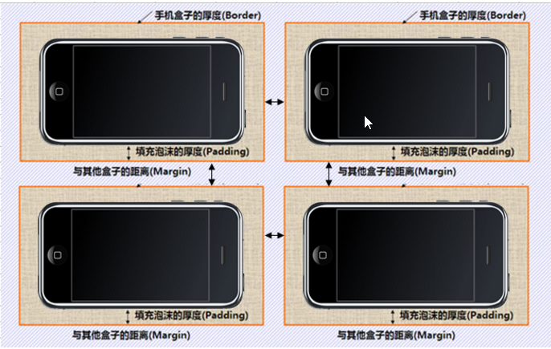

### (3)、盒子边框（border）

#### 1）、表格的细线边框

* 基本语法格式: `border " border-width  border-style  border-color`

* `border-style` 用于定义边框的样式，取值如下：

取值|含义
---|---
`none` | 取消边框（忽略所有边框的宽度）
`solid` | 边框为单实线（最常用）
`dashed` | 边框为虚线
`dotted` | 边框为点线
`double` | 边框为双实线

```html
<!DOCTYPE html>
<html lang="en">
<head>
    <meta charset="UTF-8">
    <title>v28-CSS多背景图.html</title>
    <style>
        div {
            width: 200px;
            height: 100px;
            border: 2px solid red;
        }
    </style>
</head>
<body bgcolor="#C5ECFF">
<div>
    为盒子设置边框：
    <br/>
    `border: 宽度 样式 颜色`
</div>
</body>
</html>
```

```html
<!DOCTYPE html>
<html lang="en">
<head>
    <meta charset="UTF-8">
    <title>v28-CSS多背景图.html</title>
    <style>
        div {
            width: 200px;
            height: 100px;
            /* 下面三行与这一行等价 border: 2px solid red; */
            border-width: 2px;
            border-style: solid;
            border-color: red;
        }

    </style>
</head>
<body bgcolor="#C5ECFF">
<div>
    为盒子设置边框：
    <br/>
    `border: 宽度 样式 颜色`
</div>
</body>
</html>
```

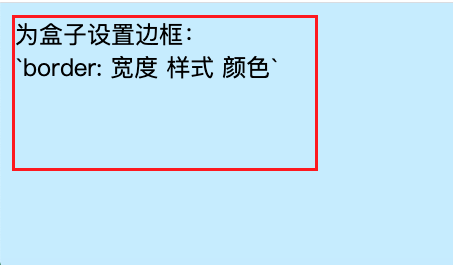

#### 2）、盒子边框总结表

设置内容 | 样式属性 | 常用属性值
---|---|---|---
上边框 | `border-top-style:` 样式 <br> `border-top-width:` 宽度 <br> `border-top-color:` 颜色 <br> `border-top:` 宽度 样式 颜色  |
下边框 | `border-bottom-style:` 样式 <br> `border-bottom-width:` 宽度 <br> `border-bottom-color:` 颜色 <br> `border-bottom:` 宽度 样式 颜色
左边框 | `border-left-style:` 样式 <br> `border-left-width:` 宽度 <br> `border-left-color:` 颜色 <br> `border-left:` 宽度 样式 颜色
右边框 | `border-right-style:` 样式 <br> `border-right-width:` 宽度 <br> `border-right-color:` 颜色 <br> `border-right:` 宽度 样式 颜色
样式综合设置 | `border-style:` 上边 [ 右边  下边  左边] ; | none 无（默认值），solid 单实线，dashed 虚线，dotted 点线，double 双实线
宽度综合设置 | `border-width:`上边 [ 右边  下边  左边] ; | 像素值
颜色综合设置 | `border-color:` 上边 [ 右边  下边  左边] ; | 颜色值

```html
<!DOCTYPE html>
<html lang="en">
<head>
    <meta charset="UTF-8">
    <title>v28-CSS多背景图.html</title>
    <style>
        .user-name {
            /* 下面三行与这一行等价 border: 2px solid red; */
            border-width: 2px;
            border-style: solid;
            border-color: red;
        }

        #other {
            border: 2px dashed red;
        }

        #nick-name {
            border-top-width: 8px;
            border-top-style: solid;
            border-top-color: red;

            border-right-width: 4px;
            border-right-style: dashed;
            border-right-color: blue;

            border-bottom-width: 8px;
            border-bottom-style: dotted;
            border-bottom-color: orange;

            border-left-width: 8px;
            border-left-style: double;
            border-left-color: green;
        }

        #nick-name2 {
            border-top: 4px solid red;
            border-right: 8px dotted blue;
            border-bottom: 4px dashed green;
            border-left: 8px double orange;
        }

        input {
            border-width: 4px 8px 4px 8px;
            border-style: solid dashed dotted double;
            border-color: green orange blue red;
        }

    </style>
</head>
<body bgcolor="#C5ECFF">
用户名：<input type="text" class="user-name"/> <br/><br/>
昵 称：<input type="text" id="nick-name"/><br/><br/>
昵 称2：<input type="text" id="nick-name2"/><br/><br/>
密 码：<input type="password"/><br/><br/>
备 注: <input type="text" id="other">
</body>
</html>
```
 
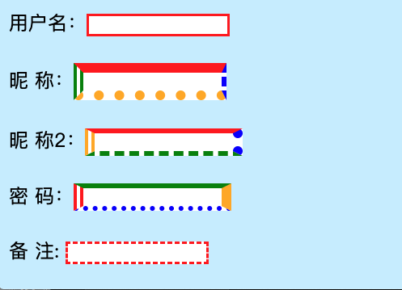 

#### 3）、表格的细线边框（合并表格边框）

HTML  中表格的边框很粗，通过 CSS 的一个属性即可设置。

即：`table { border-collapse : collapse; }`，该语句表示合并边框。

```html
<!DOCTYPE html>
<html lang="en">
<head>
    <meta charset="UTF-8">
    <title>v13-合并细线表格.html</title>
    <style>

        td {
            border: 2px solid red;
        }

        table {
            border-collapse: collapse;
        }

    </style>
</head>
<body bgcolor="#C5ECFF">

<!--设置了  border-collapse 之后，<table cellspacing="0" > 中的 cellspacing 可以省略，不省略的话，即便设置了也不生效-->
<table>
    <tr>
        <td>123</td>
        <td>123</td>
        <td>123</td>
        <td>123</td>
    </tr>
    <tr>
        <td>123</td>
        <td>123</td>
        <td>123</td>
        <td>123</td>
    </tr>
    <tr>
        <td>123</td>
        <td>123</td>
        <td>123</td>
        <td>123</td>
    </tr>
</table>
</body>
</html>
```

合并之后的效果：

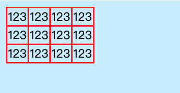

未合并的效果:

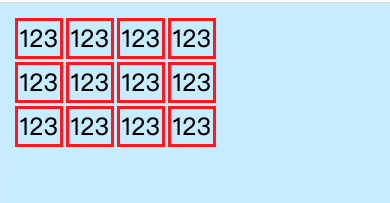


#### 4）、圆角边框--`border-radius`（CSS3）

基本格式为: `border-radius: 左上角  右上角  右下角  左下角` 或 `border-radius : 角度` ，

* 取值可以是绝对值 px ,也可以是相对于宽高的百分比。
* 写四个值表示：分别设置左上角  右上角  右下角 左下角
* 写三个值表示：左上角使用第一个值，右上角和左下角使用第二个值，右下角使用第三个值
* 写两个值表示：左上和右下使用第一个值，右上角和左下使用第二个值
* 写一个值表示：四个角使用同样的值

```html
<!DOCTYPE html>
<html lang="en">
<head>
    <meta charset="UTF-8">
    <title>v14-圆角边框.html</title>
    <style>
        div {
            height: 100px;
            width: 100px;
            border: 1px solid red;
            font-size: 12px;
        }

        div:first-child {
            border-radius: 50px;
        }

        div:nth-child(2) {
            border-radius: 50%;
        }

        div:nth-child(3) {
            border-radius: 10% 50%;
        }

        div:nth-child(4) {
            border-radius: 10% 30% 20%;
        }

        div:nth-child(5) {
            border-radius: 10% 30% 50% 70%;
        }

        div:nth-last-child(3) {
            border-radius: 0 20% 0 20%;
        }

        div:nth-last-child(2) {
            border-radius: 50%;
            height: 50px;
            width: 150px;
        }

        div:last-child {
            height: 40px;
            width: 200px;
            border-radius: 40px;
        }

    </style>
</head>
<body bgcolor="#C5ECFF">
<div>角度可以设置为具体的值：50px</div>
<div>角度可以设置为百分比：50%</div>
<div>设置两个角度值：10% 50%</div>
<div>设置三个角度值：10% 50% 20%</div>
<div>设置四个角度值：10% 30% 50% 70%</div>
<div>设置四个角度值： 0 20% 0 20%;</div>
<div>高度为 50px, 宽度 150px , radius 为 50%</div>
<div>高度为 40px , radius 为 40px, 角度和高度一致时，显示椭圆形效果</div>
</body>
</html>
```

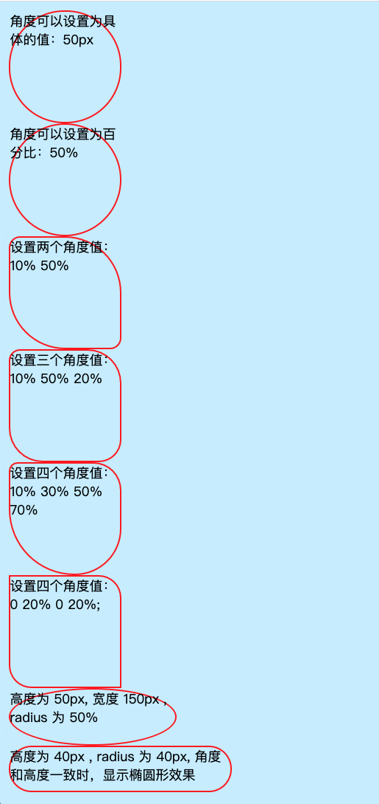

### (4)、内边距（padding)

#### 1）、内边距 

`padding` 用于设置内边距，即 边框与内容之间的距离。

属性 | 含义
---|---
`padding-top` | 上侧内边距
`padding-right` | 右侧内边距
`padding-bottom` | 底部内边距
`padding-left` | 左侧内边距
`padding` | 全部边距

* `padding` 后面值的个数与含义

值的个数 | 含义
---|---
4 个值 | 上方内边距  右方内边距 底部右边距 左侧内边距 
3 个值 | 上方内边距  左右内边距 底部内边距
2 个值 | 上下内边距  左右内边距
1 个值 | 设置全部的内边距

```html
<!DOCTYPE html>
<html lang="en">
<head>
    <meta charset="UTF-8">
    <title>v15-盒子内边距.html</title>
    <style>
        div {
            width: 200px;
            height: 50px;
            border: 1px solid red;
            font-size: 12px;
            border-radius: 10px;
        }

        div:first-child {
            padding-left: 20px;
            padding-top: 10px;
            padding-right: 20px;
            padding-bottom: 10px;
        }

        div:nth-child(2) {
            padding: 10px 20px;
        }

    </style>
</head>
<body bgcolor="#C5ECFF">
<div>使用：padding-left/right/top/bottom 设置padding</div>
<div>使用 padding 设置 padding</div>
</body>
</html>
```

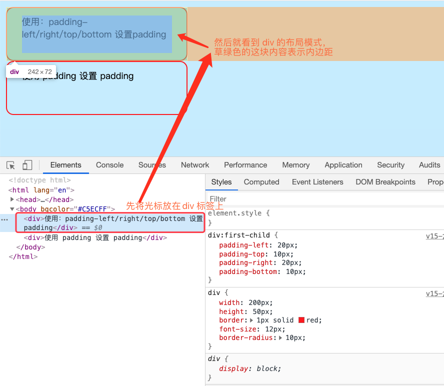

#### 2）、FireWorks 测量和取色

* 使用 `滴管工具`取色
* 使用 `切片` 工具测量宽高

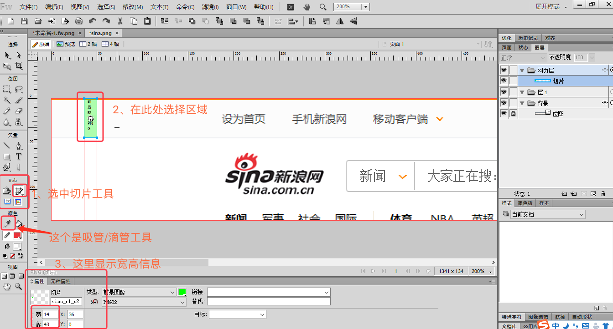

#### 3)、新浪导航案例:

```html
<!DOCTYPE html>
<html lang="en">
<head>
    <meta charset="UTF-8">
    <title>v15-盒子内边距.html</title>
    <style>
        nav {
            border-top: 3px solid orange;
            border-bottom: 1px solid #c3c3c3;
        }

        nav a {
            text-decoration: none;
            font-size: 14px;
            color: #3e3e3e;
            padding: 0px 10px;
            /* height 和 line-height 一致，并且只有一行文本时，才能实现水平和垂直居中*/
            height: 44px;
            line-height: 44px;
            text-align: center;
            /* 将 行内元素转换为 行内块元素，这样设置宽高才有效*/
            display: inline-block;
        }

        nav a:hover {
            background-color: #cccccc;
        }


    </style>
</head>
<body bgcolor="#C5ECFF">

<nav>
    <a href="#">两字</a>
    <a href="#">三个字</a>
    <a href="#">四个字啊</a>
    <a href="#">五个字啊啊</a>
</nav>
</body>
</html>
```

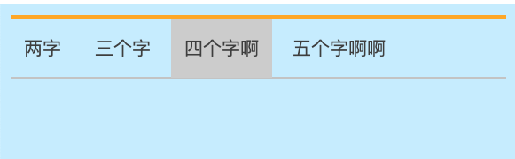

### (5)、外边距（margin）


#### 1）、外边距实现盒子居中
#### 2）、清除元素默认的内外边距

### (6)、外边距合并

#### 1）、相邻块元素垂直外边距的合并
#### 2）、嵌套块元素垂直外边距的合并

### (7)、content  宽度和奥都

### (8)、三个计算题

#### 1）、

#### 2）、

#### 3）、

### (9)、盒子布局模型的稳定性

### (10)、CSS3 盒模型

### (11)、盒子阴影 


## 十二、
### (1)、
#### (1)、
#### (2)、
#### (3)、
### (2)、
#### (1)、
#### (2)、
#### (3)、
### (3)、
#### (1)、
#### (2)、
#### (3)、
### (4)、
#### (1)、
#### (2)、
#### (3)、
### (5)、
#### (1)、
#### (2)、
#### (3)、
### (6)、
#### (1)、
#### (2)、
#### (3)、
### (7)、
#### (1)、
#### (2)、
#### (3)、
### (8)、
#### (1)、
#### (2)、
#### (3)、
### (9)、
#### (1)、
#### (2)、
#### (3)、
### (10)、
#### (1)、
#### (2)、
#### (3)、
### (11)、
#### (1)、
#### (2)、
#### (3)、

## 十三、
### (1)、
#### (1)、
#### (2)、
#### (3)、
### (2)、
#### (1)、
#### (2)、
#### (3)、
### (3)、
#### (1)、
#### (2)、
#### (3)、
### (4)、
#### (1)、
#### (2)、
#### (3)、
### (5)、
#### (1)、
#### (2)、
#### (3)、
### (6)、
#### (1)、
#### (2)、
#### (3)、
### (7)、
#### (1)、
#### (2)、
#### (3)、
### (8)、
#### (1)、
#### (2)、
#### (3)、
### (9)、
#### (1)、
#### (2)、
#### (3)、
### (10)、
#### (1)、
#### (2)、
#### (3)、
### (11)、
#### (1)、
#### (2)、
#### (3)、

## 十四、
### (1)、
#### (1)、
#### (2)、
#### (3)、
### (2)、
#### (1)、
#### (2)、
#### (3)、
### (3)、
#### (1)、
#### (2)、
#### (3)、
### (4)、
#### (1)、
#### (2)、
#### (3)、
### (5)、
#### (1)、
#### (2)、
#### (3)、
### (6)、
#### (1)、
#### (2)、
#### (3)、
### (7)、
#### (1)、
#### (2)、
#### (3)、
### (8)、
#### (1)、
#### (2)、
#### (3)、
### (9)、
#### (1)、
#### (2)、
#### (3)、
### (10)、
#### (1)、
#### (2)、
#### (3)、
### (11)、
#### (1)、
#### (2)、
#### (3)、

## 十五、
### (1)、
#### (1)、
#### (2)、
#### (3)、
### (2)、
#### (1)、
#### (2)、
#### (3)、
### (3)、
#### (1)、
#### (2)、
#### (3)、
### (4)、
#### (1)、
#### (2)、
#### (3)、
### (5)、
#### (1)、
#### (2)、
#### (3)、
### (6)、
#### (1)、
#### (2)、
#### (3)、
### (7)、
#### (1)、
#### (2)、
#### (3)、
### (8)、
#### (1)、
#### (2)、
#### (3)、
### (9)、
#### (1)、
#### (2)、
#### (3)、
### (10)、
#### (1)、
#### (2)、
#### (3)、
### (11)、
#### (1)、
#### (2)、
#### (3)、