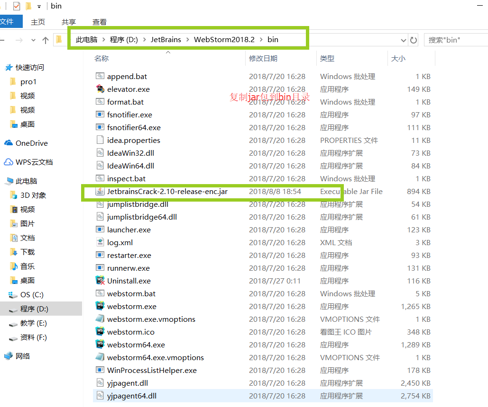
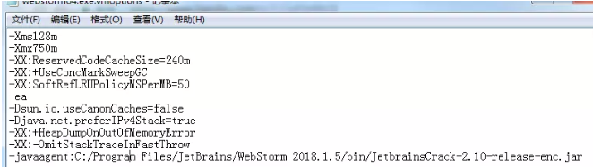

2020-01-03

* [webStorm 2019 激活码,phpStorm 2019激活,idea激活,pyCharm激活](https://www.jianshu.com/p/133af2e4fe3f)

此教程适用于jetbrains 的所有系列的软件

* [想要永久激活2019 jebrains系列 请下载压缩包 教程都在压缩包里面](https://u18744103.ctfile.com/fs/18744103-388155046)

* [2019.2最新激活 ](https://545c.com/file/18744103-399875015)
* [2019.2.4 最新激活教程 ](https://545c.com/file/18744103-409806662)
* [2019.3 最新激活教程 ](https://545c.com/file/18744103-410586877)
* [2019.3.1 最新激活教程 ](https://545c.com/file/18744103-414773569)

## 一、激活方案1

###(1)、去官网下载 WebStorm


###(2)、找到`hosts`路径

* windows 的路径为： `C:\Windows\System32\drivers\etc`
* Linux 和 mac 的 hosts 文件路径为：`/etc/hosts`。（Mac下前往指定目录的快捷键为：Shift+CMD+G）

> 注意：mac 下的 hosts 文件要先拷贝出来修改修改完了再拷贝进去,不能直接修改
如果遇到权限问题，可将 hosts 文件先复制出来修改后再覆盖原来的即可。

###(2)、修改`hosts`文件

在 `hosts`文件末尾添加如下内容：

```
0.0.0.0 account.jetbrains.com
0.0.0.0 www.jetbrains.com
```

###(3)、输入激活码

在弹出的激活对话框里面选择 `code` 然后填写一个激活码，然后点击 `active` 即可完美激活。

部分激活码如下：

* [永久激活码 点击链接 ](https://545c.com/file/18744103-406652871)
* [永久激活码20191204更新 ](https://545c.com/file/18744103-411147573)
* [永久激活码20191227更新 ](https://545c.com/file/18744103-415276627)
* [激活参考这篇文章](https://app.yinxiang.com/fx/fb7f25b6-c828-47b5-a06d-d1bd41444146)
* [点击获取激活码 ](http://idea.medeming.com/jet/)
* [license地址](http://jetbrains-license-server) 
* [如果想更改 lincense 的名称 请去这个网站 ](https://zhile.io/custom-license.html)

2020-01-04 更新的激活码：

```
7NYXX5E2OU-eyJsaWNlbnNlSWQiOiI3TllYWDVFMk9VIiwibGljZW5zZWVOYW1lIjoi5qe/5p6XIOWVhuWfjiIsImFzc2lnbmVlTmFtZSI6IiIsImFzc2lnbmVlRW1haWwiOiIiLCJsaWNlbnNlUmVzdHJpY3Rpb24iOiIiLCJjaGVja0NvbmN1cnJlbnRVc2UiOmZhbHNlLCJwcm9kdWN0cyI6W3siY29kZSI6IklJIiwiZmFsbGJhY2tEYXRlIjoiMjAyMC0wMS0wNSIsInBhaWRVcFRvIjoiMjAyMS0wMS0wNCJ9LHsiY29kZSI6IkFDIiwiZmFsbGJhY2tEYXRlIjoiMjAyMC0wMS0wNSIsInBhaWRVcFRvIjoiMjAyMS0wMS0wNCJ9LHsiY29kZSI6IkRQTiIsImZhbGxiYWNrRGF0ZSI6IjIwMjAtMDEtMDUiLCJwYWlkVXBUbyI6IjIwMjEtMDEtMDQifSx7ImNvZGUiOiJQUyIsImZhbGxiYWNrRGF0ZSI6IjIwMjAtMDEtMDUiLCJwYWlkVXBUbyI6IjIwMjEtMDEtMDQifSx7ImNvZGUiOiJHTyIsImZhbGxiYWNrRGF0ZSI6IjIwMjAtMDEtMDUiLCJwYWlkVXBUbyI6IjIwMjEtMDEtMDQifSx7ImNvZGUiOiJETSIsImZhbGxiYWNrRGF0ZSI6IjIwMjAtMDEtMDUiLCJwYWlkVXBUbyI6IjIwMjEtMDEtMDQifSx7ImNvZGUiOiJDTCIsImZhbGxiYWNrRGF0ZSI6IjIwMjAtMDEtMDUiLCJwYWlkVXBUbyI6IjIwMjEtMDEtMDQifSx7ImNvZGUiOiJSUzAiLCJmYWxsYmFja0RhdGUiOiIyMDIwLTAxLTA1IiwicGFpZFVwVG8iOiIyMDIxLTAxLTA0In0seyJjb2RlIjoiUkMiLCJmYWxsYmFja0RhdGUiOiIyMDIwLTAxLTA1IiwicGFpZFVwVG8iOiIyMDIxLTAxLTA0In0seyJjb2RlIjoiUkQiLCJmYWxsYmFja0RhdGUiOiIyMDIwLTAxLTA1IiwicGFpZFVwVG8iOiIyMDIxLTAxLTA0In0seyJjb2RlIjoiUEMiLCJmYWxsYmFja0RhdGUiOiIyMDIwLTAxLTA1IiwicGFpZFVwVG8iOiIyMDIxLTAxLTA0In0seyJjb2RlIjoiUk0iLCJmYWxsYmFja0RhdGUiOiIyMDIwLTAxLTA1IiwicGFpZFVwVG8iOiIyMDIxLTAxLTA0In0seyJjb2RlIjoiV1MiLCJmYWxsYmFja0RhdGUiOiIyMDIwLTAxLTA1IiwicGFpZFVwVG8iOiIyMDIxLTAxLTA0In0seyJjb2RlIjoiREIiLCJmYWxsYmFja0RhdGUiOiIyMDIwLTAxLTA1IiwicGFpZFVwVG8iOiIyMDIxLTAxLTA0In0seyJjb2RlIjoiREMiLCJmYWxsYmFja0RhdGUiOiIyMDIwLTAxLTA1IiwicGFpZFVwVG8iOiIyMDIxLTAxLTA0In0seyJjb2RlIjoiUlNVIiwiZmFsbGJhY2tEYXRlIjoiMjAyMC0wMS0wNSIsInBhaWRVcFRvIjoiMjAyMS0wMS0wNCJ9XSwiaGFzaCI6IjE2MDk0OTY4LzAiLCJncmFjZVBlcmlvZERheXMiOjcsImF1dG9Qcm9sb25nYXRlZCI6ZmFsc2UsImlzQXV0b1Byb2xvbmdhdGVkIjpmYWxzZX0=-MqE/Rk6NYDhRo5AKqUGrvFc1MErGZz0v6PERjwOUFg7bg7Cv4N8wxmx1msUXdEZVbeNJyZB2YmhRuzFz82lFQlxJV9hhawyuwVl93pKOvj6udHeP1cOtPSL3GcePvnMk61QNwggu9g7zvjC3q24pzP1S6UHQTTBNXjV3qzosfyjgzVEsJeuu4wCy+cdiXE65wjULvFjlYRAzU725Mb7j5v2pcD7bfTmDVgkQ2VRqCeTpUo90N5wT0LwF79ideE04eezlbna/5uih/adBbWhChcVL2cWUf0TH0jKPblwhLG1IzCiX8vPIRy2NfpSURMIwRxg6X7yd1EE955rIa19pxA==-MIIElTCCAn2gAwIBAgIBCTANBgkqhkiG9w0BAQsFADAYMRYwFAYDVQQDDA1KZXRQcm9maWxlIENBMB4XDTE4MTEwMTEyMjk0NloXDTIwMTEwMjEyMjk0NlowaDELMAkGA1UEBhMCQ1oxDjAMBgNVBAgMBU51c2xlMQ8wDQYDVQQHDAZQcmFndWUxGTAXBgNVBAoMEEpldEJyYWlucyBzLnIuby4xHTAbBgNVBAMMFHByb2QzeS1mcm9tLTIwMTgxMTAxMIIBIjANBgkqhkiG9w0BAQEFAAOCAQ8AMIIBCgKCAQEAxcQkq+zdxlR2mmRYBPzGbUNdMN6OaXiXzxIWtMEkrJMO/5oUfQJbLLuMSMK0QHFmaI37WShyxZcfRCidwXjot4zmNBKnlyHodDij/78TmVqFl8nOeD5+07B8VEaIu7c3E1N+e1doC6wht4I4+IEmtsPAdoaj5WCQVQbrI8KeT8M9VcBIWX7fD0fhexfg3ZRt0xqwMcXGNp3DdJHiO0rCdU+Itv7EmtnSVq9jBG1usMSFvMowR25mju2JcPFp1+I4ZI+FqgR8gyG8oiNDyNEoAbsR3lOpI7grUYSvkB/xVy/VoklPCK2h0f0GJxFjnye8NT1PAywoyl7RmiAVRE/EKwIDAQABo4GZMIGWMAkGA1UdEwQCMAAwHQYDVR0OBBYEFGEpG9oZGcfLMGNBkY7SgHiMGgTcMEgGA1UdIwRBMD+AFKOetkhnQhI2Qb1t4Lm0oFKLl/GzoRykGjAYMRYwFAYDVQQDDA1KZXRQcm9maWxlIENBggkA0myxg7KDeeEwEwYDVR0lBAwwCgYIKwYBBQUHAwEwCwYDVR0PBAQDAgWgMA0GCSqGSIb3DQEBCwUAA4ICAQAF8uc+YJOHHwOFcPzmbjcxNDuGoOUIP+2h1R75Lecswb7ru2LWWSUMtXVKQzChLNPn/72W0k+oI056tgiwuG7M49LXp4zQVlQnFmWU1wwGvVhq5R63Rpjx1zjGUhcXgayu7+9zMUW596Lbomsg8qVve6euqsrFicYkIIuUu4zYPndJwfe0YkS5nY72SHnNdbPhEnN8wcB2Kz+OIG0lih3yz5EqFhld03bGp222ZQCIghCTVL6QBNadGsiN/lWLl4JdR3lJkZzlpFdiHijoVRdWeSWqM4y0t23c92HXKrgppoSV18XMxrWVdoSM3nuMHwxGhFyde05OdDtLpCv+jlWf5REAHHA201pAU6bJSZINyHDUTB+Beo28rRXSwSh3OUIvYwKNVeoBY+KwOJ7WnuTCUq1meE6GkKc4D/cXmgpOyW/1SmBz3XjVIi/zprZ0zf3qH5mkphtg6ksjKgKjmx1cXfZAAX6wcDBNaCL+Ortep1Dh8xDUbqbBVNBL4jbiL3i3xsfNiyJgaZ5sX7i8tmStEpLbPwvHcByuf59qJhV/bZOl8KqJBETCDJcY6O2aqhTUy+9x93ThKs1GKrRPePrWPluud7ttlgtRveit/pcBrnQcXOl1rHq7ByB8CFAxNotRUYL9IF5n3wJOgkPojMy6jetQA5Ogc8Sm7RG6vg1yow==
```


## 二、激活方案2

永久激活(以 win 为例/ mac 方法一样)

###(1)、下载jar包

去百度网盘下载最新的jar包

* [破解包下载地址 ](https://u18744103.pipipan.com/fs/18744103-388158585)
* [2019.2最新激活 ](https://545c.com/file/18744103-399875015)
*[ 2019.2.4 最新激活教程 ](https://545c.com/file/18744103-409806662)
* [2019.3 最新激活教程 ](https://545c.com/file/18744103-410586877)
* [2019.3.1 最新激活教程 ](https://545c.com/file/18744103-414773569)

###(2)、替换jar

* 找到安装目录里面的 `bin` 目录，然后把刚刚下载 jar 包放进去



###(3)、修改 `exe.vmoptions `

修改同目录下的 `WebStorm.exe.vmoptions` 和 `WebStorm64.exe.vmoptions`，这两个文件一个是 32 位的，一个是 64 位的，建议同步修改。

分别打开这两个文件 在最后加上一行代码

```
-javaagent:文件绝对路径/jar包名称
```

示例如下：



###(4)、输入激活服务器

打开 webstorm 点击 `linstion server` 然后输入

```
http://jetbrains-license-server
```


然后点击 `active` 激活成功

## 三、附

* [IDEA使用教程：](https://mp.weixin.qq.com/s/Ds1iU6ipMgWyaqaOPgP44g)
* [群友分享的xx码](https://app.yinxiang.com/fx/bd2158ab-fea3-4382-966f-eaf54f5a4de7)
* [群友分享的xx教程： ](https://app.yinxiang.com/fx/fb7f25b6-c828-47b5-a06d-d1bd41444146)
* [汉化教程：](https://app.yinxiang.com/fx/a0d22ca8-2fcd-4399-9895-f750488998b3)
