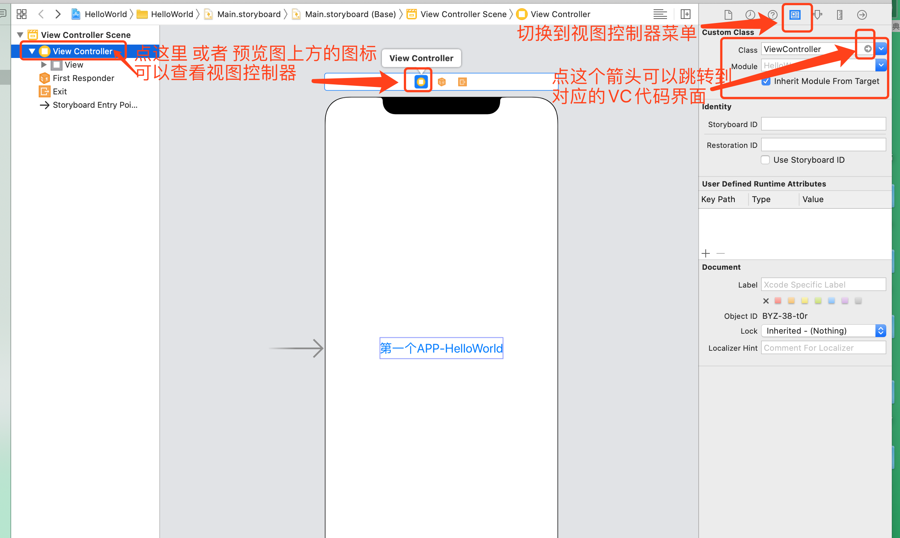

* IOS 10 教程 —— 小波说雨燕：
	* [iOS 10 开发第一季 ①入门篇](http://xiaoboswift.com/course/39)
	* [iOS 10 开发第一季 ②初级篇](http://xiaoboswift.com/my/course/40)
	* [iOS 10 开发第一季 ③中级篇](http://xiaoboswift.com/course/42)
	* [iOS 10 开发第一季 ④高级篇](http://xiaoboswift.com/course/43)
	* [iOS 10 开发第一季 ⑤上架篇](http://xiaoboswift.com/my/course/44)

**以下内容基于 XCode 11.0**,2019-10-09

# [①入门篇](http://xiaoboswift.com/course/39)
---------------------

* 注册开发者账号：[点击进行注册](http://developer.apple.com/programs/register), 注册为开发者之前需要先有 AppleID 

* 提交应用到市场时，使用正式版 Xcode, 不要使用 beta 版

## 一、Swift Playground

playground : 游乐园，游乐场，运动场

### 1、运行第一个 playground 

新建一个 playground

 
 
 选择项目类型：
 
 
 
 设置项目名称以及存储路径：
 
 
 
 运行并在右侧查看结果
 
 
 
 在代码下方显示结果：
 
 
 
 
### 2、用 playground 构建一个圆角矩形

```swift
import UIKit

// CGRect(,,,) 表示构建按钮的范围。编写时，先输入 CGRect( 此时就会有提示，然后直接选择即可
// x: y: width: height： 必须保留，不能删除
let roundCornerBtn = UILabel(frame: CGRect(x: 0, y: 0, width: 200, height: 50))

roundCornerBtn.text = "立即订购"
roundCornerBtn.textColor = UIColor.white
// 设置背景色，等价于 UIColor.red ；省略前面的类时，= 左右都必须有空格
roundCornerBtn.backgroundColor = .red
// 这种省略写法是 先写一个 . 然后会自动提示
roundCornerBtn.textAlignment = .center

// 圆角
roundCornerBtn.layer.cornerRadius=10
// 裁剪，不加不显示。false 表示不支持圆角；true 表示支持圆角
roundCornerBtn.clipsToBounds=true
```


## 二、第一个 APP - HelloWorld

* xx.storyboard 是界面编辑器，同 Android 中的 xml 布局文件
* xx.swift 是代码内容，同 Android 中的 .java/ .kt 文件


### 1、创建第一个文本View

* 选择控件

添加一个 Label 控件——用来显示文本


* 添加约束条件

不添加约束条件的话，在不同尺寸的设备上显示效果差异较大。

如果想修改控件的相关属性，可以先选中右侧的属性菜单，然后修改


在上图中，添加约束时，选择了约束条件之后，记得点击 `Add 2 Condition` , 点击一次就好了，重复点击会重复添加约束。

* 查看约束信息的属性


## 三、理解 HelloWorld APP

>* `xx.storyboard` ：为界面信息
>* `ViewController.swift` ： 具体的功能实现


* 同时打开 `ViewController.swift` 和 视图界面


* 添加事件


* 编辑事件


* 查看事件对应的控件


* 执行点击事件(在控制台打印信息)


* 执行点击事件2 （显示 Alert 弹窗）


核心代码如下：

```swift
import UIKit

class ViewController: UIViewController {

    override func viewDidLoad() {
        super.viewDidLoad()
        // Do any additional setup after loading the view.
    }
    
    @IBAction func onHelloBtnClick(_ sender: UIButton) {
        // 在控制台中显示内容，print 同 Android 中的 Log
        print(" HelloWorld 按钮被点击了")
        
        // 点击之后显示一个 Alert 弹窗
        // 声明一个弹窗 ( preferredStyle:.actionSheet 表示从底部弹出的弹窗)
        let alert=UIAlertController(title: "提示", message: "HelloWorld 按钮被点击了", preferredStyle: .alert)
        // 声明一个弹窗事件--确定按钮
        let okAction=UIAlertAction(title: "我知道了", style: .default, handler: nil)
        // 将事件添加到 弹窗中
        alert.addAction(okAction)
        // 展示弹窗 (参数分别为：要显示的控件，是否执行动画，展现之后的事件)
        self.present(alert, animated: true, completion: nil)
    }
}
```

## 四、指定 ViewController

* 查看或修改 ViewController



* IOS app 视图结构


---

# [②初级篇](http://xiaoboswift.com/my/course/40)

---