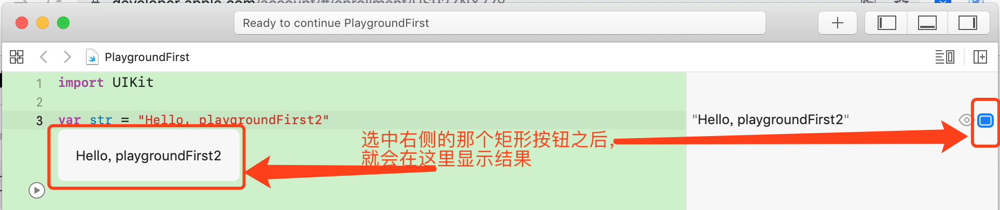
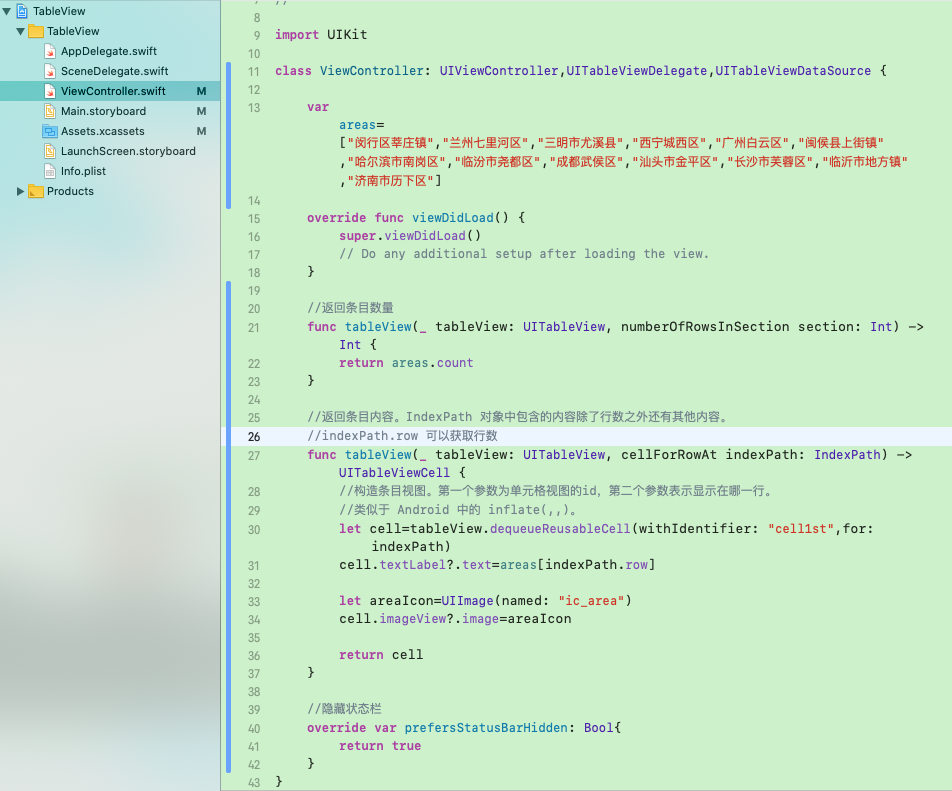
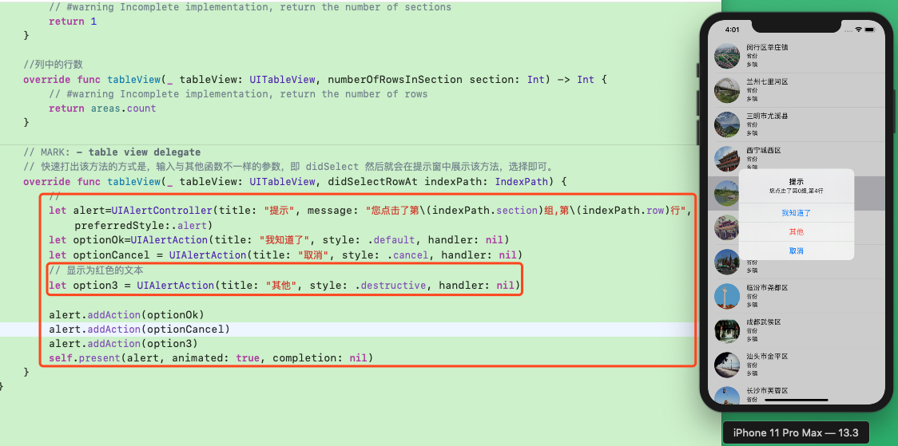

* [Xcode 中的快捷键](https://blog.csdn.net/tyhdxhl/article/details/44748993?locationNum=6&fps=1)

格式化代码的快捷键： 先全选，然后 `Ctrl+ I`

* [下载历史版本的 Xcode](https://developer.apple.com/download/more/)

---

* IOS 10 教程 —— 小波说雨燕：
	* [iOS 10 开发第一季 ①入门篇](http://xiaoboswift.com/course/39)
	* [iOS 10 开发第一季 ②初级篇](http://xiaoboswift.com/my/course/40)
	* [iOS 10 开发第一季 ③中级篇](http://xiaoboswift.com/course/42)
	* [iOS 10 开发第一季 ④高级篇](http://xiaoboswift.com/course/43)
	* [iOS 10 开发第一季 ⑤上架篇](http://xiaoboswift.com/my/course/44)

**以下内容基于 XCode 11.0 及更高版本**, 2019-10-09

* [Part1-初级篇-笔记](ios开发_小波说雨燕_Part1-初级篇.md) 
* [Part2-中级篇-笔记](ios开发_小波说雨燕_Part2-中级篇.md)
* [Part3-高级篇-笔记](ios开发_小波说雨燕_Part3-高级篇.md)
* [Part4-上架篇-笔记](ios开发_小波说雨燕_Part4-上架篇.md)

# [①入门篇](http://xiaoboswift.com/course/39)
---------------------

* 注册开发者账号：[点击进行注册](http://developer.apple.com/programs/register), 注册为开发者之前需要先有 AppleID 

* 提交应用到市场时，使用正式版 Xcode, 不要使用 beta 版

## 一、Swift Playground

playground : 游乐园，游乐场，运动场

### 1、运行第一个 playground 

新建一个 playground

 
 
 选择项目类型：
 
 
 
 设置项目名称以及存储路径：
 
 
 
 运行并在右侧查看结果
 
 
 
 在代码下方显示结果：
 
 
 
 
### 2、用 playground 构建一个圆角矩形

```swift
import UIKit

// CGRect(,,,) 表示构建按钮的范围。编写时，先输入 CGRect( 此时就会有提示，然后直接选择即可
// x: y: width: height： 必须保留，不能删除
let roundCornerBtn = UILabel(frame: CGRect(x: 0, y: 0, width: 200, height: 50))

roundCornerBtn.text = "立即订购"
roundCornerBtn.textColor = UIColor.white
// 设置背景色，等价于 UIColor.red ；省略前面的类时，= 左右都必须有空格
roundCornerBtn.backgroundColor = .red
// 这种省略写法是 先写一个 . 然后会自动提示
roundCornerBtn.textAlignment = .center

// 圆角
roundCornerBtn.layer.cornerRadius=10
// 裁剪，不加不显示。false 表示不支持圆角；true 表示支持圆角
roundCornerBtn.clipsToBounds=true
```


## 二、第一个 APP - HelloWorld

* xx.storyboard 是界面编辑器，同 Android 中的 xml 布局文件
* xx.swift 是代码内容，同 Android 中的 .java/ .kt 文件


### 1、创建第一个文本View

* 选择控件

添加一个 Label 控件——用来显示文本


* 添加约束条件

不添加约束条件的话，在不同尺寸的设备上显示效果差异较大。

如果想修改控件的相关属性，可以先选中右侧的属性菜单，然后修改


在上图中，添加约束时，选择了约束条件之后，记得点击 `Add 2 Condition` , 点击一次就好了，重复点击会重复添加约束。

* 查看约束信息的属性


## 三、理解 HelloWorld APP

>* `xx.storyboard` ：为界面信息
>* `ViewController.swift` ： 具体的功能实现


* 同时打开 `ViewController.swift` 和 视图界面（快捷键 `Ctrl + Alt + Command + Return`）


* 添加事件


* 编辑事件


* 查看事件对应的控件


* 执行点击事件(在控制台打印信息)


* 执行点击事件2 （显示 Alert 弹窗）


核心代码如下：

```swift
import UIKit

class ViewController: UIViewController {

    override func viewDidLoad() {
        super.viewDidLoad()
        // Do any additional setup after loading the view.
    }
    
    @IBAction func onHelloBtnClick(_ sender: UIButton) {
        // 在控制台中显示内容，print 同 Android 中的 Log
        print(" HelloWorld 按钮被点击了")
        
        // 点击之后显示一个 Alert 弹窗
        // 声明一个弹窗 ( preferredStyle:.actionSheet 表示从底部弹出的弹窗)
        let alert=UIAlertController(title: "提示", message: "HelloWorld 按钮被点击了", preferredStyle: .alert)
        // 声明一个弹窗事件--确定按钮
        let okAction=UIAlertAction(title: "我知道了", style: .default, handler: nil)
        // 将事件添加到 弹窗中
        alert.addAction(okAction)
        // 展示弹窗 (参数分别为：要显示的控件，是否执行动画，展现之后的事件)
        self.present(alert, animated: true, completion: nil)
    }
}
```

## 四、指定 ViewController

* 查看或修改 ViewController


* IOS app 视图结构


---

# [②初级篇](http://xiaoboswift.com/my/course/40)

---


## 一、自动布局（Auto Layout）

### 1、认识添加约束的按钮

自动布局基于约束条件


> 隐藏 XCode 左侧项目结构的快捷键 `command + 0`

* 约束-对齐


* 约束-添加


* 约束-修正


* 约束-刷新

当我们修改了约束条件之后，如果预览视图没有发生变化，点击该刷新按钮即可刷新视图


* 查看约束信息


* 约束信息有误

如下图表示约束信息有误，这种情况下就可以点击 修正 按钮去修正，但修正出来的不一定正确


* 设置预览设备


### 2、案例：添加约束，将控件固定在屏幕右下角

新增控件并拖拽到预定位置,然后按住 Ctrl 键向下拖动 添加垂直约束


上一步松手之后会出现下图:


选中第一项之后，会看到下图的样子


修正缺失约束


## 二、堆叠视图——UIStackView

### 1、堆叠视图简介

在 UI 元素不断增加的时候，自动布局无法满足精确布局的要求，所以有了堆叠视图——`UIStackView` 

`UIStackView` 对应 Css 中的 `Flexbox` , 即 弹性盒子。有如下特点：

* 可以把多个对象组合在一起，实现整体对外的布局约束。
* 内含各组件排列和分布机制。
* 可以无限嵌套。

### 2、使用堆叠视图：文字堆叠

#### （1）、堆叠视图的使用方式：

添加堆叠视图的有两种方法：

* 从组件库拖一个堆叠视图
* 选中多个视图，然后使用布局条上的 `Embed in Stack`


#### （2）、添加图片到项目

##### 1）、图片的命名规则：


##### 2）、添加图片到项目：

直接将图片拖拽到 `Assets.xcassets` 目录下即可。


[点击下载视频教程中图片资源](http://ese3a8b8c4d6ab.pri.qiqiuyun.net/coursematerial-40/20170330111350-8ejhoomb378co40g?attname=t-shirts.zip&e=1584425189&token=ExRD5wolmUnwwITVeSEXDQXizfxTRp7vnaMKJbO-:VY0OGdZK02eJnG-LFjEcRDHkalU=)


#### （3）、对标题使用堆叠视图

先通过拖拽添加一个 StackView：


添加标题文字：（使用两个 Label）


我们也可以根据需要，动态的调整 StackView 中子内容的排列方式、对齐方式、布局分配模式：


属性|含义|取值
---|---|---
Axis| 轴向（排列方式）| vertical 垂直 <br> horizontal 水平
Alignment | 对齐方式 | 当 Axis 为垂直时：Fill 与Leading 相同，左对齐；Center 居中对齐；Trailing 右对齐；<br>当 Axis 为水平时：Fill 与 Center 同，居中对齐；Top 上对齐；Bottom 底部对齐
Distribution | 空间分配方式 | Fill Equally 为等高；其他均为原样显示

具体显示效果如下：


为 StackView 添加对外约束条件——添加水平约束：


为 StackView 添加顶部约束：


调整顶距：


或者也可以使用下面的方式调整顶距：


### 3、使用堆叠视图：图像堆叠

#### (1)、添加图像及约束

先添加一个水平排列的 StackView , 然后在 StackView 中添加三个  ImageView。

然后为 ImageView 控件添加图片:


设置图片等比例显示:


为存放图片的StackView添加对外约束:


#### （2）、调整图像宽度

在上一步中，存放图片的 StackView 比手机屏幕宽，导致左右图片显示不全，所以我们就需要限定 StackView 与父视图等宽。


在操作完上一步之后，StackView 视图的宽度并没有变化，还需要按下图操作：


为了保证 StackView 缩放之后内部的子视图不变形，还需要做如下控制：


#### (3)、添加底部的两个按钮

添加按钮的步骤省略。

将多个控件组合到一个 StackView 中：


为底部 Button 所在的 StackView 添加水平约束：


为 Button 所在的 StackView 添加底部约束：


也可以使用如下方式添加相对于父视图的约束：


## 三、Size Class

### 1、屏幕尺寸的抽象

为简化屏幕适配引入的抽象概念。用来处理不同尺寸和旋转方向，配合自动布局使用。


### 2、堆叠视图的 Size Class 适配

 在前面的堆叠视图的示例中，当我们切换其他小屏设备或者旋转手机屏幕方向之后，界面就会显示异常，所以，我们需要使用 Size Class 进行适配优化。
 
#### (1)、给视图加 Label

给视图加 Label 就是给 View Controller 中的内容添加 Label 名称。


 
#### (2)、 适配

##### 1)、顶部标题适配

先切换到横屏，然后按下图操作：


经过上面的操作，标题就实现了横屏模式下的水平排列。

##### 2）、图片适配


 
 
 
 
 
#### (3)、约束的可见性

我们在横屏下添加的约束不应该在竖屏下显示，同理，竖屏下添加的约束横屏下也不应该能看到。


 

## 四、App 原型设计

### 1、原型设计简介


### 2、原型设计工具

* 纸上原型：Prototyping on Paper （可在 IOS 手机的应用商店下载）
* 国内软件：[墨刀](https://modao.cc/)
* 国外软件：[Origami Studio](http://origami.design)

## 五、TableView

### 1、UITableView 简介和 Demo

拖拽一个 TableView 到 StoryBorad 中，然后调整其大小铺满整个 SafeArea。

然后为该 TableView  添加单元格（示例中仅添加了一个单元格）：


为单元格设置样式：


此时运行的话，会显示一堆空白的单元格列表，因为我们还没有填充数据。如下图：


### 2、UITableView 相关协议及实现

#### (1)、UIKit 和 UiTableView

 iOS SDK (Software Develop Kit) 包含一系列开发用的基础框架。一个框架是相似功能类（Class）的集合。
 
 UIKit 就是 UI 相关的类集合。
 
 UITableView 是用来显示列表的类。
 
 * 可以显示多行但仅一列的重复样式的数据
 * 不同类型的数据可分组隔开
 * 表头和表尾是可选的。

#### （2）、列表相关的协议

##### 1)、协议简介

协议可以理解为中介或代理。

在使用相关的视图控件时，必须遵守相关的协议。在 Swift 语言环境下，列表相关的协议有：`UITableViewDelegate` 和 `UITaleViewDataSource`

要让列表视图显示数据，必须遵守一组预定义的协议，并提供一个对象（这里是 ViewController） 去实现所有要实现的显示数据方法。

UITableView 显示数据时，必须先通过代理/协议（ViewController）获知要显示的数据是啥，这些数据要怎么显示。（这个代理可以理解为 Android 中的列表视图中的 Adapter ）


##### 2）、为列表视图提供协议和数据源

 UITableViewDataSource 控制列表显示的数据内容，它需要实现如下方法：

* `tableView (_:numberOfRows InSection: )`  组所在的行数
* `tableView (_:cellForRowAt IndexPath: )` 每一行显示的单元格内容

UITableViewDelegate 处理列表视图的外观，没有强制要求实现的方法。可以管理行高、表格每个组的表头、表尾、单元格排序等。

在 UITableViewDataSource 的源码中，除了上述两个必须要实现的方法外，还有其他许多可选实现的方法，比如：

 

我们在 `ViewController.swift` 中定义一个变量存储列表所需要的数据：

```swift
 var areas=["闵行区莘庄镇","兰州七里河区","三明市尤溪县","西宁城西区","广州白云区","闽侯县上街镇","哈尔滨市南岗区","临汾市尧都区","成都武侯区","汕头市金平区","长沙市芙蓉区","临沂市地方镇","济南市历下区"]
```

##### 3）、让 ViewController 实现列表视图的必须协议


```swift
import UIKit

class ViewController: UIViewController,UITableViewDelegate,UITableViewDataSource {
    
    var areas=["闵行区莘庄镇","兰州七里河区","三明市尤溪县","西宁城西区","广州白云区","闽侯县上街镇","哈尔滨市南岗区","临汾市尧都区","成都武侯区","汕头市金平区","长沙市芙蓉区","临沂市地方镇","济南市历下区"]
    
    override func viewDidLoad() {
        super.viewDidLoad()
        // Do any additional setup after loading the view.
    }
    
    //返回条目数量
    func tableView(_ tableView: UITableView, numberOfRowsInSection section: Int) -> Int {
        return areas.count
    }
    
    //返回条目内容。IndexPath 对象中包含的内容除了行数之外还有其他内容。
    //indexPath.row 可以获取行数
    func tableView(_ tableView: UITableView, cellForRowAt indexPath: IndexPath) -> UITableViewCell {
        //构造条目视图。第一个参数为单元格视图的id，第二个参数表示显示在哪一行。类似于 Android 中的 inflate(,,)。
        let cell=tableView.dequeueReusableCell(withIdentifier: "cell1st",for: indexPath)
        cell.textLabel?.text=areas[indexPath.row]
        return cell
    }
}
```
### 3、连接数据源和代理

#### （1）、将视图与数据源和代理进行关联

将视图与数据源和代理进行关联：


查看关联关系：


运行查看结果：


#### （2）、添加缩略图

[点击下载视频中的缩略图](https://pan.baidu.com/s/1c2449Yo)

[一键制作 APP 图片：ydimage , 导入图片生成 APP 内应用的各尺寸图标](http://ydimage.yidianhulian.com/)


在列表中展示图片有两种方式：从 storyboard 中指定；从代码中动态添加。

方式1：从 storyborad 中指定


方式2：从代码中添加：

```swift
//先构造 UIImage 对象，然后将值赋值给 cell.imageView?.image
let areaIcon=UIImage(named: "ic_area")
cell.imageView?.image=areaIcon
```


显示效果如下：


#### （3）、隐藏状态栏

核心代码：

```swift
 //隐藏状态栏
 override var prefersStatusBarHidden: Bool{
     return true
 }
```

完整代码如下图：



隐藏状态栏之后的效果：


### 4、添加布局约束

* `Command + 左方向键` 或 `Command + 右方向键` 可以实现模拟器的横屏切换
* `Command + 上方向键` 可以调大模拟器的音量
* `Command + 下方向键` 可以减小模拟器的音量

在上一节中完成的 TableView 列表视图中，当我们横屏之后，会发现，条目之间的分割线并为铺满屏幕，右侧顶不到屏幕右边缘，如下图：


为了实现满屏效果，我们可以按照下图为 TableView 添加约束条件：


最终结果如下：


## 六、单元格

### 1、使用 UITableViewController

#### (1)、用 TableViewController 替换默认的 ViewController

新建项目 FansArea , 然后删除默认的 ViewController，如下图：


新增 TableViewController, 如下图：


新增完成之后，效果如下：


#### （2）、新建 TableViewController.swift

新建自定义的 `AreaTableViewController.swift` 文件，该类继承自 TableViewController：


然后选择存储位置：


我们打开 `AreaTableViewController.swift` 后可以发现，其中有很多自动生成的代码：


将 storyboard 中的 TableViewController 与我们自定义的 `AreaTableViewController.swift` 绑定：


将新增的 AreaTableViewController 作为 storyboard 的初始 controller:


上面这一步必须勾选，否则会报错：

```
Failed to instantiate the default view controller for UIMainStoryboardFile ‘Main’ - perhaps the designated entry point is not set?
```

然后为单元格设置样式和 id：


然后导入图片资源：


补充：需要在页面内查找元素时，可以同时按下 `command + F `, 然后输入要查找的内容即可。另外，点击左侧的下拉，还可以使用 replace 等其他功能。


### 2、单元格专属缩略图

[点击下载视频中的图片资源](http://ese3a8b8c4d6ab.pri.qiqiuyun.net/coursematerial-40/20170330111352-8ndv6uoh9m4okkkw?attname=areas-all.zip&e=1584539567&token=ExRD5wolmUnwwITVeSEXDQXizfxTRp7vnaMKJbO-:KB5aY0SknTamtKgxrXimEYeIuzU=)

将下载好的图片资源添加到 assets 目录下：


然后在 `AreaTableViewController.swift` 中构建一个我们刚导入的图片名称的数组，并在初始化单元格时，引用该数组中的图片资源。具体如下：

```swift
import UIKit

class AreaTableViewController:UITableViewController {
    
    var areas=["闵行区莘庄镇","兰州七里河区","三明市尤溪县","西宁城西区","广州白云区",
               "闽侯县上街镇","哈尔滨市南岗区","临汾市尧都区","成都武侯区","汕头市金平区",
               "长沙市芙蓉区","临沂市地方镇","济南市历下区"]
    
    var pics=["xinzhuang","qilihe","youxi","chengxi","baiyun",
              "shangjie","nangang","yaodu","wuhou","jinping",
              "furong","xining","xining"]
    
    override func viewDidLoad() {
        super.viewDidLoad()
    }
    
    // 显示几列，如果删除该函数，则默认为 1.不删除就需要手动赋值
    override func numberOfSections(in tableView: UITableView) -> Int {
        // #warning Incomplete implementation, return the number of sections
        return 1
    }
    
    //列中的行数
    override func tableView(_ tableView: UITableView, numberOfRowsInSection section: Int) -> Int {
        // #warning Incomplete implementation, return the number of rows
        return areas.count
    }
    
    //初始化单元格视图
    override func tableView(_ tableView: UITableView, cellForRowAt indexPath: IndexPath) -> UITableViewCell {
        let cell = tableView.dequeueReusableCell(withIdentifier: "cusCell", for: indexPath)
        
        cell.textLabel?.text=areas[indexPath.row]
        cell.imageView?.image=UIImage(named:pics[indexPath.row])
        
        return cell
    }
}
```

显示效果如下：


### 3、定制单元格外观

因为之前的单元格样式都是使用的 `basic` , 运行之后界面并不美观，所以需要优化。

#### (1)、定制单元格界面

调整单元格和TableView的高度和样式:


为单元格添加图片控件被设置尺寸


添加三个 Label (文本展示控件)：


添加完之后，效果如下：


#### (2)、自定义单元格的控制器

新建 UITableViewCell 的实现类。


然后将自定义的单元格视图与该实现类关联:


将单元格中的元素与控制器（`AreaTableViewCell.swift`）关联:


在上图中，

* `@IBOutlet` : 用于引用 storyboard 上的一个 UI 控件
* `@IBAction`: 用于响应 storyboard 中 UI 控件的事件
* `weak` :  表示弱引用

查看关联关系：


还可以通过如下方式查看关联关系：


### 4、单元格控制器代码编写

#### （1）、为自定义的单元格填充数据并展示

使用 `as!` TableViewCell 强制转换为 `AreaTableViewCell` , 只有当我们确定能转换时才使用强转。否则就使用 `as?` 进行安全转换。强转出错会导致崩溃，但安全转换则不会。

（一定注意，在填充图片时，一定要使用自定义的 ImageView 控件名称，千万不要手抖直接使用默认的  cell.imageView，否则图片显示会出问题的！！ ）

核心代码如下：

```swift
 //初始化单元格视图
    override func tableView(_ tableView: UITableView, cellForRowAt indexPath: IndexPath) -> UITableViewCell {
        
        // 使用 as! 强制转换为自定义的 AreaTableViewCell
        let cell = tableView.dequeueReusableCell(withIdentifier: "cusCell", for: indexPath) as! AreaTableViewCell
        
        /* 将数据填充到自定义的单元格控件中。
           nameLabel 和 thumbImageView 都是我们在 AreaTableViewCell 中声明过的
         */
        cell.nameLabel.text=areas[indexPath.row]
        cell.thumbImageView?.image=UIImage(named: pics[indexPath.row])
        
        return cell
    }
```


展示效果如下：


#### (2)、实现圆形图片

##### 1）、视图处理类介绍——CALayer

CALayer 类用来管理视图和处理视图相关动画，可调节的属性内容包括：

* 背景色
* 边框及宽度
* 阴影色及宽度等
* 透明度
* 边角半径

##### 2）、将列表单元格的图片变为圆形图

由于我们设置的 thumbImageView 的宽高是相等的，所以，当 CALayer 的圆角半径为宽度的一半时，就能实现一个圆形图的效果。

核心代码如下：

```swift
 //设置圆角半径
 cell.thumbImageView.layer.cornerRadius=cell.thumbImageView.frame.size.width/2
 //让前一步的圆角生效
 cell.thumbImageView.clipsToBounds=true
```


运行效果如下：


## 七、单元格交互

（本章节示例基于上一节自定义单元格的内容）

### 1、最常见的单元格交互——点击

#### (1)、理解 UITableViewDelegate

delegate 是一种 “模式（pattern）”，每一个代理负责一个具体的角色或任务，类似“分包”。主要用来处理行为和交互。

UITableViewDelegate 主要处理页眉页脚、单元格交互、排序等。

#### (2)、QuickHelp 的使用


#### （3）、Selections

在 IOS 中，使用 Selections 来表示选中事件，而不是用 click.

我们运用 QuickHelper 可以进入到 UITableViewDelegate 的文档说明界面，然后可以找到对于 Selection 的说明，具体如下图：


如上图，需要注意函数参数中的 willSelectRowAt 和 didSelectRowAt 分别表示开始响应事件和响应完成。

#### （4）、Selection 事件的实现

核心代码：

```swift
// 快速打出该方法的方式是，输入与其他函数不一样的参数，即 didSelect 然后就会在提示窗中展示该方法，选择即可。
   override func tableView(_ tableView: UITableView, didSelectRowAt indexPath: IndexPath) {
       //或者可以使用字符串插值实现要打印的内容
       print("您点击了第",indexPath.section,"组,第",indexPath.row,"行")
   }
```


### 2、UIAlertController——通知框

UIAlertController 可以用来显示居于屏幕中间的通知框或者底部弹出菜单。

#### (1)、UIAlertAction

在配置通知框或者底部弹出菜单的时候，可以通过 `UIAlertAction` 配置相关的菜单参数，如：

参数|含义|示例
---|---|---
`title` | 标题 | "取消"
`style` | 样式 | `.cancel`
`handle` | 响应事件 |  nil (无操作） 

#### (2)、显示位于屏幕中间的弹窗1

显示位于屏幕中间的弹窗的核心代码如下：

```swift
// MARK: - table view delegate
    // 快速打出该方法的方式是，输入与其他函数不一样的参数，即 didSelect 然后就会在提示窗中展示该方法，选择即可。
    override func tableView(_ tableView: UITableView, didSelectRowAt indexPath: IndexPath) {
    	  //message 中使用了字符串插值模板 \()
        let alert=UIAlertController(title: "提示", message: "您点击了第\(indexPath.section)组,第\(indexPath.row)行", preferredStyle:.alert)
        let optionOk=UIAlertAction(title: "我知道了", style: .default, handler: nil)
        alert.addAction(optionOk)
        self.present(alert, animated: true, completion: nil)
    }
```


#### （3）、显示位于屏幕中间的弹窗2

```swift
   // 快速打出该方法的方式是，输入与其他函数不一样的参数，即 didSelect 然后就会在提示窗中展示该方法，选择即可。
    override func tableView(_ tableView: UITableView, didSelectRowAt indexPath: IndexPath) {
        //
        let alert=UIAlertController(title: "提示", message: "您点击了第\(indexPath.section)组,第\(indexPath.row)行", preferredStyle:.alert)
        let optionOk=UIAlertAction(title: "我知道了", style: .default, handler: nil)
        let optionCancel = UIAlertAction(title: "取消", style: .cancel, handler: nil)
        // 显示为红色的文本
        let option3 = UIAlertAction(title: "其他", style: .destructive, handler: nil)
        
        alert.addAction(optionOk)
        alert.addAction(optionCancel)
        alert.addAction(option3)
        self.present(alert, animated: true, completion: nil)
    }
```



#### (3)、显示位于屏幕中间的弹窗3

```swift
// 快速打出该方法的方式是，输入与其他函数不一样的参数，即 didSelect 然后就会在提示窗中展示该方法，选择即可。
    override func tableView(_ tableView: UITableView, didSelectRowAt indexPath: IndexPath) {
        let alert=UIAlertController(title: "提示", message: "您点击了第\(indexPath.section)组,第\(indexPath.row)行", preferredStyle:.alert)
        let optionCancel = UIAlertAction(title: "取消", style: .cancel, handler: nil)
        // 显示为红色的文本
        let option3 = UIAlertAction(title: "删除", style: .destructive, handler: nil)
        
        alert.addAction(optionCancel)
        alert.addAction(option3)
        self.present(alert, animated: true, completion: nil)
    }
```

 


### 3、UIAlertController——底部弹出菜单

```swift
   // 快速打出该方法的方式是，输入与其他函数不一样的参数，即 didSelect 然后就会在提示窗中展示该方法，选择即可。
    override func tableView(_ tableView: UITableView, didSelectRowAt indexPath: IndexPath) {
        //通过preferredStyle 的值可以切换 Alert 的样式：.alert 为中间弹窗，.actionSheet 为底部弹窗
        let alert=UIAlertController(title: "提示", message: "您点击了第\(indexPath.section)组,第\(indexPath.row)行", preferredStyle:.actionSheet)
        let optionCancel = UIAlertAction(title: "取消", style: .cancel, handler: nil)
        let option3 = UIAlertAction(title: "我去过", style: .default,handler:((UIAlertAction) -> Void)?{_ in
            //点击了我去过之后，该单元格后面打上对勾
            tableView.cellForRow(at: indexPath)?.accessoryType = .checkmark
            })
        
        alert.addAction(optionCancel)
        alert.addAction(option3)
        self.present(alert, animated: true, completion: nil)
    }
```


###  4、可选链和复选 BUG 处理

#### (1)、可选链

在 `tableView.cellForRow(at: indexPath)?.accessoryType = .checkmark`  中 `?` 即表示可选链，也就是空安全判断。非空执行后面的操作，空则不执行。

#### (2)、事件响应完之后清除单元格的选中状态

如下图，当我们点击了某个条目之后，条目会变灰，除非我们点击其他条目，否则这个灰色背景一直存在：


实际上，我们希望在响应完 Selection 事件之后就恢复成原状，通过如下代码可以实现该效果：

```swift
//事件响应完之后清除选中状态
tableView.deselectRow(at: indexPath, animated: true)
```


#### （3）、修复单元格复用导致的 BUG

由于单元格存在复用机制，所以，在之前的代码中，假如我们选中并勾选了第一个条目，那么，复用该条目的条目也会被选中。

所以，我们在构建单元格视图时就需要记录并判断他们的选中。

核心代码1 ：声明一个 Bool 数组，用来存储各单元格的选中状态

```swift
//构建一个元素重复的 Bool 数组，
//等价于 var cellCheckStatus=[false,false,false,false,false,false,false,false,false,false,false,false,false,]
var cellCheckStatus=[Bool](repeatElement(false, count: 13))
```

核心代码2 : 条目被选中时，更新数组中的值

```swift
 self.cellCheckStatus[indexPath.row]=true
```

核心代码3：构建单元格视图时根据数组中的值初始化选中状态

```swift
 //如果状态是选中的，则选中；否则，不选中
 //可以用三目运算替换: cell.accessoryType=cellCheckStatus[indexPath.row] ? .checkmark:.none
if (cellCheckStatus[indexPath.row]) {
    cell.accessoryType = .checkmark
}else{
    cell.accessoryType = .none
}
```

完整代码：

```swift
import UIKit

class AreaTableViewController:UITableViewController {
    
    var areas=["闵行区莘庄镇","兰州七里河区","三明市尤溪县","西宁城西区","广州白云区",
               "闽侯县上街镇","哈尔滨市南岗区","临汾市尧都区","成都武侯区","汕头市金平区",
               "长沙市芙蓉区","临沂市地方镇","济南市历下区"]
    
    var pics=["xinzhuang","qilihe","youxi","chengxi","baiyun",
              "shangjie","nangang","yaodu","wuhou","jinping",
              "furong","xining","xining"]
    
    //构建一个元素重复的 Bool 数组，
    //等价于 var cellCheckStatus=[false,false,false,false,false,false,false,false,false,false,false,false,false,]
    var cellCheckStatus=[Bool](repeatElement(false, count: 13))
    
    override func viewDidLoad() {
        super.viewDidLoad()
    }
    
    // MARK: - table view data source
    //初始化单元格视图
    override func tableView(_ tableView: UITableView, cellForRowAt indexPath: IndexPath) -> UITableViewCell {
        
        // 使用 as! 强制转换为自定义的 AreaTableViewCell
        let cell = tableView.dequeueReusableCell(withIdentifier: "cusCell", for: indexPath) as! AreaTableViewCell
        
        /* 将数据填充到自定义的单元格控件中。
         nameLabel 和 thumbImageView 都是我们在 AreaTableViewCell 中声明过的
         */
        cell.nameLabel.text=areas[indexPath.row]
        cell.thumbImageView?.image=UIImage(named: pics[indexPath.row])
        
        //设置圆角半径
        cell.thumbImageView.layer.cornerRadius=cell.thumbImageView.frame.size.width/2
        //让前一步的圆角生效
        cell.thumbImageView.clipsToBounds=true
        
        //如果状态是选中的，则选中；否则，不选中
        //可以用三目运算替换: cell.accessoryType=cellCheckStatus[indexPath.row] ? .checkmark:.none
        if(cellCheckStatus[indexPath.row]){
            cell.accessoryType = .checkmark
        }else{
            cell.accessoryType = .none
        }
        
        return cell
    }
    
    // 显示几列，如果删除该函数，则默认为 1.不删除就需要手动赋值
    override func numberOfSections(in tableView: UITableView) -> Int {
        // #warning Incomplete implementation, return the number of sections
        return 1
    }
    
    //列中的行数
    override func tableView(_ tableView: UITableView, numberOfRowsInSection section: Int) -> Int {
        // #warning Incomplete implementation, return the number of rows
        return areas.count
    }
    
    // MARK: - table view delegate
    // 快速打出该方法的方式是，输入与其他函数不一样的参数，即 didSelect 然后就会在提示窗中展示该方法，选择即可。
    override func tableView(_ tableView: UITableView, didSelectRowAt indexPath: IndexPath) {
        //通过preferredStyle 的值可以切换 Alert 的样式：.alert 为中间弹窗，.actionSheet 为底部弹窗
        let alert=UIAlertController(title: "提示", message: "您点击了第\(indexPath.section)组,第\(indexPath.row)行", preferredStyle:.actionSheet)
        let optionCancel = UIAlertAction(title: "取消", style: .cancel, handler: nil)
        let option3 = UIAlertAction(title: "我去过", style: .default,handler:((UIAlertAction) -> Void)?{_ in
            //点击了我去过之后，该单元格后面打上对勾
            tableView.cellForRow(at: indexPath)?.accessoryType = .checkmark
            //修改数组中的状态
            self.cellCheckStatus[indexPath.row]=true
            })
        
        alert.addAction(optionCancel)
        alert.addAction(option3)
        self.present(alert, animated: true, completion: nil)
        
        //事件响应完之后清除选中状态
        tableView.deselectRow(at: indexPath, animated: true)
    }
}
```


## 八、单元格右划菜单

### 1、MVC 模式


无论哪种编程语言中，都有分离概念（SoC），其本质是将大程序或大的功能分解为小块，每一块各司其职（也就是设计模式中的单一职责原则）。

delegate 就是 iOS 编程中一种常见的 SoC，MVC 是另一种 SoC。

MVC (Model View Controller)

* `Model` 即模型，负责保持数据或对数据进行操作。数组也是模型的一种。 
* `View` 即视图，是用户能看到的东西，负责管理可视化的信息。窗口、按钮、文字等都是View
* `Controller` 是视图和模型之间的桥梁，它把从视图来的用户交互信息转换成合适的模型操作。比如，用户按了视图上的删除按钮，控制器就会触发对模型的一个删除操作，删除完成，模型就要求视图更新自己，以便反映出对数据的更改。


### 2、从 UITableView 删除一行

需要操作的内容包括：

* 删除动作的用户交互（即从右向左滑动 Cell，呈现删除按钮）
* 删除行对应的数据
* 刷新界面，将行视图从列表中删除

#### (1)、启用 Cell 的滑动删除

UITableViewDataSource 中有实现该功能的函数，如下：


核心代码如下: 

```swift
 // 展示侧滑事件（从右向左滑动）
    override func tableView(_ tableView: UITableView, commit editingStyle: UITableViewCell.EditingStyle,forRowAt indexPath: IndexPath) {
        if(editingStyle == .delete){
            tableView.deleteRows(at: [indexPath], with: .fade)
        }else if(editingStyle == .insert){
            
        }
    }
```


#### （2）、 修复崩溃的问题

在上一小节中，虽然我们从右向左滑动时展示了删除按钮，但是当我们点击这个按钮时，会触发崩溃。其崩溃信息中的核心错误是 `NSInternalInconsistencyException` , 完整错误如下：


出现该错误是因为，我们仅删除了视图，但并没有删除 Model (即各个数组)中对应的数据。所以，我们还需要把数据删除。（只删数据不删视图也会报错！）

核心代码：

```swift
 // 展示侧滑事件（从右向左滑动）
    override func tableView(_ tableView: UITableView, commit editingStyle: UITableViewCell.EditingStyle,forRowAt indexPath: IndexPath) {
        if(editingStyle == .delete){
            //删除数据
            self.areas.remove(at: indexPath.row)
            self.pics.remove(at: indexPath.row)
            self.cellCheckStatus.remove(at: indexPath.row)
            
            //删除视图
            tableView.deleteRows(at: [indexPath], with: .fade)
        }else if(editingStyle == .insert){
            
        }
    }
```

### (3)、`AreaTableViewController.swift` 的完整代码：

```swift
import UIKit

class AreaTableViewController:UITableViewController {
    
    var areas=["闵行区莘庄镇","兰州七里河区","三明市尤溪县","西宁城西区","广州白云区",
               "闽侯县上街镇","哈尔滨市南岗区","临汾市尧都区","成都武侯区","汕头市金平区",
               "长沙市芙蓉区","临沂市地方镇","济南市历下区"]
    
    var pics=["xinzhuang","qilihe","youxi","chengxi","baiyun",
              "shangjie","nangang","yaodu","wuhou","jinping",
              "furong","xining","xining"]
    
    //构建一个元素重复的 Bool 数组，
    //等价于 var cellCheckStatus=[false,false,false,false,false,false,false,false,false,false,false,false,false,]
    var cellCheckStatus=[Bool](repeatElement(false, count: 13))
    
    override func viewDidLoad() {
        super.viewDidLoad()
    }
    
    // MARK: - table view data source
    //初始化单元格视图
    override func tableView(_ tableView: UITableView, cellForRowAt indexPath: IndexPath) -> UITableViewCell {
        
        // 使用 as! 强制转换为自定义的 AreaTableViewCell
        let cell = tableView.dequeueReusableCell(withIdentifier: "cusCell", for: indexPath) as! AreaTableViewCell
        
        /* 将数据填充到自定义的单元格控件中。
         nameLabel 和 thumbImageView 都是我们在 AreaTableViewCell 中声明过的
         */
        cell.nameLabel.text=areas[indexPath.row]
        cell.thumbImageView?.image=UIImage(named: pics[indexPath.row])
        
        //设置圆角半径
        cell.thumbImageView.layer.cornerRadius=cell.thumbImageView.frame.size.width/2
        //让前一步的圆角生效
        cell.thumbImageView.clipsToBounds=true
        
//        //如果状态是选中的，则选中；否则，不选中
//        if(cellCheckStatus[indexPath.row]){
//            cell.accessoryType = .checkmark
//        }else{
//            cell.accessoryType = .none
//        }
        cell.accessoryType=cellCheckStatus[indexPath.row] ? .checkmark:.none
        
        return cell
    }
    
    // 显示几列，如果删除该函数，则默认为 1.不删除就需要手动赋值
    override func numberOfSections(in tableView: UITableView) -> Int {
        // #warning Incomplete implementation, return the number of sections
        return 1
    }
    
    //列中的行数
    override func tableView(_ tableView: UITableView, numberOfRowsInSection section: Int) -> Int {
        // #warning Incomplete implementation, return the number of rows
        return areas.count
    }
    
    // MARK: - table view delegate
    // 快速打出该方法的方式是，输入与其他函数不一样的参数，即 didSelect 然后就会在提示窗中展示该方法，选择即可。
    override func tableView(_ tableView: UITableView, didSelectRowAt indexPath: IndexPath) {
        //通过preferredStyle 的值可以切换 Alert 的样式：.alert 为中间弹窗，.actionSheet 为底部弹窗
        let alert=UIAlertController(title: "提示", message: "您点击了第\(indexPath.section)组,第\(indexPath.row)行", preferredStyle:.actionSheet)
        let optionCancel = UIAlertAction(title: "取消", style: .cancel, handler: nil)
        let option3 = UIAlertAction(title: "我去过", style: .default,handler:((UIAlertAction) -> Void)?{_ in
            //点击了我去过之后，该单元格后面打上对勾
            tableView.cellForRow(at: indexPath)?.accessoryType = .checkmark
            //修改数组中的状态
            self.cellCheckStatus[indexPath.row]=true
            })
        
        alert.addAction(optionCancel)
        alert.addAction(option3)
        self.present(alert, animated: true, completion: nil)
        
        //事件响应完之后清除选中状态
        tableView.deselectRow(at: indexPath, animated: true)
    }
    
    // 展示侧滑事件（从右向左滑动）
    override func tableView(_ tableView: UITableView, commit editingStyle: UITableViewCell.EditingStyle,forRowAt indexPath: IndexPath) {
        if(editingStyle == .delete){
            //删除数据
            self.areas.remove(at: indexPath.row)
            self.pics.remove(at: indexPath.row)
            self.cellCheckStatus.remove(at: indexPath.row)
            
            //删除视图
            tableView.deleteRows(at: [indexPath], with: .fade)
        }else if(editingStyle == .insert){
            
        }
    }
}
```

#### （4）、刷新整个列表

```swift
// 刷新整个TableView ，没有交互动画，比较生硬
tableView.reloadData()

//删除整个行，并具有交互动画
tableView.deleteRows(at: [indexPath], with: .fade)
```


### 3、定制单元格右划菜单


定制更多滑动菜单项时需要实现 返回 `UITableViewRowAction` 的 `tableView(_:editActionsForRowAt:)` 方法。需要注意的是，当我们手动实现该方法后，系统将不再提供默认的删除按钮了。

#### (1)、自定义侧滑菜单中的选项

需要新增在 `AreaTableViewController.swift` 中的核心代码如下:

```swift
//自定义侧滑菜单，返回 UITableViewRowAction 数组
    override func tableView(_ tableView: UITableView, editActionsForRowAt indexPath: IndexPath) -> [UITableViewRowAction]? {
        //定义侧滑菜单中的分享按钮
        let rowShareAction=UITableViewRowAction(style: .normal, title: "分享") { (UITableViewRowAction, IndexPath) in
            let shareSheet=UIAlertController(title: "分享到", message: nil, preferredStyle: .actionSheet)
            
            let qqAction=UIAlertAction(title: "QQ", style: .default, handler: nil)
            let weCharAction=UIAlertAction(title: "微信", style: .default, handler: nil)
            let cancleAction=UIAlertAction(title: "取消", style: .cancel, handler: nil)
            
            shareSheet.addAction(qqAction)
            shareSheet.addAction(weCharAction)
            shareSheet.addAction(cancleAction)
            
            self.present(shareSheet, animated: true, completion: nil)
        }
        
        //定义侧滑菜单中的删除按钮。.destructive 表示生成红色背景白色文本的删除样式。
        let rowDelAction=UITableViewRowAction(style: .destructive, title: "删除") { (UITableViewRowAction, indexPath) in
            self.areas.remove(at: indexPath.row)
            self.pics.remove(at: indexPath.row)
            self.cellCheckStatus.remove(at: indexPath.row)
            
            tableView.deleteRows(at: [indexPath], with: .fade)
        }
        
        // 此处后添加的元素显示在左边
        return [rowShareAction,rowDelAction]
    }
```


#### (2)、修改自定义菜单项的背景颜色

```swift
//修改侧滑菜单项的背景颜色方式1：
rowShareAction.backgroundColor = UIColor.orange

//修改侧滑菜单项的背景颜色方式2：构造中的每一个参数取值都是 0~1 之间，所以需要用色值除255
rowShareAction.backgroundColor=UIColor(red: 245/255, green: 105/255, blue: 10/255, alpha: 1)
```


## 九、导航、场景和转场

> 本章内容依旧基于前一章中的示例。

### 1、导航相关术语介绍

#### (1)、导航相关的术语

* `导航栈（Stack）`: 把一个视图叠在另一个智商，加上返回按钮，这种层次结构就叫导航栈
* `场景`：每一个页面都可以理解为一个场景
* `转场`：两个场景之间的过渡，通常有两种：Push (压入)、Modal （模态）。Push 通常是用在页面之间的切换，Modal 则用于显示弹窗。

####（2）、将 AreaTableViewController 添加到 NavigationController 中

将现有的Controller添加到NavigationController：


将现有Controller添加到NavigationController之后的效果：


修改导航栏中的标题：


此时运行，显示效果如下:


### 2、添加一个场景（即页面）

#### (1)、添加场景

新建一个 ViewController , 里面放一个 UIImageView，用来显示大图。

新增场景--ViewController:


新增 ImageView :


为 ImageView 增加约束：


#### (2)、通过转场（Segue）将视图连接在一起

先选中 Cell，然后按住 Ctrl 键，然后将 Cell 向新建的 ViewController 中拖拽，然后选择转场弹窗中的 `Show`:


转场添加完之后效果如下：


#### （3）、转场类型

* `Show` : 新的视图会被放入导航栈顶部，导航条会提供一个后退按钮，点击该按钮可以返回源视图。这是最常用的方式。
* `Show detail` : 与 Show 相似，但会替换源视图，并且没有导航条和后退按钮。
* `Present Modally` : 模态显示内容，新视图会从底部向上弹出，通常用户显示与页面连贯性不强的视图。
* `Present as popover` : iPad 常用，模态显示一个带箭头指向圆角矩形弹窗，类似一个气泡式 弹出菜单。

#### (4)、注释掉之前的单元格选中事件

注释掉或者删除 `AreaTableViewController.swift` 中的单元格选中事件相关的代码，如果不这么做，但我们点击条目时，会触发两个事件: 先弹出新的页面，然后在新页面底部弹出弹窗。

```swift
 /*
    override func tableView(_ tableView: UITableView, didSelectRowAt indexPath: IndexPath) {
        //通过preferredStyle 的值可以切换 Alert 的样式：.alert 为中间弹窗，.actionSheet 为底部弹窗
        let alert=UIAlertController(title: "提示", message: "您点击了第\(indexPath.section)组,第\(indexPath.row)行", preferredStyle:.actionSheet)
        let optionCancel = UIAlertAction(title: "取消", style: .cancel, handler: nil)
        let option3 = UIAlertAction(title: "我去过", style: .default,handler:((UIAlertAction) -> Void)?{_ in
            //点击了我去过之后，该单元格后面打上对勾
            tableView.cellForRow(at: indexPath)?.accessoryType = .checkmark
            //修改数组中的状态
            self.cellCheckStatus[indexPath.row]=true
            })
        
        alert.addAction(optionCancel)
        alert.addAction(option3)
        self.present(alert, animated: true, completion: nil)
        
        //事件响应完之后清除选中状态
        tableView.deselectRow(at: indexPath, animated: true)
    }*/
```

### 3、定制详情页

####（1）、新建一个 `AreaDetailViewController.swift`

新建 `AreaDetailViewController.swift`:


将 storyboard 中的 AreaDetail Controller 与 swift 文件关联:


#### (2)、定义接收值的变量并关联视图 变量


### 4、使用转场来传值

#### (1)、prepare 方法
只有通过 storyboad 创建的转场才可以用转场传值，代码编写的转场不行。

转场传值时使用的是 `override func prepare(for segue: UIStoryboardSegue, sender: Any?)` 方法。

在 `AreaTableViewController.swift` 文件中就已经生成了该方法，但是被注释掉了，我们解除注释。

####（2）、为转场添加 id


#### (3)、定制 prepare 方法体

定制的思路：

* 1、确认是由指定的 segue (场景) 触发的 prepare 方法
* 2、获取转场的目标控制器，并转换为具体的类
* 3、设置目标控制器的属性值

在 `AreaTableViewController.swift` 文件中新增如下内容，实现传值:

```swift
  override func prepare(for segue: UIStoryboardSegue, sender: Any?) {
        // showAreaDetail 是我们为转场添加的 identifer
        if segue.identifier == "showAreaDetail"{
            //强转
            let destController=segue.destination as! AreaDetailViewController
            //传递图片名称
            destController.areaName=pics[tableView.indexPathForSelectedRow!.row]
        }
    }
```

在 `AreaDetailViewController.swift` 的 `viewDidLoad` 方法中增加显示图片的代码：

```swift
import UIKit

class AreaDetailViewController: UIViewController {

    var areaName = ""
    
    @IBOutlet weak var areaImage: UIImageView!
    
    override func viewDidLoad() {
        super.viewDidLoad()
        //显示图片
        areaImage.image=UIImage(named: areaName)
    }
}    
```

运行之后，查看详情时显示效果如下：


#### (4)、调整图片平铺模式

* `Scale To Fill` : 拉伸
* `Aspect Fit` : 居中
* `Aspect Fill` : 平铺


---
