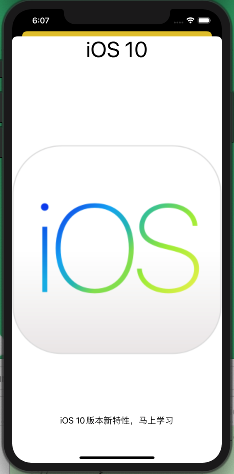
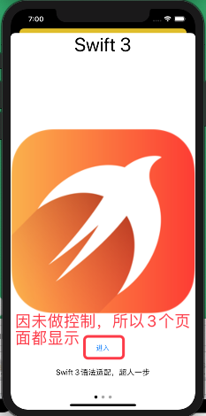
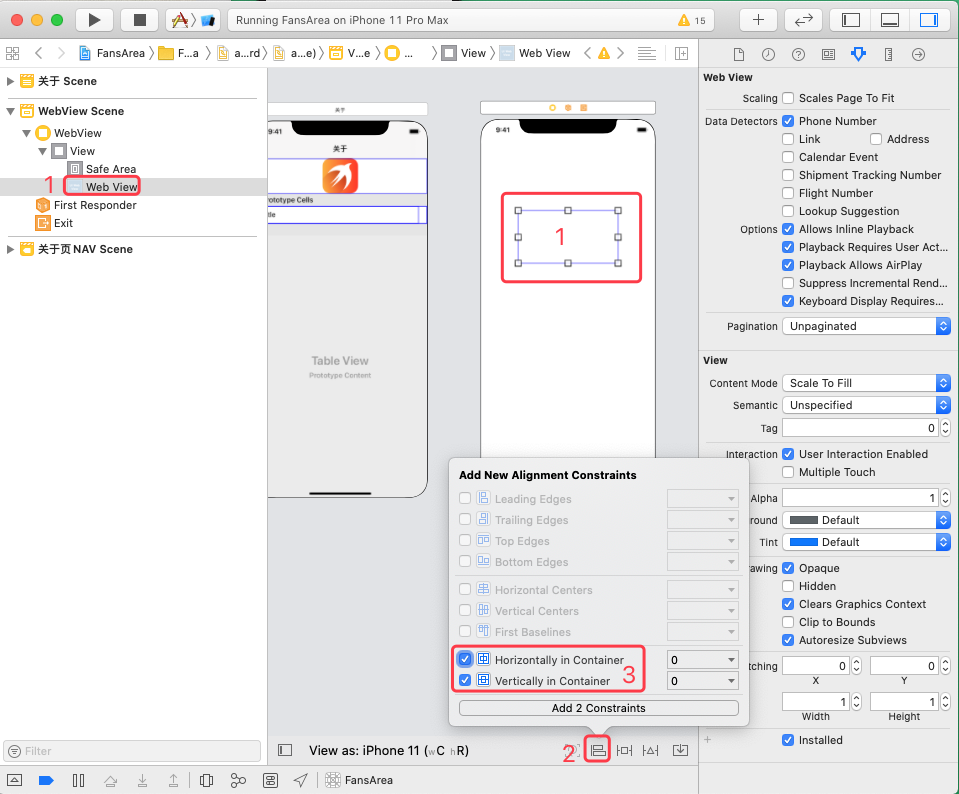
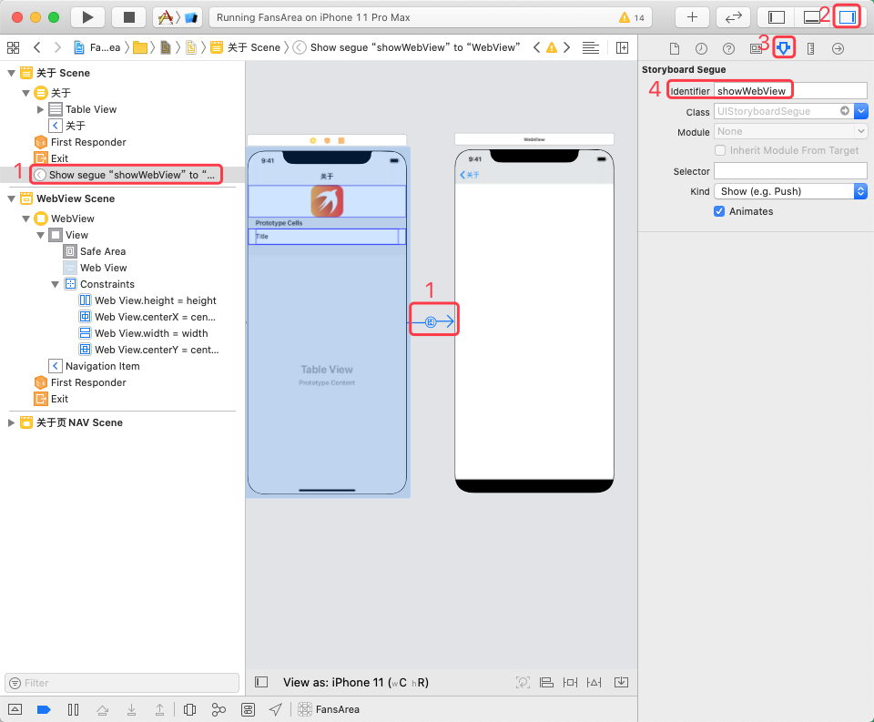
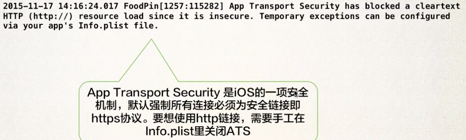

* IOS 10 教程 —— 小波说雨燕：
	* [iOS 10 开发第一季 ①入门篇](http://xiaoboswift.com/course/39)
	* [iOS 10 开发第一季 ②初级篇](http://xiaoboswift.com/my/course/40)
	* [iOS 10 开发第一季 ③中级篇](http://xiaoboswift.com/course/42)
	* [iOS 10 开发第一季 ④高级篇](http://xiaoboswift.com/course/43)
	* [iOS 10 开发第一季 ⑤上架篇](http://xiaoboswift.com/my/course/44)

**以下内容基于 XCode 11.0 及更高版本**, 2019-10-09

* [Part1-初级篇-笔记](ios开发_小波说雨燕_Part1-初级篇.md) 
* [Part2-中级篇-笔记](ios开发_小波说雨燕_Part2-中级篇.md)
* [Part3-高级篇-笔记](ios开发_小波说雨燕_Part3-高级篇.md)
* [Part4-上架篇-笔记](ios开发_小波说雨燕_Part4-上架篇.md)

 
# [④高级篇](http://xiaoboswift.com/course/43)
	
## 一、Core Data

本章工程基于上一章完成版。

### 1、什么是 Core Data

#### (1）、数据的保存

把数据保存到硬盘称为数据持久化（Persistence），iOS中持久化有如下几种方式：

存储方式|特点|示例
---|---|---
文件 | 存储更新频率低、离散、非结构化的文本类型数据 | 工程目录下的 `Info.plist` （用于保存工程配置）、 `UserDefault` 
数据库 | 更新频繁、数据量大、包含大文件（图片、视频等） | SQLite、Realm、CoreData（不是数据库，但基于数据库实现） 
 
 
SQLite 是一种轻型数据库，占内存小、速度快，非常实用移动设备、嵌入式设备实用。 
 
#### (2）、Core Data 介绍

Core Data 是 iOS/macOS 平台的官方**数据库框架**，封装了 SQLite 的基础操作，增加了面向对象的特性，增加了比如同 TableView 互动等高级特性。

iOS 其他核心库还有：Core Location、Core Graphics、Core Animation


>[摘自：认识CoreData—初识CoreData](http://www.cocoachina.com/articles/17245)
>
>CoreData 出现在 iOS 3 中，是苹果推出的一个**数据存储框架**。CoreData 提供了一种**对象关系映射(ORM)的存储关系**，类似于 Java 的 hibernate 框架。CoreData 可以将数据对象存储到数据库中，也可以将数据库中的数据转化为对象，在这个过程中不需要手动编写任何SQL语句，由系统帮我们完成。
>
>CoreData 最大的优势就是使用过程中不需要编写任何 SQL 语句，CoreData 封装了数据库的操作过程，以及数据库中数据和对象的转换过程。所以在使用 CoreData 的过程中，很多操作就像是对数据库进行操作一样，也有过滤条件、排序等操作。
>
>这就相当于 CoreData 完成了 Model 层的大量工作，例如 Model 层的表示和持久化，有效的减少了开发的工作量，使 Model 层的设计更加面向对象。


#### (3）、Core Data 组件


### 2、启用 CoreData

#### (1）、方式一：新建项目时启用


这种方式启用之后，就会在 `AppDelegate.swift`中生成默认代码。


#### (2）、方式二：现有项目启用 CoreData

先使用方式一新建一个项目，然后将 `AppDelegate.swift` 中的模板代码拷贝到我们现有的项目中，不要忘了导包——`import CoreData`

下图是新建的临时项目，我们需要拷贝其中生成的与 CoreData 相关的代码——变量`persistentContainer` 和 `saveContext()` 方法：


拷贝之后，我们现有项目的 `AppDelegate.swfit` 中的代码如下：

```swift
import UIKit
import CoreData

@UIApplicationMain
class AppDelegate: UIResponder, UIApplicationDelegate {
    
    func application(_ application: UIApplication, didFinishLaunchingWithOptions launchOptions: [UIApplication.LaunchOptionsKey: Any]?) -> Bool {
//        //导航条颜色
//        UINavigationBar.appearance().tintColor=UIColor.white
//        UINavigationBar.appearance().barTintColor=UIColor(red: 242/255, green: 116/255, blue: 119/255, alpha: 1)
//
//        //导航条字体和颜色
//        if let barFont=UIFont(name: "Avenir-Light", size: 24){
//            UINavigationBar.appearance().titleTextAttributes=[
//                //NSFontAttributeName 已经被重命名为NSAttributedString.Key.font
//                NSAttributedString.Key.font:barFont,
//                //NSForegroundColorAttributeName 已经被重名为下方的 NSAttributedString.Key.foregroundColor
//                NSAttributedString.Key.foregroundColor:UIColor.white
//            ]
//        }
        
        return true
    }
    
    // MARK: UISceneSession Lifecycle
    
    func application(_ application: UIApplication, configurationForConnecting connectingSceneSession: UISceneSession, options: UIScene.ConnectionOptions) -> UISceneConfiguration {
        // Called when a new scene session is being created.
        // Use this method to select a configuration to create the new scene with.
        return UISceneConfiguration(name: "Default Configuration", sessionRole: connectingSceneSession.role)
    }
    
    func application(_ application: UIApplication, didDiscardSceneSessions sceneSessions: Set<UISceneSession>) {
        // Called when the user discards a scene session.
        // If any sessions were discarded while the application was not running, this will be called shortly after application:didFinishLaunchingWithOptions.
        // Use this method to release any resources that were specific to the discarded scenes, as they will not return.
    }
    
    // 后面的两段内容是拷贝进来的。
    //拷贝后，注意两个地方：导包，构建 NSPersistentContainer 对象时要改成自己的项目名称
    
    // MARK: - Core Data stack 
    lazy var persistentContainer: NSPersistentContainer = {
        //CnPeng 拷贝后，注意修改这里的name,改成自己项目的名称
        let container = NSPersistentContainer(name: "FansArea")
        container.loadPersistentStores(completionHandler: { (storeDescription, error) in
            if let error = error as NSError? {
                fatalError("Unresolved error \(error), \(error.userInfo)")
            }
        })
        return container
    }()

    // MARK: - Core Data Saving support
    func saveContext () {
        let context = persistentContainer.viewContext
        if context.hasChanges {
            do {
                try context.save()
            } catch {
                let nserror = error as NSError
                fatalError("Unresolved error \(nserror), \(nserror.userInfo)")
            }
        }
    }
}
```

### 3、可视化建模

启用 CoreData 后，可以实现可视化建模（即可视化构建对象）

#### (1）、新建CoreData模型文件

`New File` > `Core Data`  > `Data Model`  命名为 `FansArea`


创建之后，将看到如下界面：


#### (2）、对象与实体的映射

即对象（Object）与 数据库的实体（Entity）的对应

先点击 `Add Entity` 添加名称为 `Area` 的 Entity 实体：


参照 `Area.swift` 编辑 `Area` 实体的属性（下图中的内容完整按照视频编辑的，与我本地的项目有差异）：


注意：`image` 属性对应的属性值是 `Binary Data` 。这是因为，我们直接引用 Assets  资源目录中的文件时可以使用文件名，但是，当我们需要获取系统相册/摄像头的图片时，必须存储实际的图片文件。

通过下图中的方式，可以调整属性信息：


#### (3）、创建托管对象

启用 Core Data 后，必须把对象置于 Core Data 框架中托管。

 先选中 Core Data 可视化界面中的 `Area` ，然后在属性栏中调整 `class` 的 `Name` 为 `AreaMo` (即添加后缀 MO)。通过菜单栏的 `Product` > `Build`  工程后，会自动创建 `AreaMo` 这个托管对象的类定义，但该文件是隐藏的，在左侧的文件浏览器中是看不到的。
 
 

#### (4）、更新模型

接下来要做的事情是，将所有使用 Area 类的地方都替换成 AreaMO。

首先清空 `AreaTableViewController.swift` 文件中 `areaBeans` 数组中的内容（我们不再使用固定数据，而是通过前面的新增页面动态的添加内容），并指定其元素类型为 `AreaMO`。

```swift
class AreaTableViewController:UITableViewController {
	var areaBeans : [AreaMO] = []
	//其他内容省略
}
```

做完上一步之后，会提示 `Use of undeclared type 'AreaMO'`, 先不管它，我们可以通过菜单栏中的 `Product` > `Clean Build Folder` 清理一下工程，然后再通过 `Product` > `Build` 重新构建，此时，可以看到下图中的错误提示：


然后点击上图 3 中的内容，挨个将 `Area` 修改为 `AreaMO`。

然后修改构建 UIImage 的方法，将原先的 ` UIImage(named: )` 改为  `UIImage(data: )`，如 ` largeImageView.image=UIImage(data:areaBean.image)`。之所以这样修改是因为，我们之前在 Area 中 image 是 String 类型，也就是图片的名字；而 AreaMO  中 image 是 Binary Data 类型，所以需要使用  `UIImage(data: )`

在替换过程中，每次修改完上图左侧列表中提示的错误后，就重新 Build 一次，直到提示 `Build Success`。

注意，在 Build 成功之后，依旧会提示 `Use of undeclared type 'AreaMO'` , 此时，关闭 XCode , 然后重新打开（在重启 Xcode 之前可以先尝试 Clean, 然后 Build，如果依旧无效，则重启 Xcode）

重启后，将不会再出现上述错误，此时，我们按住 CMD 键，单击 `var areaBeans : [AreaMO] = []` 中的 AreaMO 即可看见其定义，如下：


### 4、保存数据


#### (1）、保存数据的步骤

iOS 10 中大幅简化 Core Data 用户，保存数据只需要两步即可：

* 设置属性值
* 保存数据


#### (2）、将控件与 ViewController 关联

##### 1）、添加保存按钮

在 “新增页面” 添加一个 `bar button item` 到导航条，`System Item` 选 `save`:


##### 2）、控件与视图控制器关联

将 “新增页面” 中的按钮控件与视图控制器代码做 Action 关联，将文本输入框与文本做 IBOutlet 关联：

 
 
 
 
 
 
 

 上面三幅图中，从 1 拖向 2 时，都需要先按住 Ctrl 键。
 
 
 
##### 3）、新增变量
 
 在 `AreaAddController.swift` 中新增一个 AreaMO 变量 和 是否到访过的变量:
 
```swift
var area:AreaMO!
var isVisited=false
```

##### 4）、添加Tag并实现事件

为 “是” “否” 按钮添加 Tag，分别为 8801、8802：


```swift
@IBAction func isVisitedBtnTap(_ sender: UIButton) {
        if 8801==sender.tag {
            isVisited=true
            labelVisited.text="我去过"
        }else{
            isVisited=false
            labelVisited.text="我没去过"
        }
    }
```

##### 5）、为新增界面的反向转场设置id


#### (3）、保存数据

在 `AreaAddController.swift` 中保存数据，先导包 `import CoreData`，然后编辑 `saveTap()` 方法的内容：

```swift
// MARK: - 保存新增数据
    @IBAction func saveTap(_ sender: UIBarButtonItem) {
        // 先获取 AppDelegate，然后转为 NSManagedObjectContext
        let appDelegate = UIApplication.shared.delegate as! AppDelegate
        let nsContext=appDelegate.persistentContainer.viewContext
        
        area = AreaMO(context:nsContext )
        area.name=tfName.text
        area.province=tfProvince.text
        area.part=tfPart.text
        area.isVisited=isVisited
        //UIImageJPEGRepresentation(coverImageView.image!, 0.7) 已经被 UIImage.jpegData(compressionQuality:) 替代了
        if let imageData = coverImageView.image!.jpegData(compressionQuality: 0.7) {
            area.image=imageData
        }
        
        print("开始执行 Core Data 的保存操作")
        appDelegate.saveContext()
        
        //关闭保存界面
        performSegue(withIdentifier: "unwindToHomeList", sender: self)
    }
```

此时，运行 APP，然后添加一个条目，然后看到日志：


上面日志中，有 “保存成功” 的日志，是在 `AppDelegate.swift` 中自己添加了一个 print : 


### 5、取回数据
 
#### (1）、获取并展示全部数据

在 `AreaTableViewCotroller.swift` 中自定义一个取回全部数据的方法：`fetchAllData ( )`，然后在 `viewDidAppear()` 中调用该函数：

```swift
func fetchAllData(){
        let appDelegate=UIApplication.shared.delegate as! AppDelegate
        let nsContext = appDelegate.persistentContainer.viewContext
        
        //do try catch 是错误处理模式
        do{
            // AreaMO.fetchRequest() 表示获取 Core Data 中的全部 AreaMO 实体（Entity）
            areaBeans = try nsContext.fetch(AreaMO.fetchRequest())
        }catch{
            //error 是默认的变量名
            print(error)
        }
    }
    
override func viewDidAppear(_ animated: Bool) {
        super.viewDidAppear(animated)
        // 在显示时加载数据，viewDidAppear 类似于 Android 中的 onResume
        fetchAllData()
        // 让 tableView 重新加载从而刷新数据
        tableView.reloadData()
    }    
```


#### (2）、更高效的获取数据

##### 1)、NSFetchedResultsController

在上一小节中，我们每次都是更新全部的 tableView 视图中的数据，这样对性能不好。理想的效果是：仅更新新增或删除的一行。

`NSFetchedResultsController` 可以把单元格内容与数据进行绑定，从而响应数据变化。

首先在 `AreaTableViewController.swift` 中导包 ` import CoreData`，然后让该类遵从 `NSFetchedResultsControllerDelegate` 协议 ( 该协议挺数据变化时通知其代理的方法），然后定义一个 `NSFetchedResultsController` 变量：

```swift
import UIKit
import CoreData

class AreaTableViewController:UITableViewController,NSFetchedResultsControllerDelegate {
    var areaBeans:[AreaMO] = []
    //如果不加末尾的 ！ 就会报错： class ** has no initializers，也就是说，声明变量时必须指明是否可空
    var fc:NSFetchedResultsController<AreaMO>!
    // 其他内容省略   
}    
```

##### 2)、添加初始化代码

先注释掉 `viewDidAppear ()` 中的加载数据和刷新界面的代码内容：

```swift
  override func viewDidAppear(_ animated: Bool) {
        super.viewDidAppear(animated)
        // 在显示时加载数据，viewDidAppear 类似于 Android 中的 onResume
//        fetchAllData()
//        // 让 tableView 重新加载从而刷新数据
//        tableView.reloadData()
    }
```

然后构建一个自定义方法 `fetchAllDataV2()` 其中编写通过 NSFetchedResultsController 获取数据的代码逻辑，然后在 `viewDidLoad()` 中调用。

```swift
import CoreData

class AreaTableViewController:UITableViewController,NSFetchedResultsControllerDelegate {
    
    var areaBeans:[AreaMO] = []
    var fc:NSFetchedResultsController<AreaMO>!
    
    fileprivate func fetchAllDataV2() {
        //加载 CoreData 中的数据
        
        //构建 fetchRequest,并启用排序——按 name 排序
        let fetchRequest:NSFetchRequest<AreaMO>=AreaMO.fetchRequest()
        let sd=NSSortDescriptor(key: "name", ascending: true)
        fetchRequest.sortDescriptors=[sd]
        
        //初始化 NSFetchedResultsController ,并指定代理
        let appDelegate=UIApplication.shared.delegate as! AppDelegate
        let nsContext=appDelegate.persistentContainer.viewContext
        fc = NSFetchedResultsController(fetchRequest: fetchRequest, managedObjectContext: nsContext, sectionNameKeyPath: nil, cacheName: nil)
        fc.delegate=self
        
        //执行查询，并把数据保存到数组中
        do{
            try fc.performFetch()
            if let objets = fc.fetchedObjects {
                areaBeans=objets
            }
        }catch{
            print(error)
        }
    }
    
     // MARK: - 加载视图
    override func viewDidLoad() {
        super.viewDidLoad()
        
        //取消标题，仅保留返回操作
        self.navigationItem.backBarButtonItem=UIBarButtonItem(title: "", style: .plain, target: nil, action: nil)
        
        tableView.estimatedRowHeight=100
        tableView.rowHeight=UITableView.automaticDimension
        
        fetchAllDataV2()
    }
}    
```

此时运行程序，我们会发现，仅会展示已经添加的数据，对于新增的数据则不展示。因为我们还没有实现 `NSFetchedResultsControllerDelegate ` 的代理方法。

#### (3）、代理方法详解

当数据内容发生变化时，`NSFetchedResultsControllerDelegate` 协议的一下方法会被调用：

```swift
func controller(_ controller: NSFetchedResultsController<NSFetchRequestResult>, didChange anObject: Any, at indexPath: IndexPath?, for type: NSFetchedResultsChangeType, newIndexPath: IndexPath?) {
        //内容发生变化
    }
    
func controllerWillChangeContent(_ controller: NSFetchedResultsController<NSFetchRequestResult>) {
        //控制器开始处理内容变化
}
    
func controllerDidChangeContent(_ controller: NSFetchedResultsController<NSFetchRequestResult>) {
        //控制器已经处理完内容变化
}
```

实现代理方法的内容：

```swift
class AreaTableViewController:UITableViewController,NSFetchedResultsControllerDelegate {
 	func controller(_ controller: NSFetchedResultsController<NSFetchRequestResult>, didChange anObject: Any, at indexPath: IndexPath?, for type: NSFetchedResultsChangeType, newIndexPath: IndexPath?) {
        //内容发生变化
        switch type {
        case .delete:
            tableView.deleteRows(at: [indexPath!], with: .automatic)
        case .insert:
            tableView.insertRows(at: [newIndexPath!], with: .automatic)
        case .update:
            tableView.reloadRows(at: [indexPath!], with: .automatic)
        default:
            tableView.reloadData()
        }
    }
    
    func controllerWillChangeContent(_ controller: NSFetchedResultsController<NSFetchRequestResult>) {
        //控制器开始处理内容变化
        tableView.beginUpdates()
    }
    
    func controllerDidChangeContent(_ controller: NSFetchedResultsController<NSFetchRequestResult>) {
        //控制器已经处理完内容变化
        tableView.endUpdates()
    }
 	//其他代码省略   
}    
```

运行上述代码，当我们进入 APP 时会展示已经存储的内容，当我们新增一个条目之后，该条目也会显示在界面中。

### 6、删除和更新数据

基于上一小节的代码，我们从右向左滑动条目时，点击删除按钮，可以删除条目。但是，当我们重启 APP 后会发现，这些数据又显示出来了。这是因为我们仅是从内存中删除了数据，并没有从 CoreData 中把数据删除。而且，我们更改评价之后，也没有进行保存。

#### (1）、更新数据

以更新评价为例:


编辑完上述两处代码之后，我们更新某个地点的评价之后首页会同步到详情页面，然后当我们重启 APP 后，依旧可以展示我们上次同步的结果。

#### (2）、删除数据

核心代码：

```swift
 //定义侧滑菜单中的删除按钮
        let rowDelAction=UITableViewRowAction(style: .destructive, title: "删除") { (UITableViewRowAction, indexPath) in
            //删除本地数据源
            self.areaBeans.remove(at: indexPath.row)
            
            // 从 CoreData 中删除数据，界面的更新将由 controller() 方法接管
            let appDelegate = UIApplication.shared.delegate as! AppDelegate
            let nsContext = appDelegate.persistentContainer.viewContext
            nsContext.delete(self.fc.object(at: indexPath))
            appDelegate.saveContext()
            
            //删除界面中的条目
            //tableView.deleteRows(at: [indexPath], with: .fade)
        }
```


此时运行 APP，即可正常删除界面中的条目，并且重启 APP 后被删除的条目也不会显示，因为 CoreData 中也删除了。 

## 二、搜索条

大多数 APP 在屏幕顶端都有搜索条，该搜索条可以通过 `UISearchController` 实现。

本章项目基于上一章的完成版，本章主要学习使用 `UISearchController` 创建搜索条，并管理搜索结果。 

### 1、UISearchController

添加搜索条到TableView的关键代码:


#### (1）、为列表页添加搜索条

先在 `AreaTableViewController.swift` 中定义一个变量 ` var sc:UISearchController!`，然后在 `viewDidLoad ()` 中添加代码，示例如下: 

```swift
    override func viewDidLoad() {
        super.viewDidLoad()
        
        //构建搜索条，参数传入 nil 表示在当前页面显示搜索结果
        sc = UISearchController(searchResultsController: nil)
        sc.searchResultsUpdater = self
        // 将搜索条作为 tableView 的头布局显示
        tableView.tableHeaderView = sc.searchBar
	
	// 其他代码省略          
}
```

添加完上述代码后，`sc.searchResultsUpdater = self` 处会报错，提示需要让当前类实现 `UISearchResultsUpdating` , 我们让 `AreaTableViewController` 实现该协议，并根据提示重写 `updateSearchResults（）` 方法：

```swift
class AreaTableViewController:UITableViewController,NSFetchedResultsControllerDelegate, UISearchResultsUpdating {
    func updateSearchResults(for searchController: UISearchController) {
        
    }
 	// 其他代码省略   
}    
```

此时运行代码，就可以看到下图的样子：


#### (2）、搜索条消失了

点击搜索条，展示动画之后，搜索条可能被顶到状态栏智商，且不可见。


这是因为取消了导航条的半透明属性后出现的。

解决方案是：**让导航控制器的扩展边缘属性包含不透明条**，如下：


此时，我们在点击搜索条内部时，搜索条依旧存在，如下图：


也可以通过代码修复该问题：

```swift
 self.navigationController?.extendedLayoutIncludesOpaqueBars=true
```

完整示例如下：


### 2、筛选内容

搜索控制器没有现成的筛选功能，需要手动加上筛选功能。

对于我们当前这个 APP ，可以加上按地区名称匹配的规则。

#### (1）、定制筛选器

首先在 `AreaTableViewController.swift` 中定制一个空数组，用来保存搜索结果，然后添加筛器选方法：

```swift
class AreaTableViewController:UITableViewController,NSFetchedResultsControllerDelegate, UISearchResultsUpdating {
    
    var areaBeans:[AreaMO] = []
    var fc:NSFetchedResultsController<AreaMO>!
    var sc:UISearchController!
    //空数组用来保存搜索结果
    var searchResults:[AreaMO]=[]
    
    //MARK: - UISearchController 搜索筛选器相关
    
    //自定义筛选器
    func searchFilter(text:String){
        // 筛选并返回符合条件的新数组
        searchResults=areaBeans.filter({(area)->Bool in
            return area.name!.localizedStandardContains(text)
        })
    }
    
    // UISearchResultsUpdating 要求的实现
    func updateSearchResults(for searchController: UISearchController) {
        
    }   
    // 其他代码省略
}    
```

#### (2）、更新搜索结果：

在更新和显示搜索结果时，需要提供 `UISearchResultsUpdating` 协议的实现，然后在其 `updateSearchResults()` 方法中进行操作。 

当用户点击搜索条或者更改搜索文字时，该方法都会被调用，通过实现该方法，就可以让搜索控制器显示搜索结果。

我们在上一节添加搜索器时，已经让 `AreaTableViewController` 实现了 `UISearchResultsUpdating` 协议，所以，我们直接编辑 `updateSearchResults()` 方法即可：

```swift
 // UISearchResultsUpdating 要求的实现
    func updateSearchResults(for searchController: UISearchController) {
        // 如果搜索条中有要搜索的文本内容，则执行搜索，然后更新 tableView 视图
        if let searchText=searchController.searchBar.text{
            searchFilter(text: searchText)
            tableView.reloadData()
        }
    }
```

此时，虽然我们调用了 ` tableView.reloadData()`, 但是当我们输入内容执行搜索时，并不会显示搜索到的内容，而是依旧显示全部内容。

#### (3）、搜索与列表互动

我们此处要解除的就是如果将搜索到的结果显示在列表中。

当搜索条在使用时，`isActive` 属性为 true，所以...

以下内容都是在  `AreaTableViewController.swift` 中编辑的。

##### 1）、首先更新单元格的函数

```swift
 //列中的行数
override func tableView(_ tableView: UITableView, numberOfRowsInSection section: Int) -> Int {
    // #warning Incomplete implementation, return the number of rows
    //        return areaBeans.count
    return sc.isActive ? searchResults.count : areaBeans.count
}
```

##### 2）、然后更新单元格的数据源

```swift
 // MARK: - table view data source
    //初始化单元格视图
    override func tableView(_ tableView: UITableView, cellForRowAt indexPath: IndexPath) -> UITableViewCell {
        
        // 使用 as! 强制转换为自定义的 AreaTableViewCell
        let cell = tableView.dequeueReusableCell(withIdentifier: "cusCell", for: indexPath) as! AreaTableViewCell
        
        let areaBean = sc.isActive ? searchResults[indexPath.row]:areaBeans[indexPath.row]
        
        /* 将数据填充到自定义的单元格控件中。
         nameLabel 和 thumbImageView 都是我们在 AreaTableViewCell 中声明过的
         */
        cell.nameLabel.text=areaBean.name
        cell.thumbImageView?.image=UIImage(data: areaBean.image!)
        
        //设置圆角半径
        cell.thumbImageView.layer.cornerRadius=cell.thumbImageView.frame.size.width/2
        //让前一步的圆角生效
        cell.thumbImageView.clipsToBounds=true
        
        cell.provinceLabel.text = areaBean.province
        cell.partLabel.text = areaBean.part
      
        cell.accessoryType=areaBean.isVisited ? .checkmark:.none
        
        return cell
    }
```

##### 3）、然后设置搜索时单元格不可编辑：

```swift
 override func tableView(_ tableView: UITableView, canEditRowAt indexPath: IndexPath) -> Bool {
        //搜索时不允许编辑单元格
        return !sc.isActive
    }
```
##### 4）、用户点击搜索结果的单元格时，修改转场传递的值

```swift
// MARK: - Navigation
    override func prepare(for segue: UIStoryboardSegue, sender: Any?) {
        // showAreaDetail 是我们为转场添加的 identifer
        if segue.identifier == "showAreaDetail"{
            //强转
            let destController=segue.destination as! DetailTableViewController
            //传递
            destController.areaBean=sc.isActive ? searchResults[tableView.indexPathForSelectedRow!.row]
                :areaBeans[tableView.indexPathForSelectedRow!.row]
        }
    }
```

##### 5）、去除搜索关键字中的空格

```swift
// UISearchResultsUpdating 要求的实现
    func updateSearchResults(for searchController: UISearchController) {
        // 如果搜索条中有要搜索的文本内容，则执行搜索，然后更新 tableView 视图
        if let searchText=searchController.searchBar.text?.trimmingCharacters(in: .whitespaces){
            searchFilter(text: searchText)
            tableView.reloadData()
        }
    }
```

经过以上步骤，列表可以正常显示搜索到的内容。但是点击搜索到的条目时，并不会直接跳转到对应的详情页面，该问题将在下一节中修复。

### 3、定制搜索条外观

#### (1）、搜索条背景不要变暗

核心代码是在 `viewDidLoad()` 中加入 `sc.dimsBackgroundDuringPresentation=false` , 但该方法在 IOS 12 中已经被标记为过期，根据该方法的注释描述可以使用 iOS 9 中加入的 `sc.obscuresBackgroundDuringPresentation=false` 替代。

完整代码：


未修改前的状态：


修改后的状态：


此时，我们再执行搜索，当我们点击搜索到的条目时，就可以直接跳转到条目详情页面了。

#### (2）、其他可定制的外观选项

属性|含义
---|---
placeholder | 搜索框的文字占位符
prompt | 搜索条提示
barTintColor | 背景色
tintColor | 前景色（比如 取消按钮的颜色）
searchBarStyle | 搜索条的主题样式。默认为 `.Prominent` (突出)，搜索条半透明，搜索框不透明。`.Minimal` 搜索条全透明，搜索框半透明。


 
## 三、用 Page View 创建引导页

本章使用 `UIPageViewController ` 创建引导页，工程基于上一章的完成版。

### 1、UIPageViewController

`UIPageViewController` 可以轻松的在其管理的各 View  之间滑动切换。可以用来创建引导页，可以在图书类 APP 中做文章页面切换，可以在天气预报 APP 中做城市切换等。

#### (1）、UIPageViewController 的配置项

配置项|说明
---|---
方向 | 横/纵
样式 | 翻书/滑动
书脊位置 | 仅适用于翻书样式
页间距 | 仅适用于滑动样式


#### (2）、将要实现的引导页效果


### 2、添加翻页控制器

[点击下载视频中的图片资源](http://ese3a8b8c4d6ab.pri.qiqiuyun.net/coursematerial-43/20170330112549-n5929waf1a844ks8?attname=guide-img.zip&e=1587612347&token=ExRD5wolmUnwwITVeSEXDQXizfxTRp7vnaMKJbO-:aMUngtxuxlqlS4vr6DOjIQJZP8c=)

#### (1）、添加翻页控制器

添加 PageViewController 控件：


由于引导页只在 APP 第一次运行时展示，所以我们需要通过代码控制，代码控制则必须有控件 id，为控件设置 id 为 GuideController : 


#### (2）、理解翻页控制器

翻页控制器与导航控制器类似，都只是一个容器。其作用是管理视图、控制视图间的切换。

容器中的每页的视图内容都由自己的页面控制器管理。

#### (3）、创建视图内容

添加图片资源：


分析页面中要设置的元素：


新增引导页内容视图：


设置头标签：


设置尾标签（按住 shift+option ，然后拖动控件可以实现复制）：


设置图片控件：


为内容视图设置 storyboard id 为 ContentController :


#### (4）、添加视图控制器类

新建一个视图控制器类，命名为 `ContentViewController` 继承自 UIViewController。


将 storyboard 中的控制器与控制器类关联：


将 storyboard 中的组件与视图控制器类关联，建立 outlet:


然后新增 4 个变量，完整代码如下：

```swift
import UIKit
class ContentViewController: UIViewController {
    
    @IBOutlet weak var labelHeading: UILabel!
    @IBOutlet weak var labelFooter: UILabel!
    @IBOutlet weak var iamgeView: UIImageView!
    
    var index = 0
    var heading = ""
    var footer = ""
    var imageName = ""
    
    override func viewDidLoad() {
        super.viewDidLoad()
    }
}
```

#### (5）、完善 viewDidLoad 方法

在该方法中初始化标签的文本以及图片内容：

```swift
override func viewDidLoad() {
        super.viewDidLoad()

        labelHeading.text=heading
        labelFooter.text=footer
        imageView.image=UIImage(named: imageName)
    }
```

### 3、实现翻页控制器


#### (1）、为翻页控制器提供数据源

新建 ViewPageController 实现类，命名为 GuideViewController：


在 storyboard 中将引导页控制器与控制器类关联：


该控制器类 GuideViewController 实现 UIPageViewControllerDataSource 协议，并实现必要的方法：

```swift
import UIKit

class GuideViewController: UIPageViewController,UIPageViewControllerDataSource {
    
    override func viewDidLoad() {
        super.viewDidLoad()
    }
    
    func pageViewController(_ pageViewController: UIPageViewController, viewControllerBefore viewController: UIViewController) -> UIViewController? {
        // 这是 UIPageViewControllerDataSource 要求实现的
    }
    
    func pageViewController(_ pageViewController: UIPageViewController, viewControllerAfter viewController: UIViewController) -> UIViewController? {
        // 这是 UIPageViewControllerDataSource 要求实现的
    }
}
```

添加头标签、尾标签、图片名数组，将用于创建各页面控制器，完整代码如下:

```swift
import UIKit

class GuideViewController: UIPageViewController,UIPageViewControllerDataSource {
    var headings = ["Swift 3","iOS 10","零基础"]
    var images = ["swift","iOS","beginner"]
    var footers = ["Swift 3语法适配，超人一步","iOS 10版本新特性，马上学习","无需预备知识，新手也能入门"]
    
    override func viewDidLoad() {
        super.viewDidLoad()
    }
    
    func pageViewController(_ pageViewController: UIPageViewController, viewControllerBefore viewController: UIViewController) -> UIViewController? {
        // 这是 UIPageViewControllerDataSource 要求实现的
    }
    
    func pageViewController(_ pageViewController: UIPageViewController, viewControllerAfter viewController: UIViewController) -> UIViewController? {
        // 这是 UIPageViewControllerDataSource 要求实现的
    }
}
```

#### (2）、实现 UIPageViewControllerDataSource 要求的两个方法

```swift
import UIKit
class GuideViewController: UIPageViewController,UIPageViewControllerDataSource {
    var headings = ["Swift 3","iOS 10","零基础"]
    var images = ["swift","iOS","beginner"]
    var footers = ["Swift 3语法适配，超人一步","iOS 10版本新特性，马上学习","无需预备知识，新手也能入门"]
    
    override func viewDidLoad() {
        super.viewDidLoad()
    }
    
    func pageViewController(_ pageViewController: UIPageViewController, viewControllerBefore viewController: UIViewController) -> UIViewController? {
        // 上一页的内容
        var index = (viewController as! ContentViewController).index
        index-=1
        
        return vc(atIndex:index)
    }
    
    func pageViewController(_ pageViewController: UIPageViewController, viewControllerAfter viewController: UIViewController) -> UIViewController? {
        // 下一页的内容
        var index = (viewController as! ContentViewController).index
        index+=1
        return vc(atIndex:index)
    }
    
    func vc(atIndex:Int) -> ContentViewController? {
        // if case 判断数据是否在某个区间内
        if case 0..<headings.count = atIndex {
            if let contentVC = storyboard?.instantiateViewController(withIdentifier: "ContentController") as? ContentViewController{
                
                contentVC.heading = headings[atIndex]
                contentVC.footer = footers[atIndex]
                contentVC.imageName = images[atIndex]
                contentVC.index = atIndex
                return contentVC
            }
        }
        return nil
    }
}
```

#### (3）、完善 viewDidLoad 方法

在 viewDidLoad 中指定数据源为本身，并初始化第一个页面：

```swift
 override func viewDidLoad() {
        super.viewDidLoad()
        
        //指定数据源为本身
        dataSource = self
            
        //创建第一个引导页面
        if let startVC = vc(atIndex: 0){
        	// 注意第一个参数是一个数组
            setViewControllers([startVC], direction: .forward, animated: true, completion: nil)
        }
    }
```

#### (4）、控制显示引导页的时机

引导页要在列表页之前显示，所以，我们在列表页控制器类的 `viewDidAppear()` 中加入：

```swift
class AreaTableViewController:UITableViewController,NSFetchedResultsControllerDelegate, UISearchResultsUpdating {

 	override func viewDidAppear(_ animated: Bool) {
        super.viewDidAppear(animated)
        //显示引导页：先根据id初始化，然后用 present 模态显示
        if let pageVC=storyboard?.instantiateViewController(withIdentifier: "GuideController") as? GuideViewController{
            present(pageVC, animated: true, completion: nil)
        }
    }
 	//其他代码省略   
}    
```

注意：当我们将组件与控制器类关联时，如果想修改变量名，必须按照如下步骤先删除，再重新关联；如果直接修改，运行时会报错 ` this class is not key value coding-compliant for the key 之前的变量名.'`


此时，运行 APP 即可看到引导页的效果，左右滑动可以展示不同的引导页，从右向左滑动展示到第一张图之后将不能再左滑，从左向右滑动展示到最后一张图之后将不能右滑：




### 4、添加页码

添加页码时需要使用 `UIPageViewControllerDataSource` 协议提供的两个方法：

方法名|说明
---|---
presentationCount | 要显示的总页数
presentationIndex | 起始页的索引


#### (1）、显示页码

在 `GuideViewController.swift` 中添加如下代码：

```swift
 //MARK : - 控制页码显示
    func presentationCount(for pageViewController: UIPageViewController) -> Int {
        //页码总数
        return headings.count
    }
    
    func presentationIndex(for pageViewController: UIPageViewController) -> Int {
        //起始页码
        0
    }
```

显示效果如下:


#### (2）、定制页码

添加默认页码指示器虽然很方便，但是位置和颜色等都无法定制。所以，把之前的代码注释掉，然后用 `UIPageController` 来实现可定制的页码。

在 stroyboard 中的引导页内容中添加 PageController:


将 PageController 与控制器类（ContentViewController）关联:


然后在 ContentViewController 的  `viewDidLoad ()` 中设置页码：

```swift
class ContentViewController: UIViewController {
    //其他代码省略
    @IBOutlet weak var pageController: UIPageControl!
    
    override func viewDidLoad() {
        super.viewDidLoad()
        
        // 让页码与视图保持一致
        pageController.currentPage = index
	  //其他代码省略
    }
```

此时运行，效果如下：


#### (3）、在最后一个引导页添加按钮

在最后一个引导页添加按钮，用户点击之后展示列表页。

在图片和最后一个 Label 之间添加一个 Button，然后为其添加水平居中的约束：


将btn与控制器类关联:


为 btn 关联事件：


编辑事件内容：

```swift
  // MARK : - 点击事件
    @IBAction func btnDoneTap(_ sender: UIButton) {
        dismiss(animated: true, completion: nil)
    }
```
运行效果如下:



#### (4）、在指定页面显示按钮

在 ContentViewController 的 `viewDidLoad ()` 方法中做控制：

```swift
// 控制非最后一个页面不显示按钮
btnDone.isHidden = (index != 2)
```

此时运行 APP 即可得到我们想要的效果，前两页不显示按钮，最后一页显示按钮：


### 5、用 UserDefaults 保存参数

Core Data 用来保存较大的数据，而 UserDefaults 可以把一些小的数据（比如 App 运行参数）存储到文件中 。

引导页只是在 App 第一次运行时显示，使用 UserDefaults 保存是否显示过的参数，以便下次启动 App 时检查。


#### (1）、UserDefaults 简介


#### (2）、保存引导页的启动参数

在 `ContentViewController.swift` 内我们定义的 `btnDoneTap( )` 方法中增加存储内容：

```swift
// MARK : - 点击事件
    @IBAction func btnDoneTap(_ sender: UIButton) {
        dismiss(animated: true, completion: nil)
        
        // 将是否显示过引导页的参数存在 UserDefaults 中，类似于 Android 中的 SharedPrefences
        let defaults = UserDefaults.standard
        defaults.set(true, forKey: "guideShow")
    }
```

#### (3）、获取是否显示过引导页的参数

在 `AreaTableViewController.swift` 的 `viewDidAppear ( )` 方法内，展示引导页之前先检查是否显示过引导页的参数:

```swift
override func viewDidAppear(_ animated: Bool) {
        super.viewDidAppear(animated)
     
        let defaults = UserDefaults.standard
        if defaults.bool(forKey: "guideShow"){
            //如果显示过引导页，不再显示
            return
        }
        
        //显示引导页：先根据id初始化，然后用 present 模态显示
        if let pageVC=storyboard?.instantiateViewController(withIdentifier: "GuideController") as? GuideViewController{
            present(pageVC, animated: true, completion: nil)
        }
    }
```

此时运行 App ，当我们显示过一次引导页之后，再次启动 App 时将不再显示引导页。


## 四、Tab Bar 和 Storyboard 引用

[点击下载视频中的图片资源](http://ese3a8b8c4d6ab.pri.qiqiuyun.net/coursematerial-43/20170330112637-snf6srra8b480osw?attname=tabbaricons.zip&e=1587646541&token=ExRD5wolmUnwwITVeSEXDQXizfxTRp7vnaMKJbO-:vHxUEgkWNOfeXP8FGib1zlytgi0=)

tab bar (即 选项卡) 的设计比较普遍，位于屏幕底部，它把 App 分成若干功能块。

微信、QQ、支付宝等主流 App 都使用了选项卡。

本章主要内容：

* 创建选项卡并指定外观
* 使用  Storyboard 引用

工程基于上一章的完成版。

### 1、创建一个 Tab Bar 控制器

首先先明确我们 App 的模块划分，从而确定要添加哪些 Tab :


#### (1）、添加 Tab Bar 控制器

打开 `Main.storyboard` 选中导航控制器，即屏幕的初始化控制器，然后依次点击 `菜单 > Editor > Embed in > Tab Bar Controller `： 


TabBar添加后的样子: 


#### (2）、定制子选项卡属性


定制之后的显示效果如下：


#### (3）、选项卡的显示时机

到目前，我们添加了选项卡之后，在首页会有显示，但是，进入到列表条目详情之后依旧会显示——实际上，我们只需要再首页显示选项卡。

IOS 提供导航栏浏览时（Push） 隐藏选项卡的方法，具体如下： 


也可以在 `AreaTableViewController.swift` 的 `prepare ( )` 中通过代码控制，核心代码 `destController.hidesBottomBarWhenPushed = true` , 完整代码如下：

```swift
 override func prepare(for segue: UIStoryboardSegue, sender: Any?) {
        
        // showAreaDetail 是我们为转场添加的 identifer
        if segue.identifier == "showAreaDetail"{
            //强转
            let destController=segue.destination as! DetailTableViewController
            
            //控制详情页不显示选项卡
            destController.hidesBottomBarWhenPushed = true
            
            //传递
            destController.areaBean=sc.isActive ? searchResults[tableView.indexPathForSelectedRow!.row]
                :areaBeans[tableView.indexPathForSelectedRow!.row]
        }
    }
```

此时，运行项目，进入详情页之后将不显示选项卡。 


### 2、添加 “发现” Tab 页

添加 “发现” 和 “关于” 两个选项卡。


#### (1）、新增导航控制器


#### (2）、将新增的控制器集成到选项卡中


集成之后从 storyboard 看到的效果如下:


自定义发现页属性——System Item 选择 `Recents`: 


此时运行 App 会看到如下效果：


#### (3）、添加 “关于” Tab 页

步骤同上一小节。最后设置该页面的 System Item 为 More。


### 3、定制 Tab 外观

#### (1）、定制颜色

定制 Tab 外观时，同定制导航栏一样，也是使用 Appearance API。

以下为常见的可定制选项卡属性：

属性|含义|示例
---|---|---
tintColor | 前景色 | UITabBar.appearance().tintColor = UICloor (red:242/255, green:116/255, blue:119/255, alpha:1 )
barTintColor | 导航条颜色 | UITabBar.appearance().batTintColor = UIColor.black
backgroundImage | 背景图 | UITabBar.appearances().backgroundImage = ...

在 `AppDelegate.swift` 的 `application(_ :didFinishLaunchingWithOptions)` 方法中做修改。

```swift
func application(_ application: UIApplication, didFinishLaunchingWithOptions launchOptions: [UIApplication.LaunchOptionsKey: Any]?) -> Bool {
        UITabBar.appearance().tintColor = UIColor(red: 242/255, green: 118/255, blue: 155/255, alpha: 1)
        UITabBar.appearance().barTintColor = UIColor.lightGray
        
        return true
}
```

#### (2）、定制图标


先把上一节定制的颜色注释掉，然后运行，会看到如下界面：


#### (3）、更改选项卡被选中时的背景

在上一小节中，我们看到选项卡选中时默认变成蓝色的，实际上我们也可以指定图标的背景图片。

```swift
class AppDelegate: UIResponder, UIApplicationDelegate {
    
    func application(_ application: UIApplication, didFinishLaunchingWithOptions launchOptions: [UIApplication.LaunchOptionsKey: Any]?) -> Bool { 
        UITabBar.appearance().tintColor = UIColor.white
        UITabBar.appearance().selectionIndicatorImage = UIImage(named: "tabitem-selected")
        
        return true
    }
   // 其他代码省略
}    
```

运行后效果如下:


如上图，在不同模拟器上看到的效果不一致，在 iPhone11 pro 上的问题暂时不知道咋解决（TODO ）


### 4、Storyboard 引用

Xcode 7 开始增加了 Storyboard 引用。

Storyboard 让 UI 设计可视化，但随着工程的增长会显得杂乱难以管理。

Storyboard 引用就是把 storyboard 拆分成多个功能模块，然后做引用。


#### (1）、分割步骤

比如分割 “关于” 选项页，在 storyboard 中选中相关的视图，然后依次点击 `菜单 > Editor > refactor to storyboard`


除此之后，还有另一种分割方案，具体参考下一节。

#### (2）、将引导页拆为storyboard


将引导页抽取到新的 storyboard 之后，需要在 `AreaTableViewController.swift` 的 `viewDidAppear ()`中修改显示引导页的相关代码，因为 storyboard 变了。

核心代码 ：

```swift
 //显示引导页：先根据id初始化，然后用 present 模态显示
// “guide” 即storyboard 文件的名字，bundle 使用应用程序的主 bundle,即 Bundle.main
let guideSb=UIStoryboard(name: "guide", bundle: Bundle.main)
        
if let pageVC=guideSb.instantiateViewController(withIdentifier: "GuideController") as? GuideViewController{
     present(pageVC, animated: true, completion: nil)
}
```

完整代码：

```swift
   override func viewDidAppear(_ animated: Bool) {
        super.viewDidAppear(animated)
        
        let defaults = UserDefaults.standard
        if defaults.bool(forKey: "guideShow"){
            //如果显示过引导页，不再显示
            return
        }
      
  		//未将 storyboard 抽取之前的代码  
		//if let pageVC=storyboard?.instantiateViewController(withIdentifier: "GuideController") as? GuideViewController{
			// present(pageVC, animated: true, completion: nil)
		//}
        
        //显示引导页：先根据id初始化，然后用 present 模态显示
        // “guide” 即storyboard 文件的名字，bundle 使用应用程序的主 bundle,即 Bundle.main
        let guideSb=UIStoryboard(name: "guide", bundle: Bundle.main)
        
        if let pageVC=guideSb.instantiateViewController(withIdentifier: "GuideController") as? GuideViewController{
            present(pageVC, animated: true, completion: nil)
        }
    }
```


## 五、WebView、WKWebView 和 SFSafariViewController

iOS 提供三种方式展示网页：

方式 | 简介
---|---
Safari | 在 Safari 浏览器中打开页面，会跳出 APP
UIWebView / WKWebView | 后者时前者的增强版，都是精简的 Safari。常见的 H5 跨平台开发也是基于二者实现的
SFSafariViewController | iOS 9 中推出的控制器，相对于全功能的 Safari

本章将要学习的内容包括：

* 完善上一章中的 “关于” 选项卡页面（`about.storyboard`） , 在其中添加 “反馈” 和 “关注” 两个 section。
* 分别使用上面介绍的三种方式显示网页。

工程基于上一章的完结版。

### 1、“关于页面”的设计

#### (1）、调整列表布局

在 `about.storyboard` 中添加一个 ImageView 到列表的  headerView 中，高度为 85，图标设置为之前导入的 `swift.png`，Content Mode 为 `Aspect Fit` 


设置单元格 style 为 `Basic`


#### (2）、自定义列表类

##### 1）、新建控制器类并关联

新建 UITableViewController, 命名为 `AboutTableViewController`，然后将其与 `about.storyboard` 进行关联.


##### 2）、在 `AboutTableViewController ` 中定义数据源

```swift
import UIKit

class AboutTableViewController: UITableViewController {
    var sectionTitle = ["反馈","关注小波说雨燕"]
    var sectionContent = [["在 App Store上给我们评分","反馈意见"],["网站","博客","学习路线图"]]
    var links = ["https://github.com/CnPeng","https://github.com/CnPeng","https://github.com/CnPeng"]
 	// 其他内容省略   
}    
```

##### 3）、控制片段数和片段中的行数

```swift
 override func numberOfSections(in tableView: UITableView) -> Int {
        return 2
    }
    
    override func tableView(_ tableView: UITableView, numberOfRowsInSection section: Int) -> Int {
        // 如果是第一片段显示2行，如果是第二个片段显示3行
        return  section == 0 ? 2:3
    }
    
```    
##### 4）、设置片段标题

```swfit
 override func tableView(_ tableView: UITableView, titleForHeaderInSection section: Int) -> String? {
        return sectionTitle[section]
    }
```
##### 5）、填充单元格内容

```swift
override func tableView(_ tableView: UITableView, cellForRowAt indexPath: IndexPath) -> UITableViewCell {
  	 // 注意，这里要改成我们自定义的单元格 id
        let cell = tableView.dequeueReusableCell(withIdentifier: "Cell", for: indexPath)
        
        cell.textLabel?.text = sectionContent[indexPath.section][indexPath.row]
        
        return cell
    }
```

##### 6）、修改页面标题


此时，运行 App 会看到如下效果:


##### 7）、去除多余空行

方案1 : 使用空白View，并设置其高度为 0


方案2：在 `AboutTableViewController.swfit` 的 `viewDidLoad()` 中添加如下方法:

```swift
override func viewDidLoad() {
        super.viewDidLoad()
        
        //去除多余空行
        tableView.tableFooterView = UIView(frame: CGRect.zero)
}
```

运行后效果如下：


### 2、在 Safari 中打开网页

点击评分时，让 App 切换至 Safari 打开网页，使用  `openURL` 方法：

核心代码：

```swfit
UIApplication.shared.open(url)
```

完整代码：

```swift
 override func tableView(_ tableView: UITableView, didSelectRowAt indexPath: IndexPath) {
        switch indexPath.section {
        case 0:
            if indexPath.row == 0 {
            	    // 因视频中的地址不能用了，所以，临时使用 github 地址 
                if let url = URL(string: "https://github.com/CnPeng") {
                    UIApplication.shared.open(url)
                }
            }
        default:
            break
        }
        tableView.deselectRow(at: indexPath, animated: true)
    }
```

运行效果如下:


### 3、使用 UIWebView

UIWebView 通过 `loadRequest` 方法既可以打开远端网址，也可以打开 App 内部的静态 HTML  文件。

#### (1）、建立新 VC

拖一个新的视图控制器到 `about.storyboard`  :


再拖一个 WebView 控件到新增的控制器中：：


然后添加约束：设置水平和垂直居中（不能通过设置边距为0实现）：



与父视图等宽、等高:


添加转场，当点击 ”反馈意见“ 时，切换到这个新视图并打开网页，
（按住 Ctrl ，然后拖动 “关于” 页面的视图控制器到新建的视图控制器中，创建一个 Show 转场，id 设置为 showWebView）：





#### (2）、定制控制器类并关联

新建视图控制器类：


与控制器类关联: 


将控件与控制器类关联：


#### (3）、在控制器类中编辑加载网页的代码

```swift
import UIKit

class WebViewController: UIViewController {
    
    @IBOutlet weak var webView: UIWebView!
    
    override func viewDidLoad() {
        super.viewDidLoad()

        if let url = URL(string: "https://github.com/CnPeng"){
            let urlRequest = URLRequest(url: url)
            webView.loadRequest(urlRequest)
        }
    }
}
```

#### (4）、更新单元格点击事件

在 `AboutTableViewController.swift` 的 `tableView(_:didSelectRowAt)` 方法中做修改：

核心代码： 

```swift
 performSegue(withIdentifier: "showWebView", sender: self)
```

完整代码：

```swift
 override func tableView(_ tableView: UITableView, didSelectRowAt indexPath: IndexPath) {
        switch indexPath.section {
        case 0:
            if indexPath.row == 0 {
                if let url = URL(string: "https://github.com/CnPeng") {
                    UIApplication.shared.open(url)
                }
            }else{
                performSegue(withIdentifier: "showWebView", sender: self)
            }
        default:
            break
        }
        tableView.deselectRow(at: indexPath, animated: true)
    }
```

如果要加载的网址是 http 网址，而不是 https 网址时，会报如下错误信息：

```swfit
App  Transport Security has blocked a cleartext HTTP (http:/) resource load since it is insecure.
Temporary exceptions can be configured via your app‘s Info.plist file.
```

具体如下图:



通过关闭 ATS 即可解决上述问题：


此时，运行 App，并点击 “反馈建议” 即可在 App 内打开网页，如下图:


### 4、使用 WKWebView

WKWebView 比 UIWebView 速度更快，内存占用更少，是 UIWebView 的替代者。

#### (1）、使用 WKWebView 加载页面——代码方式

使用 WKWebView 时首先需要导包 `import WebKit`, 完整代码如下:

```swift
import UIKit
import WebKit

class WebViewController: UIViewController {
    
    @IBOutlet weak var webView: UIWebView!
    
    override func viewDidLoad() {
        super.viewDidLoad()
        
        let wkWebView = WKWebView(frame:view.frame)
        view.addSubview(wkWebView)

        if let url = URL(string: "https://github.com/CnPeng"){
            let urlRequest = URLRequest(url: url)
            wkWebView.load(urlRequest)
        }
        
        // 为了使用 WKWebView 所以需要先隐藏 WebView
        webView.isHidden = true
        // 为了避免干扰，先注释掉下面代码
        //if let url = URL(string: "https://github.com/CnPeng"){
            // let urlRequest = URLRequest(url: url)
             //webView.loadRequest(urlRequest)
         //} 
    }
}    
```


注意，截止到 2020-04-24 ，虽然在  storyboard 中可以添加 WebkitView, 但将它与控制器类关联之后加载页面时一直崩溃，报错信息如下:

```swift
2020-04-24 20:19:29.752799+0800 FansArea[19360:727946] *** Terminating app due to uncaught exception 'NSInvalidUnarchiveOperationException', 
reason: 'Could not instantiate class named WKWebView because no class named WKWebView was found; the class needs to be defined in source 
code or linked in from a library (ensure the class is part of the correct target)'
```


#### (3）、导航栏遮挡的 BUG 

使用 WKWebView 加载页面时，如果页面有导航，该导航可能会被 App 的导航条遮盖。如下图：


出现该问题是因为 WKWebView 所在的 ViewController 在默认状态下会把顶边延伸到导航条图层之下，解决方法如下：


视频中的解决遮挡问题之后的样子如下：


注意: 在 iOS 13.3 ，iPhone 11 pro max 模拟器下并为发现这个遮挡问题。 

如果高度有异常，可以增加高度自适应代码，如下：

```swift 
//启动高度自适应
wkWebView2.autoresizingMask = [.flexibleHeight]
```


### 5、使用 SFSafariViewController

#### (1）、简介

SFSafariViewController 具有跟 Safari 一样的特性，比如自动填充和阅读器。

如果需要集成一个完整的浏览器则推荐使用 SFSafariViewController。

使用时的核心代码如下:

```swift
import SafariServices

let sfVC = SFSafariViewController(url:url)
present(sfVc, animated:true, completion:nil)
```

#### (2）、使用

修改 `AboutTableViewController.swift` 中的代码。

```swift
import UIKit
import SafariServices

class AboutTableViewController: UITableViewController {
	override func tableView(_ tableView: UITableView, didSelectRowAt indexPath: IndexPath) {
        switch indexPath.section {
        case 0:
        	//代码省略   
        case 1:
            if let url = URL( string:links[indexPath.row] ){
                let sfVc = SFSafariViewController(url: url)
                present(sfVc, animated: true, completion: nil)
            }
            
        default:
            break
        }
        tableView.deselectRow(at: indexPath, animated: true)
    }
  //其他代码省略
}
```

运行之后显示效果如下:


## 六、LeanCloud

为什么要使用云存储? 参考下图:


本章使用 LeanCloud 实现 “发现” 页。

工程基于上一章的完成版。

### 1、LeanCloud 云存储

#### (1）、简介

LeanCloud云存储组件:


云存储对象:


云存储的使用和管理：


支持的数据类型对照关系:


#### (2）、注册 leancloud 并创建应用

[点击进入 leancloud 注册页面](https://leancloud.cn/dashboard/login.html#/signup)

进入注册页面，输入用户名等内容进行注册:


注册成功之后必须先完成邮箱认证和实名认证才能创建应用: 


认证完成，进入创建应用界面：


在 LeanCloud 中创建应用：


LeanCloud 创建项目完成时的样子：


LeanCloud 中以 “应用” 为单位来区分存储、消息、分析和组件等内容。


#### (3）、项目中集成 LeanCloud

LeanCloud SDK 手动安装配置比较繁琐且容易出错，所以，我们使用 `CocoaPods` 来实现。

CocoaPods 是 IOS 开发过程中经常使用的第三方配置工具。（类比 Android 中的 Gradle）

[点击查看官方的 《Swift SDK 安装指南》](https://leancloud.cn/docs/start.html)

##### 1)、安装 CocoaPods

如果之前电脑上没有安装 CocoaPods , 需要先进项安装。

先打开终端，输入 `pod --version` 检查是否已经安装过，


如果没有安装过，则输入 `sudo gem install cocaopods` :


 
 如果之前已经安装过 CocoaPods，重装时可以使用如下命令：
 
 ```swift
 // 卸载已有
 sudo gem uninstall cocoapods
 
 //安装到指定目录
 sudo gem install -n /usr/local/bin cocoapods
 ```

由于 `rubygems` 主站位于国外，所以可能会导致安装很慢，此时，则可以考虑配置 cocoapods 的源为国内镜像节点，如下：

```swift
// 移除现有的国外镜像节点
gem sources --remove https://rubygems.org/

// 替换为国内镜像节点
gem sources -a https://gems.ruby-china.com/

// 查看当前的镜像节点地址
gem sources -l 
```


>CnPeng 2020-04-26 此处必须要替换，不替换的话，后面安装会失败。

##### 2)、为工程配置 cocoapods 


打开工程（即项目），然后 `New File` > `iOS` > `Other`  > `Empty` ，必须命名为 `Podfile` ，保存到工程根目录。

> 注意 : 工程要放在非中文目录下，否则可能会出现安装失败及其他莫名的问题。


然后输入如下内容并保存:

```swift
//  'FansArea' 即工程名称，pod 'AVOSCloud' 表示添加依赖， AVOSCloud 即 LeanCloud
target 'FansArea' do
	pod 'AVOSCloud'
end
```

进入到项目根目录，执行安装命令，如下：

```swift
// 该操作可能会比较费时，需要等待一会儿
pod install 
```


集成 SDK 成功后，使用**项目根目录**下 `<项目名称>.xcworkspace` 来打开项目，如下图：


配置成功之后，我们就需要点击 `FansArea.xcworkspace` 来启动工程。


##### 3)、桥接头文件

必须设置桥接才能在 Swift 中使用 OC 编写的代码。

新建一个 Objective C 源文件（.m）, 并任意命名：


然后打开上图中的 `FansArea-Bridging-Header.h` 文件，在其中输入如下内容，然后重新 Build 编译 (快捷键 CMD+B )，编译唱功则表示桥接成功。

```swift
// 其作用是导入自动生成的 pods 子项目中 AVOSCloud 目录下的 AVOSCloud.h 文件
#import <AVOSCloud/AVOSCloud.h>
```

##### 4)、添加授权代码

先打开 LeanCloud 的控制台，查看 App 的 ID  和 KEY 信息。如下图:


然后在 `AppDelegate.swift` 的 `application(didFinishLaunchingWithOptions)` 方法中添加如下代码：

```swift
// 第一个参数为 AppID，第二个参数为 AppKey,  第三个参数为 serverURLString
 AVOSCloud.setApplicationId("77cWTyQIgXYLXNUxGiR3SLtd-gzGzoHsz", clientKey:"ajieSG2PodHRLPOci2l40p7V",serverURLString:"https://77cwtyqi.lc-cn-n1-shared.com")
```

然后运行 App， 就会在 Log 界面中看到 LeanCloud 信息，如下图:


注意：视频中没有设置 serverURLString , 是因为视频中的版本比较低，根据 [《初始化失败，返回Server URL not set》](https://forum.leancloud.cn/t/server-url-not-set/21848) 中说明，从 12.0.0 开始就必须要设置该参数。该地址即前一张图中的  `REST API 服务器地址`

到此，LeanCloud 集成成功。

### 2、保存数据到云端

我们要实现的效果：在新增区域页面中，将数据保存到本地数据库的同时，上传数据到 LeanCloud

#### (1）、模型

LeanCloud 无需事先定义 class 结构，使用 AVObject 的 setObject 方法自动处理。

class name : Area

字段及 LeanCloud 类型对照表：

字段 | 对应的LeanCloud 类型
---|---
name | string
type | string
location | string
image | AVFile（存储音视频、图片等二进制文件）


#### (2）、保存方法

保存数据到云端时，主要依靠如下两个方法：

方法名| 作用
---|---
saveInBackground | 立即保存
saveEventually | 自动保存（无网络则缓存等有网再上传）

在 `AddAreaController.swift` 中自定义保存方法，如下：

```swift
//MARK: - 保存数据到 LeanCloud
    func saveToCloud(area:AreaMO!){
        // 把本地对象包装成 AVObject
        let cloudObject = AVObject(className: "Area")
        cloudObject["name"] = area.name!
        cloudObject["province"] = area.province
        cloudObject["part"] = area.part
        cloudObject["isVisited"] = area.isVisited
        
        // 获取压缩图像（尺寸压缩）
        let originImg = UIImage(data: area.image!)!
        let scalingFactor = (originImg.size.width>1024) ? (1024/originImg.size.width):1
        let scaleImg = UIImage(data: area.image!,scale: scalingFactor)
        
        // 将压缩图像赋值给 AVObject（此处又做了一次质量压缩）
        //UIImageJPEGRepresentation(coverImageView.image!, 0.7) 已经被 UIImage.jpegData(compressionQuality:) 替代了
        let imgData = scaleImg!.jpegData(compressionQuality: 0.7)!
        let imgFile = AVFile(data:imgData  ,name: "\(String(describing: area.name)).jpg")
        cloudObject["image"] = imgFile
        
        // 保存到云端
        cloudObject.saveInBackground{(succeed,err) in
            if succeed{
                print("云端保存成功")
            }else{
                print(err ?? "保存出错")
            }
        }
    }
```

修改 `AddAreaController.swift` 中之前自定义的保存方法 ——`saveTap()`，在执行关闭保存界面的转场之前调用保存到云端的代码，如下：

```swift
 // MARK: - 保存新增数据到本地
    @IBAction func saveTap(_ sender: UIBarButtonItem) {
        // 其他构建 AreaMO 并保存到 CoreData 的代码省略
        print("开始执行 Core Data 的保存操作")
        appDelegate.saveContext()
        
        // 保存到云端
        saveToCloud(area: area)
        
        //关闭保存界面
        performSegue(withIdentifier: "unwindToHomeList", sender: self)
    }
```

运行 App ，新增一个地区，然后执行保存操作。保存成功后会看到如下信息：


我们打开 LeanCloud 的存储控制台，就会看到下图的样子:


### 3、取回数据

从 LeanCloud 中取回数据时，需要使用 `AVQuery` 类。

核心代码片段如下:

```swift
let query = AVQuery(className: "Area")
// 该方法未加筛选，查询了全部
query.findObjects (...)
```

接下来我们要做的是，将取回的云端数据展示在 “发现” 页面中。步骤如下:


#### (1）、新建发现页面对应的视图控制器类并关联


#### (2）、取回数据

在 `DiscoverTableViewController.swift` 中定义一个变量用来存储取回的数据，并定义取回数据的方法，然后在 `viewDidLoad ()` 方法中调用，如下:

```swift
class DiscoverTableViewController: UITableViewController {
    var areas : [AVObject] = []
    
    // MARK: - 获取云端数据
    func getObjectsFromCloud(){
        let query = AVQuery(className: "Area")
        query.findObjectsInBackground{(results,err) in
            if let results = results as? [AVObject]{
                self.areas = results
                self.tableView.reloadData()
                print("从云端取数据成功了")
            }else{
                print(err ?? "从云端取数据出错了")
            }
        }
    }
    
     // MARK: - 加载视图
    override func viewDidLoad() {
        super.viewDidLoad()
        
        getObjectsFromCloud()
    }
    
   //其他内容省略
}    
```

#### (3）、更新初始化单元格相关的方法

然后在 `DiscoverTableViewController.swift` 中修改用于显示单元格的方法：

```swift
 // MARK: - Table view data source
    override func numberOfSections(in tableView: UITableView) -> Int {
        return 1
    }
    
    override func tableView(_ tableView: UITableView, numberOfRowsInSection section: Int) -> Int {
        return areas.count
    }
    
    override func tableView(_ tableView: UITableView, cellForRowAt indexPath: IndexPath) -> UITableViewCell {
        // 注意：withIdentifier 要改成我们自己的 identifier, 即 Cell.其中包含一个文本框一个图片
        let cell = tableView.dequeueReusableCell(withIdentifier: "Cell", for: indexPath)
        
        let area = areas[indexPath.row]
        cell.textLabel?.text = area["name"] as? String
        
        if let imgAvFile = area["image"] as? AVFile {
            // 展示缩略图：toFit 为 true 时，scale 不生效；为 fasle 时会裁剪到指定的尺寸
            if let thumbUrl = imgAvFile.getThumbnailURLWithScale(toFit: true, width: 80, height: 60){
                print("图片地址:\(thumbUrl)")
                do{
                    let imgData = try Data(contentsOf: URL(string: thumbUrl)!)
                    cell.imageView?.image = UIImage(data: imgData)
                }catch{
                    print(error)
                }
            }
            
            // 展示原图
            //if  let imgUrl=imgAvFile.url(){
            //    print("图片地址:\(imgUrl)")
            //    do{
            //        let imgData = try Data(contentsOf: URL(string: imgUrl)!)
            //        cell.imageView?.image = UIImage(data: imgData)
            //    }catch{
            //        print(error)
            //    }
            //}
            
        }
        return cell
    }
```

> 注意：视频中在获取图片 data 时，使用了 AVFile 的 `getData()` 方法，但是，这个方法在 LeanCloud 的  12.1.3 版本 SDK 中没有了。。。

此时运行，点击 “发现” 选项卡，即可看见我们存储在云端的内容，如下:


#### (4）、解决运行缓慢的问题

iOS 中 UI 的更新时在高优先级的 "主线程" 中进行的。而网络等耗时操作则通常放在后台线程（Background）中。

 LeanCloud 的数据取回默认也是在后台线程中进行的。数据取回来之后，需要在 “主线程” 中对 UI 进行更新。`OperationQueue.main` 用于获取主线程，并加入要执行的任务。
 
 核心代码：
 
 ```swift
  // 获取主线程并添加任务
OperationQueue.main.addOperation {
   	//执行刷新 UI 的操作
}
 ```
 
修改 `DiscoverTableViewController.swift` 中定义的 `getObjectsFromCloud ()` 方法，将刷新视图的操作放在主线程：

```swift
// MARK: - 获取云端数据
    func getObjectsFromCloud(){
        let query = AVQuery(className: "Area")
        query.findObjectsInBackground{(results,err) in
            if let results = results as? [AVObject]{
                self.areas = results
                print("从云端取数据成功了")
                
                // 将更新视图的操作放在主线程中
                OperationQueue.main.addOperation {
                    self.tableView.reloadData()
                }
            }else{
                print(err ?? "从云端取数据出错了")
            }
        }
    }
``` 

>上一小节的代码中，我们没有放在主线程中，也能运行且未报错，但是最好放在主线程中——Android 中则是必须在主线程更新 UI ， 否则可能会产生崩溃。


### 4、性能提升

#### (1）、性能提升要点


#### (2）、用代码实现菊花进度条

用代码实现菊花进度条时，需要使用 `UIActivityIndicatorView`

```swift
// 创建并启动菊花进度条
let spinner = UIActivityIndicatorView ()
spinner.style = .gray
spinner.center = view.center
spinner.hidesWhenStopped = true
view.addSubview(spinner)
spinner.startAnimating()

//加载完毕时，关闭菊花进度条
self.spinner.stopAnimating()
```

#### (3）、拖拽版菊花进度条

也可以利用 Xcode 的 Extra Views 特性，打开 `discover.storyboard` 从组件库中拖一个进度指示器到 Exit 按钮左边。 如下图:


然后按住 Ctrl 键，将该组件与控制器类 `DiscoverTableViewController.swift` 关联，建立 Outlet。如下图：


然后在 `DiscoverTableViewController.swift` 的 `viewDidLoad()` 方法中补充无法通过 storyboard 的属性面板设置的属性，如下：

```swift
spinner.center = view.center
view.addSubview(spinner)
```

然后在我们自定义的数据获取的 `getObjectsFromCloud()` 方法取到数据之后，停止动画：

核心代码：

```swift
// 数据加载完成停止动画
self.spinner.stopAnimating()
```

完整代码:

```swift
// MARK: - 获取云端数据
    func getObjectsFromCloud(){
        let query = AVQuery(className: "Area")
        query.findObjectsInBackground{(results,err) in
            if let results = results as? [AVObject]{
                self.areas = results
                print("从云端取数据成功了")
                
                // 将更新视图的操作放在主线程中
                OperationQueue.main.addOperation {
                	  // 数据加载完成停止动画
               	  self.spinner.stopAnimating()
                
                    self.tableView.reloadData()
                }
            }else{
                print(err ?? "从云端取数据出错了")
            }
        }
    }
```


#### (4）、延迟加载图片

文字加载比图片加载快，所以，先显示文字，加载图片时，先给定一个占位图，然后异步加载图片，图片加载完成后主线程更新界面。

修改  `DiscoverTableViewController.swift` 中的  `tableView(_ cellForRowAt)` 方法，具体如下:

```swift
override func tableView(_ tableView: UITableView, cellForRowAt indexPath: IndexPath) -> UITableViewCell {
        // 注意：withIdentifier 要改成我们自己的 identifier, 即 Cell.其中包含一个文本框一个图片
        let cell = tableView.dequeueReusableCell(withIdentifier: "Cell", for: indexPath)
        
        let area = areas[indexPath.row]
        cell.textLabel?.text = area["name"] as? String
        
        // 指定占位图片
        cell.imageView?.image = UIImage(named: "photoalbum")
        // 使用异步获取图像并显示
        if let imgAvFile = area["image"] as? AVFile{
            //该方法已过期，使用 downloadWithCompletionHandler 替代
            imgAvFile.getDataInBackground({(data,err) in
                if let data = data{
                    OperationQueue.main.addOperation {
                        cell.imageView?.image = UIImage(data: data)
                    }
                }else{
                    print(err ?? "图片加载失败")
                }
            })
        }
```


> 注意，上述方式取出来的图片时方形的。


#### (5）、数据缓存

##### 1)、缓存策略介绍

LeanCloud 有查询缓存（默认关闭）、获取数据缓存（默认开启）。

缓存属性：

选项 | 含义
---|---
cachePolicy | 缓存策略
maxCacheAge | 缓存有效期（秒）

缓存策略有如下取值：

策略 | 含义 | 查询次数
---|---|---
ignoreCache | 无缓存 | 1
cacheOnly | 仅缓存 | 1
cacheElseNetwork | 缓存优先，无缓存则查询网络数据 | 1
networkElseCache | 网络优先，网络不通则查询缓存数据 | 1
cacheThenNetwork | 先查缓存，再查网络 | 2 

##### 2)、从缓存中获取数据

修改 `DiscoverTableViewController.swift` 中我们自定义的查询数据的 `getObjectsFromCloud()` 方法:

```swift
// MARK: - 获取云端数据
    func getObjectsFromCloud(){
        let query = AVQuery(className: "Area")
        
        // 启用缓存
        query.cachePolicy = .cacheElseNetwork
        query.maxCacheAge = 60*2
        if query.hasCachedResult(){
            print("有缓存，从缓存中读取数据")
        }
        
        query.findObjectsInBackground{(results,err) in
            if let results = results as? [AVObject]{
                self.areas = results
                print("从云端取数据成功了")
               
                // 将更新视图的操作放在主线程中
                OperationQueue.main.addOperation {
                    // 数据加载完成停止动画
                    self.spinner.stopAnimating()
                    
                    self.tableView.reloadData()
                }
            }else{
                print(err ?? "从云端取数据出错了")
            }
        }
    }
``` 

### 5、下拉刷新

下拉刷新时获取最新数据，不走缓存。

TableView 本山自带下拉刷新功能


#### (1）、增加下拉刷新

在 `DiscoverTableViewController` 的  `viewDidLoad()` 方法中增加如下代码:

```swift
// 实例化 UIRefreshControl，然后赋值给 TableView 自带的 refrshControl 属性
refreshControl = UIRefreshControl()
// action:下拉刷新时的具体事件, #selector()的参数先置空，晚一会再实现；for：事件类型
refreshControl?.addTarget(self, action: #selector(), for: .valueChanged)
```

#### (2）、修改加载数据的方法

修改从云端数据的方法，增加 Bool 变量，如下:

```swift
 func getObjectsFromCloud(needUpdate:Bool = false){
        let query = AVQuery(className: "Area")
        
        if needUpdate {
            query.cachePolicy = .ignoreCache
        }else{
            // 启用缓存
            query.cachePolicy = .cacheElseNetwork
            query.maxCacheAge = 60*2
            if query.hasCachedResult(){
                print("有缓存，从缓存中读取数据")
            }
        }
        
        query.findObjectsInBackground{(results,err) in
            if let results = results as? [AVObject]{
                self.areas = results
                print("从云端取数据成功了")
                
                // 将更新视图的操作放在主线程中
                OperationQueue.main.addOperation {
                    // 数据加载完成停止动画
                    self.spinner.stopAnimating()
                    
                    self.tableView.reloadData()
                }
            }else{
                print(err ?? "从云端取数据出错了")
            }
        }
    }
```

然后增加一个简化版的下拉刷新方法:

```swift
// 简化调用
func refreshData()  {
    getObjectsFromCloud(needUpdate:true)
}
```

#### (3）、调用刷新方法

修改  `DiscoverTableViewController.swift`  的  `viewDidLoad()` 方法:

```swift
// 实例化 UIRefreshControl，然后赋值给 TableView 自带的 refrshControl 属性
refreshControl = UIRefreshControl()
// action:下拉刷新时的具体事件, #selector() 表示先置空，晚一会二再实现；for：事件类型
refreshControl?.addTarget(self, action: #selector(self.refreshData), for: .valueChanged)
```

此时，运行 App，在发现页面我们会看到如下：


然后我们修改 LeanCloud 中的数据:


在 “发现” 页面触发下拉刷新，然后会看到如下效果:


如上图， 我们触发下拉刷新后，界面上展示了菊花进度条，数据也发生了变化，但是，数据更新完毕后，菊花进度条一直在显示，没有消失掉。是因为我们在获取到数据之后没有关闭刷新：

核心代码：

```swift
// 关闭刷新
 self.refreshControl?.endRefreshing()
```

完整代码:

```swift
func getObjectsFromCloud(needUpdate:Bool = false){
        let query = AVQuery(className: "Area")
        
        if needUpdate {
            query.cachePolicy = .ignoreCache
        }else{
            // 启用缓存
            query.cachePolicy = .cacheElseNetwork
            query.maxCacheAge = 60*2
            if query.hasCachedResult(){
                print("有缓存，从缓存中读取数据")
            }
        }
        
        query.findObjectsInBackground{(results,err) in
            if let results = results as? [AVObject]{
                self.areas = results
                print("从云端取数据成功了")
                
                // 将更新视图的操作放在主线程中
                OperationQueue.main.addOperation {
                    //关闭刷新效果
                    self.refreshControl?.endRefreshing()
                    // 数据加载完成停止动画
                    self.spinner.stopAnimating()
                    
                    self.tableView.reloadData()
                }
            }else{
                print(err ?? "从云端取数据出错了")
            }
        }
    }
```

此时再运行 App, 下拉刷新获取到数据之后即可关闭菊花进度条。

#### (4）、结果排序

AVQuery 类内建排序机制（order）

按创建日期排序时，代码如下：

```swift
// "cratedAt" 字段可以在 LeanCloud 的控制台查看，ascending：false 降序排列，true 升序排列
query.order(by: NSSortDescriptor(key:"createdAt", ascending: false))
```

> 注意: 由于 SDK 版本的变化，视频中的 API 已经不存在了。需要使用上面的代码。


