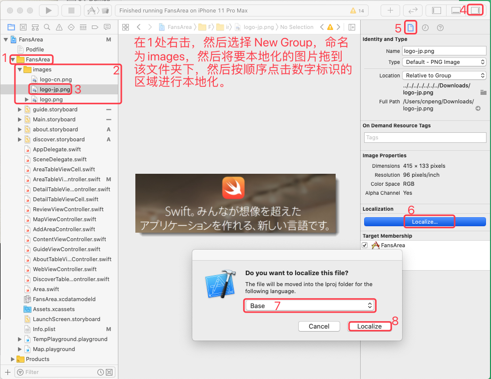

* IOS 10 教程 —— 小波说雨燕：
	* [iOS 10 开发第一季 ①入门篇](http://xiaoboswift.com/course/39)
	* [iOS 10 开发第一季 ②初级篇](http://xiaoboswift.com/my/course/40)
	* [iOS 10 开发第一季 ③中级篇](http://xiaoboswift.com/course/42)
	* [iOS 10 开发第一季 ④高级篇](http://xiaoboswift.com/course/43)
	* [iOS 10 开发第一季 ⑤上架篇](http://xiaoboswift.com/my/course/44)

**以下内容基于 XCode 11.0 及更高版本**, 2019-10-09

* [Part1-初级篇-笔记](ios开发_小波说雨燕_Part1-初级篇.md) 
* [Part2-中级篇-笔记](ios开发_小波说雨燕_Part2-中级篇.md)
* [Part3-高级篇-笔记](ios开发_小波说雨燕_Part3-高级篇.md)
* [Part4-上架篇-笔记](ios开发_小波说雨燕_Part4-上架篇.md)
 

# [⑤上架篇](http://xiaoboswift.com/my/course/44)

## 一、App 本地化

本地化（localization）即让 App 支持多种语言，把语言文字翻译成当地通用的。

本章主要内容：让我们的 App 支持三种本地化语言

工程基于上一版的完结版。

> 该章节实际操作时，与视频内容差异较大，可能是因为 Xcode 的版本跨度太大了😢


### 1、用户交互的翻译

#### (1）、有默认翻译的关键字

对于 “删除”、“确认” 等常用关键字会有标准的翻译，对这这些关键字做本地化时可以使用 `NSLocalizedString`。

下面的示例中，我们将对地区列表界面中条目的删除按钮做本地化处理，

修改 `AreaTableViewController.swift ` 中的 `tableView(_  editActionsForRowAt )` 方法，核心代码如下：

```swift
// 使用了 NSLocalizedString 五个参数的构造，但其中两个有默认值
let title = NSLocalizedString("Delete", bundle: Bundle(for: UIButton.classForCoder()),  comment: "title for delete action")
let rowDelAction=UITableViewRowAction(style: .destructive, title: title) { (UITableViewRowAction, indexPath) in
       // 代码省略
}
```

然后参考下图修改开发语言并运行 App ，即可看到本地化的效果


#### (2）、无默认翻译的字符串本地化

使用两个参数的 `NSLocalizedString( , )`

#### (3）、需要修改的内容

* `.swift` 文件中的内容
* storyboard 中的内容
* `info.plist` 中的内容


### 2、导出本地化

#### (1）、增加多语言支持


如上图增加多语言支持之后，我们直接运行 App,  然后当我们在手机设置界面中更改语言之后，前一节中的 “删除” 文本就会随着系统语言的变化而变化。

> 通过 `设置 > 通用 > 区域和语言` 可以更改系统语言

#### (2）、把字符串自动导出

注意，必须先选中下图的 1， 然后再点击 Editor, 否则，看不到导入和导出。


导出之后，会看到如下目录结构，其中的 `en.xliff` 就是具体的语言文件内容，打开之后显示的都是 xml 格式的文本。


> `.xliff` 表示业内翻译标准文件； 另外，不知道为什么，视频中导出的是两个 xliff 文件，分别是中文的和日文的。但我导出的只有中文的。

#### (3）、字符串翻译工具

在前面做本地化翻译时，我们都是挨个文本去翻译，效率太低，我们可以借助翻译工具实现。

在电脑端打开 AppStore ，搜索 `xlifftool` 并安装：


运行 XliffTool 之后，初始并没有窗口，需要从菜单栏中打开文件，然后才有窗口：


借助 XliffTool 可以方便的实现翻译，不用再满项目中导出找文本。

### 3、导入本地化资源


### 4、测试本地化App

#### (1）、更改测试本地化时的语言类型

注意：在下图中，点击 1 时，必须点击红框内圈出来的图标，不要点击图片后面的部分，后面的部分是选择运行在哪个机器上的。 


#### (2）、编辑过程中预览

在 storyboard 编辑的时候也可以进行本地化预览，方式如下：


### 5、图片资源本地化

[点击下载视频中的图片资源](http://xiaoboswift.com/course/44/task/425/show)



在上一步将图片拖拽到 images 目录时，会出现如下弹窗，必须按照下图中的样子勾选：


然后运行 App 更改系统语言版本后就可以发现，“关于” 页面的图片也随之发生了变化


## 二、App 真机部署

真机部署需要配置以下内容：

* 请求开发证书
* 创建 App ID 
* 配置设备
* 创建 App 的描述文件

工程基于上一章的内容

### 1、为何需要证书

有了证书才安全。

#### (1）、 证书和签名介绍

部署到真机的 App, 代码都需要签名。

代码签名 = 私有 Key + 证书

证书分为：开发证书（Development）、发布证书（Distribution）

 真机部署时使用开发整数就可以了；上架时才使用发布证书。

#### (2）、添加开发账号


然后检查上图中的 `Bundle Identifier`，这是 App 的唯一标识符，全球唯一。通常是国际域名倒序，如 `com.cnpeng.FansArea`


### 2、描述文件 `Provisioning Profile`

#### (1）、描述文件简介

描述 App 在真机的运行过程，对全体组员的真机进行签名，从而能够运行 App。

iOS 描述文件包含三部分：开发证书、AppId (Bundle Id)、授权设备（UDID）

#### (2）、查看描述文件


#### (3）、在真机上运行

在真机上第一次安装我们的 App 时，会爆出如下问题：  


上图中的弹窗也提醒我们了，需要在 `设置--通用` 中处理，具体步骤如下：

`设置 > 通用 > 描述文件与设备管理 > 点击开发者应用分组下我们的账号 > 信任开发者`


#### (4）、问题解决

##### 1）、修改 target 版本

TODO 

##### 2）、为什么真机上运行黑屏

TODO

## 三、单元测试

本章主要内容：

* Xcode 的单元测试
* 如何对一小块（单元）代码功能进行验证

### 1、新增单元测试类

#### (1）、新建测试 Bundle

按照下图步骤新建一个测试 Bundle : 


点击上一步的 Next 之后会让我们输入名称，使用默认的即可，创建完成后会看到下图的样子：


#### (2）、导入要测试的项目

##### 1）、桥接头文件 

因为 FansAreaTests 这个 target 是一个单独的项目，如果主 target (即 FansArea) 有桥接之类的配置，则必须再配置一次。

查看测试target的桥接信息:


查看主target的桥接信息：


然后双击主 target 的头文件信息，拷贝，并粘贴到测试 target 中，如下图：


##### 2）、导入要测试的包

这样，在测试中也就可以导入要测试的包了，导入语句为：`@testable import FansArea`，详细参考下图：


然后用 `菜单栏 > Product > Build ` 对项目重新构建，如果构建成功，则表示可以对主 target 进行测试了。

#### (3）、更新 podfile

Podfile 只配置了主 target , 必须让 FansAreaTests 这个 target 也能使用  cocoapods。

先修改 Podfile 文件，如下：


然后切换到项目根目录下，执行更新命令：`pod update --no-repo-update` ，如下图：


### 2、开始单元测试

#### (1）、XCTest 框架


> 注意：在 Xcode 11.4.1 中上述两个方法已经变更为 `setUpWithError()` 和 `tearDownWithError()`


#### (2）、测试案例

以 AreaTableViewController 中的 searchFilter 方法进行测试。

##### 1）、初始化要测试的 VC

在 `FansAreaTests.swift` 中新增一个控制器属性：

```swift
var vc:AreaTableViewController!
```

初始化要测试的 ViewController ，首先要为 AreaTableViewController 在 `Main.storyboard` 中设置 `storyboardId`:


然后在 `FansAreaTests.swift`  的 `setUpWithError()` 方法中对 vc 进行初始化：

```swift
let sb=UIStoryboard(name: "Main", bundle: Bundle.main)
vc = sb.instantiateViewController(identifier: "AreaTableVC") as! AreaTableViewController
```

##### 2）、编写测试方法

测试方法必须以 `test` 开头：

```swift
func testSearchFilter(){
        
}
```

然后先通过新增页面增加一个区域 ，比如：地名——大山坡公园，省——山东，然后我们编写 ` testSearchFilter()` 的方法体：

```swift
func testSearchFilter(){
        vc.searchFilter(text: "大山坡")
        print("搜索结果：",vc.searchResults.count,"区域数量：",vc.areaBeans.count)
        XCTAssert(vc.searchResults.count>=1)
}
```


##### 3）、修正调试失败的原因

上一小节中之所以测试失败，是因为在执行 `vc.searchFilter("大山坡")` 的时候 `AreaTableViewController` 中的视图还没有初始化，所以必然返回为0。解决方法就是，在搜索前加入 `vc.viewDidLoad()` 先对视图进行初始化：

```swift
func testSearchFilter(){
        vc.viewDidLoad()
        vc.searchFilter(text: "大山坡")
        print("搜索结果：",vc.searchResults.count,"区域数量：",vc.areaBeans.count)
        XCTAssert(vc.searchResults.count>=1)
}
```


 
## 四、TestFlight

[点击下载视频中的图片资源](http://xiaoboswift.com/course/44/task/424/show)

TestFlight 是苹果官方推荐的 beta 测试工具（即上架前的测试工具），与上架流程一致：

* 内测：无需审核，限定 25 人
* 外侧：审核但不严格，达 2000 人

缺点：邀请测试邮件及 TestFlight 界面都是英文。

### 1、创建 App 记录

iTunes Connect  是开发者管理发布 App 的在线系统。地址：[https://itunesconnect.apple.com](https://itunesconnect.apple.com)

未付费开发者用户初次使用时是下面的样子：


已付费开发者用户打开之后是下面的样子：


因我的账户未付费，公司账号不敢随便操作，所以，后续部分截图直接来自视频：


套装id的创建步骤如下：

先使用已付费开发者账号进入 [https://developer.apple.com/account](https://developer.apple.com/account), 然后按如下截图操作：


在上图中，填完内容之后点击右上角的 continue 按钮。进入下图中的页面：


点击之后会看到下图的样子：


### 2、打包和上传

#### (1）、完善 App 图标

先找一个  1024*1024 的 PNG 图片做母版，然后通过如下工具生成各尺寸的图标：

[图标工场](http://icon.wuruihong.com/)

然后导入图片资源：


注意：不要直接使用视频中带的图片资源，那个没有尺寸标识，导入会报错的。

#### (2）、打包


打包时还必须做如下设置：


也可以手动从  `菜单栏 > Window > Organizer` 中打开上图中的验证界面。

然后，上传：


如果出现警告，修复后再上传：


等待版本处理：


处理完毕后，Apple ID 的邮箱就会收到完成通知，然后就可以进行 TestFlight 的测试或提交上架了。

### 3、内部测试

#### (1）、填写测试信息：


#### (2）、添加测试用户


#### (3）、开始测试


### 4、外部测试

* 版本需要先提交审核一次（后续无需再审核）
* 无需添加用户，任意 Email 都可以

 

### 5、分发测试包的方式总结（非视频内容）

方式一：

* 1、手机下载 TestFlight；
* 2、用户提供可用邮箱用于邀请验证，开发人员添加并邀请测试用户，用户登录邮箱接受测试邀请后，即可在 TestFlight 中下载安装。

方式二：

* 1、手机下载 TestFlight；
* 2、开发者提交外部测试版本，该版本需通过苹果审核；
* 3、外部测试版本审核通过后，开发者通过分享公开链接来邀请测试用户。

方式三：

* 1、提供手机 UDID，获取方法参考链接:  https://www.jianshu.com/p/28550362efae;
* 2、通过开发者提供的二维码扫码下载安装，此安装包推送功能会异常。

## 五、提交 AppStore 上架

### 1、上架前准备


### 2、提交 AppStore 审核

设置价格和销售范围:


选择版本:


添加截图：


完善审核信息：


设置 App 分级：


设置版权和广告信息：


提交后等待审核：

