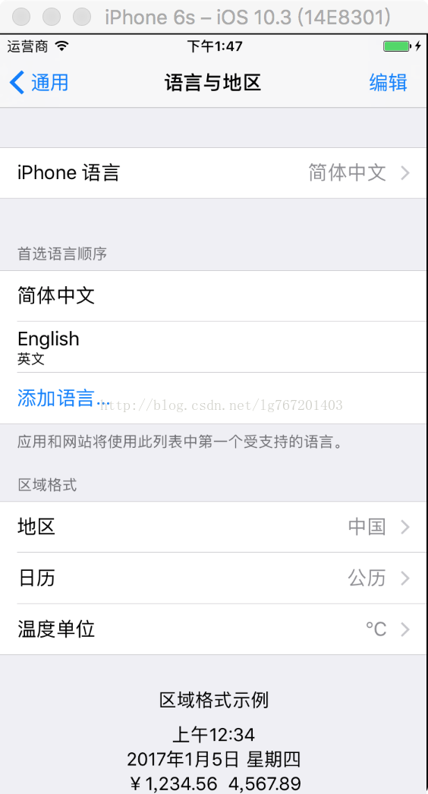
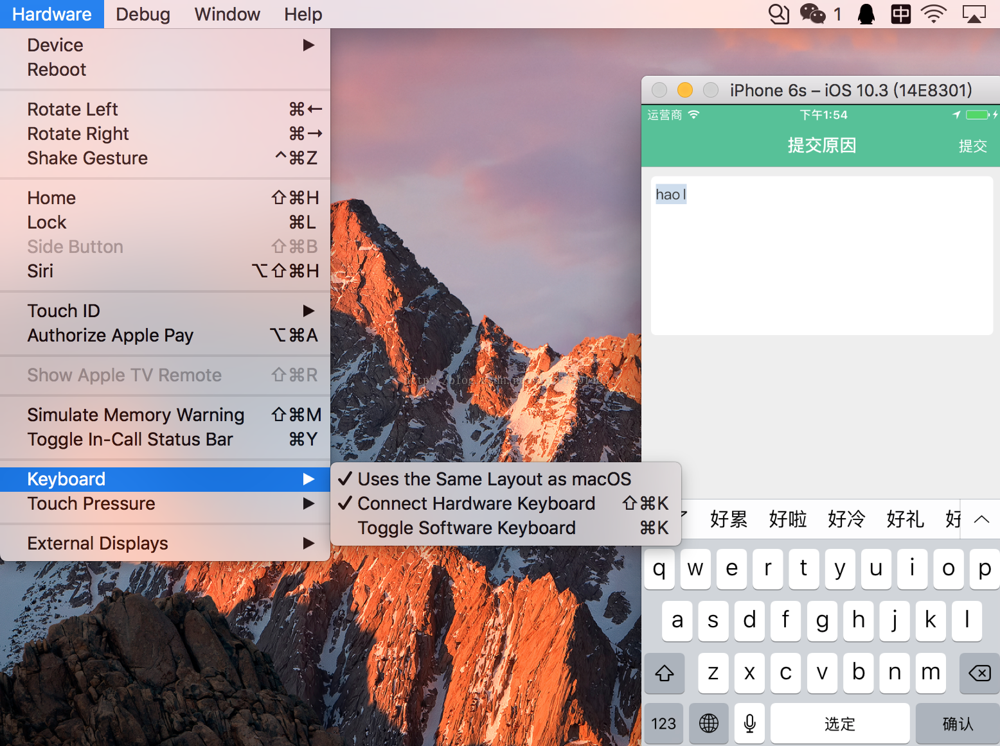

[原文：iOS模拟器不能输入中文解决](https://blog.csdn.net/lg767201403/article/details/77676908)

1. `Command+K`, 在软键盘上通过地球仪选择中文输入法(在应用里让输入框成为第一响应者,也就是引入输入模式),再`Command+K`,取消软键盘;

2.` Command+Shift+K`,绑定电脑的键盘,完事收工.

还不会的往下看:

第0步:首先在设置里面把语言设置成简体中文,地区设置成中国,当然不设置也不影响什么, 我习惯设置成中文.

**`Settings-->General-->Language & Region-->iPhone Language -->简体中文; Region -->中国`**

* 第一步: 来到应用中,找一个可以响应键盘的地方,让他成为第一响应者,也就是输入模式;

`Command + K`,调起软键盘,点击软键盘下面那个小地球仪,切换成中文输入;

* 第二步: 打开模拟器的Hardware,找到KeyBoard,第二个打上勾就行了;

或者直接 `Command+Shift+K`;

其实最重要的是第一步,得选中中文输入法,才能用键盘敲出中文.
