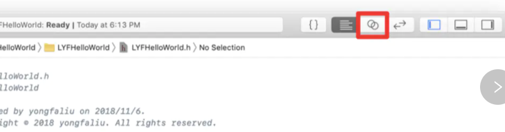
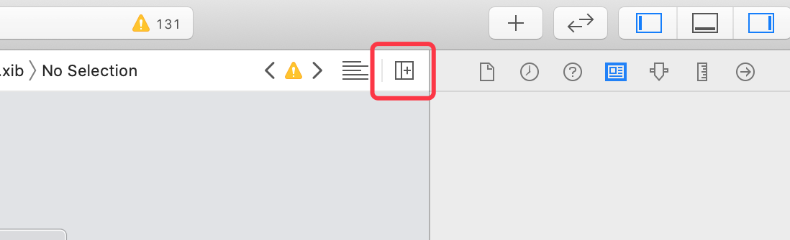

[原文：Xcode11找不到Show Assistant Editor（助理编辑器）](https://blog.csdn.net/SuperTsui/article/details/104748879)

在 Xcode11 之前，工具栏上有一个 `Assistant Editor` 按钮（双环图标，即辅助编辑器），单击它编辑器会分为左右两个窗口，左边显示 storyboard ，右边显示对应的 swift 文件。但在 Xcode11 后，这个图标消失了。

原辅助编辑器按钮如下：

在 Xcode11 中仅能使用快捷键 `control + option + command + return` 触发辅助编辑器。

如果想要实现多个文件分屏浏览，则可以使用下图中的图标实现：
 
 
 
 
 