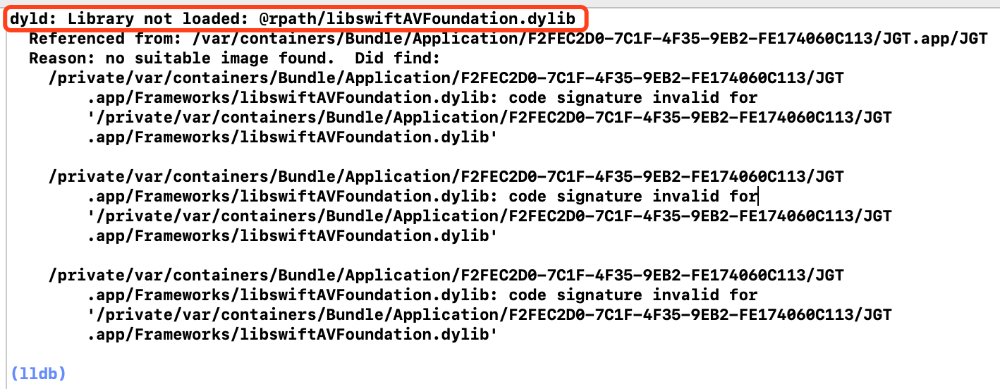

`Library not loaded: @rpath/libswiftAVFoundation.dylib` 的解决

## 一、问题现象 

IOS 证书过期，更新证书后部署项目到手机，手机端运行时一直崩溃，且报如下错误：

## 二、解决方案：

通过快捷键 `Shift + Command + K` 清理构建目录即可。（即 菜单栏 -> Clean Build Folder）

## 三、参考内容

更多内容可参考

[dyld: Library not loaded: @rpath/libswiftAVFoundation.dylib解决方案](https://www.jianshu.com/p/46c3d65a996b)