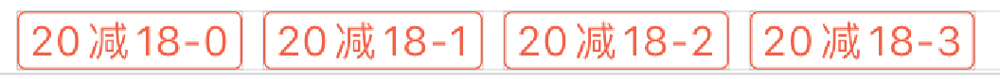

## 1.获取字符串高度并添加约束

实际编码过程中，我们可能会需要通过代码动态的向某个 View 视图中添加 UILabel, 此时，我们必须手动的为这些 UILabel 对象添加约束条件，否则，这些 UILabel 将会因为没有约束条件而无法显示。

只有获取到 UILabel 中填充的字符串所占据的宽高信息信息之后，才能为其添加具体的约束，所以——

通过代码获取字符串所占视图宽度：

```swift
/*
* 获取字符串边框
*/
func getStrBoundRect(str:String,font:UIFont,constrainedSize:CGSize,
                         option:NSStringDrawingOptions=NSStringDrawingOptions.usesLineFragmentOrigin)->CGRect{
    let attr = [NSAttributedString.Key.font:font]
    let rect=str.boundingRect(with: constrainedSize, options: option, attributes:attr , context: nil)
    return rect
}
```

当我们获取到字符串所占视图区域 Rect 之后，就可以动态添加约束了，示例如下：

```swift
/*
* 添加约束
*/
func addLabelConstraint(targetView:UIView,preRightBound:CGFloat,viewWidth:CGFloat)->CGFloat{
    let totalPadding=CGFloat(6)
    let childSpace=CGFloat(5)
    
    targetView.translatesAutoresizingMaskIntoConstraints=false
    
    let leftBound = CGFloat(preRightBound==0 ? 0:(preRightBound+childSpace))
    targetView.leftAnchor.constraint(equalTo: self.spendCouponView.leftAnchor, constant: leftBound).isActive=true
    let rightBound = leftBound+viewWidth+totalPadding
    targetView.rightAnchor.constraint(equalTo: self.spendCouponView.leftAnchor, constant: rightBound).isActive=true
    targetView.topAnchor.constraint(equalTo: self.spendCouponView.topAnchor, constant: 0).isActive=true
    targetView.bottomAnchor.constraint(equalTo: self.spendCouponView.bottomAnchor, constant: 0).isActive=true
    
    return rightBound
}
```

上述两个函数的调用示例如下：

```swift
 //添加满减券子视图
 func addSpendCouponChildView(){
     
     var preRightBound=CGFloat(0)
     
     for i in 0 ..< 4{
         let spendCouponChildView=UILabel()
         spendCouponChildView.text="20减18-\(i)"
         spendCouponChildView.font=UIFont.n8
         spendCouponChildView.textColor=UIColor.emphasizeText
         spendCouponChildView.layer.borderColor=UIColor.emphasizeText.cgColor
         spendCouponChildView.layer.borderWidth=0.5
         spendCouponChildView.layer.cornerRadius=2
         spendCouponChildView.textAlignment  = .center
         self.spendCouponView.addSubview(spendCouponChildView)

         let rect=getStrBoundRect(str: spendCouponChildView.text ?? "",font: spendCouponChildView.font, constrainedSize: CGSize(width: spendCouponView.width,height:15 ))

         preRightBound = addLabelConstraint(targetView: spendCouponChildView, preRightBound: preRightBound, viewWidth: rect.width)
     }
 }
```

效果如下：



## 2.参考链接

[swift-计算字符串宽度高度](https://www.jianshu.com/p/f08328e0aa50)

[Swift中计算字符串的宽高](https://www.jianshu.com/p/e71b6c4a0563)