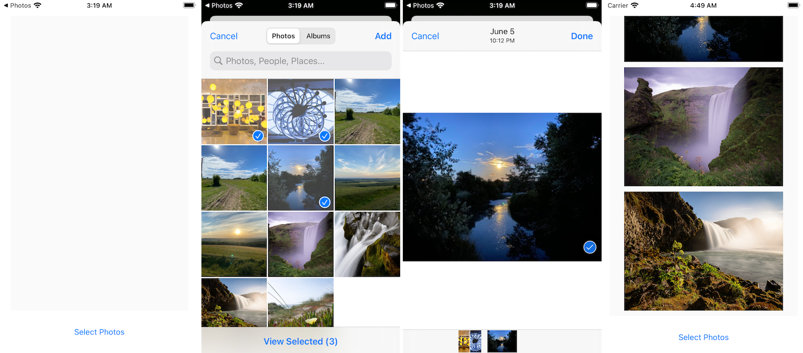

[原文：《在iOS 14上使用PHPickerViewController选择照片》](https://www.jianshu.com/p/5e7aacfa4374)

原文：[Using PHPickerViewController to Select a Photo on iOS 14](https://ikyle.me/blog/2020/phpickerviewcontroller)

## 1.1 UIImagePickerController

如何在 iOS 14 中使用新推出的 `PhotoKit` 框架中的 `PHPickerViewController` 类，并通过 Objective C 和 Swift 语言从照片库中选择照片。

多年来，在 iOS 上选择照片和视频的最简单方法是使用 `UIImagePickerController` 类。该类允许你呈现一个内置的系统 UI 来选择照片或视频，并将其返回到你的应用程序中，而无需构建选择照片的 UI 页面或访问照片库的提示。

实现代码非常简单：

```swift
// Objective-C
- (void)pickPhoto {
    UIImagePickerController *imagePicker = [[UIImagePickerController alloc] init];
    imagePicker.sourceType = UIImagePickerControllerSourceTypePhotoLibrary;
    imagePicker.delegate = self;
    [self presentViewController:imagePicker animated:YES completion:nil];
}

// 实现 UIImagePickerControllerDelegate 协议的方法
-(void)imagePickerController:(UIImagePickerController *)picker didFinishPickingMediaWithInfo:(NSDictionary<UIImagePickerControllerInfoKey,id> *)info {
    UIImage *image = info[UIImagePickerControllerOriginalImage];
    self.imageView.image = image;

    [picker dismissViewControllerAnimated:YES completion:nil];
}
```

```swift
// Swift
func pickPhoto()
{
    let imagePicker = UIImagePickerController()
    imagePicker.sourceType = .photoLibrary
    imagePicker.delegate = self
    present(imagePicker, animated: true)
}

// 实现 UIImagePickerControllerDelegate 协议的方法
public func imagePickerController(_ picker: UIImagePickerController, didFinishPickingMediaWithInfo info: [UIImagePickerController.InfoKey: Any])
{
    imageView.image = (info[.originalImage] as? UIImage)
    picker.dismiss(animated: true, completion: nil)
}
```

然而，`UIImagePickerController` 也有很多缺点：

* 它相当基础，而且呈现给用户浏览照片库的 UI 也非常有限；
* 一次只能选择一个（图片或者视频），而且只支持基本的过滤功能。

在 iOS 14 中，`UIImagePickerController` 被 "软废弃 "了。虽然目前还没有被标记为废弃，但如果你看一下头文件，就会发现 API 标记有这个：

```swift
API_DEPRECATED("Will be removed in a future release, use PHPicker.", ios(11, API_TO_BE_DEPRECATED));
```

`API_TO_BE_DEPRECATED` 的宏定义上面有这个注释：

```swift
/* 
 * API_TO_BE_DEPRECATED is used as a version number in API that will be deprecated 
 * in an upcoming release. This soft deprecation is an intermediate step before formal 
 * deprecation to notify developers about the API before compiler warnings are generated.
 * You can find all places in your code that use soft deprecated API by redefining the 
 * value of this macro to your current minimum deployment target, for example:
 * (macOS)
 *   clang -DAPI_TO_BE_DEPRECATED=10.12 <other compiler flags>
 * (iOS)
 *   clang -DAPI_TO_BE_DEPRECATED=11.0 <other compiler flags>
 */
```
 
`API_TO_BE_DEPRECATED` 是作为 API 中的版本号，将在即将发布的版本中被废弃。这种软弃用是正式弃用之前的一个中间步骤，目的是在编译器产生警告之前通知开发者有关该 API 的信息。例如，你可以通过将这个宏的值重新定义为你当前的最小部署目标来找到代码中所有使用软废弃 API 的地方。

取而代之的是 iOS14 现在包含了 `PHPickerViewController`，支持多选，UI 也有了很大的改进。

## 1.2 PHPicker

iOS 14 中新的 `PHPicker` 类不是在 `UIKit` 框架中的，而是位于 `PhotosUI` 框架中，包括：

* [PHPickerViewController](https://developer.apple.com/documentation/photokit/phpickerviewcontroller?language=swft)
* [PHPickerConfiguration](https://developer.apple.com/documentation/photokit/phpickerconfiguration?language=swift)
* [PHPickerFilter](https://developer.apple.com/documentation/photokit/phpickerfilter?language=swift)
* [PHPickerResult](https://developer.apple.com/documentation/photokit/phpickerresult?language=swift)

你使用 `PHPickerViewController` 时，需要通过 `PHPickerConfiguration` 配置来告诉它要选择多少个媒体项，以及需要选择的媒体类型。如: 通过 `PHPickerConfiguration` 的 `filter` 属性配置可选择的媒体类型，它的选项可以是任意组合：图片、实况照片或视频。通过 `PHPickerConfiguration` 的 `selectionLimit` 属性来配置用户可以选择的媒体项数量。

```swift
PHPickerConfiguration *config = [[PHPickerConfiguration alloc] init];
config.selectionLimit = 3;
config.filter = [PHPickerFilter imagesFilter];

PHPickerViewController *pickerViewController = [[PHPickerViewController alloc] initWithConfiguration:config];
pickerViewController.delegate = self;
[self presentViewController:pickerViewController animated:YES completion:nil];
```

`PHPickerConfiguration`、`PHPickerFilter` 和 `PHPickerResult` 都是作为结构体 `（Struct）`而不是作为类桥接到 Swift 中的。

```swift
var config = PHPickerConfiguration()
config.selectionLimit = 3
config.filter = PHPickerFilter.images

let pickerViewController = PHPickerViewController(configuration: config)
pickerViewController.delegate = self
self.present(pickerViewController, animated: true, completion: nil)
```

从 `PHPickerViewController` 返回的结果与 `UIImagePickerController` 不同，而是使用 `NSItemProvider`，就像 [`Drag and Drop`](https://developer.apple.com/documentation/uikit/drag_and_drop) API一样。

>注意：
>`PHPickerResult` 上定义了一个 `assetIdentifier` 属性，该属性被记录为所选资产的 Local 标识符。然而，（从iOS 14.0 beta 1开始，在我的测试中，这个属性总是为零；无论应用程序是否已被授予完整的照片库访问权限。
>我推测这是指 `PHAsset` 的 `assetIdentifier`，允许我们通过调用 `asset = PHAsset.fetchAssets(withLocalIdentifiers: [photoID], options: nil).firstObject`来检索资产对象。

```swift
// Objective-C
-(void)picker:(PHPickerViewController *)picker didFinishPicking:(NSArray<PHPickerResult *> *)results{
   [picker dismissViewControllerAnimated:YES completion:nil];
    
   for (PHPickerResult *result in results)
   {
      // Get UIImage
      [result.itemProvider loadObjectOfClass:[UIImage class] completionHandler:^(__kindof id<NSItemProviderReading>  _Nullable object, NSError * _Nullable error)
      {
         if ([object isKindOfClass:[UIImage class]])
         {
            dispatch_async(dispatch_get_main_queue(), ^{
               NSLog(@"Selected image: %@", (UIImage*)object);
            });
         }
      }];
   }
}
```


```swift
// Swift
func picker(_ picker: PHPickerViewController, didFinishPicking results: [PHPickerResult]) {
   picker.dismiss(animated: true, completion: nil)
   
   for result in results {
      result.itemProvider.loadObject(ofClass: UIImage.self, completionHandler: { (object, error) in
         if let image = object as? UIImage {
            DispatchQueue.main.async {
               // Use UIImage
               print("Selected image: \(image)")
            }
         }
      })
   }
}
```

## 1.3 过滤和多选

默认情况下，`selectLimit` 设置为 1，并且没有配置过滤条件。

要改变选择的内容和数量，我们只需要改变 `PHPickerConfiguration` 配置。

例如：要选择最多 10 个视频，我们只需要这样指定：

```swift
var config = PHPickerConfiguration()
config.selectionLimit = 10
config.filter = PHPickerFilter.videos
```

如果将 `selectionLimit` 设置为 0，则可以选择系统支持的任意数量的媒体项。

## 1.4 示例项目



演示如何使用新 API 的 Xcode 项目示例代码可在 GitHub上获得：

* [Objective-C Project](https://github.com/kylehowells/ikyle.me-code-examples/blob/master/Photo%20Picker%20ObjC/Photo%20Picker%20ObjC/ViewController.m#L99)
* [Swift Project](https://github.com/kylehowells/ikyle.me-code-examples/blob/master/Photo%20Picker%20Swift/Photo%20Picker%20Swift/ViewController.swift#L13)
