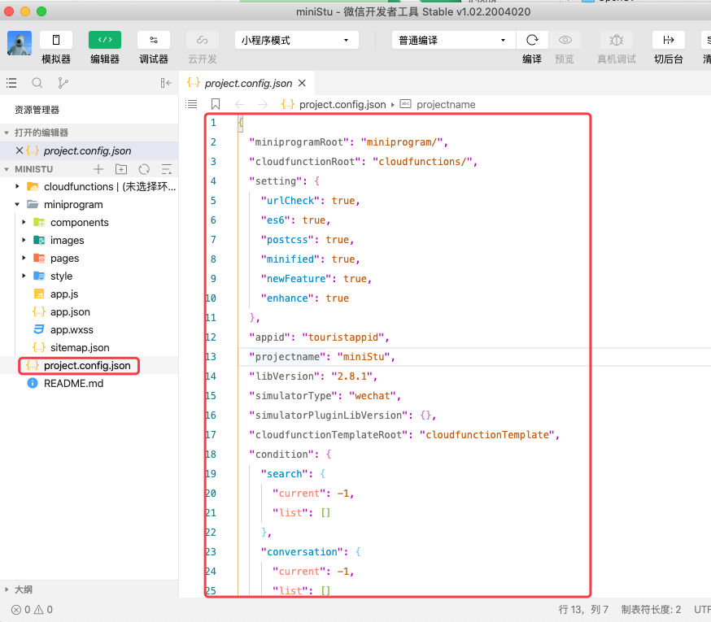
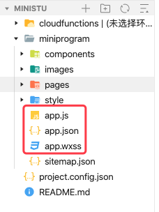
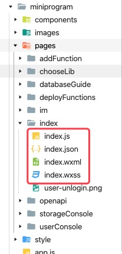

# 二、第一个微信小程序

## 1、创建第一个微信小程序

## 2、小程序的目录结构

### 2.1 项目配置文件

新建一个项目后，根目录下会自动生成 `project.config.json` 文件，该文件即为项目配置文件。

### 2.2 主体文件

项目主体文件包括：`app.js`、`app.json`、`app.wxss`, 如下：

* `app.js`  是必填文件，用于描述小程序的公共配置
* `app.json` 是别提案文件，用于描述小程序的整体逻辑
* `app.wxss` 可选文件，用于定义小程序公共样式表

#### 2.2.1 `app.js`

TODO 

#### 2.2.2 `app.json`

TODO 

#### 2.2.3 `app.wxss`

TODO 

### 2.3 页面文件

每一个单独的页面基本都由以下四种文件组成：`.wxml` 、`.wxss`、`.js`、`.json`，如下图：

文件类型|作用
---|---
`.wxml` | 用于构建当前页面的结构，包括组件、事件等。决定了用户最终看到的页面效果
`.wxss` | 可选。用于设置当前页面的样式效果。会覆盖 `app.wxss` 中的样式，但仅对当前页面生效。
`.js` | 可选。用于设置当前页面的逻辑
`.json` | 可选。用于重新设置 `app.json` 中 `window` 属性规定的内容，该设置仅对当前页面生效。

TODO ：json 文件中的可用属性及示例

### 2.4 其他文件

## 3、开发工具介绍