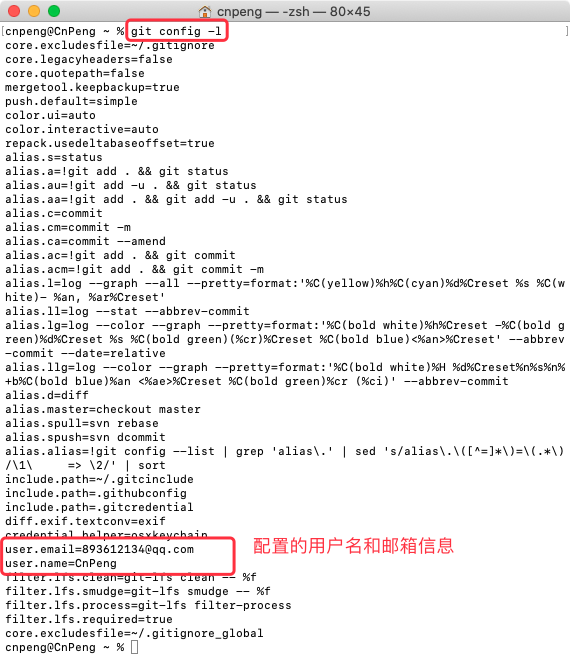

## 1.1 git 的安装及初始配置

Git客户端的下载链接：[https://git-scm.com/downloads](https://git-scm.com/downloads)

安装完成后，需要做如下初始化设置：

```git
# 配置用户名——查看提交记录时的提交人名称，可自定义
git config --global user.name "YourName"
# 配置用户邮箱
git config --global user.email "xxxx@xxx.com"


# 查看 git 版本信息
git version
# 查看配置信息
git config -l 
```

