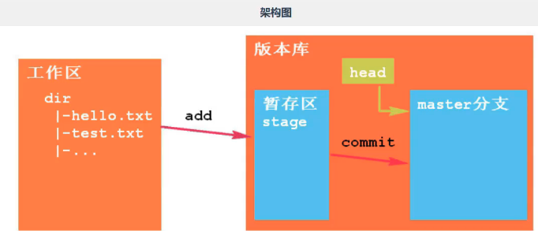

## 2.1 架构

概念|含义
---|---
工作区 | 即我们项目目录
版本库 | 工作区中有一个隐藏目录 `.git`, 该目录不属于工作区，而是 git 的版本库，是 git 管理的所有内容
暂存区 | 版本库中包含一个临时区域，保存下一步要提交的文件
分支 | 版本库中包含若干根治，提交的文件存储在分支中

## 2.2 仓库

仓库就是项目的工作目录，该目录中的所有文件都会被 git 管理起来，文件的变动也会由 git 进行跟踪。（通过 `.gitignore` 文件过滤的文件不在管理和跟踪的范围内）

### 2.2.1 新建仓库

通过终端/命令行工具进入到项目目录，然后执行：`git init` 命令

