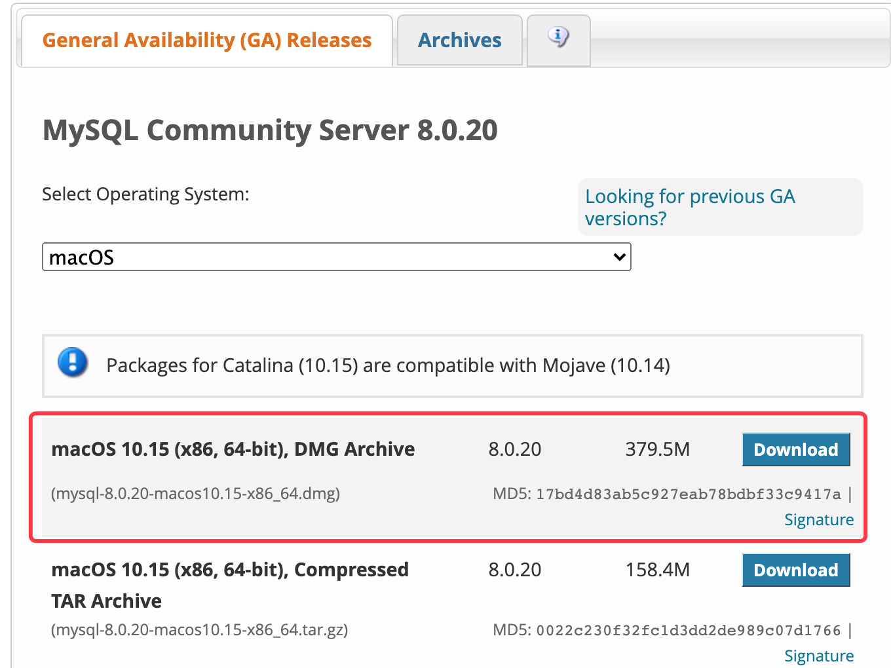
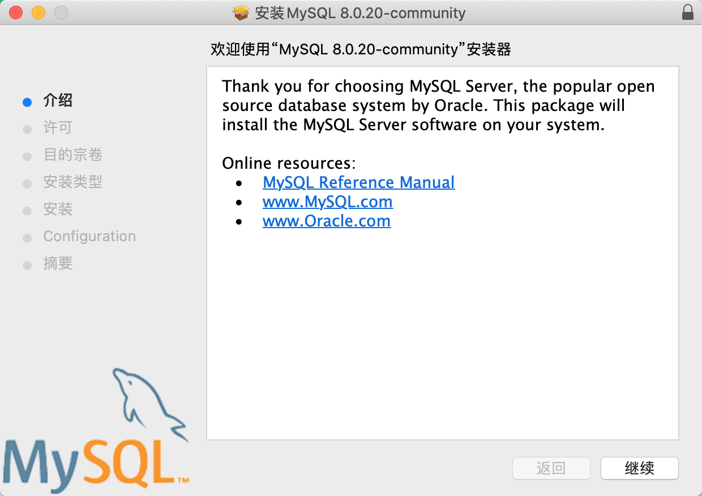
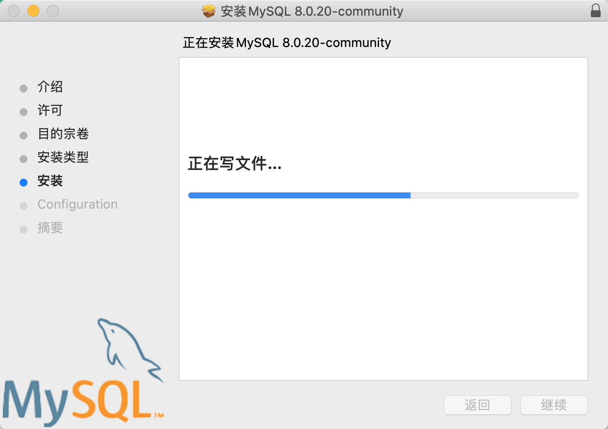
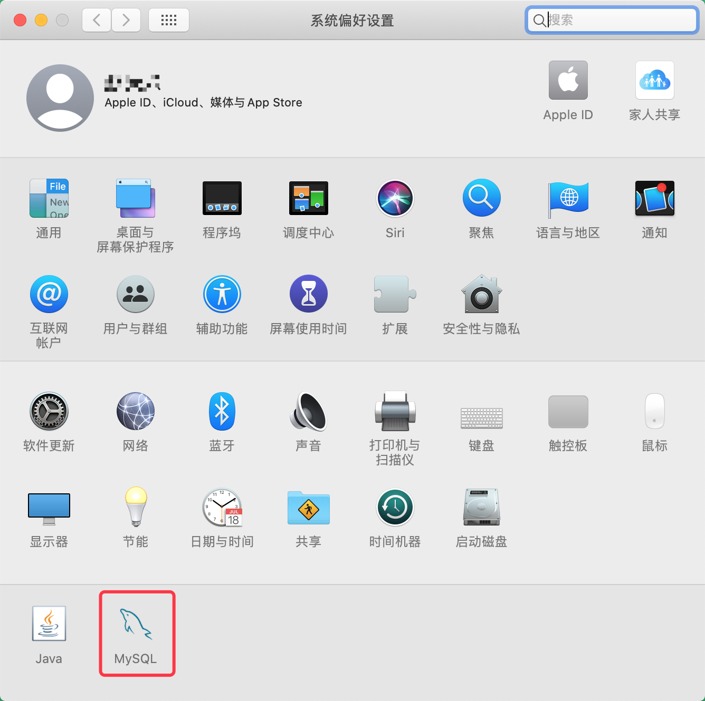
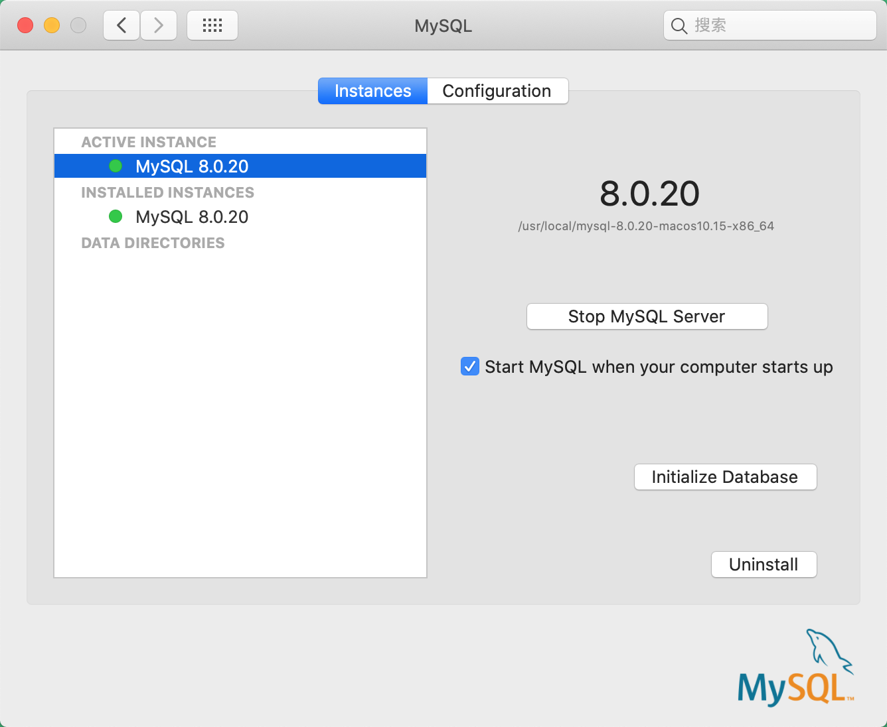
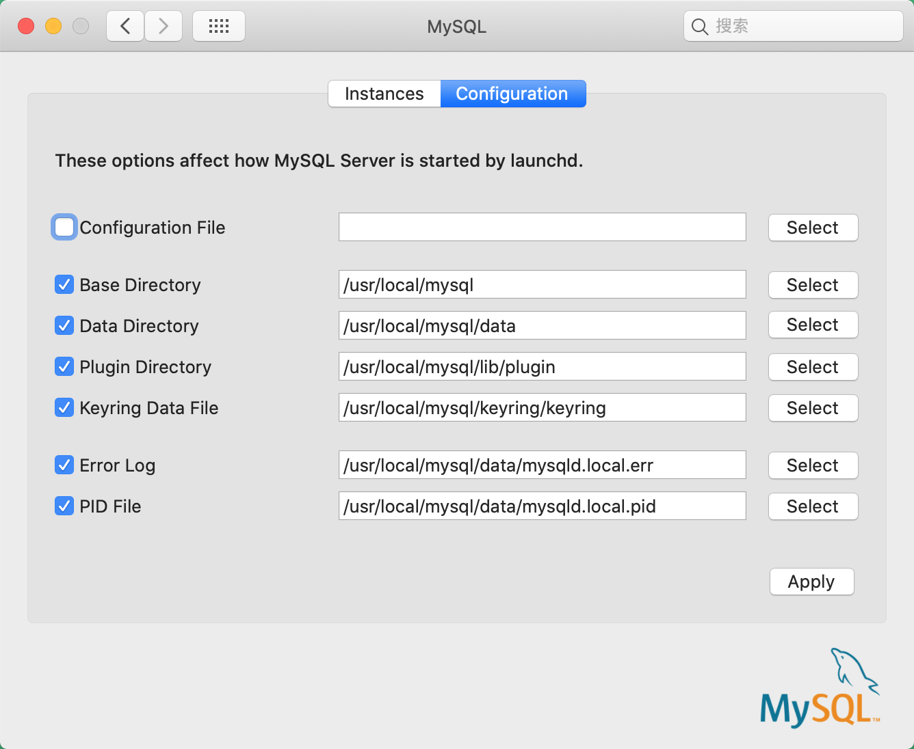
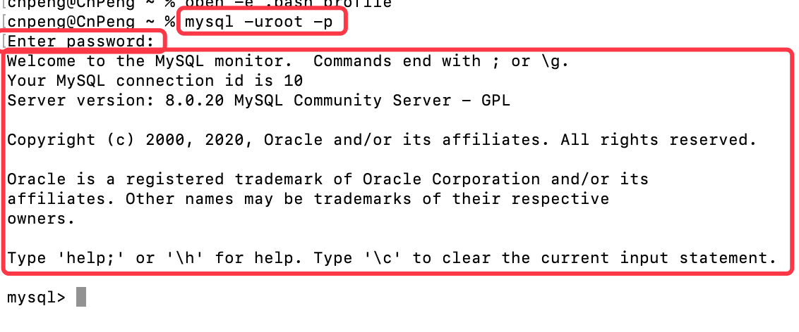
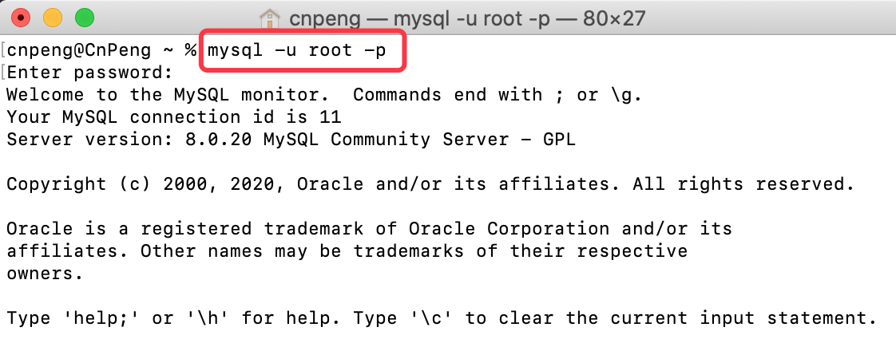
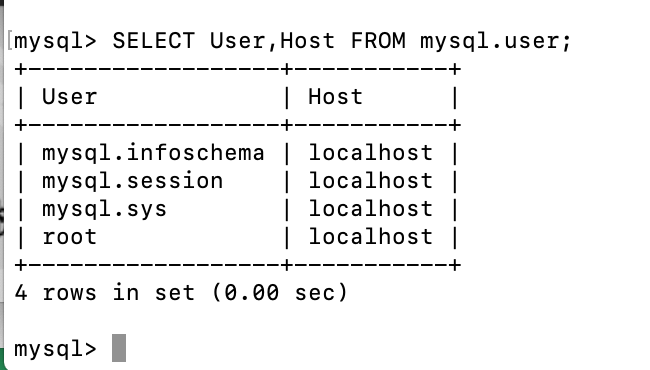

## 2.5 MAC 下安装 MySQL

本节内容是参考 [mac 安装mysql详细教程(安装包方式)](https://www.cnblogs.com/liuzyw/p/11529257.html) 和  [MySQL for Mac 安装教程](https://www.jianshu.com/p/199492627ccc) 整理的。

### 2.5.1 安装

[点击下载 MySQL Community Downloads](https://dev.mysql.com/downloads/mysql/),如下图：



下载完成之后直接双击安装即可：





安装完成在偏好设置中多处一个图标：



双加该图标可以进入设置界面：





> 初次安装时，会提示让我们输入一个超级管理员密码，这个密码设置之后一定要保存好。

### 2.5.2 配置环境变量

安装完成之后，我们直接在命令行中输入 `mysql` 并回车时，会提示 `command not found`，这是因为还没有配置环境变量。

配置环境变量时，需要先使用 `where mysql` 命令查看我们的 MySQL 安装到哪个目录了：


然后通过 `open -e .bash_profile` 命令打开配置文件，并将 MySQL 的安装路径配置到环境变量中：


上图中的代码为：

```java
PATH=$PATH:/usr/local/mysql/bin
export PATH
```

编辑完成后，关闭文件，即可自动保存。

然后执行 `source ~/.bash_profile` 或 ` source ~/.zshrc` 让修改立即生效（如果还不生效，则重启电脑）。

### 2.5.3 登录 MySQL

在终端中执行命令：`mysql -uroot -p`, 然后输入安装过程中我们设置的超级管理员密码即可进入到数据库中：



## 2.8 安装后的配置

`mysql -u root -p` 的作用是登录到 MySQL 中（进入 mysql 命令模式），如下图：



然后输入 `SELECT User,Host FROM mysql.user;` 命令查看所有可以连接到客户机的用户及其 Host 地址。



`SET PASSWORD FOR 'root'@'localhost'=PASSWORD('新的密码');` 命令的作用是修改用户 `root` 的密码为 `新的密码`，`@` 是链接符，连接后面的 `localhost` 主机地址。

> 按照书中书，上述命令可以修改密码，但实际操作时，一直报错，暂时不知道怎么解决。


