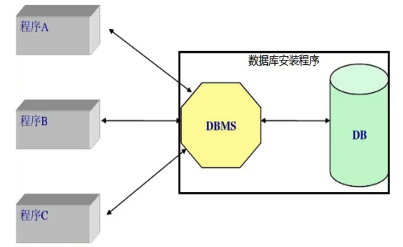
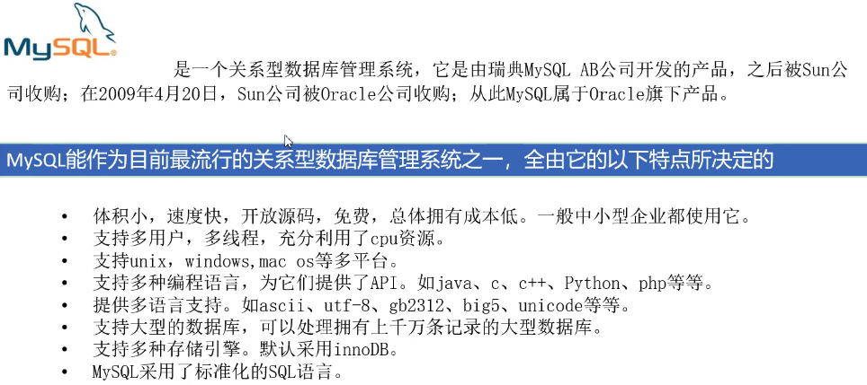

[基于 B 站 《好程序员大数据_Mysql核心技术》-1 整理](https://www.bilibili.com/video/BV1ut4y1y7tt?from=search&seid=10801019508552053814)

## 1.1 数据库和数据库管理系统

**数据库**，英文名 DataBase , 简称 DB。是按照某种特定的数据结构来组织、存储和管理数据的仓库。

**数据库管理系统**，英文名 DataBase Management System，简称 DBMS。是一种操作和管理数据库的大型软件，用于建立、使用和维护数据库。它对数据库进行统一的管理和控制，以保证数据库的安全性和完整性。它介于用户和数据库之间。用户通过 DBMS 来访问数据库中的数据。

## 1.2 关系型数据库

建立在 “关系模型” 基础上的数据库，称之为 **关系型数据库**。

**关系模型** 指的是数据具有 “一对一、一对多、多对多” 等关系模型。

常见的关系型数据库产品包括：MySql、Oracle、DB2、SQL Server、Sybase、Access

## 1.3 MySql 简介

