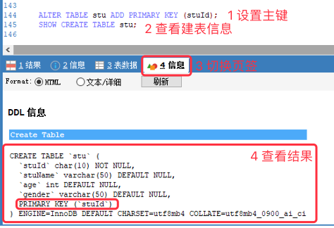
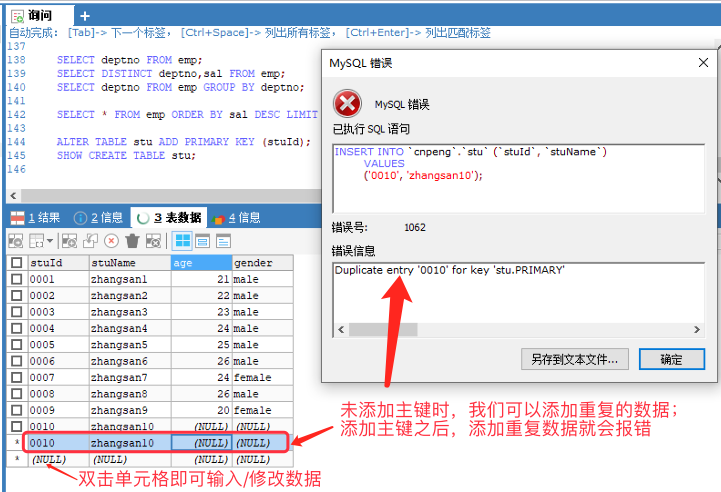
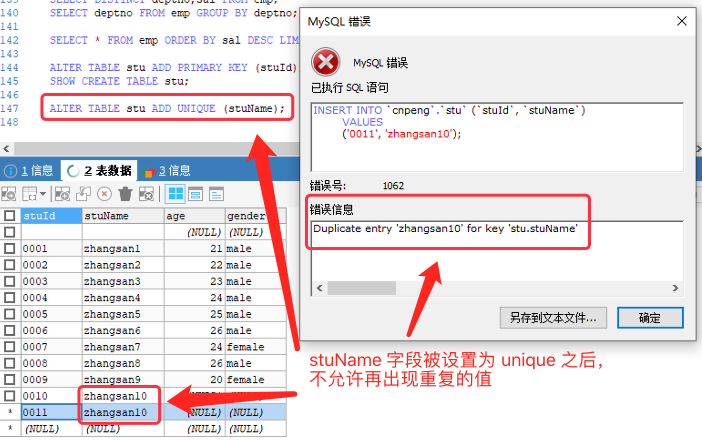
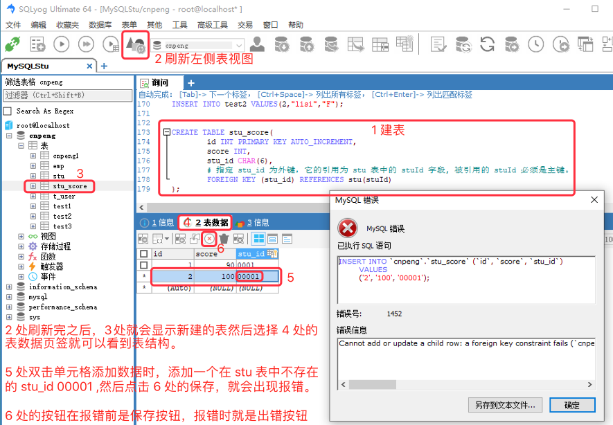

[基于 B 站 《好程序员大数据_Mysql核心技术》15-17 节 整理](https://www.bilibili.com/video/BV1ut4y1y7tt?p=15)

# 15. 数据完整性

## 15.1 概念和分类

### 15.1.2 约束的概念

* 完整性约束条件，简称约束（constrant），用于保证表中数据的完整性和安全性。
* 约束是对表进行的一种强制性的校验规则。
* 在进行 DML 操作时，必须符合约束条件，否则不能执行。

### 15.1.2 约束的分类

* 实体完整性（数据唯一）
* 域完整性
* 引用完整性

## 15.2 实体完整性

表中的一行（一条记录）对应一个实体（entity）, **实体完整性是为了保证表中每条记录唯一**。

通过 **主键约束**（primary key, 简称 PK）、**唯一性约束**（unique, 简称 UK） 的方式可以实现实体完整性。

### 15.2.1 主键约束

主键约束是非空约束和唯一性约束的组合形式，表示字段的值不能为 null 并且唯一。通常用作记录的唯一标识来使用。

我们把某个字段作为约束主键时，需要满足如下要求：

* 对业务需求没有实际意义的字段，如序号。
* 如果设置了主键约束，那么该字段最好不要再进行人为修改，而是自动生成。数值类型可以通过 `auto_increment` 自增
* 不建议将动态赋值的字段设置为主键，比如时间戳。

#### 15.2.1.1 设置主键

* 为新建表设置主键

```sql
create table tableName(
	tid int primary key auto_increment,
	tname varchar(20) not null
);
```

* 对已有表格设置主键

```sql
alter table tableName add primary key (colName);
```

#### 15.2.1.2 设置主键的示例

基于之前创建的 stu 表为例：

```sql
// 为已经存在的表设置主键
ALTER TABLE stu ADD PRIMARY KEY (stuId);

// 查看建表信息
SHOW CREATE TABLE stu;
```





### 15.2.2 唯一性约束

唯一性约束的关键字是 `unique`

如果字段设置了唯一性约束，那个在表中此字段的值将不能重复，但是可以为 NULL（无穷大不等于无穷大）。

#### 15.2.2.1 设置唯一性约束

* 为新建表设置主键

```sql
create table tableName(
	tid int ,
	tname varchar(20) not null,
	username varchar(20) unique
);
```

* 对已有表格设置主键

```sql
alter table tableName add unique (colName);
```



### 15.2.3 主键约束和唯一性约束对比

* 一个表只能有一个主键，但一个表可以有多个 unique 字段。
* 主键约束的值不能为 NULL，但是唯一约束的字段值可以为 NULL。


## 15.3 域完整性

### 15.3.1 域完整性介绍

**域完整性**，即对表中每列上数据的约束。包括：

* 非空约束，`not null` 简称 NN
* 数据类型约束
* 默认值约束 DEFAULT
* 检查约束 


### 15.3.2 语法

* 创建新表时的写法

```sql
create table tableName(
	tid int,
	tname varchar(20) not null,
	gender char(1) default 'M'
);
```

* 为已有的表添加约束

```sql
alter table tableName modify colName type not null;
```

### 15.3.3 示例

```sql
CREATE TABLE test1 (
	tid INT PRIMARY KEY,
	# 不加 NOT NULL 的话表示可以为 null
	tname VARCHAR(50) NOT NULL,
	gender CHAR(1) DEFAULT 'F'
);

# 末尾的 DEFAULT 表示取默认值
INSERT INTO test1 VALUES (1,"李四",DEFAULT);
# 未指定 gender 字段，也是使用默认值
INSERT INTO test1 (tid,tname) VALUES(2,"张三");
```

### 15.3.4 检查约束

检查约束，全称 check, 简称 CK.

示例：

```sql
CREATE TABLE test2(
	tid INT,
	tname VARCHAR(20),
	# 检查 gender 的值是不是 F 或 M，不是则报错
	gender CHAR(1) CHECK(gender IN ('F','M'))
);

# 能正常插入
INSERT INTO test2 VALUES(2,"lisi","F");
# 会报错，
INSERT INTO test2 VALUES(1,"zhangsan","A");
```

也可以通过枚举的方式来实现 check 的效果：

```sql
CREATE TABLE test3(
	tid INT,
	tname VARCHAR(50),
	# 使用枚举
	gender ENUM('F','M')
);

# 可以正常插入
INSERT INTO test3 VALUES(1,'zhangsan','F');
# 插入时会报错
INSERT INTO test3 VALUES(2,'lisi','A');
```

## 15.4 引用完整性

### 15.4.1 引用完整性的概念

字段 A 的值依赖于字段 B 的值。这两个字段可以在同一张表中，也可以在不同的表中。字段 A 所在的表称之为从表（副表），字段 B 所在的表称之为 主表（父表）。字段 A 的值可以为 null，字段 B 必须为主键（即 非 null）。

如果 B 为 NULL，我们就不应该让 A 输入值，否则数据就有问题了。


### 15.4.2 外键约束

外键约束，全称 foreign key, 简称 FK。通过外键约束可以实现引用完整性。

* 创建新表时的写法

```sql
create table tableName(
	tid int primary key auto_increment,
	tname varchar(20),
	tmgr int,
	constraint constraintName foreign key (tmgr) references tableName(tid)
);
```

* 为已有的表添加外键约束

```sql
alter table tableName add constraint constraintName foreign key (colName) references tableName2(colName2);
```

### 15.4.3 示例

基于前面的 stu 表，我们再创建一个 `stu_score` 表并指定其外键：

```sql

CREATE TABLE stu_score(
	id INT PRIMARY KEY AUTO_INCREMENT,
	score INT,
	stu_id CHAR(6),
	# 指定 stu_id 为外键，它的引用为 stu 表中的 stuId 字段, 被引用的 stuId 必须是主键。
	#foreign key (stu_id) references stu(stuId)
	# 指定 stu_id 为外键，其引用指向 stu 表的 sid 字段，并自定义外键名为 fk_sid
	CONSTRAINT fk_sid FOREIGN KEY (stu_id) REFERENCES stu(stuId)
);

# 如果创建 stu_score 表示没有指定外键，可以使用如下方式创建外键
# alter table stu_score add foreign key (stu_id) references stu(stuId);
# fk_sid 是自定义的外键名
# ALTER TABLE stu_score ADD CONSTRAINT fk_sid FOREIGN KEY (stu_id) REFERENCES stu(stuID);
```

