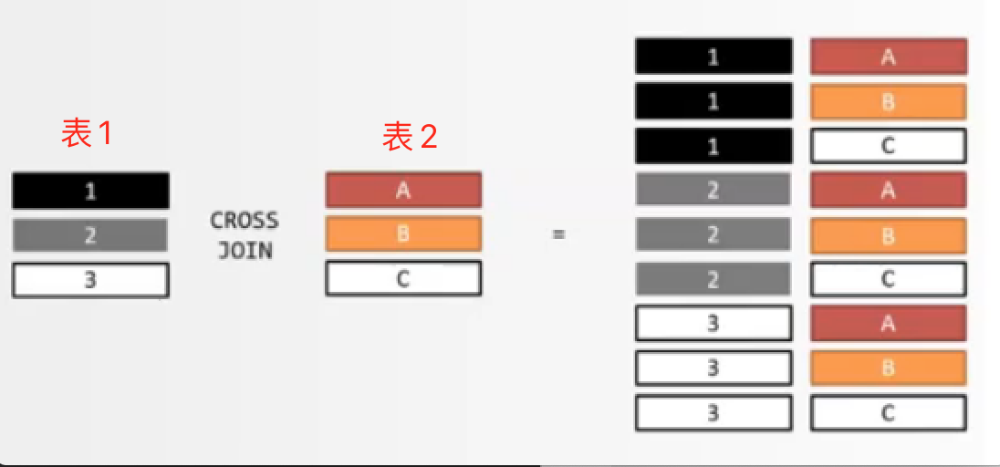
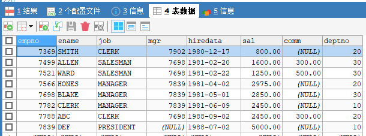
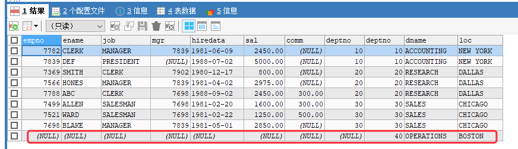
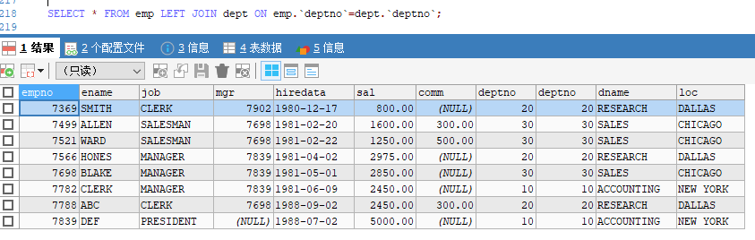

[基于 B 站 《好程序员大数据_Mysql核心技术》18 节 整理](https://www.bilibili.com/video/BV1ut4y1y7tt?p=18)

# 16.多表查询

## 16.1 简介

我们业务需求的数据可能会在一张或多张表中，这些表中通常都会存在着 “有关系” 的字段，那么，此时的查询操作就会涉及到多表查询，我们称之为 **关联查询**。

最简单的关联查询语句：

```sql
SELECT * FROM stu,stu_score;
SELECT * FROM stu JOIN stu_score;
```

## 16.2 写法分类

在进行多表关联查询时，通常有两种写法：

* 方式1：在 from 子句中直接写多个表名，表名之间使用逗号分隔，如：

```sql
select A.* , B.*, C.* from A, B, C where 关联条件
```

* 方式2：在 from 子句中，多个表名之间使用 `join` 关键字链接，并在 `on` 关键字后面添加关联条件，如：

```sql
select A.*, B.* from A join B on 关联条件;

select A.*, B.*, C.* from A join B on AB 关联条件 join C on AC 或 BC 的关联关系;

select A.*, B.* ,C.* from A join B join C on AB 的关联条件 and BC 或 AC 的关联条件;  
```

## 16.3 示例

* 先创建一张部门表

```sql
CREATE TABLE dept(
	deptno INT,
	dname VARCHAR(14),
	loc VARCHAR(13)
);

INSERT INTO dept VALUES (10,'ACCOUNTING','NEW YORK');
INSERT INTO dept VALUES (20,'RESEARCH','DALLAS');
INSERT INTO dept VALUES (30,'SALES','CHICAGO');
INSERT INTO dept VALUES (40,'OPERATIONS','BOSTON');
```

> 本节后面的示例内容基于前面建立的 `emp` 和 `dept` 表

### 16.3.1 笛卡尔积

```sql
# 这样查询会将 emp 和 dept 中的每一条数据进行关联，从而得到 emp.行数 * dept.行数 条结果。
SELECT * FROM emp,dept;
# 8
SELECT COUNT(*) FROM emp;
# 4
SELECT COUNT(*) FROM dept;
# 32
SELECT COUNT(*) FROM emp,dept;
```

上面语句得到的效果就称为 **笛卡尔积**。

当做关联查询时，如果两张表中不存在关联字段，或者忘记写关联条件，就会出现下图所示的情况：



上图中，表 1 中的每一条记录都会与表 2 中的所有记录进行匹配组合。假设表 1 中有 M 条数据，表 2 中有 N  条数据，匹配组合之后得到了 `M*N` 条数据，这个 `M*N` 的积就称为 **笛卡尔积**。

### 16.3.2 等值连接

在做关联查询时，使用有关系的字段进行等值条件的限制操作，我们就称之为 **等值查询**。

如：

```sql
select A.* , B.* from A, B where A.colName = B.colName;
```

```sql
# 注意，等值连接时，字段使用反引号包裹！！不是单引号，不是单引号，不是单引号！
SELECT * FROM emp,dept WHERE emp.`deptno`=dept.`deptno`;

# 也可以使用这种 join on 的形式——内连接
SELECT * FROM emp JOIN dept ON emp.`deptno` = dept.`deptno`;
```

### 16.3.3 Join 连接

Join 连接只支持等号连接。它分为内连接和外连接两种。

#### 16.3.3.1 内连接

在多表查询时，通过 join 连接表，并且仅显示符合条件的数据的方式就称作内连接。

关键字：`[inner] join`

语法格式如下：

```sql
from tableName1 [inner] join tableName2 on 条件;
``` 

**内连接的效果和等值查询的效果一致。**都是仅展示符合条件的数据。

#### 16.3.3.2 外连接

在多表查询时，通过 join 连接表，除显示符合条件的数据外还需要把其中一张表的数据也显示出来的方式就称作外连接。

外连接的两张表分别为 **驱动表** 和 **从动表**。

外连接 (outer join ) 又分为：左外连接（left [outer] join）、右外连接（right [outer] join）、全外连接（full [outer] join）。

* 对于左/右外连接来说，驱动表的数据都会显示，从动表的数据仅显示满足条件的数据。
* 全外连接会显示两张表中的全部数据——但是，**mysql 不支持全外连接**。
* 左外连接中左边的表就是驱动表。
* 右外连接中右边的表就是驱动表。


语法如下：

```sql
# 左外连接：
from tableName1 left join tableName2 on 条件;

# 右外连接
from tableName1 right join tableName2 on 条件;
```

示例：

先看一下 emp 表和 dept 表中的现有数据：




```sql
SELECT * FROM emp RIGHT JOIN dept ON emp.`deptno`=dept.`deptno`;
```

上述代码中使用的是右外连接，所以 dept 为驱动表，结果中会显示其全部数据——虽然 emp 中没有 deptno = 40 的数据，但结果中还是会显示这个部门编号：



```sql
SELECT * FROM emp LEFT JOIN dept ON emp.`deptno`=dept.`deptno`;
```

上述代码中使用的是左外连接，所以 emp 为驱动表，结果中会显示其全部数据以及符合条件的 dept 中的数据——emp表中没有 deptno=40 的数据，所以 dept 中 deptno=40 的数据不会显示：



