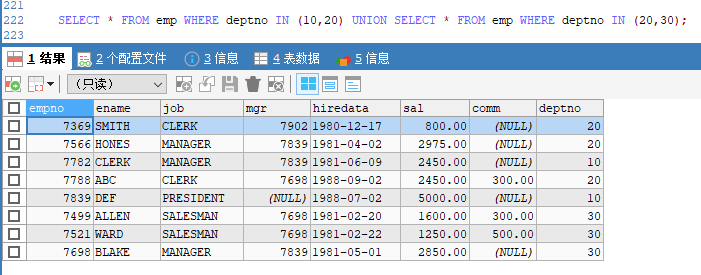
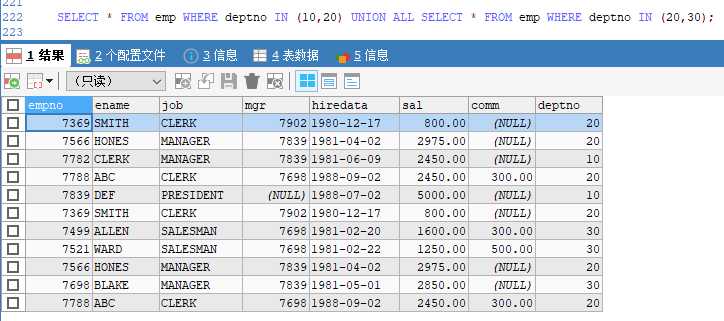
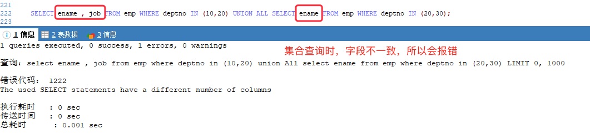

[基于 B 站 《好程序员大数据_Mysql核心技术》-19 整理](https://www.bilibili.com/video/BV1ut4y1y7tt?p=19)

# 17. 集合查询（union）

## 17.1 关键字

* union 会去除重复数据
* union all 不会去除重复数据

将两个查询语句使用上述关键字链接即可实现集合查询。

注意：两个查询语句的字段名、字段个数必须一一对应。

## 17.2 示例

查询部门编号为 10 和 20 的员工信息，与查询部门编号为 20 和 30 的员工信息相联合。

```sql
SELECT * FROM emp WHERE deptno IN (10,20) UNION SELECT * FROM emp WHERE deptno IN (20,30);
``` 

上述代码的效果如下：



```sql
SELECT * FROM emp WHERE deptno IN (10,20) UNION ALL SELECT * FROM emp WHERE deptno IN (20,30);
```

上述代码效果如下：



```sql
# 指定查询部分字段
SELECT ename , job FROM emp WHERE deptno IN (10,20) UNION ALL SELECT ename, job FROM emp WHERE deptno IN (20,30);
```

在使用集合查询时，如果字段数量或者字段名称不一致，就会报错，如下：

