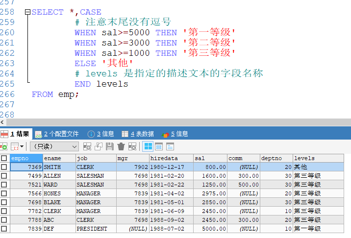

[基于 B 站 《好程序员大数据_Mysql核心技术》-22 整理](https://www.bilibili.com/video/BV1ut4y1y7tt?p=22)

# 19. case-when 语句

`case-when` 语句可以做一些简单的分支逻辑，类似于 `if-else` 和 `switch-case`.

语法：

```sql
case [colName] when 条件1 then 值1
			     when 条件2 then 值2
			     ......
			     else 值n
			     end
```

* 查询员工的信息，及其工资等级（>=5000 第一等级，>=3000 第二等级，>=1000 第三等级，其他等级 ）

```sql
# case 中指定一个条件
SELECT *,CASE 
	# 注意末尾没有逗号
	WHEN sal>=5000 THEN '第一等级'
	WHEN sal>=3000 THEN '第二等级'
	WHEN sal>=1000 THEN '第三等级'
	ELSE '其他'
	# levels 是指定的描述文本的字段名称——别名
	END levels
FROM emp;
```



* 查询员工表中的姓名、部门（显示效果如：10 第一部门，20 第二部门，30 第三部门，其他）

```sql
# case 中指定一个具体的值
SELECT ename,CASE deptno
	WHEN 10 THEN '第一部门'
	WHEN 20 THEN '第二部门'
	WHEN 30 THEN '第三部门'
	ELSE '其他'
	END
FROM emp;
```


```sql
SELECT ename,CASE deptno
	WHEN 10 THEN '第一部门'
	WHEN 20 THEN '第二部门'
	WHEN 30 THEN '第三部门'
	ELSE '其他'
	END levels
FROM emp;
```

