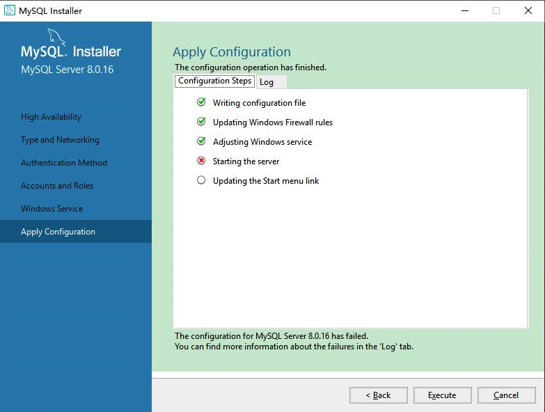

[基于 B 站 《好程序员大数据_Mysql核心技术》-2 整理](https://www.bilibili.com/video/BV1ut4y1y7tt?p=2)

## 2.1 下载

[MySql 官方下载页面](https://dev.mysql.com/downloads/mysql/)

[Windows 系统可以直接点击此处下载 exe 安装文件](https://dev.mysql.com/downloads/windows/installer/8.0.html)

## 2.2 安装步骤

一步步的按照提示进行安装即可。


## 2.3 Window 安装过程中出现 error 1042 的解决


原文 [《安装mysql8.0出现error 1042，无法正常启动解决方案》](https://www.jianshu.com/p/de3adc46c8ec)

### 2.3.1 错误信息

安装过程中在 log 窗口中出现如下报错，导致安装进程无法 finish：

```
error 1042：Unable to connect to any of the specified MySQL hosts
```




### 2.3.2 解决方案

windows 端使用 `Win+R` --> 运行 `services.msc` --> 打开 service 服务管理器，找到刚才安装 mysql 的服务名称（注意，此处服务名与版本号有关，前面固定的是 MySQL，后面的数字是 MySQL 版本号的前两位，如 8.0.20 的版本对应的服务名称为 MySQL80）


右键 --> 属性 --> 登录，更改成 “本地系统账户” --> 确定


回到安装程序，在次点击 `Execute`，会发现已经可以成功到 Finish 界面

