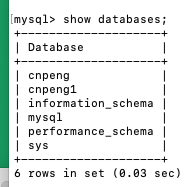
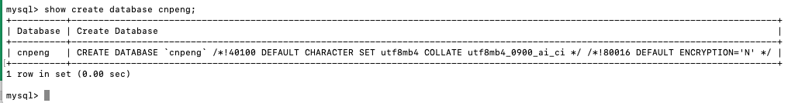
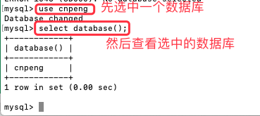
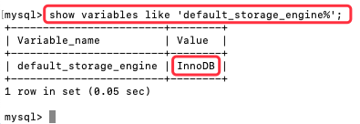
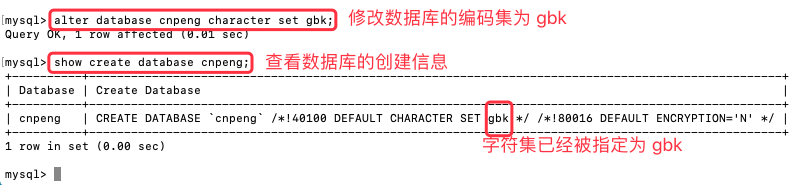

[基于 B 站 《好程序员大数据_Mysql核心技术》-6 整理](https://www.bilibili.com/video/BV1ut4y1y7tt?p=6)

# 6.数据库操作

> 在后续内容中，`[关键字]` 的格式表示该关键字内容可以省略


## 6.1 库操纵总览

### 6.1.1 数据库的创建

* 创建数据库

```sql
create database DBName;
```

* 创建数据库的同时指定字符集

```sql
CREATE DATABASE DBName CHARACTER SET UTF8;
```

### 6.1.2 数据库的查看

* 查看所有数据库

```sql
 show databases;
```



* 查看指定数据库的创建信息

```sql
show create database DBName;
```



* 查看当前数据库的名称

```sql
select database();
```



### 6.1.3 数据库的切换

* 切换当前使用的数据库

```sql
use DBName;
```


### 6.1.4 查看数据库引擎

```sql
 show variables like 'default_storage_engine%';
```



通过上图可知，MySql 默认使用的数据库引擎为 InnoDB, InnoDB 支持事务。

### 6.1.5 修改字符集

```sql
 alter database 数据库名 character set gbk;
```



### 6.1.6 删除数据库

```sql
drop database 数据库名;
```

