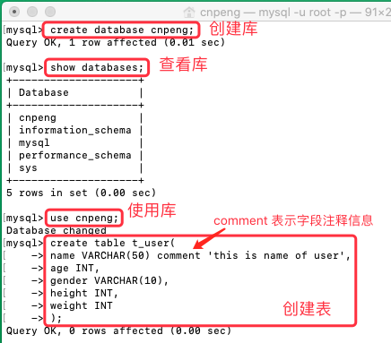
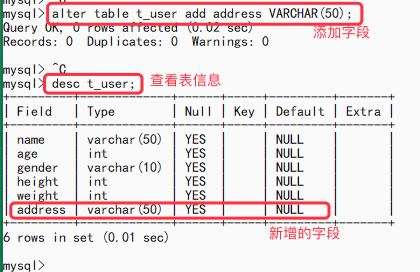
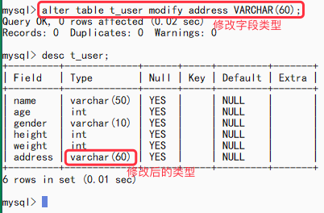
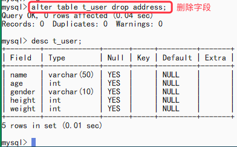
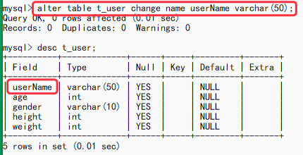

[基于 B 站 《好程序员大数据_Mysql核心技术》-7 整理](https://www.bilibili.com/video/BV1ut4y1y7tt?p=7)

# 7.表的创建和修改

## 7.1 表的概念

* 数据库中存储数据的基本单位就是表，一个数据库是由多个表组成的。
* 表是二维结构，由行和列组成。
* 表的行是横排数据，也被称之为**记录**（Record）
* 表的列是竖排数据，也被称之为**字段**（Field）
* 表与表之间存在着关联关系。

## 7.2 数据类型

表中的数据是按类型进行存储的，类型的定义只需要在建表时对字段进行规定即可。常用类型如下：

类型 | 含义
---|---
int  | 整型
double / float | 浮点型
char / varchar / text | 字符串类型
blob | 字节类型
date | 日期类型（`yyyy-MM-dd`）
time | 时间类型（`hh:mm:ss`）
timestamp | 时间戳类型（`yyyy-MM-dd hh:mm:ss`）
datetime | 时间类型 （`yyyy-MM-dd hh:mm:ss`）

* varchar 表示可变长度的 char, 会根据实际存储数据的长度动态调整存储空间。

## 7.3 创建表


```sql
 create table t_user(
         name VARCHAR(50) comment 'this is name of user',
         age INT,
   	   gender VARCHAR(10),
         height INT,
         weight INT
);
```



## 7.4 查看表信息

* 查看当前库的全部表

```sql
 show tables;
```


* 查看某个表的结构

```sql
desc tableName;
```


* 查看建表语句信息

```sql
 show create table tableName;
```


## 7.5 修改表

操作 | 对应语句格式
---|---
添加字段 | `alter table tableName add colName type`
修改字段类型 | `alter table tableName modify colName newType`
修改字段名称 | `alter table tableName change oldColName newColName type`
删除字段 | `alter table tableName drop colName`
删除表 | `drop table tableName`

* 添加字段

```sql
 alter table t_user add address VARCHAR(50);d
```



* 修改字段类型

```sql
 alter table t_user modify address VARCHAR(60);
```



* 删除字段

```sql
 alter table t_user drop address;
```



* 修改字段名称

```sql
 alter table t_user change name userName varchar(50);
```



* 删除表

```sql
drop table t_user;
```
