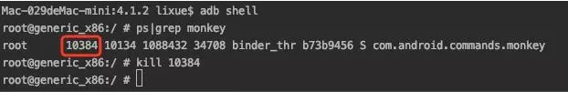

* 1、随机测，整个手机乱点、乱滑
  
``` 
# (1000 表示测试 1000 次 )  
adb shell monkey 1000   
```

* 2、测试指定应用

```   
# 添加 -v 可以在终端中显示操作的流程
# 最好加上 -v ，因为去掉之后，经常会「注入失败」（Injection Failed）
# 包名 即 build.gradle 中的 applicationId 对应值

adb shell monkey -p 应用包名 -v 次数
```

* 3、100%执行应用内点击事件

第二种虽然是测试应用，但是会触发 返回、任务、下拉设置、音量、等等系统层别的，如果只想针对内部测试，则需要在第二步基础上加上 `--pct-touch 100`

```
  adb shell monkey -p 应用包名 --pct-touch 100 -v 次数
```

* 4、应用内、应用外混着来

只需将第三步的100设置成小于100的值，即可，如：一半一半
    
```
    adb shell monkey -p 应用包名 --pct-touch 50 -v 次数
```

* 5、无视 crash 和 ANR 操作超时 ，发生时测试将继续执行

只需添加 `--ignore-crashes --ignore-timeouts`即可

```
adb shell monkey -p 应用包名 --pct-touch 50  --ignore-crashes --ignore-timeouts -v 次数 
```

* 6、如果不想测了，怎么办

	- `ctrl+c` 终止终端的输出
	- 输入 `adb shell` 进入测试设备
	- 输入 `ps|grep monkey` 获取 monkey 的进程 id ，第二个就是进程 id
	- 输入 `kill 进程id` 来终结 monkey 进程

红框就是进程id



如果无法查看进程，可以直接执行 `abd shell reboot` 命令，该命令表示重启设备，自然会终止 monkey


* [android studio monkey 测试](https://www.jianshu.com/p/59431a75400d)